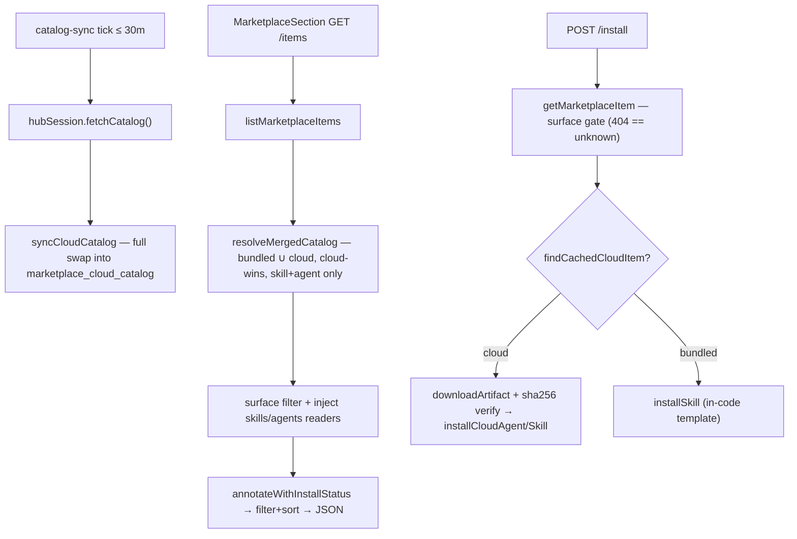
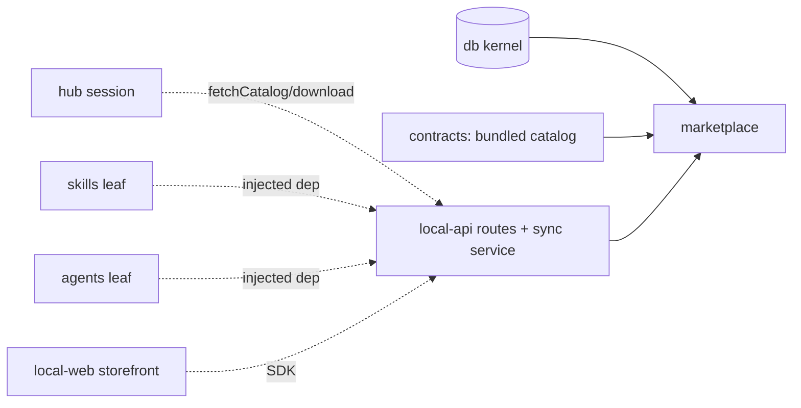

# Marketplace — Structure

> The code map and connections for the marketplace module. For the concepts behind it, see [overview.md](./overview.md).
>
> Folders touched: `packages/marketplace/src/` · `apps/local-api/src/routes/marketplace/` · `apps/local-api/src/services/` · `apps/local-api/src/middleware/` · `apps/local-web/src/{components/sections,composables/marketplace}/`

Marketplace is a **read-side, browse-and-cache leaf**. The package resolves a catalog (bundled ∪ cached-cloud), annotates each item with the caller's install status, and filters/sorts — all **synchronous**, no outbox, one owned table. It **cannot install anything**: its only deps are `@vynel/contracts`, `@vynel/db`, `@vynel/errors` (`packages/marketplace/package.json`). The **mutating install/uninstall lifecycle lives in the app layer** (`apps/local-api/src/routes/marketplace/item-lifecycle.ts`), where sibling leaves `@vynel/skills` + `@vynel/agents` get composed — the leaf may not import a sibling (invariant #2), so it reads installed rows through the injected `MarketplaceDeps` seam.

## File map

► = entry point.

### Package — `packages/marketplace/src/`

| Path | Role |
|---|---|
| ► `index.ts` | public barrel (`.` + `./schema/*`) — types, the pure ops, sync/clear, `resolveMergedCatalog`, and the one repo read `findCachedCloudItem` |
| `marketplace-types.ts` | the cross-leaf **injection seam** — `InstalledSkillView` / `InstalledAgentView` structural views + `MarketplaceDeps` (two injected readers) + `MarketplaceInstallOwner` |
| `schema/cloud-catalog-cache.ts` | the owned table `marketplace_cloud_catalog` + `MarketplaceCloudCatalogRow` |
| `repositories/cloud-catalog-cache-repository.ts` | sync cache repo — `replaceCloudCatalog` (full swap), `listCloudCatalog`, `findCachedCloudItem`, `clearCloudCatalog` |
| `sync-cloud-catalog.ts` | `syncCloudCatalog` (hub DTO → cache rows, full swap) + `clearCachedCloudCatalog` |
| `resolve-merged-catalog.ts` | the merge — bundled ∪ cached cloud, deduped by itemId **cloud-wins**, cloud kinds filtered to `skill`+`agent` |
| `cloud-catalog-mapper.ts` | `cloudRowToMarketplaceItem` — cache row → wire `MarketplaceItem` (kind/tier/category/scope narrowing) |
| `annotate-with-install-status.ts` | pure — stamps each item's `installStatus` per kind (skills key on skillId; agents on slug === itemId AND `source: 'community'`) |
| `filter-marketplace-items.ts` | pure — category / tier / installState / search filter, then sort (`recommended`/`name-asc`/`newest`) |
| `list-marketplace-items.ts` | browse: resolve → surface-visibility filter → inject readers → annotate → filter+sort |
| `get-marketplace-item.ts` | one item on a surface, or `NotFoundError('marketplace-item', id)` (off-surface == unknown, no enumeration leak) |
| `surface-visibility.ts` | `isItemVisibleOnSurface` — global lists `user`+`both`, workspace lists `workspace`+`both` |

Bundled catalog source lives in **contracts**, not this leaf: `packages/contracts/src/marketplace/resolve-catalog-sources.ts` (`VERIFIED_SKILL_CATALOG` → `MarketplaceItem[]`, drops `isSystemInstalled`), which `resolveMergedCatalog` unions with the cache.

### App layer — `apps/local-api/src/`

| Path | Role |
|---|---|
| ► `routes/marketplace/index.ts` | WORKSPACE surface — `GET /items`, `GET /items/:itemId`, `POST /install`, `POST /uninstall`; `...workspaceScoped` |
| ► `routes/marketplace/user-scoped.ts` | GLOBAL surface — `GET /items`, `POST /install`, `POST /uninstall`; `...userScoped`; always user-scope |
| `routes/marketplace/item-lifecycle.ts` | the ONE home for per-kind install/uninstall dispatch + `marketplaceDeps` binding — shared by both surfaces |
| `routes/marketplace/schemas.ts` | Zod request/response schemas (API-internal; promote to contracts on 2nd consumer) |
| `routes/marketplace/serializers.ts` | pass-through item serializer + `serializeInstalledSkillResponse` |
| `services/catalog-sync-service.ts` | app-layer boot service — 30-min hub-catalog sync into the cache |
| `middleware/feature-gate.ts` | `featureGate('marketplace')` — hub entitlement tier gate over both subtrees |

### Web — `apps/local-web/src/`

| Path | Role |
|---|---|
| `components/sections/MarketplaceSection.vue` | the storefront panel — search + kind/installed filters, card grid, install/arm-to-remove wiring |
| `components/sections/MarketplaceItemCard.vue` | one presentational card — icon/monogram, Official (`BadgeCheck`) + Pro badges, `Get`/`Installed`/`Sure?` states |
| `composables/marketplace/use-marketplace-items.ts` | vue-query browse read, keyed per surface |
| `composables/marketplace/use-install-marketplace-item.ts` | install mutation; invalidates `["marketplace"]` + `["skills","installed"]` + `["agents"]` |
| `composables/marketplace/use-uninstall-marketplace-item.ts` | uninstall mutation; same invalidation fan-out |

## Data & persistence

One owned table, registered in the kernel's `drizzle.sqlite.config.ts:40` (`../marketplace/src/schema/cloud-catalog-cache.ts`). This table is the deliberate **supersede of D1 ("marketplace owns no tables")** — that premise held only while the catalog was bundled-in-code; the cloud catalog retires it.

**`marketplace_cloud_catalog`** — local cache of the hub's cloud catalog; one row per published cloud item. Tier-**neutral** by design: it caches the hub's item (incl. `minimumTier` + latest sha), never a per-caller `canInstall`.

| Column | Type | Notes |
|---|---|---|
| `itemId` | text (PK) | the hub's item id — the id anchor |
| `kind` | text | `skill` / `agent` / `mcp` / `rule` / `plugin` (hub-opaque; non-installable kinds filtered at merge) |
| `publisherName` / `publisherTier` / `publisherUrl` | text (url null) | publisher provenance |
| `displayName` / `oneLineDescription` / `category` / `iconName` | text | display fields |
| `recommendedScope` | text (null) | doubles as the hub's surfacing scope; null/unknown → `both` at map time |
| `minimumTier` | text | `basic`/`pro` — display badge only; real gate is server-side at download |
| `latestVersion` | text | version to download |
| `latestVersionSha256` | text | the **integrity anchor** — verified at install |
| `releasedAt` | text | ISO string, straight from the hub DTO |
| `syncedAt` | timestamp (`integer`) | when this snapshot landed |

**No secondary indexes** — PK-only (migration `packages/db/src/migrations-sqlite/0002_marketplace-cloud-catalog.sql`). Writes are a **full swap** (`replaceCloudCatalog`: `delete` all → `insert` fresh in one tx) — the catalog is small and curated, so a replace can't leave stale rows. No FKs, no loose refs into other tables (it's a pure cache).

## Repositories

Functional, `db`-first, **sync** (better-sqlite3), so the merge stays synchronous.

| Function (db-first) | Purpose | On barrel? |
|---|---|---|
| `findCachedCloudItem` | one cached row by itemId, or null (null = bundled, not cloud) — the install path reads the version + sha here | **yes** |
| `replaceCloudCatalog` | full-swap the whole cache (one tx) | no — internal to sync |
| `listCloudCatalog` | all rows — the merge read | no — internal to merge |
| `clearCloudCatalog` | wipe the cache (sign-out / hub-gone) | no — via `clearCachedCloudCatalog` |

## Core operations (package — all sync, no outbox)

| Operation | What it does | Key calls |
|---|---|---|
| `syncCloudCatalog` | map hub `HubCatalogItem[]` → cache rows, full swap | `replaceCloudCatalog` |
| `clearCachedCloudCatalog` | wipe cache | `clearCloudCatalog` |
| `resolveMergedCatalog` | bundled ∪ cached cloud, dedup by itemId **cloud-wins**; cloud kinds filtered to `skill`+`agent` (mcp/rule/plugin skipped) | `resolveCatalogSources`, `listCloudCatalog`, `cloudRowToMarketplaceItem` |
| `annotateWithInstallStatus` | per-kind install match; workspace-scope match preferred over user-scope (D12) | pure |
| `filterAndSortMarketplaceItems` | category/tier/installState/search filter (search ≥ 2 chars, `includes` over name+description) → sort | pure |
| `listMarketplaceItems` | resolve → surface filter → inject readers → annotate → filter+sort | `resolveMergedCatalog`, `isItemVisibleOnSurface`, `deps.listInstalled*`, `annotate…`, `filterAndSort…` |
| `getMarketplaceItem` | one item on surface, else `NotFoundError` (off-surface == unknown id) | `resolveMergedCatalog`, `isItemVisibleOnSurface`, `annotate…` |

### App-layer composition (`item-lifecycle.ts` — async, binds sibling leaves)

These are **not** in the package — they live in the api layer because they compose `@vynel/skills` + `@vynel/agents`. Both resolve through `getMarketplaceItem` on the caller's surface FIRST (the ONE surface gate).

| Operation | What it does | Key calls |
|---|---|---|
| `marketplaceDeps` | binds the two injected readers: `listInstalledSkillsForUserAndWorkspace` (skills leaf) + `listAgentsForUserAndWorkspace` (kernel repo — the agents leaf export is async, this stays sync) | — |
| `installMarketplaceItem` | surface-gate → `findCachedCloudItem`: cloud (skill/agent) → download artifact + sha256-verify → `installCloudAgent` / `installCloudSkill`; else bundled → `installSkill` | `getMarketplaceItem`, `hubSession.downloadArtifact`, `installCloud{Agent,Skill}`, `installSkill` |
| `uninstallMarketplaceItem` | surface-gate → require installed → per kind: `softDeleteAgent` (agent) / `uninstallSkill` (skill) — removes exactly the row the card shows | `getMarketplaceItem`, `softDeleteAgent`, `uninstallSkill` |

## HTTP surface

Two mount points, both gated by `featureGate('marketplace')`:

- **Workspace surface** — `marketplaceApp` at `/workspaces/:workspaceId/marketplace` (`app.ts:138`); `featureGate` at `app.ts:117`; per-route `...workspaceScoped`. Surface = `workspace` (lists `workspace`+`both`; installs at requested scope).
- **Global surface** — `marketplaceUserApp` at `/marketplace` (`app.ts:156`); `featureGate` at `app.ts:118`; per-route `...userScoped`. Surface = `global` (lists `user`+`both`; always user-scope).

`featureGate` is the hub **entitlement** tier gate (403 `feature_locked` when a live entitlement lacks `marketplace`; permissive when no entitlement is readable). No error mapping in the routes — typed `VynelError`s hit the global `onError`.

| Method | Path (both surfaces) | Purpose | `x-sdk-name` |
|---|---|---|---|
| GET | `/items` | list, annotated + filtered/sorted | `marketplace.listItems` / `marketplaceUser.listItems` |
| GET | `/items/:itemId` | one item (workspace surface only) | `marketplace.getItem` |
| POST | `/install` | install (cloud artifact or bundled) | `marketplace.install` / `marketplaceUser.install` |
| POST | `/uninstall` | uninstall (skill hard-delete / agent soft-delete) | `marketplace.uninstall` / `marketplaceUser.uninstall` |

The install/uninstall responses are **discriminated by `kind`** (`skill` vs `agent`) — see `schemas.ts`. The global `POST /install` body carries **no scope** (always user); the workspace body carries `scope`.

## MCP surface

**None.** By design (D9): marketplace exposes **no** `x-mcp` on any route. The skills leaf already ships `list_available_skills` + `list_installed_skills`; marketplace's reads are the join of those two — redundant for the LLM. No descriptor, no tools.

## Worker / background jobs

| Service | Where | Schedule | What runs |
|---|---|---|---|
| `startCatalogSyncService` | `apps/local-api/src/services/catalog-sync-service.ts`; booted at `server.ts:90` (hub-configured only) | every 30 min (+ once at boot) | `hubSession.fetchCatalog()` → `syncCloudCatalog` (full swap). On a **definitive** no-session verdict (`signed-out`/`locked`) → `clearCachedCloudCatalog`; on transient/offline failure → **keep** the cache (offline browse) |

## Web surface

Everything speaks the generated SDK (`vynel.marketplace.*` / `vynel.marketplaceUser.*`) through vue-query; no Pinia store — cache keys under `["marketplace","items", <surface>]`.

- **Composables** — `use-marketplace-items.ts` (per-surface read: global → `marketplaceUser.listItems()`, workspace → `marketplace.listItems(workspaceId)`), `use-install-marketplace-item.ts`, `use-uninstall-marketplace-item.ts`. Both mutations invalidate `["marketplace","items"]` **plus** `["skills","installed"]` and `["agents"]` — a user-scope install flips every workspace shelf's annotation and must show up in the skills panel + Agents shelves without a reload.
- **Components** — `MarketplaceSection.vue` (storefront: client-side search + kind filter (All/Skills/Agents) + installed-only toggle over the small catalog; single install/uninstall mutation pair with per-card pending/error scoping; Remove **arms first**, second click uninstalls). `MarketplaceItemCard.vue` (presentational — lucide icon or monogram fallback, `BadgeCheck` Official badge, Pro badge when `minimumTier === 'pro'` and not on Pro, `Get`/`Installing…`/`Installed` + `Remove`/`Sure?`/`Removing…`).
- **Mounting** — global: `GlobalChatView.vue` (menu section `marketplace`, `LockedFeatureCard` when the entitlement lacks it); workspace: `WorkspaceSectionPanel.vue`.

## Pipeline — "sync the cloud catalog, then browse and install"

1. `apps/local-api/src/services/catalog-sync-service.ts` — every 30 min, `hubSession.fetchCatalog()` → `syncCloudCatalog(db, items, now)` → `replaceCloudCatalog` full-swaps the cache in one tx.
2. `apps/local-web/.../MarketplaceSection.vue` → `GET /items` → `listMarketplaceItems` (`packages/marketplace/src/list-marketplace-items.ts:28`).
3. `resolveMergedCatalog` (`resolve-merged-catalog.ts:14`) unions the bundled catalog with `listCloudCatalog`, dedups by itemId **cloud-wins**, and skips cloud rows whose kind isn't `skill`/`agent`.
4. `isItemVisibleOnSurface` trims to the surface, then `deps.listInstalledSkills` / `listInstalledAgents` feed `annotateWithInstallStatus` (`annotate-with-install-status.ts:23`), then `filterAndSortMarketplaceItems`.
5. `POST /install` → `installMarketplaceItem` (`item-lifecycle.ts:80`) → `getMarketplaceItem` surface-gate → `findCachedCloudItem`: a cloud item downloads its artifact and sha256-verifies before `installCloudAgent` / `installCloudSkill`; anything else falls through to bundled `installSkill`.

## Connections

**Summary:** marketplace is a **read-side leaf** — it depends only on the kernel + contracts + errors, publishes and consumes **zero** outbox events, and reaches its sibling leaves (`skills`, `agents`) exclusively through the app-layer **injection seam** (`MarketplaceDeps`). The mutating install/uninstall composition lives in the api layer, not the package.

| Unit | Direction | Mechanism | What crosses |
|---|---|---|---|
| db kernel (`@vynel/db`) | out | import | `Database`, dialect helpers, the owned table |
| contracts (`@vynel/contracts`) | out | import | `MarketplaceItem` + wire types, `resolveCatalogSources` (bundled catalog), `HubCatalogItem` DTO, `SkillScope`/`SkillCategory` |
| errors (`@vynel/errors`) | out | import | `NotFoundError`, `ValidationError` |
| [skills](../skills/overview.md) | in | **injected dep** | `listInstalledSkillsForUserAndWorkspace` (annotate) + `installSkill`/`installCloudSkill`/`uninstallSkill` (bound in `item-lifecycle.ts`) — the leaf never imports skills |
| [agents](../agents/overview.md) | in | **injected dep** | `listAgentsForUserAndWorkspace` (kernel repo, annotate) + `installCloudAgent`/`softDeleteAgent` (bound in `item-lifecycle.ts`) |
| hub (`@vynel/hub-account`) | in | app-layer | `hubSession.fetchCatalog` (sync service) + `downloadArtifact` (install); entitlement drives `featureGate` |
| local-api routes | in | import | both surfaces + `item-lifecycle` composition |
| local-web | in | SDK | the storefront reads list + install/uninstall |

**Events published:** none (D10). **Events consumed:** none (D10). Marketplace touches the outbox nowhere.

## Config & gotchas

- **The package can't install** — it has no skills/agents dep. All mutation is app-layer (`item-lifecycle.ts`), composing sibling leaves through injection. Don't add an install op to the package.
- **Non-installable kinds are hidden** — `resolveMergedCatalog` passes only `skill`+`agent` cloud rows; `mcp`/`rule`/`plugin` are filtered out (honest UI over dead Get buttons). See `docs/module-notes/marketplace-kinds.md` "Deferred" for why each waits (`rule` → notebook leaf; `mcp` → ownership + carding forks; `plugin` → no desktop semantics).
- **Cloud wins on dedup** — a bundled item that was also seeded to the cloud (e.g. `email-drafter`) resolves to the cloud row; this also removes the annotate-by-skillId ambiguity a duplicate would cause.
- **Full-swap cache, no diff** — `replaceCloudCatalog` deletes then re-inserts every tick; no stale rows possible, but a mid-sync reader inside the same tx sees the swap atomically.
- **Two gates, one word** — `featureGate('marketplace')` is the hub *entitlement* tier gate (403 `feature_locked`); the item's `minimumTier` badge in the UI is display-only. The real per-item install gate is **server-side, fail-closed at download** (sha256 verify + hub authorization), never the cached `minimumTier`.
- **Off-surface == unknown id** — `getMarketplaceItem` throws the same `NotFoundError` for unknown, hidden (`isSystemInstalled`), and off-surface ids — no enumeration leak. Install/uninstall both resolve through it first, so no surface can mint or remove a row its own reads would hide.
- **Agent match requires `source: 'community'`** — a hand-made agent (`source: 'user'`) whose slug collides with a catalog itemId must never flip the card to "Installed" or be soft-deleted by uninstall. The annotator filters on `source === 'community'` (the value `installCloudAgent` stamps).
- **Agents carry no installed version** — the annotated `versionInstalled` is null for agents (the update flow is a deferred arc).
- **Tier truth table** — `toPublisherTier` passes all three tiers through (`verified` | `anthropic-official` | `community`; unknown legacy text → `verified`); `isOfficial` is true for both curated tiers, false only for community. `anthropic-official` rows come from the hub (the claude-official arc, `docs/module-notes/marketplace-claude-official.md`).
- **Sync cache, sync merge** — the repo is deliberately sync (better-sqlite3) so `listMarketplaceItems` stays synchronous; the agents install-status reader binds the **kernel repo** directly (`listAgentsForUserAndWorkspace`) rather than the agents leaf's async export, to keep the pipeline sync.

---
*Mapped from the code on disk, 2026-07-14. If you change this module, update this file and [overview.md](./overview.md).*
