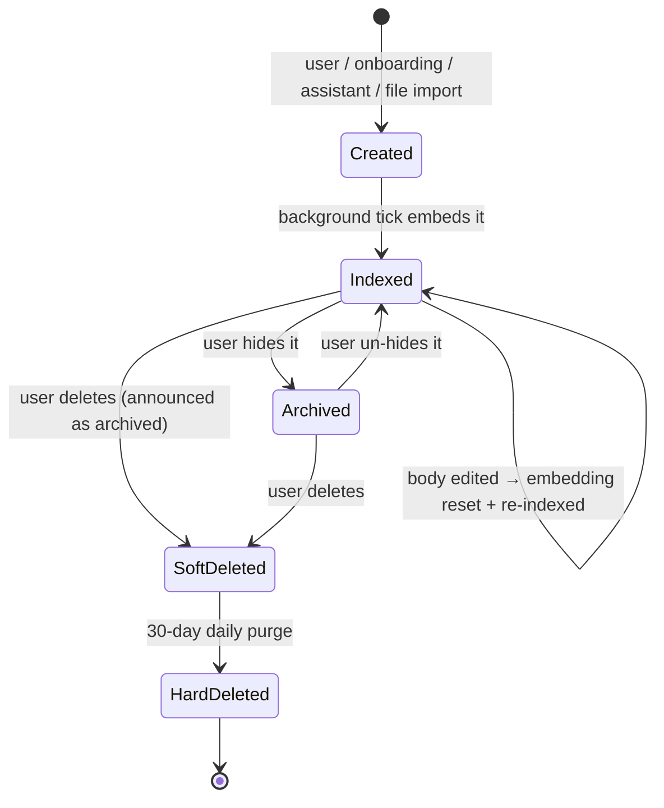

# Memory — Overview

> Vynel's visible, persistent memory: the tagged facts the assistant holds about you and your work across every session — that *you* can open, read, edit, and delete.
>
> **Status:** shipped · **Depends on:** [db](../_platform/database/overview.md) (kernel), [embeddings](../_platform/embeddings-and-indexing/overview.md), [indexer](../_platform/embeddings-and-indexing/overview.md) · **Code map:** [structure.md](./structure.md)

## Purpose

Memory is what lets Vynel *remember* — people, preferences, business facts, recurring patterns — instead of starting cold each session. Each thing it knows is one editable **entry**, scoped to a workspace, carrying open **tags**, and embedded so it can be found by meaning as well as by keyword.

What makes it a product surface rather than plumbing is **legibility**. The user opens the Memory section — on the global surface for the whole brain, or inside a workspace drawer for that room — and sees every fact the assistant holds, including the ones the assistant wrote for itself, and can correct or remove any of them. Vynel doesn't have a black-box memory; it has a drawer the user can open.

The tag `context` is the module's second big idea: it turns memory from a passive archive into the workspace's **standing context**. Entries wearing that one reserved tag are exactly what every fresh session is shown first, and the assistant is instructed to curate that set itself — save standing facts under it, and *update* the entry when a fact changes rather than pile up duplicates.

## What it can do

- **Capture a fact** four ways — the user types it into the Memory panel, onboarding seeds the very first entries, the assistant writes one mid-conversation through an approved tool, or a single on-disk file (markdown, plain text, PDF, Word, HTML, CSV, JSON) is imported one-shot as an entry.
- **Browse entries** in scope — filtered by kind, most-recently-mentioned first, cursor-paginated, archived entries hidden by default.
- **Search entries** by keyword, by meaning, or both fused together — hybrid is the default, and keyword-only skips the model entirely.
- **Tag entries** with up to eight short, lowercase labels. The vocabulary is open — a starter set is only suggested — except for the one reserved behavioral tag, `context`.
- **Feed the session** — when the memory capability is on, each turn's system prompt gets a usage instruction plus a rendered snapshot: the context-tagged entries alone (freshest first, capped) once any exist, or a top-N-per-kind fallback before anyone has learned about tags.
- **Edit an entry** — title, body, kind, archived state, tags (the sent list *replaces* the old one). Editing the body clears its embedding so it re-indexes.
- **Soft-delete an entry**, with a 30-day retention window before the hard purge.
- **Track mentions** — every time an entry is loaded into a session's context, that's recorded and the entry floats to the top of recency ordering; an entry's recent mentions are viewable.
- *(background)* Generate missing embeddings on a once-a-minute tick, and hard-purge expired soft-deletes daily. (A cleanup step for when chat hard-deletes a session is written and tested but not yet running anywhere — see the structure doc's gotchas.)

## Responsibilities

**Owns** — the entries and their whole lifecycle: three tables (entries, mentions, tags), both search indices (keyword + vector), the tag vocabulary and its normalization rules (the reserved `context` tag included), create / read / update / soft-delete / purge, hybrid search, file import, mention bookkeeping, the session-start snapshot and its agent instructions, and the four lifecycle events it announces through the outbox.

**Does not own** —
- the embedding *model* — shared infrastructure ([embeddings](../_platform/embeddings-and-indexing/overview.md)), the same engine [knowledge](../knowledge/overview.md) uses;
- document parsing for file import — the shared parser stack ([indexer](../_platform/embeddings-and-indexing/overview.md));
- whether memory is switched *on* for a workspace, and the prompt composition that injects its snapshot — [capabilities](../capabilities/overview.md) and [session](../session/overview.md);
- the timers that run its background jobs — the [local-api](../_apps/local-api/overview.md) app schedules them (the desktop runs no separate worker);
- chat sessions and messages — memory only points at them loosely, by id ([chat](../chat/overview.md));
- the seed content of a new user's first memories — [onboarding](../onboarding/overview.md) decides what to seed; memory just stores it.

## Concepts & vocabulary

| Term | Meaning |
|---|---|
| **Memory entry** | One fact. Has a *kind*, a free-text *body*, a *title* (auto-derived from the body if omitted), a *category / section* grouping, *tags*, and provenance. |
| **Kind** | `person` · `preference` · `business-fact` · `recurring-pattern` · `note`. Drives the panel's labels and the fallback snapshot's grouping. |
| **Tag** | A short lowercase label, up to eight per entry. An open, user-grown vocabulary — the defaults are picker *suggestions*, never an enum. |
| **`context` (reserved tag)** | The one *behavioral* tag: entries wearing it form the workspace's standing context, auto-injected at session start. The assistant is taught to maintain this set — save under it, update rather than duplicate. |
| **Category / Section** | A two-level grouping: category is one of `user` · `preferences` · `memory`; section is free text ("Key contacts"). |
| **Provenance** | Where an entry came from: `workspace-seed` · `user-manual` · `onboarding-seed` · `file-import`. |
| **Mention** | A recorded reference to an entry — e.g. loaded into a session's context. Drives recency ordering. High-volume, so mentions announce no outbox event. |
| **Embedding** | A numeric fingerprint of the entry's meaning, generated in the background, powering semantic and hybrid search. |
| **Archived vs. deleted** | Two states. *Archived* is a user "hide" toggle, reversible in place. *Deleted* is a soft-delete with a retention window. |

## Rules & invariants

- **Every entry belongs to exactly one workspace and one user.** Reads are workspace-scoped; single-entry access is ownership-guarded at the boundary — an entry outside your workspace is a plain not-found, never a leak that it exists.
- **Soft-delete is the only delete users see.** Normal views hide soft-deleted and archived entries; the hard purge runs 30 days later on a daily sweep. Soft-delete announces itself with the *archived* event — the distinct *hard-deleted* event fires only at purge time, as a coarse count-level signal.
- **An entry's embedding follows its body.** Born empty → filled by the background tick → reset whenever the body is edited, so it re-indexes. The vector-index row is removed explicitly at delete time, because the vector store honors no cascade.
- **Every state change co-commits its outbox event** — the row and the event land in one transaction, or neither does. The model call for embeddings always happens *outside* the transaction.
- **Tags are normalized at one gate.** Trimmed, lowercased, deduplicated, capped at eight per entry and a fixed length — every write path funnels through the same rule.
- **Standing context is selective and capped.** The moment any live entry wears `context`, those entries *alone* form the session snapshot (freshest first, generous ceiling); with none, the per-kind fallback keeps memory working untouched.
- **A file becomes a memory only if it stays snapshot-sized.** Import is one-shot, capped in length; anything bigger is rejected with a plain-words pointer to the knowledge base, where large documents belong.
- **The assistant's writes are approved mutations.** Six tools are exposed — three reads, three writes — and they gate together with the workspace's memory capability: capability off means none of them.

## Lifecycle

## Where it sits in the bigger picture

Memory is a quiet dependency of every conversational turn. The [session](../session/overview.md) composer injects its snapshot and instructions into the system prompt whenever the workspace's memory capability ([capabilities](../capabilities/overview.md)) is on, and the assistant reads and writes memory mid-turn through the [mcp](../_apps/mcp/overview.md) tool surface. [Onboarding](../onboarding/overview.md) seeds a new user's first entries. The [local-api](../_apps/local-api/overview.md) app hosts its routes, feeds the Memory panel in [local-web](../_apps/local-web/overview.md), and runs its maintenance ticks. It references [chat](../chat/overview.md) only loosely — by id, so chat can purge a session without breaking an entry that mentioned it — and it shares its embedding engine and file parsers with [knowledge](../knowledge/overview.md), the other half of "what Vynel knows": memory holds the curated facts a session carries; knowledge holds the large, searchable corpus.

---
*Mapped from the code on disk, 2026-07-14. If you change this module, update this file and [structure.md](./structure.md).*
