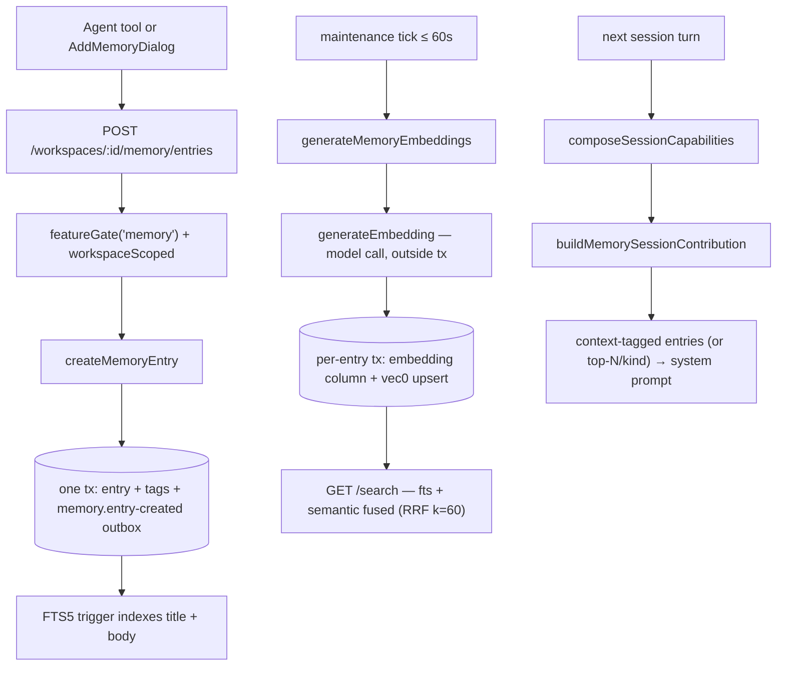
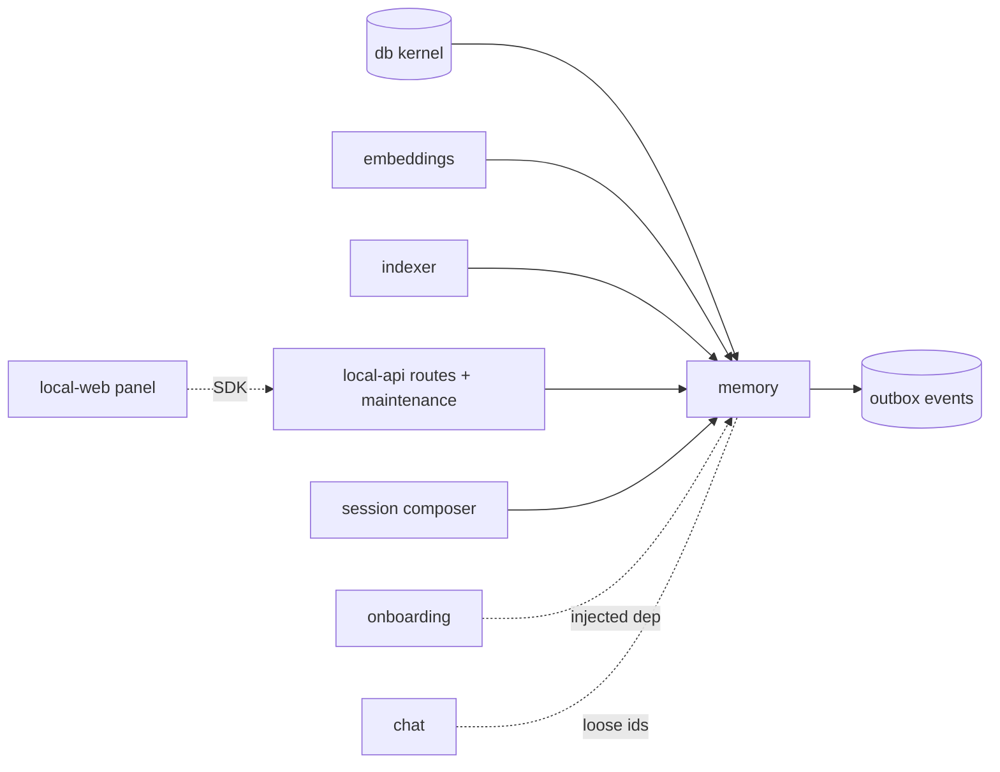

# Memory — Structure

> The code map and connections for the memory module. For the concepts behind it, see [overview.md](./overview.md).
>
> Folders touched: `packages/memory/src/` · `apps/local-api/src/routes/memory/` · `apps/local-api/src/services/` · `apps/mcp/src/` · `apps/local-web/src/{components/sections,composables/memory}/`

Memory is a vertical-slice leaf: the package owns its own `schema/`, `repositories/`, and operations (`lifecycle/` · `queries/` · `indexing/` · `session/`) over the shared `@vynel/db` kernel. Deps: `@vynel/db`, `@vynel/embeddings`, `@vynel/errors`, `@vynel/indexer`, `@vynel/logger` (`packages/memory/package.json`).

## File map

► = entry point.

| Path | Role |
|---|---|
| ► `packages/memory/src/index.ts` | public barrel — the only subpath export (`.`); repo reads the HTTP layer needs (`findEntryById`, `listRecentMentionsForEntry`, `listMemoryTagsForEntries`) are widened onto it |
| `packages/memory/src/memory-types.ts` | domain type re-exports + `StructuralLogger` (type-only from `@vynel/logger`) |
| `packages/memory/src/memory-events.ts` | 4 outbox event constants + payload types |
| `packages/memory/src/memory-tags.ts` | tag vocabulary — `CONTEXT_MEMORY_TAG`, `DEFAULT_MEMORY_TAGS` starters, `normalizeMemoryTag(s)` (the one normalization gate; max 8 tags × 32 chars) |
| `packages/memory/src/schema/memory-entries.ts` | `memory_entries` table + kind/source/category types |
| `packages/memory/src/schema/memory-entry-mentions.ts` | `memory_entry_mentions` table + `MentionKind` |
| `packages/memory/src/schema/memory-tags.ts` | `memory_tags` table (open labels, `context` reserved) |
| `packages/memory/src/repositories/memory-entries.ts` | entry repo — find / list (NULLS-LAST keyset cursor) / insert / update / soft- & hard-delete / null-source-refs |
| `packages/memory/src/repositories/memory-entry-mentions.ts` | mention repo — insert / list / count / delete-by-session |
| `packages/memory/src/repositories/memory-search.ts` | hybrid search (FTS5 + vec0, RRF k=60) + explicit `vec0` upsert/delete; dialect branch (Postgres throws) |
| `packages/memory/src/repositories/memory-tags.ts` | tag repo — insert / delete-for-entry / tags-per-entry map / distinct-per-workspace / entries-by-tag |
| `packages/memory/src/lifecycle/create-memory-entry.ts` | insert + tags + `memory.entry-created` outbox (one tx) + worker signal |
| `packages/memory/src/lifecycle/update-memory-entry.ts` | patch + tag REPLACE + embedding-reset on body change + `…updated` outbox |
| `packages/memory/src/lifecycle/import-memory-entry-from-file.ts` | *(async)* "remember this file" — parse one document (`@vynel/indexer`), ≤ 20 000 chars, then `createMemoryEntry` (`file-import`) |
| `packages/memory/src/lifecycle/delete-memory-entry.ts` | soft-delete + drop `vec0` row + `…archived` outbox (one tx) |
| `packages/memory/src/lifecycle/record-memory-entry-mention.ts` | mention row + `lastMentionedAt` bump (one tx) |
| `packages/memory/src/lifecycle/purge-soft-deleted-memory-entries.ts` | hard-delete rows soft-deleted > 30 d + coarse `…hard-deleted` outbox |
| `packages/memory/src/lifecycle/cleanup-memory-for-chat-session-hard-deleted.ts` | outbox consumer for `chat.session-hard-deleted` — *defined but not yet wired* (see Gotchas) |
| `packages/memory/src/lifecycle/derive-title-from-body.ts` | pure title helper (first sentence, ≤ 120 chars) |
| `packages/memory/src/queries/list-memory-entries-for-workspace.ts` | ISO↔Date cursor conversion + `nextCursor` envelope |
| `packages/memory/src/queries/list-memory-tags.ts` | tag-picker read — in-use ∪ defaults, `context` leads |
| `packages/memory/src/queries/search-memory-for-agent.ts` | *(async)* embed the query (semantic/hybrid only), then `searchEntries` |
| `packages/memory/src/session/load-workspace-context-for-session.ts` | the snapshot — `context`-tagged entries if any (≤ 50), else top-N-per-kind fallback; records `session-context-load` mentions when ids are supplied |
| `packages/memory/src/session/build-memory-session-contribution.ts` | `MEMORY_AGENT_INSTRUCTIONS` + rendered snapshot → system-prompt string |
| `packages/memory/src/indexing/generate-memory-embeddings.ts` | *(async)* batch-embed null-embedding entries; model call outside the tx |
| `packages/memory/src/indexing/embedding-worker-signal.ts` | Phase-1 **no-op stub** (cron-only; signal-on-write deferred) |
| ► `apps/local-api/src/routes/memory/index.ts` | HTTP entry — 9 routes, 6 exposed as MCP tools |
| `apps/local-api/src/routes/memory/{schemas,serializers}.ts` | Zod request/response schemas · row→JSON serializers (embedding Buffer never crosses the wire) |
| `apps/local-api/src/services/memory-maintenance-service.ts` | in-process background service — embeddings tick + retention purge |
| `apps/mcp/src/vynel-mcp-feature-descriptor.ts` | the `vynel` `McpFeatureDescriptor`s; memory's 6 tools listed in `capabilityGatedTools.memory` |
| `apps/local-web/src/components/sections/MemorySection.vue` | the panel — entries list on global + workspace surfaces |
| `apps/local-web/src/components/sections/AddMemoryDialog.vue` | write-by-hand or import-a-file, with tags |
| `apps/local-web/src/components/sections/MemoryTagsField.vue` | tag chips — known vocabulary + coin-inline, normalize/cap rules |
| `apps/local-web/src/composables/memory/*.ts` | 4 vue-query composables — entries-in-scope, create, import-file, tags |

## Data & persistence

All three tables live in `packages/memory/src/schema/` but are registered in the kernel's `drizzle.sqlite.config.ts` (repo root, lines 32–34) — the schema-parity check (`scripts/src/generators/check-schema-parity.ts`) enforces exactly-one-config registration. Migrations: `memory_entries` + `memory_entry_mentions` + the two virtual indices are in `packages/db/src/migrations-sqlite/0000_baseline.sql` (tables ~L166–205, hand-authored FTS/vec DDL ~L584–608); `memory_tags` is `0004_memory_tags.sql`.

**`memory_entries`** — one row per fact. Soft-delete column: `deletedAt`.

| Column | Type | Notes |
|---|---|---|
| `id` | id (PK) | UUID supplied by the core op |
| `userId`, `workspaceId` | id (FK, cascade) | → `users`, `workspaces` — the kernel's tables, not another leaf's |
| `kind` | text | `person` / `preference` / `business-fact` / `recurring-pattern` / `note` |
| `title`, `body` | text | title auto-derived from body if blank |
| `category`, `section` | text | `user` / `preferences` / `memory` + free sub-grouping label |
| `sourceMessageId` | text (null) | **loose ref** into chat — nulled by the (unwired) chat-cleanup consumer |
| `createdSource` | text | `workspace-seed` / `user-manual` / `onboarding-seed` / `file-import` |
| `embedding` | bytes (null) | 384 × float32 (MiniLM-L6-v2); null until the maintenance service fills it |
| `embeddingModelVersion` | text (null) | model tag |
| `isArchived` | boolean | the hide toggle |
| `createdAt` / `updatedAt` / `lastMentionedAt` / `deletedAt` | timestamp | |

Indexes: `userId` · `(workspaceId, kind)` · `(workspaceId, isArchived)` · `(workspaceId, lastMentionedAt)` · `deletedAt` · `sourceMessageId`.

**`memory_entry_mentions`** — recency log; cascade-deleted with its entry; carries **no** `userId` (scopes through the entry). Columns: `id`, `memoryEntryId` (FK cascade), `sessionId` + `messageId` (loose chat refs), `mentionKind` (`session-context-load` / `tool-output` / `agent-citation`), `mentionedAt`. Indexes: `(memoryEntryId, mentionedAt)` · `sessionId`.

**`memory_tags`** — many labels per entry, normalized lowercase, `context` reserved-behavioral. Columns: `id`, `memoryEntryId` (FK cascade), `tag`, `createdAt`. Indexes: by entry, by tag, unique `(memoryEntryId, tag)`.

**Two virtual indices** (baseline, hand-authored — drizzle-kit doesn't model them):
- `memory_entries_fts` — FTS5 external-content over `title` + `body`, kept in sync by 3 SQL triggers (insert/delete/update).
- `memory_entries_vec` — `sqlite-vec` `vec0(entryId PK, workspaceId, embedding float[384])`. **No** triggers or FKs — every write/delete is explicit code in `memory-search.ts`. The extension loads at every connection (`packages/db/src/client.ts`).

## Repositories

| Function (db-first) | Purpose |
|---|---|
| `findEntryById` | one entry or `null` |
| `listEntriesForWorkspace` | keyset cursor on `(lastMentionedAt DESC NULLS LAST, id DESC)`; caps 50/200 |
| `listEntriesForKindBundle` | top-N for one kind — the snapshot's fallback read |
| `findEntriesNeedingEmbedding` | `embedding IS NULL AND deletedAt IS NULL` — the maintenance queue |
| `insertEntry` / `insertManyEntries` | create (id supplied by caller) |
| `updateEntry` / `updateEntryEmbedding` | patch fields / set embedding + model version |
| `touchEntryMentionedAt` | bump recency |
| `softDeleteEntry` / `hardDeleteEntriesDeletedBefore` | retention lifecycle |
| `nullSourceMessageIdsForMessageIds` | chat-cleanup hook |
| *(mentions)* `insertMention`, `insertManyMentions`, `listRecentMentionsForEntry`, `countMentionsForEntry`, `deleteMentionsForSessionIds` | recency log |
| *(search)* `searchEntries`, `upsertVectorIndex`, `deleteVectorIndex` | hybrid search + explicit vec0 maintenance |
| *(tags)* `insertMemoryTags`, `deleteMemoryTagsForEntry`, `listMemoryTagsForEntries`, `listDistinctMemoryTagsForWorkspace`, `listEntriesByTag` | tag vocabulary + the `context` session read |

## Core operations

| Operation | What it does | Key calls |
|---|---|---|
| `createMemoryEntry` | insert + tags + `memory.entry-created`, one tx; derive title; (no-op) worker signal after commit | `insertEntry`, `insertMemoryTags`, `insertOutboxEvent`, `deriveTitleFromBody` |
| `updateMemoryEntry` | find→404, tag REPLACE, patch (resets embedding when body changes), `…updated` event — one tx | `findEntryById`, `deleteMemoryTagsForEntry` + `insertMemoryTags`, `updateEntry`, outbox |
| `importMemoryEntryFromFile` *(async)* | validate path → parse via `@vynel/indexer` → reject > 20 000 chars with a pointer to Knowledge → create (`kind: 'note'`, `category: 'memory'`, `section: 'imported'`) | `deriveDocumentKindFromPath`, `resolveDocumentParser`, `createMemoryEntry` |
| `deleteMemoryEntry` | find→404 (also on already-deleted), soft-delete, drop vec0 row, `…archived` event — one tx | `softDeleteEntry`, `deleteVectorIndex`, outbox |
| `recordMemoryEntryMention` | mention row + `lastMentionedAt` bump — one tx | `insertMention`, `touchEntryMentionedAt` |
| `listMemoryEntriesForWorkspace` | ISO↔Date cursor conversion + `nextCursor` envelope | `listEntriesForWorkspace` |
| `listMemoryTags` | in-use ∪ `DEFAULT_MEMORY_TAGS`, `context` first | `listDistinctMemoryTagsForWorkspace` |
| `loadWorkspaceContextForSession` | `context`-tagged entries (≤ 50, freshest first) if any exist, **else** top-N-per-kind across all 5 kinds; records mentions only when `sessionId` + `messageId` are supplied | `listEntriesByTag`, `listEntriesForKindBundle`, `recordMemoryEntryMention` |
| `buildMemorySessionContribution` | snapshot + `MEMORY_AGENT_INSTRUCTIONS` (incl. tag guidance) → system-prompt string; no mentions (pre-turn, no session id yet) | `loadWorkspaceContextForSession` |
| `searchMemoryForAgent` *(async)* | embed the query only for semantic/hybrid, then search | `generateEmbedding`, `searchEntries` |
| `generateMemoryEmbeddings` *(async)* | batch (50) of null-embedding entries; model call **outside** the tx, per-entry tx for the write; first-failure-before-any-success aborts the batch (model down) | `findEntriesNeedingEmbedding`, `generateEmbedding`, `updateEntryEmbedding`, `upsertVectorIndex` |
| `purgeSoftDeletedMemoryEntries` | hard-delete > 30 d + coarse `…hard-deleted` event (only when count > 0) — one tx | `hardDeleteEntriesDeletedBefore`, outbox |
| `cleanupMemoryForChatSessionHardDeleted` | delete mentions for the session + null matching `sourceMessageId`s — one tx; *defined + tested, not registered* | `deleteMentionsForSessionIds`, `nullSourceMessageIdsForMessageIds` |

## HTTP surface

Mounted at `/workspaces/:workspaceId/memory` (`apps/local-api/src/app.ts:143`). Two layers of middleware: `featureGate('memory')` on the whole subtree (`app.ts:116` — hub **entitlement** tier; 403 `feature_locked` when a live entitlement lacks the feature, permissive with no entitlement) and the `workspaceScoped` bundle per route (user + workspace ownership). No error mapping in the routes — typed `VynelError`s hit the global `onError`.

| Method | Path | Purpose | MCP tool |
|---|---|---|---|
| GET | `/entries` | list; kind filter, `includeArchived`, cursor; tags joined per page | `list_memory_entries` (read) |
| GET | `/search` | fts / semantic / hybrid (default) search | `search_memory` (read) |
| POST | `/entries` | create (`user-manual`) | `create_memory_entry` (**mutatingApproved**) |
| POST | `/entries/from-file` | one-shot file import | `add_memory_from_file` (**mutatingApproved**) |
| GET | `/tags` | tag picker — in-use ∪ defaults | `list_memory_tags` (read) |
| GET | `/entries/:entryId` | one entry (404 if cross-workspace or soft-deleted) | — |
| PATCH | `/entries/:entryId` | update title/body/kind/isArchived/tags (REPLACE) | `update_memory_entry` (**mutatingApproved**) |
| DELETE | `/entries/:entryId` | soft-delete (30 d retention) | — |
| GET | `/entries/:entryId/mentions` | recent mentions (guarded like the other single-entry routes) | — |

> The single-entry routes call `findEntryById` / `listRecentMentionsForEntry` / `listMemoryTagsForEntries` directly — repo reads deliberately widened onto the `@vynel/memory` barrel for the cross-workspace ownership guard (see the barrel's comment).

## MCP surface

Memory ships no descriptor of its own — its tools ride the route-derived `vynel` server: each route's `x-mcp` block is compiled by `scripts/src/generators/generate-mcp-tools.ts` into `apps/mcp/src/generated/api-tools.ts` (tool calls re-enter through the same HTTP routes, so agent and UI see one rulebook, including the feature gate).

- **6 tools** — 3 reads (`list_memory_entries`, `search_memory`, `list_memory_tags`) + 3 writes (`create_memory_entry`, `update_memory_entry`, `add_memory_from_file`). DELETE and mentions stay unexposed. `update_memory_entry` is exposed specifically so the assistant keeps `context`-tagged entries current instead of duplicating.
- **Capability gate** — `vynelWorkspaceDescriptor.capabilityGatedTools.memory` (`apps/mcp/src/vynel-mcp-feature-descriptor.ts:36-43`) lists all 6; `composeSessionMcpServers` (`apps/local-api/src/sessions/compose-session-mcp-servers.ts`) denies them all when the `memory` capability is off for the workspace. The capability itself is first-party, workspace-scoped, `defaultEnabled: true` (`packages/capabilities/src/catalog.ts`).
- **Approval** — the three writes are `mutatingApproved: true` (auto-approved, no card); the descriptor's `mutatingToolNames` is empty for the workspace server. When the real approval card lands they move there.

## Background service

The desktop app runs no `apps/worker` — memory's jobs run in-process in the API: `startMemoryMaintenanceService` (`apps/local-api/src/services/memory-maintenance-service.ts`), started at boot (`server.ts:115`), stopped on shutdown.

| Tick | Interval | Runs |
|---|---|---|
| embeddings | every 60 s (+ once at boot; in-flight guard) | `generateMemoryEmbeddings` |
| purge | every 24 h (+ once at boot) | `purgeSoftDeletedMemoryEntries` |

## Web surface

Everything speaks the generated SDK (`vynel.memory.*`) through vue-query; no Pinia store — cache keys under `["memory", …]`, mutations invalidate the whole `["memory"]` family.

- **Composables** (`apps/local-web/src/composables/memory/`) — `use-memory-entries-in-scope.ts` (workspace = one list call; global = aggregates the **first page** of every unarchived workspace), `use-create-memory-entry.ts`, `use-import-memory-file.ts`, `use-memory-tags.ts`.
- **Components** — `MemorySection.vue` (the list, archived filtered out, add button), `AddMemoryDialog.vue` (write-by-hand with kind picker, or file import via `FilePickerField.vue`; both take tags), `MemoryTagsField.vue` (known-tag chips + coin-inline; mirrors the 8×32 caps locally).
- **Mounting** — global surface: `GlobalChatView.vue` (menu section `memory`, `LockedFeatureCard` when the entitlement lacks it); workspace surface: `WorkspaceSectionPanel.vue` via `workspace-sections.ts`.

## Pipeline — "store a fact, then it's searchable and in context"

1. `apps/local-api/src/routes/memory/index.ts` (POST `/entries`) → `featureGate('memory')` + `workspaceScoped` → `createMemoryEntry(c.var.db, …)`.
2. `packages/memory/src/lifecycle/create-memory-entry.ts` — one tx: `insertEntry` (embedding null) + `insertMemoryTags` + `insertOutboxEvent('memory.entry-created')`; title via `deriveTitleFromBody`; then the inert `signalEmbeddingWorker()`.
3. The FTS5 insert trigger (`0000_baseline.sql` ~L591) populates the keyword index immediately; the semantic index waits.
4. Within a minute the maintenance service (`memory-maintenance-service.ts`) → `generateMemoryEmbeddings` → model call outside the tx → per-entry tx: `updateEntryEmbedding` + `upsertVectorIndex` (DELETE+INSERT — vec0 has no upsert).
5. `GET /search` → `searchMemoryForAgent` embeds the query → `searchEntries` fuses FTS + vec0 ranks (RRF, k=60) → JSON with literal `<mark>` snippets.
6. On the next workspace turn, `packages/session/src/runtime/compose-session-capabilities.ts` (if the `memory` capability is enabled) → `buildMemorySessionContribution` → `loadWorkspaceContextForSession` — `context`-tagged entries alone if any exist, else top-10-per-kind — rendered into the system-prompt append.

## Connections

**Summary:** memory is a **read-side hub, event-side leaf** — consumed by the session composer (the snapshot), the API routes/MCP tools, onboarding (seeding, via injected dep), and the web panel; it depends only on the kernel + shared packages. It publishes four lifecycle events; none are consumed yet (the registry is empty).

| Unit | Direction | Mechanism | What crosses |
|---|---|---|---|
| db kernel (`@vynel/db`) | out | import | `Database`, `withTransaction`, dialect helpers, `users`/`workspaces` FKs, `insertOutboxEvent` |
| embeddings (`@vynel/embeddings`) | out | import | `generateEmbedding`, `EMBEDDING_MODEL_VERSION` |
| indexer (`@vynel/indexer`) | out | import | document parsers for the file import |
| errors / logger | out | import / type-only | `NotFoundError`, `ValidationError`, `StructuralLogger` |
| [session](../session/overview.md) | in | import | `composeSessionCapabilities` calls `buildMemorySessionContribution` when the capability is on |
| local-api routes | in | import | the 9 routes + repo reads; `workspaceScoped` + `featureGate` enforce access |
| local-api services | in | import | the maintenance service's two ticks |
| [onboarding](../onboarding/overview.md) | in | **injected dep** | `createMemoryEntry` bound into `OnboardingDeps` at `apps/local-api/src/routes/onboarding/build-onboarding-deps.ts` — the leaf never imports `@vynel/memory` |
| [capabilities](../capabilities/overview.md) | in | id string | `'memory'` in the catalog; gates the prompt contribution + the 6 MCP tools |
| [chat](../chat/overview.md) | both (loose) | shared id strings | `sessionId`/`messageId`/`sourceMessageId` as loose `text()`; *intends* to consume `chat.session-hard-deleted` (not wired) |
| local-web | in | SDK | the panel calls list / create / importFile / listTags |

**Events published** (each co-committed in the mutating tx): `memory.entry-created` · `memory.entry-updated` (incl. archive toggle) · `memory.entry-archived` (on soft-**delete** — note the name) · `memory.entry-hard-deleted` (per purge tick; coarse — empty `entryIds`, user/workspace fields omitted).
**Events consumed:** none — `OUTBOX_CONSUMERS` (`packages/core/src/_shared/outbox-consumer-registry.ts`) is empty; `cleanupMemoryForChatSessionHardDeleted` is exported and tested but unregistered.

## Config & gotchas

- **`sqlite-vec` loads at every connection** (`packages/db/src/client.ts`) — fail-loud on unsupported platforms; without it every vec0 statement dies with `no such module: vec0`.
- **Postgres search throws** — `searchEntriesPostgres` is a deliberate Phase-2 stub; Phase 1 is SQLite-only.
- **Two gates, different questions.** `featureGate('memory')` is the hub *entitlement* (plan tier, HTTP 403 `feature_locked`); the *capability* gate is per-workspace (`workspace_capabilities`) and only denies MCP tools + drops the prompt contribution. MCP calls re-enter through HTTP, so they hit both.
- **`memory.entry-archived` fires on soft-delete, not the archive toggle** — toggling `isArchived` emits `…updated`. Historical name; treat soft-delete as the "archived" signal.
- **vec0 has no triggers, no FKs, no upsert** — every index write is explicit (`upsertVectorIndex` = DELETE+INSERT; `deleteVectorIndex` at every delete site). FTS rows, by contrast, sync via triggers and are excluded at query time by the JOIN's `deleted_at IS NULL`. Don't assume symmetry.
- **`embedding-worker-signal.ts` is a deliberate no-op** — cron-only; callers invoke it anyway so a future signal path needs no new branches.
- **The chat-cleanup consumer is unwired** — and even once registered, chat's payload carries only `sessionId` today; `hardDeletedMessageIds` is a backlog extension, so the `sourceMessageId`-nulling step is a no-op in the wild.
- **`@vynel/memory` exports only `.`** — no `./repositories` subpath; the HTTP layer's repo reads are widened onto the main barrel deliberately (comment in `src/index.ts`).
- **Global memory doesn't exist yet** — entries live in a workspace; the global surface aggregates per-workspace lists and takes only the **first page** of each (known truncation, `use-memory-entries-in-scope.ts`).
- **Coarse purge event** — `MemoryEntryHardDeletedPayload` ships empty `entryIds` with user/workspace omitted from the cron path; consumers must handle both shapes (see the type's comment).
- **Caps are enforced twice** — Zod at the wire (tags 8×32, body ≤ 10 000) and again in `normalizeMemoryTags` / repo list limits (50 default / 200 max).

---
*Mapped from the code on disk, 2026-07-14. If you change this module, update this file and [overview.md](./overview.md).*
