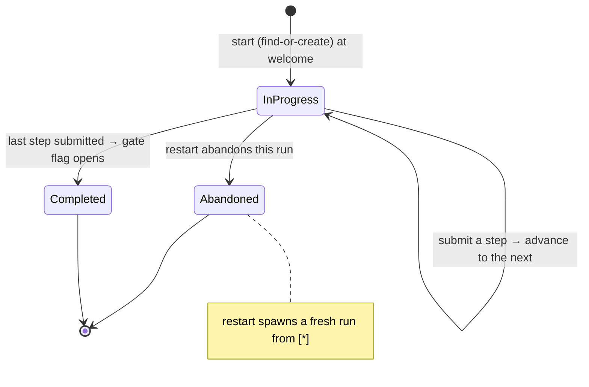

# Onboarding — Overview

> Vynel's first-launch wizard: a short, ordered set of steps that turns a blank install into a ready workspace — a named workspace, a filled-in profile, the assistant's first memories about you, and a starter skill — then opens the door to the app.
>
> **Status:** shipped · **Depends on:** [db](../_platform/database/overview.md) (kernel), [contracts](../_platform/contracts-and-sdk/overview.md), [errors](../_platform/primitives/overview.md) · **Code map:** [structure.md](./structure.md)

## Purpose

Onboarding exists so a non-technical person's very first minutes with Vynel are guided rather than blank. On a fresh install the assistant knows nothing — no workspace to work in, no name, no facts about the user, no skills. This module runs a small, resumable interview that fills all of that in, one step at a time, and then flips the single flag that tells the rest of the app "this person is set up — stop showing the wizard."

What makes it a genuine product surface, not plumbing, is that it is the user's **first impression** and the moment the assistant's memory is first seeded. It is also, structurally, a **coordinator**: onboarding owns almost none of the things it sets up. It does not create workspaces, write memories, install skills, connect channels, or make schedules itself — it *asks each of those modules* to do its own job, in the right order, and records how far the interview has gotten. Onboarding is the conductor; the other modules are the orchestra.

## What it can do

- **Check whether onboarding is still needed** — reads the user's "has completed onboarding" gate flag plus any interview already underway, so the app's first-launch gate and the web client both know whether to show the wizard.
- **Start (or resume) an interview** — find-or-create: if the user already has one in progress, that same run comes back; otherwise a fresh one begins at the welcome step.
- **Submit a step** — the single entry point the wizard calls per screen. It validates that the step matches where the run actually is, runs that step's work, and moves the run forward.
- **Report a run's status** — the current step, how many of the total steps are done, everything collected so far, and (at the skills step) the list of suggested skills.
- **Restart** — abandon every in-progress interview for the user and begin a clean one. It does **not** undo the workspace, profile, memories, or anything already created — restarting resets the *interview*, not its results.
- **Seed the assistant's first memories** — turn the "help Claude know you" answers into structured memory entries stamped as onboarding-sourced.
- **Complete the run** — once the last step finishes, open the gate: flip the user's "has completed onboarding" flag exactly once.

The seven steps, in order:

1. **Welcome** — a no-op acknowledgement that moves things along.
2. **Profile** — updates the boot-created user with a display name, locale, and timezone.
3. **Name your workspace** — creates a fresh folder at the default location under a filesystem-safe name, then registers it as the user's first workspace.
4. **Help Claude know you (identity-seed)** — a few freeform questions whose answers become the assistant's first workspace-scoped memories.
5. **Install starter skills** — installs each chosen verified skill at its recommended scope.
6. **Connect a chat app** *(optional)* — connect a Telegram bot to the workspace, or skip.
7. **Set a daily briefing** *(optional)* — create a morning-briefing schedule, or skip.

## Responsibilities

**Owns** — the interview itself: the run record (one row per attempt), its position in the seven-step sequence, the per-step input it accumulates, and the rules of the state machine (which step is next, what counts as complete, when a step is out of order). It owns the find-or-create / resume / restart lifecycle, the ownership-and-status guards on every submission, the three typed state-machine errors the wizard branches on, the mapping of identity answers into memory-seed shapes, and the act of opening the gate flag at the end.

**Does not own** — everything the steps *set up*. Each of these lives in the module that owns it, reached only through injected operations, never imported:
- the workspace folder and its registration — [workspaces](../workspaces/overview.md);
- the user row and its profile / gate flag — [core](../core/overview.md) (users);
- the memory entries the identity step seeds — [memory](../memory/overview.md) (onboarding only *decides what to seed*; memory stores it);
- installing a skill — [skills](../skills/overview.md);
- connecting a channel — [channels](../channels/overview.md);
- creating a schedule — [schedules](../schedules/overview.md);
- the step catalog, per-step input schemas, and suggested-skill resolution — shared definitions in [contracts](../_platform/contracts-and-sdk/overview.md).

## Concepts & vocabulary

| Term | Meaning |
|---|---|
| **Onboarding run** | One attempt at the interview — a single record holding the current step, the steps already completed, everything collected so far, and a status. One row per attempt, not one per user. |
| **Step / step kind** | One screen of the wizard. Seven of them, in a fixed order: welcome, profile, name-workspace, identity-seed, install-suggested-skills, optional-channel, optional-schedule. |
| **Step catalog** | The shared, ordered list that names every step, its display label, one-line description, order number, and whether it can be skipped. It is the single source of "what step comes next." |
| **Collected data** | The bag of per-step answers a run accumulates as it advances — opaque storage, read back through a typed shape. |
| **Gate flag** | The user's "has completed onboarding" boolean. While it is false the app shows the wizard; completing the run flips it true. |
| **Injected operations** | The set of sibling capabilities (create workspace, update profile, create memory, install skill, connect channel, create schedule, mark complete) handed to onboarding from the outside. Onboarding calls them by shape, never by import. |
| **Memory seed entry** | An identity answer reshaped into a memory-ready fact, stamped with onboarding provenance, ready for the memory module to store. |
| **Suggested skills** | The default-checked and optional skill sets offered at the install step, resolved for the default workspace kind. |
| **Run status** | `in-progress` · `completed` · `abandoned`. There is no delete — the status enum *is* the lifecycle. |

## Rules & invariants

- **The single user exists before onboarding runs.** Boot creates the one local user; onboarding only *updates* that user (profile, gate flag) and never creates one. The interview's own record carries that user's id from the very first step.
- **Onboarding never imports a sibling feature.** Every workspace, profile, memory, skill, channel, and schedule action is a capability injected from outside and called by its shape. This keeps onboarding a coordinator that depends only on the shared kernel and contracts — honoring the "imports point down only, no cross-feature imports" invariant.
- **One place moves the run forward.** A single bookkeeping step is the only thing that changes which step is current, appends to the completed list, folds in the step's input, and detects completion. Individual step handlers do their work, then hand off to it.
- **Only the last two steps are skippable.** Welcome, profile, name-workspace, identity-seed, and install-suggested-skills are required; connecting a channel and setting a briefing are optional and can be skipped outright.
- **Later steps refuse to run before their prerequisite exists.** Steps that need a workspace (identity-seed, skills, and a connecting channel/schedule) raise an out-of-order error if the name-workspace step hasn't created one yet.
- **A submission must match the run's real position.** Every submit is guarded: the run must exist and belong to the caller, must not already be completed or abandoned, and the submitted step must equal the run's current step — otherwise a distinct, coded error tells the wizard exactly how to recover (redirect, resync, or jump back).
- **Completion opens the gate exactly once.** When the final step finishes, the run is marked completed and the user's gate flag is flipped — the single seam that ends first-launch mode.
- **Restart abandons, never destroys.** Restarting marks in-progress runs abandoned and starts a clean interview; the workspace, profile, memories, and anything else already created stay put.
- **Best-effort where a failure shouldn't trap the user, fail-and-retry where it should.** A failed skill install is logged and skipped so one bad skill can't block onboarding; a bad channel token is re-thrown so the wizard can show the error and let the user retry or skip.
- **The interview publishes no outbox events and has no soft-delete.** Unlike most feature modules, onboarding's whole lifecycle is the status enum on its single record.

## Lifecycle

## Where it sits in the bigger picture

Onboarding is the seam between "just installed" and "using the app." The [local-api](../_apps/local-api/overview.md) app hosts its routes and — crucially — is the composition point that binds onboarding's injected operations to the real sibling modules, so the leaf itself stays import-clean. The wizard screens live in [local-web](../_apps/local-web/overview.md), driven by the shared step catalog and per-step schemas in [contracts](../_platform/contracts-and-sdk/overview.md). Downstream, onboarding is the first writer into most of the product: it stands up a [workspace](../workspaces/overview.md), fills in the [user](../core/overview.md), seeds the assistant's first [memories](../memory/overview.md), installs a starter [skill](../skills/overview.md), and optionally wires a [channel](../channels/overview.md) and a [schedule](../schedules/overview.md). It touches all of them and owns none of them — the clearest example in the codebase of a coordinator that composes features through injection rather than dependency.

---
*Mapped from the code on disk, 2026-07-14. If you change this module, update this file and [structure.md](./structure.md).*
