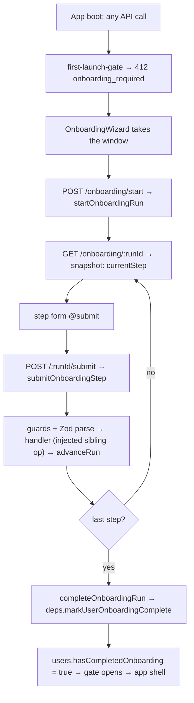
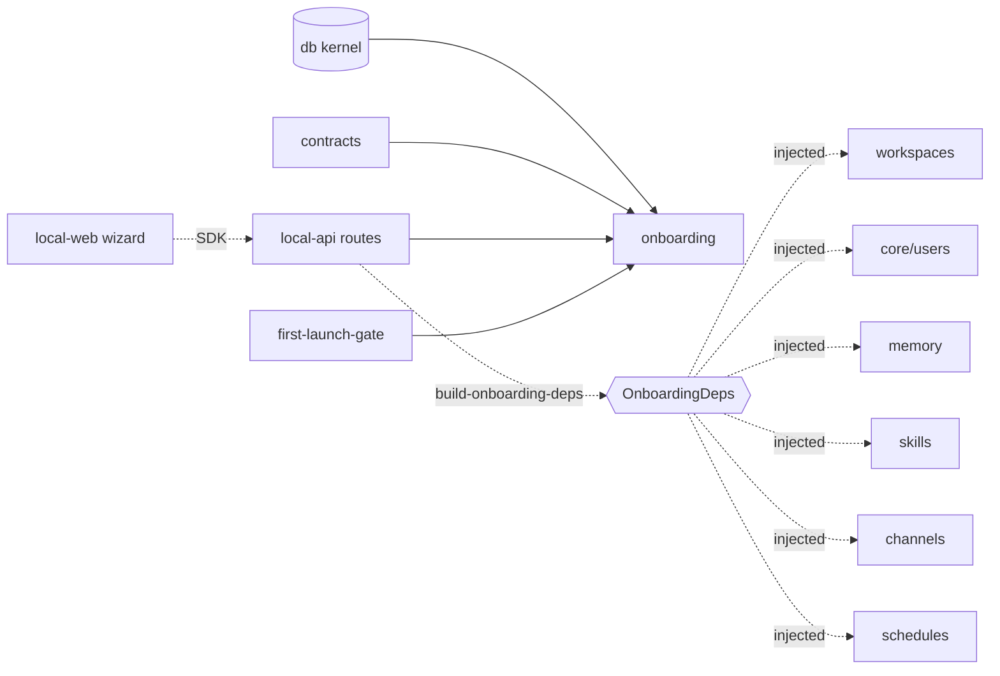

# Onboarding — Structure

> The code map and connections for the onboarding module. For the concepts behind it, see [overview.md](./overview.md).
>
> Folders touched: `packages/onboarding/src/` · `packages/contracts/src/onboarding/` · `packages/db/src/{schema,repositories}/onboarding/` · `apps/local-api/src/routes/onboarding/` · `apps/local-api/src/middleware/` · `apps/local-web/src/components/onboarding/`

Onboarding is a vertical-slice leaf that runs a **7-step first-launch state machine**, but with an unusual shape: it owns almost no persistence of its own (one table) and reaches every sibling feature — workspaces, users, memory, skills, channels, schedules — **only through an injected `OnboardingDeps` bundle**. The package's real dependency set is just the kernel + shared: `@vynel/db`, `@vynel/contracts`, `@vynel/errors` (`packages/onboarding/package.json`). It imports **no** sibling feature package, not even type-only — the sibling call shapes are re-declared *structurally* in `onboarding-types.ts` (invariant #2). Phase-1 sync throughout: no outbox, no `db.transaction`.

## File map

► = entry point.

| Path | Role |
|---|---|
| ► `packages/onboarding/src/index.ts` | public barrel (`.` only) — the 6 lifecycle ops + the `submitOnboardingStep` dispatcher + `buildMemorySeedEntries` + types |
| `packages/onboarding/src/onboarding-types.ts` | domain types + the **`OnboardingDeps`** contract (the injected-sibling seam) + `MemorySeedEntry` / `SkillInstallRequest` structural shapes + `StructuralLogger` |
| `packages/onboarding/src/onboarding-errors.ts` | 3 `VynelError` subclasses with distinct wizard-branch codes (409 / 400 / 400) |
| `packages/onboarding/src/start-onboarding-run.ts` | find-or-create the in-progress run; stamps `userId`, seeds `welcome` |
| `packages/onboarding/src/restart-onboarding-run.ts` | abandon all in-progress runs for the user, then start fresh (leaves user/workspace/siblings untouched — D11) |
| `packages/onboarding/src/check-if-onboarding-needed.ts` | reads `users.hasCompletedOnboarding` + any in-progress run — the gate's probe |
| `packages/onboarding/src/get-onboarding-run-status.ts` | run + current-step entry + completed count; at step 5 attaches suggested skills |
| `packages/onboarding/src/complete-onboarding-run.ts` | the completion seam — flips `users.hasCompletedOnboarding` via injected `markUserOnboardingComplete`; does NOT re-advance |
| `packages/onboarding/src/advance-run.ts` | the **only** writer of `currentStepKind`/`completedSteps`/`collectedData`; merges step input, computes next step, detects completion |
| ► `packages/onboarding/src/submit-onboarding-step.ts` | the dispatcher — ownership + status + step-match guards, per-step Zod parse, calls the handler, fires `completeOnboardingRun` on the last step |
| `packages/onboarding/src/handlers/index.ts` | barrel for the 7 step handlers (domain-internal — only the dispatcher calls them) |
| `packages/onboarding/src/handlers/handle-welcome-step.ts` | step 1 — no-op acknowledge + advance |
| `packages/onboarding/src/handlers/handle-profile-step.ts` | step 2 — injected `updateUserProfile`, then advance |
| `packages/onboarding/src/handlers/handle-name-workspace-step.ts` | step 3 — `mkdirSync` a fresh folder (default location + sanitized name), injected `createWorkspace`, stash `workspaceId`/`workspacePath` |
| `packages/onboarding/src/handlers/handle-identity-seed-step.ts` | step 4 — `buildMemorySeedEntries` → injected `createMemoryEntry` per entry |
| `packages/onboarding/src/handlers/handle-install-suggested-skills-step.ts` | step 5 — injected `installSkill` per selected skill; **failures non-fatal** (logged, skipped); skips unknown/system skills |
| `packages/onboarding/src/handlers/handle-optional-channel-step.ts` | step 6 — `skipped` advances; else injected `connectChannel` (Telegram); bad token re-throws |
| `packages/onboarding/src/handlers/handle-optional-schedule-step.ts` | step 7 (last) — `skipped` advances; else injected `createSchedule` (morning-briefing cron); advance completes the run |
| `packages/onboarding/src/seeding/build-memory-seed-entries.ts` | maps identity-seed answers → 2–3 `MemorySeedEntry` rows (working-style optional) |
| `packages/contracts/src/onboarding/onboarding-step-catalog.ts` | the 7-entry catalog + `findOnboardingStepByKind` / `getNextOnboardingStep` (shared api + web) |
| `packages/contracts/src/onboarding/onboarding-step-inputs.ts` | 7 per-step Zod input schemas + inferred types (channel/schedule are discriminated unions on `kind`) |
| `packages/contracts/src/onboarding/collected-onboarding-data.ts` | the typed shape the opaque `collectedData` JSON is cast to |
| `packages/contracts/src/onboarding/suggested-skills.ts` | `SUGGESTED_SKILLS_BY_WORKSPACE_KIND` + `resolveSuggestedSkills` (per-kind, retained for future multi-skill) |
| `packages/db/src/schema/onboarding/onboarding-runs.ts` | the `onboarding_runs` table + local `OnboardingStepKind` / `OnboardingRunStatus` unions |
| `packages/db/src/repositories/onboarding/onboarding-runs.ts` | functional repo — insert / find-by-id / find-in-progress / list-in-progress / update |
| ► `apps/local-api/src/routes/onboarding/index.ts` | HTTP entry — 5 routes, `userScoped`, no MCP |
| `apps/local-api/src/routes/onboarding/build-onboarding-deps.ts` | **the composition point** — binds the real sibling ops into `OnboardingDeps` |
| `apps/local-api/src/routes/onboarding/schemas.ts` | Zod request/response schemas (dates pass through as ISO strings — no serializer) |
| `apps/local-api/src/middleware/first-launch-gate.ts` | 412 `onboarding_required` on every non-onboarding route until setup completes |
| `apps/local-web/src/components/onboarding/OnboardingWizard.vue` | the wizard shell — takes the window, drives step-by-step off the server snapshot |
| `apps/local-web/src/components/onboarding/steps/*.vue` | the 7 step forms (`WelcomeStep` … `ScheduleStep`) |
| `apps/local-web/src/composables/onboarding/use-onboarding-run.ts` | vue-query start / restart / status / submit against the SDK |
| `apps/local-web/src/stores/onboarding-store.ts` | Pinia UI flag `isRequired` (server truth lives in vue-query) |
| `apps/local-web/src/utils/onboarding-required-error.ts` | recognizes the gate's 412 envelope |

## Data & persistence

Onboarding owns **one** table, `onboarding_runs`, in `packages/db/src/schema/onboarding/onboarding-runs.ts`, registered once in the kernel's `drizzle.sqlite.config.ts` (line 48 — the schema-parity check enforces exactly-one registration). The DDL is baseline: `packages/db/src/migrations-sqlite/0000_baseline.sql` (L432–448). There is **no** `deletedAt` — the lifecycle is the `status` enum, and no dedicated migration beyond the baseline.

**`onboarding_runs`** — one row per onboarding attempt.

| Column | Type | Notes |
|---|---|---|
| `id` | id (PK) | UUID from `startOnboardingRun` |
| `userId` | id (FK, **cascade**) | → `users` — a **kernel table**, so this is a real FK, not a loose ref; NOT NULL (single user exists from boot — D14) |
| `workspaceId` | text (FK, **set null**) | → `workspaces` — kernel table; nullable until step 3; declared `text()` not `id()` so the set-null FK is expressible |
| `currentStepKind` | text | the `OnboardingStepKind` union (local copy) |
| `completedSteps` | json | opaque `OnboardingStepKind[]`, appended by `advanceRun` |
| `collectedData` | json | opaque `Record<string, unknown>` at the DB layer; the core casts it to `CollectedOnboardingData` |
| `status` | text | `in-progress` / `completed` / `abandoned` |
| `startedAt` / `lastActivityAt` | timestamp | |
| `completedAt` | timestamp (null) | set only when the last step lands |

Indexes: `idx_onboarding_runs_user` (`userId`) · `idx_onboarding_runs_status` (`status`).

**Loose ID stored in the JSON** (not FKs): `collectedData.channelId` and `collectedData.workspacePath` are stashed by `advanceRun` from step outputs — plain strings, no referential integrity.

## Repositories

All reads filter on `userId`; Phase-1 sync (no `Promise`).

| Function (db-first) | Purpose |
|---|---|
| `insertOnboardingRun` | create (id supplied by the op) |
| `findOnboardingRunById` | one run or `null` |
| `findInProgressRunForUser` | the at-most-one in-progress run (`desc(startedAt)` defensive pick) |
| `listInProgressRunsForUser` | all in-progress runs — the restart abandon-loop |
| `updateOnboardingRun` | patch (throws if the id is gone) — the sole write path for `advanceRun` |

## Core operations

No outbox events, no `db.transaction` — Phase-1 sync. Sibling effects run through injected deps (the "key calls" that read like `deps.X`).

| Operation | What it does | Key calls |
|---|---|---|
| `startOnboardingRun` | resume the in-progress run if any, else insert a fresh `welcome` run | `findInProgressRunForUser`, `insertOnboardingRun` |
| `restartOnboardingRun` | abandon every in-progress run, then `startOnboardingRun` | `listInProgressRunsForUser`, `updateOnboardingRun`, `startOnboardingRun` |
| `checkIfOnboardingNeeded` | `!user.hasCompletedOnboarding` + in-progress run id | `findUserById`, `findInProgressRunForUser` |
| `getOnboardingRunStatus` | run (404 if not owned) → current-step entry, counts, cast `collectedData`; at step 5 attaches `resolveSuggestedSkills('personal')` | `findOnboardingRunById`, `findOnboardingStepByKind`, `resolveSuggestedSkills` |
| `submitOnboardingStep` *(async)* | ownership/status/step-match guards → per-step Zod parse → handler → on `completed`, `completeOnboardingRun` | the 7 handlers, `completeOnboardingRun` |
| `advanceRun` | merge step input into `collectedData`, append `completedSteps`, compute next step, stamp timestamps + completion | `getNextOnboardingStep`, `updateOnboardingRun` |
| `completeOnboardingRun` | re-find (404 if not owned), flip the gate flag via injected dep | `findOnboardingRunById`, **`deps.markUserOnboardingComplete`** |
| `handleWelcomeStep` | acknowledge + advance | `advanceRun` |
| `handleProfileStep` | update the boot user's profile, advance | **`deps.updateUserProfile`**, `advanceRun` |
| `handleNameWorkspaceStep` *(async)* | `mkdirSync` folder → register workspace → advance with `workspaceId`/`workspacePath` | **`deps.createWorkspace`**, `deps.resolveDefaultWorkspaceLocation`, `deps.sanitizeFolderName`, `advanceRun` |
| `handleIdentitySeedStep` *(async)* | 404-guard `workspaceId`, seed 2–3 memory facts, advance | `buildMemorySeedEntries`, **`deps.createMemoryEntry`**, `advanceRun` |
| `handleInstallSuggestedSkillsStep` *(async)* | per selected skill: skip unknown/system, else install (**non-fatal on failure**), advance | `findVerifiedSkillById`, **`deps.installSkill`**, `advanceRun` |
| `handleOptionalChannelStep` *(async)* | `skipped` → advance; else connect Telegram (bad token re-throws), stash `channelId` | **`deps.connectChannel`**, `advanceRun` |
| `handleOptionalScheduleStep` | `skipped` → advance; else create morning-briefing schedule → advance (completes the run) | **`deps.createSchedule`**, `advanceRun` |
| `buildMemorySeedEntries` | answers → `MemorySeedEntry[]` (About you / Things to remember + optional Communication style) | pure |

## HTTP surface

Mounted at `/onboarding` (`apps/local-api/src/app.ts:163`). Every route composes `...userScoped` (resolves the single boot user into `c.var.user`) but **not** the workspace resolver — there is no workspace until step 3 (D7). Handlers throw typed `VynelError`s; the global `onError` maps them. **No `x-mcp`** — onboarding runs before the agent/MCP runtime exists.

| Method | Path | Purpose | MCP tool |
|---|---|---|---|
| POST | `/start` | start or resume the run | — |
| POST | `/restart` | abandon in-progress, start fresh | — |
| GET | `/status/needs-onboarding` | `{ needsOnboarding, inProgressRunId }` | — |
| GET | `/:runId` | the run status snapshot (owner-scoped, 404 otherwise) | — |
| POST | `/:runId/submit` | submit one step, advance (400 mismatch / 404 not-owned / 409 already-complete) | — |

The submit route is the one place the sibling ops enter: it calls `buildOnboardingDeps(c.var.logger)` and threads the bundle into `submitOnboardingStep`.

## The first-launch gate (middleware)

`firstLaunchGateMiddleware` (`apps/local-api/src/middleware/first-launch-gate.ts`) is a cross-cutting precondition, not a domain error. Wired behind `enableFirstLaunchGate` in `createApp` (`app.ts:106`), which `server.ts:99` drives from `VYNEL_FIRST_LAUNCH_GATE_ENABLED` — **off by default** so domain route tests stay ungated.

- Skips `/openapi.json` and `/onboarding*` **before** any `c.var.db` access (keeps the SDK generator's stub-deps `/openapi.json` request safe).
- Resolves the user via read-only `findSingleLocalUser` (never `getOrCreateLocalUser` — D7); never mutates.
- Returns `412 onboarding_required` (with `inProgressRunId`) for every other route while `checkIfOnboardingNeeded` says setup isn't finished.

## Web surface

The wizard is a full-window takeover driven entirely by server truth — no client-side step logic.

- **Store** (`stores/onboarding-store.ts`) — a single Pinia UI flag `isRequired`; server state lives in vue-query. `main.ts` wires the query client's `onOnboardingRequired` → `markRequired`; `App.vue` shows `<OnboardingWizard>` when `isRequired`, and its `completed` event calls `markCompleted`.
- **412 recognition** (`utils/onboarding-required-error.ts` + `plugins/vue-query.ts`) — any gated call that answers the 412 envelope flips `isRequired`, so the wizard takes the window even mid-session.
- **Composables** (`composables/onboarding/use-onboarding-run.ts`) — `useStartOnboarding` (resume-safe), `useRestartOnboarding`, `useOnboardingRunStatus` (sentinel-guarded key), `useSubmitOnboardingStep`; types inferred from the SDK so the wire is the single source of truth. Cache keys under `["onboarding", …]`; mutations invalidate the whole family.
- **Components** — `OnboardingWizard.vue` starts the run on mount, reads the snapshot's `currentStepKind`, and renders one of 7 `steps/*.vue` forms; `WizardProgressHeader`/`WizardStepBody`/`WizardBootScreen`/`WizardDoneScreen` frame it. Each step `@submit`s an opaque `stepInput` back to the dispatcher.

## Pipeline — "a fresh install walks 7 steps and the app unlocks"

1. Any gated call while setup is unfinished → `first-launch-gate.ts` returns `412 onboarding_required`; `vue-query.ts` maps it to `markRequired`, and `App.vue` shows the wizard.
2. `OnboardingWizard.vue` (`onMounted`) → `POST /onboarding/start` → `packages/onboarding/src/start-onboarding-run.ts` (resume-or-create).
3. `GET /onboarding/:runId` → `get-onboarding-run-status.ts` gives the current step entry (+ suggested skills at step 5); the matching `steps/*.vue` renders.
4. The step `@submit`s → `POST /:runId/submit` → `submit-onboarding-step.ts:48` guards ownership/status/step-match, parses the per-step schema, dispatches to the handler.
5. The handler runs its injected sibling op (e.g. `handle-name-workspace-step.ts:32` → `deps.createWorkspace`) then `advance-run.ts:35` writes the next step / completion into the one row.
6. On the last step (`optional-schedule`), `advanceRun` sets `status: 'completed'`; the dispatcher calls `complete-onboarding-run.ts:21` → `deps.markUserOnboardingComplete` flips `users.hasCompletedOnboarding`, the gate stops 412-ing, and the app shell loads.

## Connections

**Summary:** onboarding is an **orchestrator leaf** — it drives a walk across six sibling features but depends (by import) only on the kernel + shared. The distinction that defines this module: kernel is *imported*, sibling features are *injected*. It publishes and consumes **no** outbox events.

| Unit | Direction | Mechanism | What crosses |
|---|---|---|---|
| db kernel (`@vynel/db`) | out | import | `Database`, the `onboarding_runs` schema/repo, `users`/`workspaces` **FKs**, `findUserById`, `findSingleLocalUser` |
| contracts (`@vynel/contracts`) | out | import | step catalog, per-step Zod schemas, `CollectedOnboardingData`, suggested-skills, verified-skill catalog |
| errors (`@vynel/errors`) | out | import | `NotFoundError`, `VynelError` base |
| [workspaces](../workspaces/overview.md) — the **table** | out | **kernel FK** | `onboarding_runs.workspaceId` → `workspaces` (set-null) |
| [workspaces](../workspaces/overview.md) — the **feature** | out | **injected dep** | `createWorkspace`, `sanitizeFolderName`, `makeDefaultWorkspaceParentDirectory` |
| [core/users](../core/overview.md) | out | **injected dep** | `updateUserProfile`, `markUserOnboardingComplete` |
| [memory](../memory/overview.md) | out | **injected dep** | `createMemoryEntry` (via structural `MemorySeedEntry`) |
| [skills](../skills/overview.md) | out | **injected dep** | `installSkill` (via structural `SkillInstallRequest`) + `findVerifiedSkillById` (contract) |
| [channels](../channels/overview.md) | out | **injected dep** | `connectChannel` (Telegram) |
| [schedules](../schedules/overview.md) | out | **injected dep** | `createSchedule` (morning-briefing) |
| local-api routes + first-launch-gate | in | import | the 5 ops + `checkIfOnboardingNeeded`; `buildOnboardingDeps` binds the injected ops |
| local-web wizard | in | SDK | `onboarding.start` / `restart` / `getRunStatus` / `submitStep` |

> **The one name-collision to keep straight:** the `workspaces` **table** is a db-kernel FK (imported), while `@vynel/workspaces` the **feature** (`createWorkspace` etc.) is an injected dep the leaf never imports. Same word, two mechanisms.

**Events published:** none. **Events consumed:** none — onboarding touches no outbox at all.

The injected sibling ops are declared **structurally** in `onboarding-types.ts` (`OnboardingDeps`, `MemorySeedEntry`, `SkillInstallRequest`, inline channel/schedule inputs) so the leaf never imports a sibling package even type-only — which is exactly why `package.json` lists only `@vynel/db`, `@vynel/contracts`, `@vynel/errors`. The real bindings live at `apps/local-api/src/routes/onboarding/build-onboarding-deps.ts` (apps may import anything).

## Config & gotchas

- **The injected-deps seam is the whole design.** Every sibling-feature effect flows through `OnboardingDeps`, bound only at `build-onboarding-deps.ts`. The leaf imports no sibling; the call shapes are re-declared structurally in `onboarding-types.ts` (invariant #2 — a type import is still a dependency). To change what a step does to a sibling, edit the binding site, not the leaf.
- **The step union lives in three places** — `packages/db/src/schema/onboarding/onboarding-runs.ts` (local copy), `packages/contracts/src/onboarding/onboarding-step-catalog.ts`, and the route's `schemas.ts` enum — each commented "kept in sync." Real drift risk; change all three together.
- **`VYNEL_FIRST_LAUNCH_GATE_ENABLED` is off by default** (`apps/local-api/src/env.ts:64`) — domain route tests stay ungated; production turns it on in `server.ts`. The gate skips `/onboarding*` + `/openapi.json` before any DB access and uses read-only `findSingleLocalUser` (SDK-generator-safe, never mutates).
- **Workspace-kind picker retired** — `getOnboardingRunStatus` hardcodes `resolveSuggestedSkills('personal')`; `SUGGESTED_SKILLS_BY_WORKSPACE_KIND` (all four kinds) is retained for when more than one user-installable skill ships (Phase 1 has only `email-drafter`).
- **Routes are `userScoped`, not `workspaceScoped`** — no workspace exists until step 3; `onboarding_runs.workspaceId` is `text()` (not `id()`) so the set-null FK is expressible while it's still null.
- **No transaction around multi-write steps.** `submitOnboardingStep` and the route open no `db.transaction`, so a step that both calls a sibling op and `advanceRun` is not atomic — a mid-step failure leaves partial state. This is by-design tolerable: `install-suggested-skills` is explicitly non-fatal per skill, and `name-workspace` guards with 404s on retry (though a retry re-runs `mkdirSync`, which is `recursive: true` and idempotent). Flagged, not a bug.
- **Identity files retired** — step 4 seeds structured memory facts (`createdSource: 'onboarding-seed'`) instead of writing identity `.md` files; the agent sees them via the memory capability.
- **`completedAt` and `collectedData` dates cross the wire as ISO strings** — the routes return the raw row via `c.json(...)` with no serializer; `JSON.stringify`'s native `Date`→ISO handles it, and the response Zod schemas type them as `z.string()`.

---
*Mapped from the code on disk, 2026-07-14. If you change this module, update this file and [overview.md](./overview.md).*
