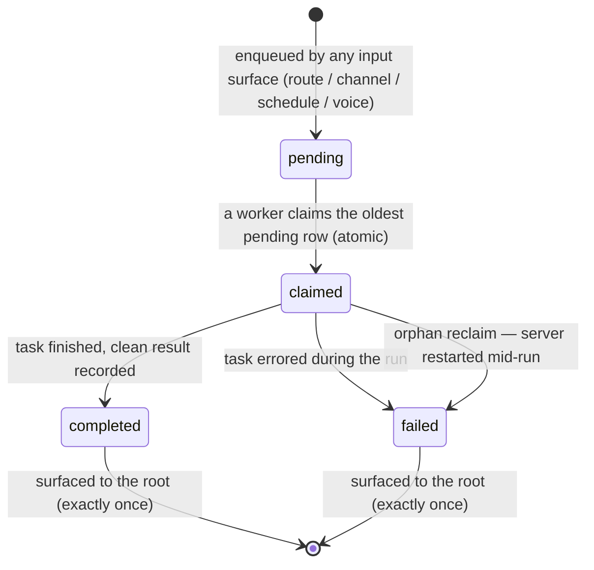

# Orchestration — Overview

> The delegation engine: how Vynel's one "brain" hands work down to many "hands" — resolving who a task is for, running that work in its own session, queueing it durably when it must run in the background, and reporting the outcome back up.
>
> **Status:** shipped · **Depends on:** [db](../_platform/database/overview.md) (kernel), [agents](../agents/overview.md), [providers](../providers/overview.md) · **Code map:** [structure.md](./structure.md)

## Purpose

Orchestration is the *verb* over the [agents](../agents/overview.md) *noun*. Agents describe the "hands" a user can employ; orchestration is what actually reaches for one, gives it a task, and absorbs its answer. It sits a tier above chat and agents — a composer, not a leaf — and is itself the substrate the [session](../session/overview.md) layer builds its delegation continuity on.

The mental model is a **three-level hierarchy**. At the top is the **global root** — the single always-on brain per user, the one the user talks to. Below it are **workspace roots** (and, later, managers) — each workspace's own continuing conversation, with its own context. At the bottom are **leaves** — throwaway agent sessions spun up for one focused job. "Roots are managers, not doers": a root never does the work itself, it delegates down and relays what comes back up. Orchestration owns the machinery that makes that request-down / report-up flow real.

Two things distinguish it from plain plumbing. First, delegation can be **asynchronous and durable** — a task handed to another workspace survives as a queued job that a background worker claims and runs, so the user can walk away and still get an answer. Second, it is **safety-aware without owning the safety gate**: a delegated "hand" runs unattended, so orchestration decides what happens when that hand proposes an irreversible action nobody is watching — deny it and report back in words, or park it for the user to decide later.

## What it can do

- **Resolve `@mentions`** — parse the agents a user named in a turn and map them to the ones actually available in that workspace (dropping names that aren't agents).
- **Compose the live agents into a session** — hand the chat turn the set of enabled agents the model may delegate to.
- **Delegate by reference** — spawn a fresh leaf session running a named agent on a task, capture its clean answer, and hold a reference to it; later push a follow-up task into that same leaf; the leaf runs in its own context and the root absorbs only the result.
- **Route a request to another workspace** — coordinate a request-down / report-up turn: send a task into a target workspace's continuing root brain, wait a bounded budget, and return a thin envelope (completed with a result, timed-out, or failed).
- **Queue a delegation for the background** — enqueue a workspace task as a durable job that any input surface (a routed turn, a channel message, a schedule, voice) can drop onto one shared queue.
- **Surface finished work back to the root** — collect the terminal delegations the global root hasn't been told about yet and build a context block for its next turn, so it never tells the user a finished task is "still working."
- **Show what's in flight** — list a user's currently-running delegations for the "Vynel is processing…" indicator.
- *(background)* **Claim and run queued jobs** — a worker claims the oldest pending job atomically, runs it, and records the terminal outcome; at startup it fails jobs a crash left stranded mid-run.
- *(background)* **Announce lifecycle to the outbox** — a session-tree edge event when one session delegates to another, plus coarse agent-run start/complete signals, for a future monitor to reconstruct the tree.

## Responsibilities

**Owns** — the whole delegation act. The durable delegation-job queue and its full lifecycle: the atomic first-come-first-served claim, terminal recording, and the startup reclaim of jobs orphaned by a crash. `@mention` resolution and the composition of enabled agents into a session. The by-reference delegation runtime: spawning a leaf, draining its turn down to the clean result, and pushing follow-ups into it. The routing coordinator — its bounded wait budget, its suspend-while-a-human-decides wait clock, and the report-up envelope. The routed-leaf approval policy (fail-closed deny *or* record-and-park) and the circuit-breaker that stops a leaf that keeps proposing denied actions. The root-awareness catch-up that feeds terminal reports into the root's next turn exactly once. The in-flight listing. The per-request correlation key and the anchor lookup by that key. And the outbox events it announces.

**Does not own** —
- the AI runtime *and the approval gate's enforcement* — reaching the model, and the per-tool card check that fires on every irreversible action, both live in [providers](../providers/overview.md) (a locked seam: orchestration decides the *policy* for an unattended leaf, providers *enforce* the gate);
- the agents themselves — their definitions and data belong to [agents](../agents/overview.md), reached only through its public surface; this dependency is by design;
- chat sessions and messages — orchestration points at them only by loose reference; the "look up a leaf's recorded detail" op is chat's existing session read, not a wrapper here ([chat](../chat/overview.md));
- the *rendered* delegation trace — orchestration mints the correlation key and owns the anchor lookup, but the composed view that stitches chat messages into a readable chain was deliberately kept out and lands at the [session](../session/overview.md)/monitor tier;
- the background worker's timer and the concrete workspace-root delegate that routing calls — both are wired and injected by the app tier ([local-api](../_apps/local-api/overview.md));
- the session-level delegation continuity that ties these run-ops to chat persistence — [session](../session/overview.md);
- the consumer of its lifecycle events — the future monitor;
- users and workspaces — the shared [db](../_platform/database/overview.md) kernel.

## Concepts & vocabulary

| Term | Meaning |
|---|---|
| **Global root** | The single always-on brain per user — the one the user talks to. Delegates down, never does the work itself. |
| **Workspace root** | A workspace's own continuing conversation, with its own context. A routed request lands *here*, not in a fresh throwaway agent. |
| **Leaf** | A throwaway agent session spun up for one focused task. Runs in its own context; the caller absorbs only its clean result. |
| **Delegation (by reference)** | Handing a task to another session and holding a reference to it — spawn a leaf, later push more work into it, look up its detail. The reference is the addressed session's own id. |
| **Delegation job** | One row on the durable queue: a workspace task waiting to be claimed and run in the background. Moves through `pending → claimed → completed / failed`. |
| **Correlation / trace key** | A per-request id minted once at enqueue, distinct from the job id, so every message a request later produces shares it and the chain is queryable as one trace. |
| **Routing** | The request-down / report-up coordinator a global-root turn invokes to send a task into a target workspace and get back a thin outcome envelope. |
| **Route outcome** | The envelope routing returns: `completed` (with a result), `timed-out` (the wait budget elapsed — the target keeps running), or `failed`. |
| **Wait clock (pausable)** | The routing budget that measures the *workspace's* working time — it suspends while a routed approval is parked on a human, so a task approved late still completes. |
| **Approval policy (routed leaf)** | What an unattended leaf does with a carded tool: fail-closed *deny* (report in words instead), or *record-and-park* for the user to decide from the web notifier or origin channel. A denial circuit-breaker stops a leaf that keeps proposing denied actions. |
| **Origin** | Where a delegation was requested from (a channel + recipient), carried as loose refs so the report is delivered back to where the user asked. |
| **Permission mode** | The mode a routed turn runs under: `ask` · `auto` · `bypass-with-behavior-gate` (the default: only the irreversible floor cards). |
| **Session-tree edge** | The recorded "who delegated to whom" — announced to the outbox so a monitor can rebuild the global → workspace → leaf tree. |

## Rules & invariants

- **Roots are managers, not doers.** A root delegates work down and absorbs only the clean result; the actual doing happens in a leaf or a workspace root running in its own context.
- **Delegation reaches agents through their public surface, never their data.** Composition depends on the agents domain's public ops, not its kernel repositories — the cross-feature rule. The graph stays acyclic: agents never depends on orchestration.
- **A queued job is claimed by exactly one worker.** The claim is a guarded compare-and-swap on the oldest pending row; if a concurrent worker won the race the update matches nothing and the loser simply gets the next job. This single guard is the whole concurrency story.
- **Jobs are run at most once.** A crash that strands a job mid-run gets that job marked *failed* at the next startup, never silently re-run — and marked already-surfaced, so a restart doesn't spam the root with false "couldn't complete" notes.
- **A timeout stops *waiting*, not the work.** When the routing budget elapses the coordinator returns a timed-out envelope, but the routed turn keeps running in its own session; its result is a deferred follow-up, not surfaced after the fact.
- **An unattended leaf never deadlocks and never acts unwatched.** A routed leaf that hits a carded tool must have a policy — deny fail-closed or record-and-park — or the drain fails loudly rather than hang. Either way the safety card still fires: the leaf starts through the same provider path a watched session does.
- **The wait clock measures working time, not deciding time.** While a routed approval is parked on a human the budget suspends and resumes with the remaining time once decided; the only bound on an unanswered card is the approvals reaper.
- **A finished delegation is surfaced to the root exactly once.** Terminal reports the root hasn't seen are collected into its next turn and then marked surfaced, so a later turn won't re-inject them — and a *failed* task surfaces too, so the root never claims a dead task is still working.
- **Cross-feature links are loose refs, not foreign keys.** Parent-session ids, correlation keys, and channel origins are plain text references to other systems — the queue joins nothing across features.
- **The queue insert is intra-feature by design.** Enqueuing a job writes no cross-feature outbox event; the cross-feature signal fires later, at *execution*, when the delegation is actually recorded — no feature needs a "queued" signal today.

## Lifecycle

The delegation job is the central concept that moves through states:

A *routed* request is the synchronous face of the same act: it returns `completed`, `timed-out`, or `failed` as an envelope to the root — described in prose above rather than as a second diagram, since it is an outcome shape, not a stored state machine.

## Where it sits in the bigger picture

Orchestration is the composition tier between [chat](../chat/overview.md) + [agents](../agents/overview.md) below it and [session](../session/overview.md) above it. A global-root turn in chat reaches orchestration to compose its available agents and, through the routing coordinator, to delegate work into another workspace's root — a delegate the [local-api](../_apps/local-api/overview.md) app binds and injects, along with the background worker tick that drains the job queue. Orchestration leans on [providers](../providers/overview.md) for the AI runtime and trusts it to enforce the approval gate, while orchestration itself sets the policy an unattended leaf follows. Its only cross-feature domain dependency is [agents](../agents/overview.md), by design. It announces session-tree and agent-run events to the shared outbox for a future monitor, and it mints the correlation key that the session/monitor tier later renders into a readable delegation trace — orchestration owns the key and its anchor; the composed, chat-joining view lives there, not here. Set beside [memory](../memory/overview.md) (what Vynel *knows*), orchestration is how Vynel *acts*: one brain, many hands.

---
*Mapped from the code on disk, 2026-07-14. If you change this module, update this file and [structure.md](./structure.md).*
