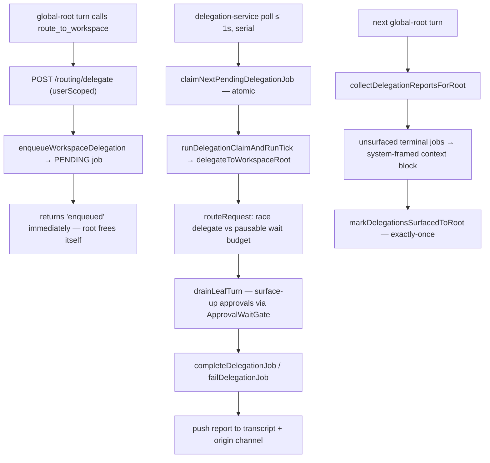
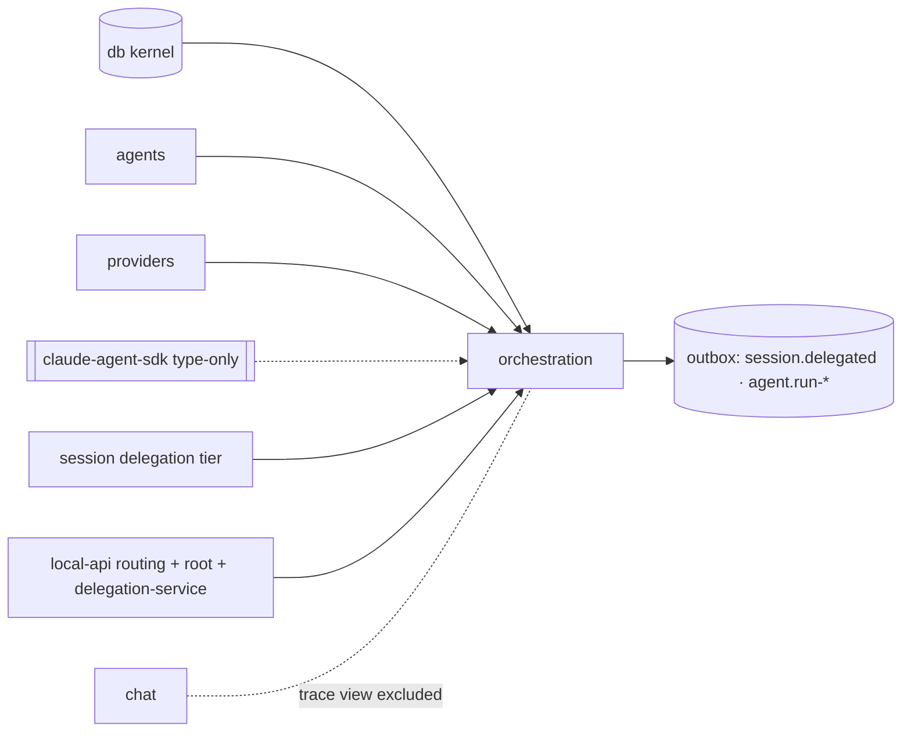

# Orchestration — Structure

> The code map and connections for the orchestration module. For the concepts behind it, see [overview.md](./overview.md).
>
> Folders touched: `packages/orchestration/src/` · `packages/session/src/delegation/` (the tier above) · `apps/local-api/src/routes/routing/` · `apps/local-api/src/routes/root/` · `apps/local-api/src/services/delegation-service.ts`

Orchestration is the **delegation engine** — "the VERB over the `agents` noun." Unlike a leaf, it is a **composition tier above `chat` + `agents`**: it owns one table (`delegation_jobs`), resolves `@mention`s, composes enabled agents into a session, runs by-reference leaf/workspace-root turns, records the parent→child tree edges + agent-run lifecycle, and surfaces terminal reports back up to the global root. It is itself substrate for `@vynel/session`, whose `delegation/` folder ties orchestration's run-ops to chat persistence + continuity. Deps: `@vynel/agents` (by-design — composing the noun), `@vynel/db`, `@vynel/providers`, `@vynel/errors`, `@vynel/logger`, plus a **type-only** `@anthropic-ai/claude-agent-sdk` (`AgentDefinition`, erased) (`packages/orchestration/package.json`). No sibling-leaf import beyond `agents`; no chat import (the trace view was excluded — see Gotchas).

## File map

► = entry point (the public barrel).

| Path | Role |
|---|---|
| ► `packages/orchestration/src/index.ts` | public barrel — the only subpath export (`.`); re-exports the agents-compose, mention, leaf, record, route, queue-repo, and approval-gate surfaces; carries comments recording what deliberately does NOT export (the trace VIEW, the chat "look up" op) |
| `packages/orchestration/src/orchestration-types.ts` | domain types — `StructuralLogger` re-export, `DelegationPermissionMode` local union (`ask`/`auto`/`bypass-with-behavior-gate`), `AgentMention` |
| `packages/orchestration/src/orchestration-events.ts` | 3 outbox event constants (`agent.run-started`, `agent.run-completed`, `session.delegated`) + payload types; `SessionDelegatedPayload` is a **locked 5-field contract** (3a emits, 5a monitor consumes) |
| `packages/orchestration/src/schema/delegation-jobs.ts` | the one owned table + `DelegationJobStatus` union (`pending`/`claimed`/`completed`/`failed`) |
| `packages/orchestration/src/schema/index.ts` | schema barrel (re-exports the table so the drizzle config + parity guard pick it up) |
| `packages/orchestration/src/repositories/delegation-jobs.ts` | functional repo (db-first, Phase-1 SYNC) — insert / find / atomic FIFO claim / complete / fail / list / surfaced-mark / orphan-reclaim |
| `packages/orchestration/src/repositories/index.ts` | repo barrel (stable internal import surface `../repositories/index.js`) |
| `packages/orchestration/src/agents/compose-session-agents.ts` | `composeSessionAgents` — thin delegate to `@vynel/agents` `resolveEnabledAgentsForSession` → SDK `Record<string, AgentDefinition>` for `query({ agents })` |
| `packages/orchestration/src/agents/resolve-mentions.ts` | `resolveMentions` + pure `parseMentionSlugs` — `@slug` extraction → agents available in the (user, workspace) session |
| `packages/orchestration/src/leaf/create-leaf-session.ts` | the by-reference "create" op — resolve agent by slug, map to a Mode-B leaf, start a FRESH SDK session, drain, return `{ reference, resultText, agentSlug }` |
| `packages/orchestration/src/leaf/push-to-session.ts` | the by-reference "push" op — resume an existing leaf session (`resumeSessionId`), run a follow-up, drain, return the clean result |
| `packages/orchestration/src/leaf/drain-leaf-turn.ts` | the shared stream-drain (session id + accumulated text); approval-handling + denial circuit-breaker; exports `buildRoutedLeafApprovalDenier`, the `ROUTED_LEAF_*` constants, `DrainLeafTurnOptions`. **Out of the barrel except its option/const exports** — internal to the leaf ops |
| `packages/orchestration/src/leaf/map-agent-to-leaf-input.ts` | maps an `AgentRow` → `StartChatSessionInput` (Mode B; prompt→append, grants→allow/deny, hardcoded `bypass-with-behavior-gate`). **Internal** — not in the barrel |
| `packages/orchestration/src/records/record-delegation.ts` | `recordDelegation` — emits the `session.delegated` edge (one `insertOutboxEvent`) |
| `packages/orchestration/src/records/record-agent-run.ts` | `recordAgentRunStarted` / `recordAgentRunCompleted` — lone outbox inserts (no accompanying state change) |
| `packages/orchestration/src/queries/collect-delegation-reports-for-root.ts` | `collectDelegationReportsForRoot` — the global-root catch-up: build a system-framed context block from unsurfaced terminal jobs + the job ids to mark |
| `packages/orchestration/src/queries/list-in-flight-delegations.ts` | `listInFlightDelegations` — the light DTO (`partialSessionId`, `workspaceId`, `workspaceName`, `status`) for the /global "Vynel is processing…" indicator |
| `packages/orchestration/src/routing/route-request.ts` | `routeRequest` — the pure request-down/report-up coordinator (injected `delegate` dep, pausable wait budget); `DEFAULT_ROUTE_TIMEOUT_MS = 120_000` |
| `packages/orchestration/src/routing/enqueue-workspace-delegation.ts` | `enqueueWorkspaceDelegation` — insert a PENDING job (mints `id` + `partialSessionId`), return the id; `DelegationOrigin` (channel refs) |
| `packages/orchestration/src/routing/approval-wait-gate.ts` | `ApprovalWaitGate` — the stateful per-job park/resume signal shared between a routed turn's approval handler and `routeRequest`'s wait clock (surface-up decision C) |
| `packages/orchestration/src/test-support/fake-leaf-provider.ts` | test double — a fake `AiAgentProvider` leaf stream for the drain/leaf tests |

*Not present:* `run-root-delegation-turn.ts` — named in `docs/module-notes/orchestration.md` but **no longer in `src/`** (only a stale `dist/` artifact; zero source references). The doc's provisional `leaf/` folder note is otherwise accurate.

## Data & persistence

One owned table, `delegation_jobs`, defined in `packages/orchestration/src/schema/delegation-jobs.ts`, registered for drizzle-kit at `drizzle.sqlite.config.ts:54` (`'../orchestration/src/schema/delegation-jobs.ts'`) — the schema-parity guard enforces exactly-one-config registration. DDL: `packages/db/src/migrations-sqlite/0000_baseline.sql` (table L522, indexes L546–547), then seven additive `ALTER`s — `0012`, `0014`, `0015`, `0020`, `0021`, `0023`, `0027` (see the warning below). **No `deletedAt`** — terminal rows await a future retention job, not soft-delete.

**`delegation_jobs`** — one row per delegated background task; a durable FIFO work queue.

| Column | Type | Notes |
|---|---|---|
| `id` | id (PK) | UUID minted by `enqueueWorkspaceDelegation` (the `id()`-has-no-DEFAULT contract) |
| `userId` | id (FK, cascade) | → `users` (kernel table) — the tenant boundary |
| `parentSessionId` | text (notNull) | **loose ref** — the enqueue-time global-root SDK session id (the `session.delegated` parent / provenance), not a FK |
| `workspaceId` | id (FK, cascade) | → `workspaces` (kernel table) — the domain scope |
| `workspacePath`, `workspaceName` | text (notNull) | the routed turn's cwd + the indicator/report label |
| `taskText` | text (notNull) | the task handed down |
| `partialSessionId` | text (null) | **loose ref** — the per-request trace correlation key (minted at enqueue; distinct from `id`); anchors `resolveDelegationTrace` |
| `status` | text | `pending` / `claimed` / `completed` / `failed` |
| `claimedAt` / `completedAt` | timestamp (null) | claim + terminal instants |
| `resultText` / `errorMessage` | text (null) | terminal outcome (one or the other) |
| `surfacedToRootAt` | timestamp (null) | when this terminal delegation was surfaced into the root's next turn (the Ch3.5 root-awareness fix); the "unseen reports" query filters on `IS NULL` |
| `originChannelId` / `originExternalSenderId` / `originExternalChatContextId` | text (null) | **loose refs** into `channels` (Ch4) — all null = a non-channel (web/voice) origin; when set, the tick delivers the report back to that channel |
| `permissionMode` | text (null) | the routed turn's `DelegationPermissionMode`; null = the pre-mode default (`bypass-with-behavior-gate`) |
| `createdAt` | timestamp (notNull) | FIFO ordering key |

Indexes: `idx_delegation_jobs_status_created` on `(status, createdAt)` (the FIFO claim) · `idx_delegation_jobs_user` on `(userId)`.

> **⚠ This column table is incomplete as of 2026-08-16.** It was mapped before the session-messaging
> work landed and does not list `jobKind` (the five-shape discriminator — `task` / `report-delivery` /
> `update-delivery` / `direct-delivery` / `agent-run`, added in `0015`), `threadId` (`0020`),
> `reportedAt` (`0021`), the retry trio `attemptCount` / `nextAttemptAt` / `errorCode` (`0023`), or
> `agentSlug` / `requesterWorkspaceId` (`0027`). Two more indexes exist too
> (`idx_delegation_jobs_thread`, `idx_delegation_jobs_ready`). Those columns — and how the delivery
> kinds reuse `taskText` / `workspaceName` / `parentSessionId` for a message rather than a task — are
> mapped in [session-communication/structure.md](../session-communication/structure.md). The table
> is still owned here; that doc is the current reading for the messaging columns.

## Repositories

Functional, db-first, **Phase-1 SYNC** (`packages/orchestration/src/repositories/delegation-jobs.ts`). No raw SQL / Drizzle outside this file.

| Function (db-first) | Purpose |
|---|---|
| `insertDelegationJob` | insert a row, return it (throws if none returned) |
| `findDelegationJobById` | one job or `null` |
| `findDelegationJobByPartialSessionId` | the job that minted a correlation key — the trace-view ownership anchor |
| `findLatestDelegationJobForParentSince` | this-turn's delegation (parent session + `createdAt ≥ since`); stamps the ack message's trace link; null when the turn didn't delegate |
| `claimNextPendingDelegationJob` | **the atomic FIFO claim** — SELECT oldest pending, then guarded compare-and-swap UPDATE (`WHERE id = ? AND status = 'pending'`); empty `.returning()` = lost the race → null. The one concurrency guard |
| `completeDelegationJob` / `failDelegationJob` | mark terminal (result / error) |
| `listPendingDelegationJobsForUser` | bounded pending list (cap 50/100) |
| `listUnsurfacedTerminalDelegationsForUser` | terminal (`completed`+`failed`) jobs with `surfacedToRootAt IS NULL`, oldest-first — the root catch-up feed |
| `listInFlightDelegationsForUser` | `pending`+`claimed` for the processing indicator (capped) |
| `markDelegationsSurfacedToRoot` | stamp `surfacedToRootAt` exactly-once (idempotent; no-op on empty) |
| `failOrphanedClaimedDelegations` | at startup, mark every lingering `claimed` row FAILED + surfaced (crash cleanup, NOT re-run); returns the count |

## Core operations

| Operation | What it does | Key calls / boundary |
|---|---|---|
| `composeSessionAgents` *(async)* | Mode-A: the enabled agents made available to a session, as SDK `AgentDefinition`s | `resolveEnabledAgentsForSession` (`@vynel/agents`) |
| `resolveMentions` *(async)* | `@slug` tokens → agents in the (user, workspace) union; unmatched dropped | `parseMentionSlugs`, `listAgentsForWorkspace` (`@vynel/agents`) |
| `createLeafSession` *(async)* | resolve agent (workspace scope → user scope fallback, else `NotFoundError`) → map to Mode-B → FRESH SDK session → drain (fail-closed denier) | `findAgentBySlug`, `mapAgentToLeafInput`, `provider.startChatSession`, `drainLeafTurn`. **No chat/table writes** — the caller records |
| `pushToSession` *(async)* | resume a leaf by reference, run a follow-up, drain, return the clean text | `provider.startChatSession({ resumeSessionId })`, `drainLeafTurn` |
| `drainLeafTurn` *(async)* | consume the leaf stream to terminal; capture session id + text; require an approval handler (else throw, no deadlock); denial circuit-breaker interrupts after `maxCardedDenials` | provider stream; `interruptSession` when the breaker trips |
| `enqueueWorkspaceDelegation` | insert a PENDING job (mints `id` + `partialSessionId`, nulls terminal cols) | `insertDelegationJob`. **No outbox, no `db.transaction`** — see Gotchas |
| `routeRequest` *(async)* | race the injected `delegate` against a pausable wait budget → `completed`/`timed-out`/`failed` envelope; wait clock suspends while an approval is parked (`waitGate`) | injected `delegate`; `ApprovalWaitGate`. **Pure** — no db/providers import |
| `recordDelegation` | emit the `session.delegated` parent→child edge | `insertOutboxEvent` (lone insert) |
| `recordAgentRunStarted` / `recordAgentRunCompleted` *(async)* | emit the coarse per-turn agent-run lifecycle pair | `insertOutboxEvent` (lone inserts, no accompanying state change) |
| `collectDelegationReportsForRoot` | build the system-framed catch-up context block from unsurfaced terminal jobs + their ids | `listUnsurfacedTerminalDelegationsForUser` |
| `listInFlightDelegations` | map in-flight jobs → the indicator DTO | `listInFlightDelegationsForUser` |

## HTTP & MCP surface (in `apps/local-api`, not owned here)

Orchestration is a package — it ships **no routes and no `McpFeatureDescriptor` of its own**. Its ops back two app surfaces:

- **`/routing`** (`apps/local-api/src/routes/routing/index.ts`, top-level + `userScoped` — the global root has no workspace). `POST /routing/delegate` → `enqueueWorkspaceDelegation` (ENQUEUE + return immediately), exposed as the **mutating** MCP tool `route_to_workspace` (`mutatingApproved: true`); routed turns surface approvals up, they never auto-deny. Siblings `list_routing_workspaces`, `list_routing_channels`, `send_to_channel` belong to the routing surface but not to orchestration. These compile into the SEPARATE `generatedRoutingMcpTools` array (path-prefix `/routing/`) so they reach ONLY the global-root turn.
- **`/root`** (`apps/local-api/src/routes/root/index.ts`) — reads `listInFlightDelegations` for the "Vynel is processing…" indicator and `findDelegationJobByPartialSessionId` for the trace anchor.

## Worker / background jobs

The desktop app runs no `apps/worker`; the queue is drained in-process by `startDelegationService` (`apps/local-api/src/services/delegation-service.ts`), started from `server.ts`, stopped on shutdown.

| Loop | Cadence | Runs |
|---|---|---|
| startup reclaim | once at start | `failOrphanedClaimedDelegations` — mark lingering `claimed` rows FAILED |
| delegation tick | poll 1 s, **SERIAL** (in-flight guard) | `runDelegationClaimAndRunTick` (`@vynel/session/delegation`) → `claimNextPendingDelegationJob` → run the workspace-root turn → complete/fail → push the report up |

The serial guard matters: a tick runs a full workspace turn (minutes); an unguarded interval would fan out N concurrent provider sessions. The atomic DB claim stops two ticks claiming the SAME job; the guard stops N DIFFERENT jobs running at once.

## Pipeline — "the global root hands a task to a workspace, then learns the outcome"

1. On a global-root turn the model calls `route_to_workspace` → `apps/local-api/src/routes/routing/index.ts` (`POST /delegate`) validates an active global root (`findPrimaryConversation`), ownership-checks the target, reads the origin + mode headers, then `enqueueWorkspaceDelegation(c.var.db, …)` and returns `{ status: 'enqueued', jobId }` — the root does not block.
2. `packages/orchestration/src/routing/enqueue-workspace-delegation.ts` mints `id` + `partialSessionId` and inserts a PENDING row (`insertDelegationJob`).
3. `apps/local-api/src/services/delegation-service.ts` polls every second (serial); each tick claims the oldest pending row atomically (`claimNextPendingDelegationJob`, `repositories/delegation-jobs.ts:92`) and hands it to `runDelegationClaimAndRunTick` (`@vynel/session/delegation`).
4. The session tick runs the workspace-root turn via `delegateToWorkspaceRoot`, whose coordinator is `routeRequest` (`packages/orchestration/src/routing/route-request.ts`) — racing the injected `delegate` against a pausable wait clock that SUSPENDS while an approval is parked (`ApprovalWaitGate`); the turn drains through `drainLeafTurn`, which surfaces carded tools up for the user's decision (or trips the denial breaker).
5. On terminal, the tick calls `completeDelegationJob`/`failDelegationJob` and pushes the attributed report into the transcript (and the origin channel if set).
6. On the next global-root turn, `collectDelegationReportsForRoot` reads jobs with `surfacedToRootAt IS NULL`, builds a system-framed context block prepended to the provider input, and the caller `markDelegationsSurfacedToRoot` (exactly-once) — closing the Ch1 gap where the async push reached the transcript but not the root's SDK session.

*(By-reference `createLeafSession` / `pushToSession` are the Slice-3a leaf-agent rails; `delegateToLeafSession` in the session tier drives them the same way, recording the `session.delegated` edge.)*

## Connections

**Summary:** orchestration is a **composition tier** — a read-and-run engine driven from above by `@vynel/session` (which owns `delegate-to-leaf-session` / `delegate-to-workspace-root` / the claim-and-run tick / the trace view) and the `apps/local-api` routing + root routes, composing `@vynel/agents` below it. It publishes 3 lifecycle events; **none are consumed yet** (the monitor is a later slice).

| Unit | Direction | Mechanism | What crosses |
|---|---|---|---|
| db kernel (`@vynel/db`) | out | import | `Database`, `users`/`workspaces` FKs, `insertOutboxEvent`, dialect helpers |
| [agents](../agents/overview.md) (`@vynel/agents`) | out | import (by design) | `findAgentBySlug`, `listAgentsForWorkspace`, `resolveEnabledAgentsForSession`; `AgentRow` type from `@vynel/db/repositories/agents` (agents' repos still kernel-side) |
| providers (`@vynel/providers`) | out | import + SDK | `AiAgentProvider`, `StartChatSessionInput`, `NormalizedSessionEvent` — the sole leaf-spawn path (`startChatSession`) |
| `@anthropic-ai/claude-agent-sdk` | out | **type-only** | `AgentDefinition` (erased; flows through `composeSessionAgents`'s return) |
| errors / logger | out | import / type-only | `NotFoundError`, `ValidationError`, `StructuralLogger` |
| [session](../session/overview.md) | in | import | the `delegation/` folder consumes `createLeafSession`, `pushToSession`, `recordDelegation`, `enqueueWorkspaceDelegation`, `routeRequest`, `ApprovalWaitGate`, `collect…`, the queue repos, `failOrphanedClaimedDelegations` |
| local-api routing/root routes | in | import | `enqueueWorkspaceDelegation`, `listInFlightDelegations`, `findDelegationJobByPartialSessionId` |
| local-api delegation-service | in | import | `failOrphanedClaimedDelegations` (+ the session tick) |
| chat (`@vynel/chat`) | — | none | the trace VIEW that reads chat was **excluded** and lives at the session tier; orchestration has no chat dep |
| monitor (future) | in | outbox | *intends* to consume `session.delegated` + `agent.run-*` to rebuild the session tree — not wired |

**Events published:** `session.delegated` (via `recordDelegation`) · `agent.run-started` / `agent.run-completed` (via `record-agent-run`). All three are **lone `insertOutboxEvent` calls** — `recordDelegation` sits sequentially after the session tier's `recordLeafSession` chat write but is **not** wrapped with it in one `db.transaction` (see Gotchas); the agent-run pair has no accompanying state change (a coarse "orchestration happened" signal), so no transaction is claimed.
**Events consumed:** none — `OUTBOX_CONSUMERS` (`packages/core/src/_shared/outbox-consumer-registry.ts`) is empty.

## Config & gotchas

- **`enqueueWorkspaceDelegation` writes a job with no outbox event and no `db.transaction`** (`routing/enqueue-workspace-delegation.ts`). Named against invariant 5, but deliberate + faithful: the enqueue is an intra-feature queue insert; the cross-feature `session.delegated` signal fires later at EXECUTION via `recordDelegation`. No feature needs a "queued" event today (module note "Deferred / flagged").
- **`recordDelegation` is a bare outbox insert, not a co-commit.** At its call site (`packages/session/src/delegation/delegate-to-leaf-session.ts:65-79`) `recordLeafSession` (a chat write) and `recordDelegation` (the outbox) run as two sequential better-sqlite3 statements — NOT one `db.transaction`. The module note's phrase "which DOES co-commit its outbox" overstates it; the leaf write and the edge event are not atomic. Flag for the next editor.
- **`partialSessionId` ≠ `id`.** The job id is the queue row; `partialSessionId` is the per-request trace key minted separately, so a retried delegation could reuse it across job rows. Loose text ref, not a FK.
- **The atomic claim is the ONLY concurrency guard** — a guarded single-statement UPDATE (`claimNextPendingDelegationJob`), no explicit transaction. Two ticks racing the same row: the loser gets an empty `.returning()` → null.
- **Startup reclaims `claimed` rows as FAILED, not re-run** — exactly-once is preserved (Ch1 was no-RE-EXECUTE, not no-cleanup); `surfacedToRootAt` is stamped so a restart doesn't spam the root with orphan "couldn't complete" reports.
- **Routed leaves surface approvals up; leaf-agents fail closed.** `drainLeafTurn` REQUIRES an `onApprovalRequested` handler (no handler → throw, never deadlock). Workspace routing uses the record-and-park handler (`ApprovalWaitGate`) so the user decides; the by-reference leaf-agent path uses `buildRoutedLeafApprovalDenier` (auto-deny). Either way a `maxCardedDenials` breaker interrupts a model that keeps proposing denied actions (`ROUTED_LEAF_MAX_CARDED_DENIALS = 2`) instead of burning the route budget.
- **`DelegationPermissionMode` is a LOCAL union**, not imported from `@vynel/session` — orchestration sits BELOW session and cannot import its mode model; drift fails to typecheck where the value meets the provider's `StartChatSessionInput.permissionMode`.
- **Mode-B leaves run `bypass-with-behavior-gate` regardless of the agent's own mode** (`map-agent-to-leaf-input.ts`) — the non-negotiable safety backstop; mapping the agent's 6-mode `permissionMode`/`effort`/`background` is a deferred refinement. No `mcpServers` on a leaf: if one ever gains MCP attachment it MUST forward the composed mutating set, else a non-floor mutating tool would run uncarded.
- **The route timeout is "stop WAITING", not "stop the target"** — on timeout `routeRequest` returns a `timed-out` envelope while the routed turn keeps running in its own SDK session; the result is not surfaced after the timeout (a deferred follow-up).
- **`run-root-delegation-turn.ts` is gone from `src/`** — the module note still lists it; only a stale `dist/` artifact remains. Don't reach for it.
- **The trace read is NOT here** — `resolveDelegationTrace` reads `@vynel/chat` messages + orchestration jobs, so it's a cross-domain composed VIEW that landed at `packages/session/src/delegation/resolve-delegation-trace.ts`. Orchestration exports only the anchor (`findDelegationJobByPartialSessionId`). Likewise the by-reference "look up" op is the existing chat `getChatSessionDetail` — no orchestration→chat wrapper.
- **The `providers → orchestration` grep hit is a comment**, not a runtime import (`packages/providers/src/shared/start-chat-session-input.ts:96` documents `composeSessionAgents`) — no layering inversion.

---
*Mapped from the code on disk, 2026-07-14; the `delegation_jobs` section annotated 2026-08-16 (see the warning under Data & persistence). If you change this module, update this file and [overview.md](./overview.md).*
