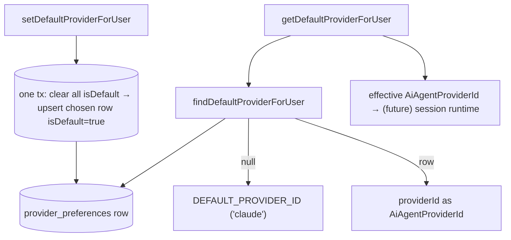
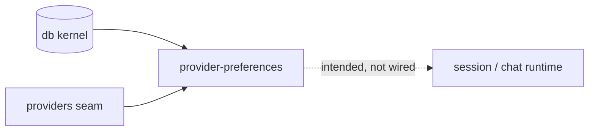

# provider-preferences — Structure

> The code map and connections for the provider-preferences module. For the concepts behind it, see [overview.md](./overview.md).
>
> Folders touched: `packages/provider-preferences/src/` · (kernel-owned) `packages/db/src/{schema,repositories}/providers/`

`@vynel/provider-preferences` is a **thin logic-only leaf**: it owns no table and no repository of its own. The `provider_preferences` table FKs to the `users` hub, so — per the kernel rule (§3) — its schema and repositories stay in `@vynel/db`. This package is just the three management ops (`find` / `get` / `set`) over that kernel table plus the provider seam. Deps: `@vynel/db` + `@vynel/providers` only (`packages/provider-preferences/package.json`).

## File map

► = entry point (public barrel).

| Path | Role |
|---|---|
| ► `packages/provider-preferences/src/index.ts` | public barrel — the only subpath export (`.`); re-exports the 3 ops + 4 types; header documents the preferences-ONLY scope |
| `packages/provider-preferences/src/find-default-provider-for-user.ts` | raw read — the user's explicit choice or `null`; casts the stored `providerId` to `AiAgentProviderId` |
| `packages/provider-preferences/src/get-default-provider-for-user.ts` | non-null sibling — `find… ?? DEFAULT_PROVIDER_ID` ('claude'); the one home of the "claude is the default" rule |
| `packages/provider-preferences/src/set-default-provider-for-user.ts` | atomic default-flip — clear all `isDefault`, then upsert the chosen (userId, providerId) row's flag, in one tx |
| `packages/provider-preferences/src/provider-preferences-types.ts` | type re-exports — `ProviderPreference`, `NewProviderPreference`, `ProviderDefaultSettings` (from kernel) + `AiAgentProviderId` (from providers) |
| `packages/provider-preferences/src/provider-preferences-events.ts` | **deliberately empty** placeholder (`export {}`) — no cross-feature outbox signal in Phase 1 |
| `packages/provider-preferences/src/get-default-provider-for-user.test.ts` | resolve-with-fallback tests (real SQLite) |
| `packages/provider-preferences/src/set-default-provider-for-user.test.ts` | single-default invariant / upsert / user-isolation tests (real SQLite) |

## Data & persistence

This package owns **no** table. The row it manages lives in the kernel:

**`provider_preferences`** — one row per (user, provider) pair (`packages/db/src/schema/providers/provider-preferences.ts`). Registered in the kernel drizzle config; DDL in `packages/db/src/migrations-sqlite/0000_baseline.sql` (table L39–48, indexes L50–51). No `deletedAt` — "delete" means a missing row, which already resolves to provider defaults.

| Column | Type | Notes |
|---|---|---|
| `id` | id (PK) | UUID supplied by the write op (`randomUUID()`) |
| `userId` | id (FK, cascade) | → `users` — the kernel's hub table. **loose-ref-free**: a real FK because the target is the kernel, not a sibling leaf |
| `providerId` | text | `'claude' \| 'codex' \| 'gemini' \| 'cursor'` — validated at the app layer (Zod), **not** a DB CHECK (avoids SQLite/Postgres divergence) |
| `isDefault` | boolean | the "exactly one true per user" flag — invariant held by the `set` op, not a partial index |
| `defaultSettings` | json | opaque `ProviderDefaultSettings` blob (`permissionMode?`, `providerSpecific?`); never filtered on |
| `createdAt` / `updatedAt` | timestamp | |

Indexes: `idx_provider_preferences_user_id` on `userId` · unique `uidx_provider_preferences_user_provider` on `(userId, providerId)` (the upsert's collision guard).

## Repositories

The package calls the kernel repo `@vynel/db/repositories/providers` (`packages/db/src/repositories/providers/provider-preferences.ts`) — functional, `db`-first, Phase-1 sync:

| Function (db-first) | Used by | Purpose |
|---|---|---|
| `findDefaultProviderPreferenceForUser` | `find…` op | the `isDefault: true` row or `null` |
| `findProviderPreferenceForUserAndProvider` | `set…` op | existing (userId, providerId) row for the upsert branch |
| `clearDefaultProviderPreferenceForUser` | `set…` op | flip every `isDefault: true` row back to false |
| `updateProviderPreference` | `set…` op | set the existing row's `isDefault: true` (returns `null` if not found) |
| `insertProviderPreference` | `set…` op | create a fresh row with `isDefault: true` |
| `listProviderPreferencesForUser` | tests only | all rows for a user |

> `clearDefaultProviderPreferenceForUser` intentionally drops the blueprint's vestigial `exceptId` param — the §5.5 op clears all, then re-sets the target (see the repo comment).

## Core operations

| Operation | What it does | Key calls |
|---|---|---|
| `findDefaultProviderForUser(db, userId)` | raw read → `AiAgentProviderId \| null`; null on no preference | `findDefaultProviderPreferenceForUser` |
| `getDefaultProviderForUser(db, userId)` | effective provider → `AiAgentProviderId`, never null; falls back to `DEFAULT_PROVIDER_ID` | `findDefaultProviderForUser`, `DEFAULT_PROVIDER_ID` |
| `setDefaultProviderForUser(db, input)` | atomic flip in one tx: find existing → clear all defaults → update-or-insert the chosen row with `isDefault: true`; `initialSettings` used only on insert | `withTransaction`, the 4 write/find kernel repos, `randomUUID` |

No outbox event is emitted — the mutating `set` op writes rows only (the events surface is the empty placeholder above).

## HTTP surface

**None yet.** No route in `apps/local-api/src/routes/` imports this package. The barrel's header names "the api routes, a future db-direct CLI" as intended callers, but none exist on disk today.

## MCP surface

**None.** No `McpFeatureDescriptor`, no `x-mcp` route blocks (there being no routes).

## Worker / background jobs

**None.**

## Web surface

**None.** No `apps/local-web` store, composable, or component reads a default-provider preference.

## Pipeline — "resolve the effective provider for a user"

1. **Write** — `set-default-provider-for-user.ts:26` opens `withTransaction`; inside it `findProviderPreferenceForUserAndProvider` locates any existing row, `clearDefaultProviderPreferenceForUser` zeroes every default, then either `updateProviderPreference` (flag → true) or `insertProviderPreference` (fresh row) — preserving the single-default invariant.
2. **Raw read** — `find-default-provider-for-user.ts:12` returns the stored `providerId` cast to `AiAgentProviderId`, or `null`.
3. **Effective read** — `get-default-provider-for-user.ts:15` applies `?? DEFAULT_PROVIDER_ID` — the single swap point for a Phase-2 different default.
4. **Consumption** — a session/chat surface *would* call `getDefaultProviderForUser` to pick which provider to run, then hand the resolved id to `selectAiAgentProvider` in `@vynel/providers`. **This last hop is not yet wired** (see Gotchas).

> Scope note: this resolves the effective **provider** only, never the model. `chat_sessions` carries its own `provider_id` + `model` columns (kernel schema) resolved elsewhere — this package does not touch model selection.

## Connections

**Summary:** a **pure leaf** — it imports the kernel + the provider seam and is imported by nobody in the running app yet. Read-side and event-side are both empty at runtime: the only importers on disk are its own two test files.

| Unit | Direction | Mechanism | What crosses |
|---|---|---|---|
| db kernel (`@vynel/db`) | out | import | `Database`, `withTransaction`, `provider_preferences` schema/repos, `users` FK, the 3 row types |
| [providers](../providers/overview.md) (`@vynel/providers`) | out | import | `AiAgentProviderId`, `DEFAULT_PROVIDER_ID` (types + the default literal) |
| session / chat runtime | in *(intended)* | import | *would* call `getDefaultProviderForUser` then `selectAiAgentProvider` — **not wired** |
| local-api routes / MCP / web | — | — | none exist |

**Events published:** none — `provider-preferences-events.ts` is an empty placeholder.
**Events consumed:** none.

## Config & gotchas

- **Landed green, not yet wired.** The package passes its tests but no route, MCP tool, web view, or session-runtime call imports it — a `grep` for `@vynel/provider-preferences` imports returns only its own tests. Treat the "callers" in the barrel header as intent, not fact.
- **Owns logic, not data.** Schema + repositories live in the kernel (`packages/db/src/{schema,repositories}/providers/`) because the row FKs to `users`. Change the table there, not here.
- **`isDefault` invariant is code-enforced, not indexed.** "Exactly one default per user" is held by the atomic clear-then-set in `setDefaultProviderForUser` — SQLite/Postgres disagree on partial indexes, so no DB constraint backs it. Never insert a default row outside this op.
- **`providerId` is un-validated at the DB.** It's plain `text` (no CHECK); Zod at the write boundary is the only guard, and `find…` casts the stored value to `AiAgentProviderId` trusting that write-time validation.
- **The "claude is default" fallback lives in exactly one line** (`get-default-provider-for-user.ts:16`) — the Phase-2 swap point. Don't re-scatter `?? 'claude'` in consumers.
- **Phase-1 sync.** Ops return `void` / a value, not `Promise`; Phase 2 Postgres flips only the async annotations (call sites already `await`-safe).
- **Preferences ONLY.** Provider *status* (auth/availability, in `@vynel/providers/status`) and *skills* discovery are separate concerns — deliberately not homed here (module-notes concern-split table).
- **`initialSettings` is insert-only** — passed to a fresh row, ignored on the update branch (`set-default-provider-for-user.ts:18`).

---
*Mapped from the code on disk, 2026-07-14. If you change this module, update this file and [overview.md](./overview.md).*
