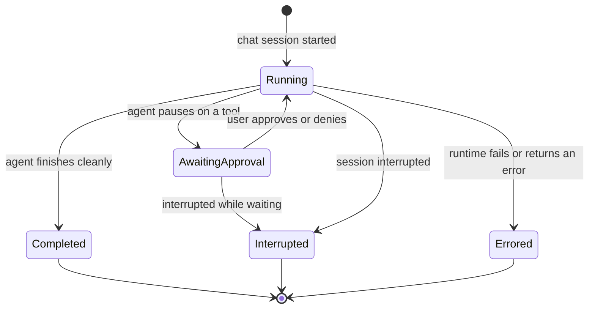

# Providers — Overview

> Vynel's socket for AI agent runtimes: one abstract contract that every runtime implements, a Claude implementation behind it, and a registry that hands callers a running instance — so the rest of Vynel talks to "an AI agent" without knowing which one.
>
> **Status:** shipped · **Depends on:** the shared error kernel and the Claude Agent SDK only — a leaf, no database · **Code map:** [structure.md](./structure.md)

## Purpose

Every AI turn in Vynel — a chat message, a scheduled task, a delegated sub-session — has to run through *some* AI agent runtime. Providers is the seam that lets the rest of the system drive that runtime without ever touching it directly. Callers speak to one runtime-agnostic contract, `AiAgentProvider`, and receive normalized events back; they never learn whether Claude, or a future runtime, is on the other side.

This is the AI seam, and it is deliberately sacred. The abstract contract is real from day one even though only Claude is implemented today. When a second runtime arrives, it becomes a new sibling implementation and one line in the registry — no caller changes, no signature churn. To make that promise hold, the raw Agent SDK is quarantined inside a single adapter within the Claude implementation: an upstream SDK change lands in one place and can never reach the types the wider codebase depends on.

Providers is plumbing, not a product surface. It owns no user-facing screen; its value is that everything above it stays simple and runtime-agnostic.

## What it can do

- **Start a chat session** — returns a live stream of normalized events covering the whole turn: answer text, extended-thinking deltas, tool-use starts and completions, approval pauses, token-usage reports, and a single terminal event (completed, interrupted, or errored).
- **Pause on a tool for approval** — when a tool needs a human decision, the session pauses and emits an approval-requested event; the caller routes the user's approve/deny back in and the stream resumes.
- **Interrupt a running session** — cancels the underlying runtime stream and resolves any pending approval as cancelled, ending the stream cleanly.
- **Report install and authentication status** — as data, never as an exception: is the runtime installed, is the user signed in, by which method, and if not, why.
- **Discover installed skills** the runtime sees on disk, optionally scoped to one workspace — the real on-disk picture, distinct from what Vynel's skills domain believes should be installed.
- **List the MCP servers** the runtime is configured with (read-only).
- **Fetch a persisted transcript** for a session that is no longer active, from the runtime's own artifact storage.
- **Report the context window** — the runtime's own breakdown of what is filling the window, as markdown, or nothing if the runtime has no such command.
- **Summarize a session** — distil a conversation into a concise hand-off summary for the continuity seed-fresh swap, or nothing if the runtime cannot summarize.
- *(background)* **Synchronize persisted sessions** — scan the runtime's artifact storage for sessions touched since a cutoff and return lightweight metadata the chat domain uses to populate its session list on startup.

## Responsibilities

**Owns** — the `AiAgentProvider` contract and every runtime-agnostic type that crosses its boundary (the session-event stream, the session-start input, the approval decision, the authentication status, the permission mode); the Claude implementation and the SDK adapter it hides; the process-level registry of provider instances; the two in-memory runtime stores (active sessions and pending approvals) that make cross-call interruption and approval-resolution possible; and the small set of status operations that read a runtime's install/auth/skills state.

**Does not own** —
- the **chat session row** and its persistence — that's [chat](../chat/overview.md), the seam's primary consumer;
- the **approval card UI and its lifecycle** — that's [approvals](../approvals/overview.md); providers only pauses the stream and accepts the decision;
- the user's **default-provider preference** and its storage — that split off into a separate provider-preferences feature over the database kernel; providers here is preference-free;
- the **MCP server construction** — that's [MCP](../_apps/mcp/overview.md); the caller builds the server and passes it through, and providers forwards it to the runtime verbatim;
- the **system-prompt append** and the **enabled subagents** — those are composed upstream (the capability composer and [session](../session/overview.md)/orchestration) and forwarded verbatim;
- **skill installation** — that's [skills](../skills/overview.md); providers only *discovers* what the runtime already sees on disk;
- the **database client and migrations** — providers touches no database at all.

## Concepts & vocabulary

| Term | Meaning |
|---|---|
| **Provider** | A concrete AI agent runtime Vynel can drive. Claude is the only one in Phase 1; the id set enumerates Claude, Codex, Gemini, and Cursor for exhaustiveness, but only Claude is registered. |
| **The provider contract (`AiAgentProvider`)** | The abstract class every runtime implements — the sole cross-domain surface. Adding a runtime means adding an implementation of this, nothing more. |
| **Provider registry** | A process-level map from provider id to a single provider instance. One instance per provider per process, because each instance holds stateful in-memory registries. |
| **Normalized session-event stream** | The runtime-agnostic event stream a session emits — a closed set of eleven event kinds. Consumers read this shape and never the runtime's native shape. |
| **Session-start input** | The complete shape for starting or resuming a turn: workspace path, user message, optional images, model, permission mode, allowed/denied tools, and several *forwarded* extras (MCP servers, system-prompt append, subagents, extra always-card tools, a compaction callback). |
| **Permission mode** | The per-session tool policy: *ask* (every tool cards), *auto* (the runtime's safety classifier decides, with the irreversible floor still carding), *bypass-with-behavior-gate* (Vynel's default — silent except the irreversible floor), or *plan-only* (plan, don't execute). |
| **Irreversible floor** | The fixed set of tools that card for approval even under a bypass mode — shell, file writes/edits, notebook edits, and memory writes — unioned with any extra always-card tools a feature declares. A runtime can never drop below this floor. |
| **Approval decision** | The four outcomes of an approval pause: approved (optionally with edited input and a remember-rule), denied (with a reason shown to the agent), timed-out (a synthetic deny), or cancelled (the session was interrupted while waiting). |
| **Authentication status** | Install/auth state as data: installed?, authenticated?, by which method, a display label, and an inactive reason — never an exception for the normal not-installed / not-authenticated cases. |
| **Active-session store** | The in-memory registry each provider holds that lets an interrupt from one call cancel a stream running in another. |
| **Pending-approval store** | The in-memory registry each provider holds that lets a routed decision wake the paused approval waiting inside a running session. |
| **The SDK adapter** | The single quarantined boundary — inside the Claude implementation — where the raw Agent SDK is imported. An upstream SDK change lands here and nowhere else. |

## Rules & invariants

- **The contract is the only cross-domain surface.** Consumers reach a runtime only through the registry and the abstract contract. The Claude implementation and its internal helpers are private to the package.
- **The SDK runtime is confined to one adapter.** Nothing outside that adapter imports the Agent SDK's runtime. The wider codebase's types never carry an SDK shape, so an Anthropic release is a one-place update.
- **The event stream is a closed set.** Adding an event kind is a deliberate, ripple-wide change — the union, every translator, every consumer's exhaustive switch, and the test table. No kind outside the set is ever emitted.
- **Starting a session never throws.** Runtime failures — including a missing Claude binary — arrive as a terminal errored event, keeping the stream contract clean for every caller.
- **Providers forwards, it doesn't compose.** MCP servers, the system-prompt append, subagents, extra always-card tools, and the compaction callback are all built upstream and passed straight through to the runtime; providers never inspects or owns them.
- **Default-null capabilities.** The context-report and session-summary abilities default to "not supported," so adding a new runtime never forces a stub — a runtime opts in only if it can genuinely do them.
- **One instance per provider per process.** Two resolutions of the same provider return the same object, sharing its active-session and pending-approval stores — this is what makes cross-call interruption and approval-resolution work.
- **In-memory stores do not survive a restart.** Active sessions and pending approvals are lost on process restart; a durable approval store is deferred, and the chat domain handles surfacing on resume.
- **Provider status is data, not exceptions.** Install/auth/skill reads return state; only an unregistered provider id is an error.

## Lifecycle

Providers persists no entity of its own, but each *session* it runs moves through one shape:

The terminal event is always the last event in the stream, and cleanup of the in-memory stores and the underlying cancellation is guaranteed even when a consumer abandons the stream mid-flight.

## Where it sits in the bigger picture

Providers is the backbone of every AI turn and a leaf that sits directly on the shared error kernel — nothing but errors and the Agent SDK beneath it. [Chat](../chat/overview.md) is its primary consumer, piping the normalized event stream into its live streaming layer; [session](../session/overview.md) drives it for root and delegated turns; [approvals](../approvals/overview.md) routes user decisions back into a paused session; [capabilities](../capabilities/overview.md) and [MCP](../_apps/mcp/overview.md) hand it the system-prompt append and the pre-built servers to forward; [skills](../skills/overview.md) and [onboarding](../onboarding/overview.md) ask it what the runtime sees on disk. There is no dedicated web view — a runtime's status surfaces inline where the user needs it, such as the chat composer and onboarding.

---
*Mapped from the code on disk, 2026-07-14. If you change this module, update this file and [structure.md](./structure.md).*
