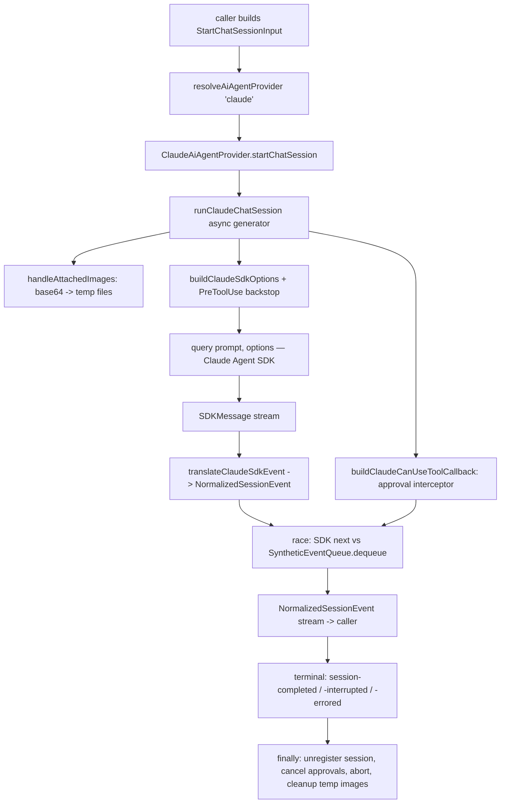
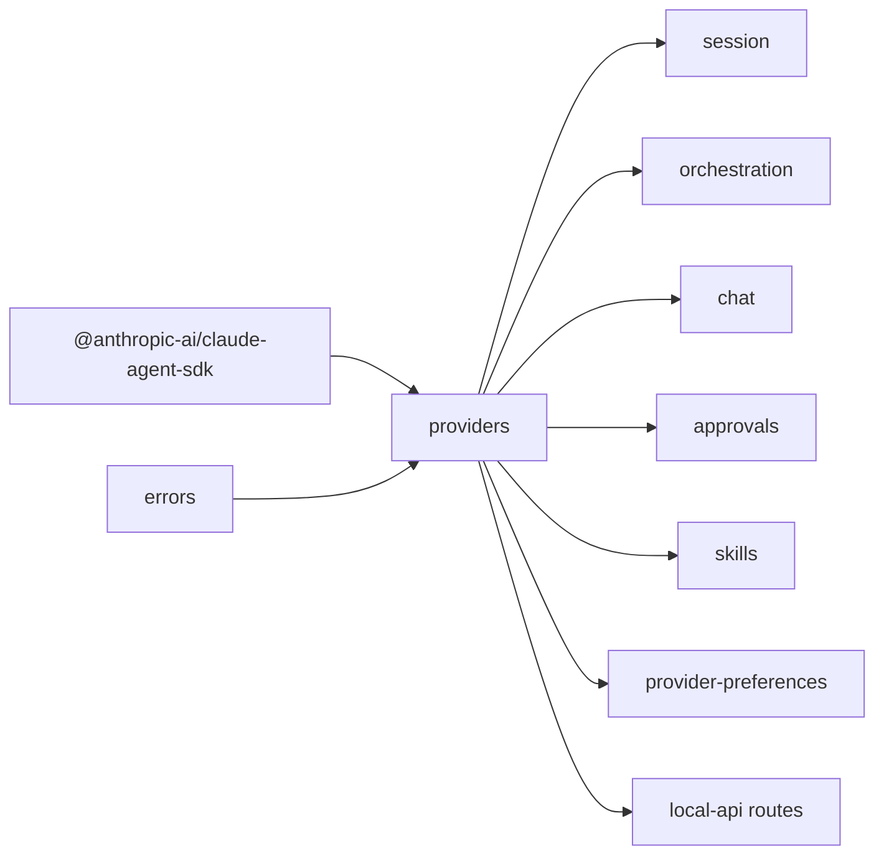

# Providers — Structure

> The code map and connections for the providers module (`@vynel/providers`). For the concepts behind it, see [overview.md](./overview.md).
>
> Folders touched: `packages/providers/src/` · `apps/local-api/src/routes/providers/`
>
> Not owned here (loose neighbours): `packages/provider-preferences/src/` (the DB-touching preference feature) · `packages/db/src/{schema,repositories}/providers/` (the `provider_preferences` kernel table). Providers itself is **DB-free** — its only runtime deps are `@anthropic-ai/claude-agent-sdk` + `@vynel/errors`.

## File map

`► ` = entry point (public surface).

### `packages/providers/src/` — package root

| Path | Role |
|---|---|
| ► `index.ts` | Public surface. Re-exports `shared/*` + `registry.ts`, plus the three status ops (`listProvidersWithStatus`, `getProviderAuthenticationStatus`, `discoverInstalledSkillsForProvider`). The concrete `ClaudeAiAgentProvider` and every `claude/**` helper are **not** exported — consumers reach a provider only via `resolveAiAgentProvider`. |
| ► `registry.ts` | Process-level singleton `Map<AiAgentProviderId, AiAgentProvider>`. `resolveAiAgentProvider` (throws `ValidationError`/400 on unknown id), `listAvailableAiAgentProviders`, `listAvailableAiAgentProviderIds`. Phase 1 registers `claude` only. |

### `packages/providers/src/shared/` — the provider-agnostic CONTRACT (SDK-free)

This is what the many consuming packages import; an SDK change must never reach these signatures. It is the shape a future `codex/` sibling implements.

| Path | Role |
|---|---|
| `shared/index.ts` | Barrel — re-exports every file below (types + the two registries). |
| `shared/ai-agent-provider.ts` | `AiAgentProvider` abstract class — the nine-method contract. `getContextReport` / `summarizeSession` ship a default `null` impl so a new provider needs no stub. |
| `shared/ai-agent-provider-id.ts` | `AiAgentProviderId` union (`'claude' \| 'codex' \| 'gemini' \| 'cursor'`) + `DEFAULT_PROVIDER_ID = 'claude'`. |
| `shared/normalized-session-event.ts` | The **closed 11-variant** `NormalizedSessionEvent` union (discriminated on `kind`). |
| `shared/start-chat-session-input.ts` | `StartChatSessionInput` + `ChatMessageImage` + the `ClaudePermissionMode` union (`ask` / `auto` / `bypass-with-behavior-gate` / `plan-only`). |
| `shared/approval-decision.ts` | `ApprovalDecision` union (`approved` / `denied` / `timed-out` / `cancelled`). |
| `shared/authentication-status.ts` | `AuthenticationStatus` + `AuthenticationMethod` (`oauth` / `api-key`). Status-as-data; never the API key value. |
| `shared/installed-skill.ts` | `InstalledSkill` + `DiscoverSkillsInput`. |
| `shared/mcp-server-config.ts` | `McpServerConfig` + `ListMcpServersInput`. |
| `shared/chat-session-transcript.ts` | `ChatSessionTranscript` + `FetchTranscriptInput`. |
| `shared/persisted-session-record.ts` | `PersistedSessionRecord` — lightweight metadata for the sessions-sync. |
| `shared/get-context-report-input.ts` | `GetContextReportInput`. |
| `shared/summarize-session-input.ts` | `SummarizeSessionInput` — the continuity hand-off summary input. |
| `shared/provider-logger.ts` | `ProviderLogger` structural shape (NOT a `@vynel/logger` import) — shared by the two best-effort read inputs. |
| `shared/active-session-registry.ts` | `ActiveSessionRegistry` class — in-memory `Map<sessionId, ActiveSessionRecord{cancel()}>`. |
| `shared/pending-approval-registry.ts` | `PendingApprovalRegistry` class — in-memory `Map<approvalRequestId, resolve()>`; the lever that resumes the SDK's awaiting `canUseTool` promise from outside. |

### `packages/providers/src/status/` — the runtime-read operations

Pulled from the old core `providers` domain: the runtime-interrogating reads live with the AI seam (preference reads split off into `@vynel/provider-preferences`).

| Path | Role |
|---|---|
| `status/list-providers-with-status.ts` | `listProvidersWithStatus(providers?)` — auth status of every provider (defaults to the registry; Phase 1 = one entry). |
| `status/get-provider-authentication-status.ts` | `getProviderAuthenticationStatus(providerId, activeProvider?)` — one provider's status. |
| `status/discover-installed-skills-for-provider.ts` | `discoverInstalledSkillsForProvider(input, activeProvider?)` — on-disk skills the runtime sees. |
| `status/select-ai-agent-provider.ts` | Internal helper: prefer the caller's injected `activeProvider` when it serves the id; else fall back to `resolveAiAgentProvider` (keeps the 400-on-unknown-id contract). Not exported. |

### `packages/providers/src/claude/` — the Claude provider (Phase 1's only registered provider)

| Path | Role |
|---|---|
| `claude/claude-ai-agent-provider.ts` | `ClaudeAiAgentProvider extends AiAgentProvider`. Thin — every method delegates to a concern folder. Holds the two registries as private fields. Imports **no** SDK. |
| **`claude/base/`** | **SDK adapter — the anti-corruption layer.** |
| `claude/base/claude-agent-sdk.ts` | The **SOLE non-test import site** of `@anthropic-ai/claude-agent-sdk`. Re-exports `query` + `CanUseTool` / `HookCallback` / `Options` / `SDKMessage`. An Anthropic changelog change lands **here, one file**. |
| `claude/base/build-claude-sdk-options.ts` | Assembles the SDK `Options` from `StartChatSessionInput`; maps `ClaudePermissionMode` → SDK `permissionMode`; binds the always-on `PreToolUse` backstop. |
| `claude/base/translate-claude-sdk-event.ts` | Maps raw `SDKMessage` shapes → `NormalizedSessionEvent[]`. The one file that reads native SDK message shapes. |
| `claude/base/claude-sdk-message-readers.ts` | Pure readers off a raw `SDKMessage`: streamed assistant-message id + a `result` message's early-end error. |
| `claude/base/handle-attached-images.ts` | Writes `base64Data` images to temp files for the SDK prompt; cleanup in a returned `cleanup()`. |
| **`claude/session/`** | **Driving `query()`.** |
| `claude/session/run-claude-chat-session.ts` | The `async function*` core: builds options, races SDK events vs. synthetic approval events, guarantees registry + temp-file cleanup in `finally`. |
| `claude/session/synthetic-event-queue.ts` | `SyntheticEventQueue<T>` — dequeue/enqueue bridge between the `canUseTool` callback and the generator's race loop. |
| `claude/session/run-claude-context-report.ts` | Runs the Claude `/context` command → raw markdown or `null`. |
| `claude/session/run-claude-session-summary.ts` | Distils a session into a continuity hand-off summary (the seed-fresh CARRY). |
| **`claude/approvals/`** | **Permission wiring.** |
| `claude/approvals/build-claude-can-use-tool-callback.ts` | Builds the `canUseTool` callback — pauses on restricted tools, enqueues synthetic `approval-requested` / `approval-resolved` events, `await`s the registry `resolve`. |
| `claude/approvals/build-claude-pre-tool-use-hook.ts` | The can't-be-skipped backstop: forces the irreversible floor to card even for a subagent under `bypassPermissions`/`dontAsk` (stands down only for the `auto` MAIN session). |
| `claude/approvals/build-claude-post-compact-hook.ts` | Captures the SDK's compaction summary → the injected `onCompaction` callback (session-continuity Layer 1). Best-effort; never throws. |
| `claude/approvals/tools-always-requiring-approval.ts` | Single source of truth for the irreversible-tool floor (cards even under bypass). Consumed by both the callback and the hook. Hardcoded in Phase 1. |
| **`claude/history/`** | **Persisted-session reads.** |
| `claude/history/fetch-claude-persisted-session-transcript.ts` | Reads a Claude CLI session artifact → `ChatSessionTranscript`. |
| `claude/history/synchronize-claude-persisted-sessions.ts` | Scans Claude CLI session artifacts → `PersistedSessionRecord[]`. |
| `claude/history/translate-persisted-claude-message.ts` | Maps a persisted Claude message → normalized transcript shape. |
| `claude/history/claude-session-storage.ts` | Path helpers for the Claude CLI session-artifact storage. |
| **`claude/installation/`** | **Host install/config reads.** |
| `claude/installation/read-claude-authentication-status.ts` | Reads the Claude CLI auth/oauth state → `AuthenticationStatus`. |
| `claude/installation/discover-claude-installed-skills.ts` | Scans skill directories → `InstalledSkill[]`. |
| `claude/installation/list-claude-configured-mcp-servers.ts` | Reads the Claude CLI MCP config → `McpServerConfig[]`. |
| `claude/installation/resolve-claude-code-executable-path.ts` | Resolves the Claude Code CLI binary path. |
| `claude/installation/read-host-os-env-var.ts` | Reads a host-OS env var (blessed exception to the `process.env` ban — a runtime boundary read, not app config). |

### `packages/providers/src/test-support/`

| Path | Role |
|---|---|
| `test-support/fake-claude-query.ts` | Test-only fake for the SDK `query()`. |
| `test-support/fake-ai-agent-provider.ts` | `makeFakeAiAgentProvider(overrides)` — a fake whose methods throw unless overridden, for the status-op + route tests. |

### `apps/local-api/src/routes/providers/` — the HTTP surface (not part of the package)

| Path | Role |
|---|---|
| ► `index.ts` | `providersApp` — three chained read-only GET routes, all `x-mcp`-exposed, mounted at `/providers`. |
| `schemas.ts` | `ProviderIdParamSchema`, `DiscoverSkillsQuerySchema` + the three response schemas. |

## Data & persistence

**No owned tables.** `@vynel/providers` never imports `@vynel/db`. The `provider_preferences` kernel table and its CRUD live in the neighbouring `@vynel/provider-preferences` leaf, not here.

**In-memory state (not persisted, one per `ClaudeAiAgentProvider` instance):**

| Registry | Shape | Purpose |
|---|---|---|
| `ActiveSessionRegistry` | `Map<sessionId, { sessionId, startedAt, cancel(): Promise<void> }>` | Lets `interruptChatSession` abort an in-flight session from outside the SDK callback. |
| `PendingApprovalRegistry` | `Map<approvalRequestId, PendingApprovalRecord{ resolve }>` | Lets `respondToApprovalRequest` resume the SDK's awaiting `canUseTool` promise. |

Both are lost on process restart (Phase 1 mitigation = surface-on-resume, outside this package).

## The provider interface (abstract class + concrete)

**`AiAgentProvider`** (`shared/ai-agent-provider.ts`) — nine methods:

| Method | Returns | Notes |
|---|---|---|
| `getAuthenticationStatus()` | `Promise<AuthenticationStatus>` | Never throws for not-installed / not-authenticated — status is data. |
| `discoverInstalledSkills(input)` | `Promise<InstalledSkill[]>` | `[]` when the runtime isn't installed. |
| `listConfiguredMcpServers(input)` | `Promise<McpServerConfig[]>` | Read-only; `[]` when not installed. |
| `startChatSession(input)` | `AsyncIterable<NormalizedSessionEvent>` | Never throws — errors surface as a terminal `session-errored` event. |
| `respondToApprovalRequest(requestId, decision)` | `Promise<void>` | Throws `NotFoundError('approval_request', id)` for an unknown id. |
| `interruptChatSession(sessionId)` | `Promise<void>` | No-op if the session isn't active. |
| `fetchPersistedSessionTranscript(input)` | `Promise<ChatSessionTranscript>` | |
| `synchronizePersistedSessions(since?)` | `Promise<PersistedSessionRecord[]>` | |
| `getContextReport(input)` | `Promise<string \| null>` | Default `null` on the abstract class; Claude overrides. |
| `summarizeSession(input)` | `Promise<string \| null>` | Default `null`; Claude overrides (continuity CARRY). |

**`ClaudeAiAgentProvider`** (`claude/claude-ai-agent-provider.ts`) delegates each method to a concern-folder helper; imports no SDK type itself.

**Registry** (`registry.ts`):

| Function | Purpose |
|---|---|
| `resolveAiAgentProvider(id)` | The singleton instance; `ValidationError` (400) for an unknown/unregistered id (`codex`/`gemini`/`cursor` → 400 by design). |
| `listAvailableAiAgentProviders()` | All registered instances. |
| `listAvailableAiAgentProviderIds()` | All registered id strings. |

## Status operations

| Operation | What it does | Key calls |
|---|---|---|
| `listProvidersWithStatus(providers?)` | Auth status of all providers (defaults to the registry) | `provider.getAuthenticationStatus()` per provider |
| `getProviderAuthenticationStatus(id, active?)` | One provider's install + auth status | `selectAiAgentProvider → getAuthenticationStatus` |
| `discoverInstalledSkillsForProvider(input, active?)` | On-disk skills the runtime sees | `selectAiAgentProvider → discoverInstalledSkills` |

All three accept an optional injected provider (`c.var.aiProvider` in routes) so tests never hit the real runtime; they fall back to the registry, preserving the 400-on-unknown-id contract.

## HTTP surface

Mounted at `/providers` from `apps/local-api/src/app.ts`. Every route runs the `...userScoped` handler bundle (user resolver — providers are user-scoped, not workspace-scoped). All three are read-only and opt into MCP.

| Method | Path | Purpose | x-sdk-name | MCP tool |
|---|---|---|---|---|
| GET | `/providers` | All providers with status | `providers.list` | `list_ai_agent_providers` |
| GET | `/providers/:providerId/auth` | One provider's auth status (400 on bad id) | `providers.getAuthStatus` | `get_ai_agent_provider_auth_status` |
| GET | `/providers/:providerId/skills` | Installed skills for one provider (optional `?workspacePath=`) | `providers.discoverInstalledSkills` | `discover_installed_skills_for_provider` |

**No mutating routes.** Setting a default provider is the `@vynel/provider-preferences` leaf's job, called internally (onboarding) rather than exposed here.

## MCP surface

Providers ships **no `McpFeatureDescriptor` of its own.** Its three MCP tools are derived from the route `x-mcp` annotations above (all read-only → no approval card). The mutating-tool carding this package *enforces* (via `tools-always-requiring-approval` + the `PreToolUse` backstop) is for the tools of *other* features running inside a session, not for providers' own surface.

## Worker / background jobs

**None.** Providers owns no scheduled or background jobs.

## Web surface

**None — backend-only.** No dedicated providers view. Provider status is consumed inline by the surfaces that need it (chat composer, onboarding) via the three read routes.

## Pipeline — "start a chat turn → normalized event stream"

1. Caller (session/chat layer) builds `StartChatSessionInput` — system-prompt append, MCP servers, agents, allowed/denied tools, `alwaysRequireApprovalToolNames`. `packages/session/src/runtime/start-chat-turn.ts:21`.
2. `resolveAiAgentProvider('claude')` returns the singleton. `registry.ts:23`.
3. `startChatSession` → `runClaudeChatSession` (`claude/session/run-claude-chat-session.ts:42`) — an `async function*`. Sets up an `AbortController`, temp-image handling, SDK options, and the `canUseTool` callback.
4. `buildClaudeSdkOptions` (`claude/base/build-claude-sdk-options.ts`) maps `ClaudePermissionMode` → SDK `permissionMode` and binds the always-on `PreToolUse` backstop that cards the irreversible floor even under bypass.
5. `canUseTool` (`claude/approvals/build-claude-can-use-tool-callback.ts`) intercepts restricted tools: enqueues a synthetic `approval-requested` on the `SyntheticEventQueue` and `await`s `PendingApprovalRegistry.resolve(requestId, decision)`.
6. The generator's loop races `queryInstance.next()` against `syntheticEventQueue.dequeue()`, yielding whichever resolves first — interleaving SDK events with synthetic approval events without buffering. `run-claude-chat-session.ts:182`.
7. `translateClaudeSdkEvent` (`claude/base/translate-claude-sdk-event.ts`) maps raw `SDKMessage` shapes to `NormalizedSessionEvent[]` — the only translator of native SDK shapes.
8. The terminal `result` message maps to `session-completed` or `session-errored`; an `AbortError` maps to `session-interrupted`. `run-claude-chat-session.ts:229-262`.
9. `finally`: `activeSessionRegistry.unregister`, `pendingApprovalRegistry.cancelAllForSession`, `abortController.abort()`, `syntheticEventQueue.close()`, temp-image cleanup. `run-claude-chat-session.ts:263`.

## Connections

**Summary:** providers is a **deep leaf hub** — a widely-imported foundation called by nearly every domain that runs AI turns, but it imports only *down* (the SDK + `@vynel/errors`). It publishes/consumes **no** outbox events; its `NormalizedSessionEvent` stream is the cross-domain signal. Nothing calls it on startup — it's invoked on demand per turn.

| Unit | Direction | Mechanism | What crosses |
|---|---|---|---|
| `@anthropic-ai/claude-agent-sdk` | out | import (only in `claude/base/claude-agent-sdk.ts`) | `query()`, `SDKMessage`, `Options`, hook/`CanUseTool` types |
| [errors](../errors/overview.md) | out | import | `NotFoundError`, `ValidationError` |
| [session](../session/overview.md) | in | import | `resolveAiAgentProvider`, `AiAgentProvider`, `NormalizedSessionEvent`, `StartChatSessionInput`, `DEFAULT_PROVIDER_ID`, `ClaudePermissionMode` |
| [orchestration](../orchestration/overview.md) | in | import | `AiAgentProvider`, `NormalizedSessionEvent`, `StartChatSessionInput` (leaf turn drain) |
| [chat](../chat/overview.md) | in | import | `resolveAiAgentProvider`, `NormalizedSessionEvent`, `AiAgentProviderId`, `PersistedSessionRecord`, `ApprovalDecision` |
| [approvals](../approvals/overview.md) | in | import | `ApprovalDecision`, `resolveAiAgentProvider` (respond to approval) |
| [skills](../skills/overview.md) | in | import | `discoverInstalledSkillsForProvider` (reconcile disk vs DB) |
| [provider-preferences](../provider-preferences/overview.md) | in | import | `AiAgentProviderId`, `DEFAULT_PROVIDER_ID` (the DB-side default feature) |
| [channels](../channels/overview.md) · [schedules](../schedules/overview.md) · [voice](../voice/overview.md) | in | import | types / `resolveAiAgentProvider` for their turn flows |
| [local-api](../_apps/local-api/overview.md) | in | route mount + injected `c.var.aiProvider` | `providersApp` mounted; status ops called with the injected provider |

**Events published:** none.
**Events consumed:** none.

## Config & gotchas

- **The Claude CLI / SDK must be reachable, but a missing binary never throws.** `startChatSession` emits `session-errored`; `discoverInstalledSkills` / `listConfiguredMcpServers` return `[]`; `getAuthenticationStatus` returns `isInstalled: false`. The whole test suite mocks the SDK (`test-support/fake-claude-query.ts`) so the gate is green on any machine — no real CLI/auth needed.
- **`base/claude-agent-sdk.ts` is the single anti-corruption choke point** — the only non-test file that imports `@anthropic-ai/claude-agent-sdk`. Two other files *mention* the package in comments only. An Anthropic changelog bump is reconciled here, one file, so drift never reaches the SDK-free `shared/` contract or any downstream package.
- **The registry singleton is process-scoped.** Tests that import it share one `ClaudeAiAgentProvider`; the in-memory registries accumulate state. Prefer the injectable `activeProvider` seam (`c.var.aiProvider`) or the fakes over touching the singleton.
- **`AiAgentProviderId` includes `codex`/`gemini`/`cursor` but none are registered.** `resolveAiAgentProvider` returns **400 (ValidationError), not 404** for them — the id is a recognized concept, just unsupported today.
- **`NormalizedSessionEvent` is a CLOSED union.** Adding a variant is a deliberate multi-edit commit (the union, every translator, every exhaustive consumer switch, the table-test). Never emit a `kind` outside it.
- **The safety floor is enforced twice, on purpose.** `tools-always-requiring-approval` feeds both the `canUseTool` behavior gate AND the `PreToolUse` backstop; the backstop catches subagents that keep their own `bypassPermissions`/`dontAsk` mode and would otherwise skip `canUseTool` entirely. It stands down only for the `auto` MAIN session (no `agent_id`).
- **`read-host-os-env-var.ts` reads host env vars** — a blessed exception to the CLAUDE.md `process.env` ban (a runtime-boundary read to locate the Claude binary / detect auth, not app config).
- **Drift vs the module notes:** `docs/module-notes/providers.md` describes the seam as a pure runtime pull with preferences/status deferred. As shipped, the three **status** read-ops now live *in* this package (`status/`) and are exposed as the three `/providers` routes; the DB-touching **preference** CRUD is the separate `@vynel/provider-preferences` leaf. The notes' `claude/base` fold and the SDK single-choke-point invariant are both realised on disk.

---
*Mapped from the code on disk, 2026-07-14. If you change this module, update this file and [overview.md](./overview.md).*
