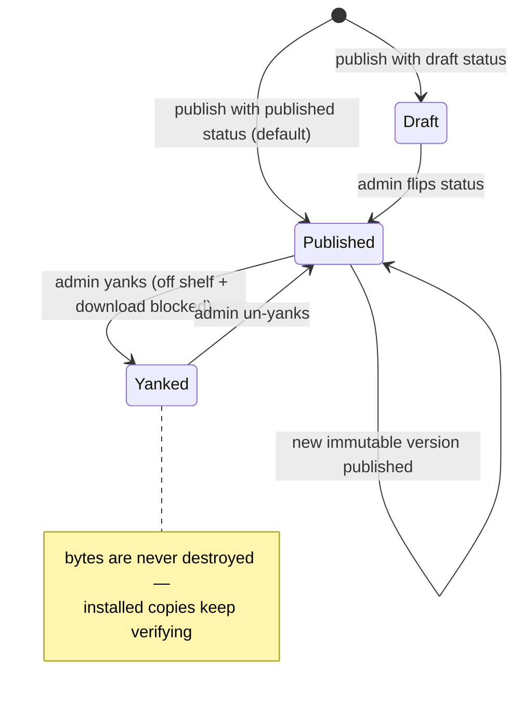

# Registry — Overview

> The cloud-side system of record for Vynel's marketplace: who publishes, what's on the shelf, every immutable version of it, and the tier-gated door through which the desktop downloads it.
>
> **Status:** shipped · **Depends on:** [cloud-db](../_platform/database/overview.md) (cloud kernel), [contracts](../_platform/contracts-and-sdk/overview.md) (hub wire shapes + the shared tier rule) · **Code map:** [structure.md](./structure.md)

## Purpose

Registry is the **hub's authoritative marketplace store** — the real data holder behind the shelf, running on the cloud database rather than the desktop's local kernel. Everything a user browses, every "install" the desktop performs, and every publish an operator makes ultimately reads or writes here.

It exists to make distribution **trustworthy**. A marketplace item isn't just a name and a description; it's downloadable content that will run on someone's machine. So the registry treats each release as an integrity record: content is hashed on the way in, that hash travels with the version, and the desktop verifies the bytes it downloaded match before trusting them. Combined with immutability — a published version's bytes can never change — this is what lets an already-installed copy stay verifiable forever, even after the item is pulled from sale.

The registry is deliberately **kind-agnostic**. A catalog item can be a skill, an agent, an MCP server, a rule, or a plugin, and the registry stores all five the same way: metadata, a per-kind install manifest it keeps opaque, and hashed content. Adding a new kind of installable thing is a data change, not a schema change — the meaning of the manifest is the desktop installer's problem, never the hub's.

## What it can do

- **Browse the catalog** — list every published item that has at least one shippable version, each annotated with whether *this* caller's plan can install it. Browse is generous: an item you can't install still shows up, marked as such.
- **Open an item's detail** — the item plus its full version history, newest first.
- **Download an item's content** — the tier-gated door: given a caller's *live* plan, decide whether they may install, then hand back the version's content and its integrity facts.
- **Publish a new version** — validate a publish request, accept the content bytes, hash and store them, and record an immutable version alongside its publisher and item.
- **Curate the catalog *(admin)*** — see every item at every status (not just the published ones), edit an item's presentation metadata, and move an item through its lifecycle: draft, published, or yanked.
- **Yank / un-yank an item *(admin)*** — pull a live item from both the shelf and the download door instantly, or restore it — without ever destroying its bytes.

## Responsibilities

**Owns** — the marketplace's persistent truth: three tables (publishers, catalog items, and their versions), the publish use-case with its hashing and immutability guarantee, the browse and detail reads, the fail-closed download authorization, the admin lifecycle (metadata edits + status transitions), and the **artifact store seam** — the swappable backend where the raw content bytes actually live. It owns the mapping from stored rows to the hub's wire shapes, and it enforces content limits (non-empty, size-capped) and identifier shapes (kebab item ids, semver versions) at the publish boundary.

**Does not own** —
- **who the caller is and what plan they're on** — the registry is *told* a caller's live tier; establishing it belongs to the hub's account/entitlements side ([accounts](../accounts/overview.md), [hub-account](../hub-account/overview.md));
- **the wire contract and the single tier-comparison rule** — the DTO shapes and the shared "does this tier meet the minimum" function live in [contracts](../_platform/contracts-and-sdk/overview.md);
- **the cloud database itself** — the connection and dialect are the [cloud-db](../_platform/database/overview.md) kernel's;
- **routing, auth, transport decoding, and which artifact backend to wire** — the [cloud-api](../_apps/cloud-api/overview.md) hub app does that; it decodes uploads, resolves the caller's tier, and injects the artifact store, then calls into here;
- **the admin UI** — [cloud-admin-web](../_apps/cloud-admin-web/overview.md) drives the curation operations;
- **the desktop side of "install"** — verifying the hash, reading the manifest, and actually placing an item on a machine is the [marketplace](../marketplace/overview.md) package's job; the registry only serves the bytes and the facts to verify them against.

## Concepts & vocabulary

| Term | Meaning |
|---|---|
| **Catalog item** | One installable thing on the shelf. Kind-agnostic, globally unique kebab id, carrying presentation metadata (name, one-line description, category, icon) and gating fields (minimum tier, recommended scope). Its downloadable content lives in versions, not here. |
| **Kind** | What the item *is*: `skill` · `agent` · `mcp` · `rule` · `plugin`. Validated at publish, otherwise opaque to the registry. |
| **Version** | One immutable release of an item: a semver, a changelog, the content's sha256 + size, and the opaque install manifest. `(item, version)` is unique — republishing is a conflict, never an overwrite. |
| **Publisher** | Who released an item. `verified` or `community` tier. v1 seeds a single verified publisher — the table exists so community publishing later is a data change, not a schema change. |
| **Manifest** | Per-kind install instructions (entry file, declared tools, permissions), carried as bounded JSON. Validated as a shape, kept opaque — its meaning is the desktop installer's concern. |
| **Minimum tier** | Which plan may *install* an item: `basic` (anyone, the default) or `pro`. Checked against the caller's live tier at download time. |
| **Status** | An item's lifecycle position: `draft`, `published`, or `yanked`. Only `published` surfaces in browse and passes the download gate. |
| **Artifact store** | The swappable backend holding the raw content bytes, keyed by item + version. v1 is a filesystem directory on the hub; the same shape can later be object storage (R2/S3). |
| **Caller tier** | The plan behind the request, resolved *live* per download — `basic`, `pro`, or *none* (a validly-signed token whose account is gone). Never trusted from a stale token claim. |

## Rules & invariants

- **A published version's bytes are immutable.** Once `(item, version)` exists, re-publishing it is a conflict — bump the semver instead. The conflict is checked *before* the bytes are stored, so a rejected republish can never overwrite good content with mismatched bytes.
- **Content is hashed at the door and verified at the destination.** The registry computes each version's sha256 as it accepts the bytes and ships that hash with the version; the desktop checks its download against it. A recorded version whose bytes have gone missing from storage is surfaced as an integrity fault, never a silent empty download.
- **Browse is generous, install is gated.** Listing and detail are fail-open — items you can't install still appear, flagged. The download decision is fail-closed: no live account is denied, an unpublished item is a plain not-found, and a plan below the item's minimum is refused.
- **The tier check runs against the caller's *live* plan.** Eligibility is decided fresh at download time from the account that stands behind the token — a deleted or downgraded account can't install on a stale claim.
- **Removal is soft, never destructive.** Pulling an item means yanking it — it vanishes from browse and the download door at once — never deleting its bytes. Destroying content would make already-installed copies unverifiable and burn the version number regardless.
- **One publish, one transaction.** A publish lands the publisher, the item, and the new version together or not at all — there's never a version-less item row from a partial failure. (The content bytes are written to the artifact store first, outside the transaction, but only after the immutability conflict is cleared.)
- **A published item with no version is not installable.** Browse skips it; detail treats it as a missing version. An item only becomes real when it has content to ship.
- **Content is bounded and identifiers are shaped.** Artifacts must be non-empty and within the size cap; item ids are kebab-case (with `publish` reserved), versions are semver — all enforced at the publish boundary before anything is stored.
- **The registry is kind-blind and manifest-blind.** It validates that a kind is one of the five and that a manifest is a bounded object, then stores both without interpreting them — so new kinds and richer manifests need no hub change.

## Lifecycle

## Where it sits in the bigger picture

Registry is the cloud counterpart to the desktop's marketplace experience. The [cloud-api](../_apps/cloud-api/overview.md) hub app is its only caller: it authenticates requests, resolves the caller's live tier from the account/entitlements side ([accounts](../accounts/overview.md), [hub-account](../hub-account/overview.md)), decodes uploaded content, wires the artifact backend, and turns the registry's results into HTTP. Operators curate the shelf through [cloud-admin-web](../_apps/cloud-admin-web/overview.md), which drives the admin lifecycle here. On the other end of the wire, the desktop's [marketplace](../marketplace/overview.md) package browses this catalog and installs from it — downloading a version's bytes, verifying them against the sha256 the registry recorded, and reading the manifest the registry kept opaque. The shared [contracts](../_platform/contracts-and-sdk/overview.md) package holds the wire shapes both sides speak and the one tier-comparison rule that drives both the browse annotation and the download gate, and everything persists in the [cloud-db](../_platform/database/overview.md) kernel — distinct from the desktop's local database.

---
*Mapped from the code on disk, 2026-07-14. If you change this module, update this file and [structure.md](./structure.md).*
