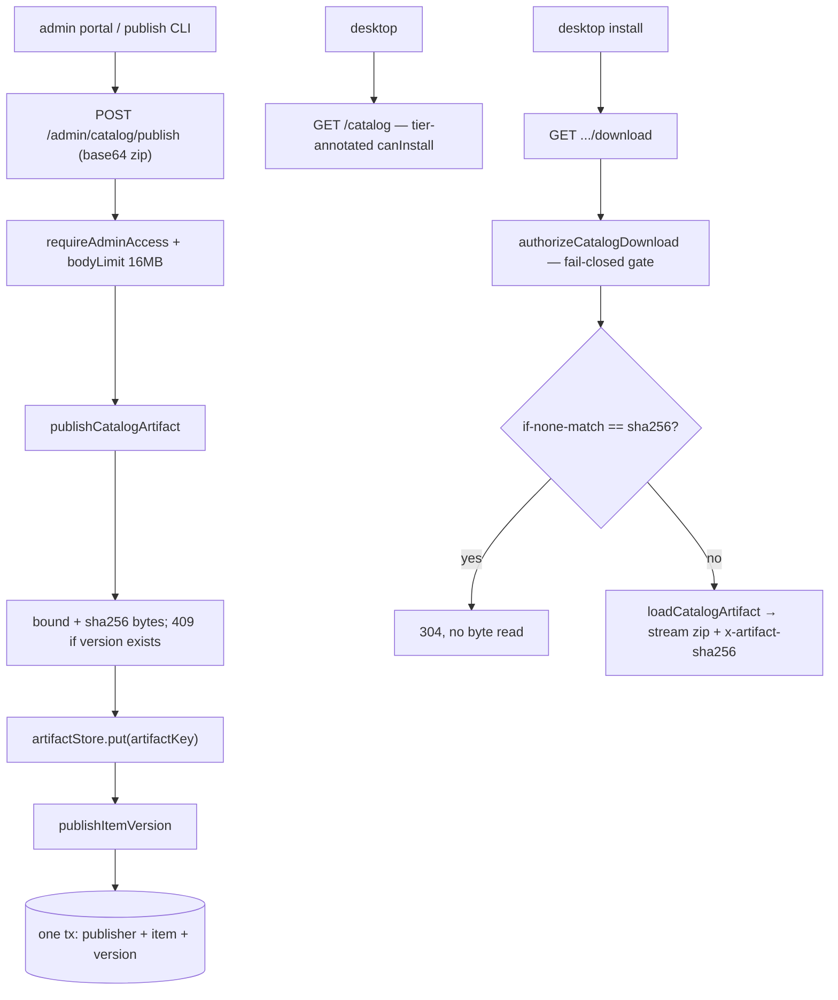
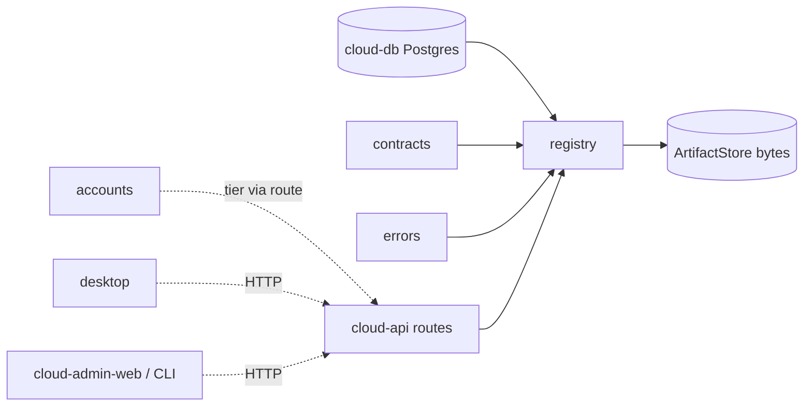

# Registry — Structure

> The code map and connections for the registry module. For the concepts behind it, see [overview.md](./overview.md).
>
> Folders touched: `packages/registry/src/` · `apps/cloud-api/src/routes/{catalog,admin}.ts` · `apps/cloud-api/src/{app,server,cloud-app-options}.ts` · `packages/cloud-db/migrations-postgres/`

Registry is a **cloud-side** vertical-slice leaf — the hub's marketplace catalog. Unlike a product leaf (SQLite + outbox), it owns its `schema/` and `repositories/` over the shared **`@vynel/cloud-db` Postgres kernel**, and is consumed only by `apps/cloud-api` (browse/detail/download for the desktop, publish/lifecycle for the admin portal + CLI). Deps: `@vynel/cloud-db`, `@vynel/contracts`, `@vynel/errors`, `drizzle-orm`, `zod` (`packages/registry/package.json`). No outbox, no MCP, no worker, no web store — those sections are dropped because the leaf has none.

## File map

► = entry point (public barrel).

| Path | Role |
|---|---|
| ► `packages/registry/src/index.ts` | public barrel — every export the cloud-api routes consume (browse, detail, publish, download, admin lifecycle, artifact store) |
| `packages/registry/src/schema/publishers.ts` | `publishers` table — v1 seeds one row (Vynel Team, verified); table exists so community publishing is later a data change, not a schema change |
| `packages/registry/src/schema/catalog-items.ts` | `catalog_items` table — one row per installable thing, kind-agnostic; `minimumTier` gates install |
| `packages/registry/src/schema/item-versions.ts` | `item_versions` table — the downloadable content's integrity + provenance record (`artifactSha256`, `manifestJson`) |
| `packages/registry/src/repositories/publishers-repository.ts` | publisher repo — `upsertPublisher` / `findPublisherById` |
| `packages/registry/src/repositories/catalog-repository.ts` | items + versions repo — upsert/find/list items, insert/list/find versions, admin joins, metadata patch, status flip |
| `packages/registry/src/registry-mappers.ts` | row → wire DTO mappers (`toHubCatalogItem` / `toHubCatalogVersion`); `canInstall` annotated via `tierMeetsMinimum`; `normalizeTier` |
| `packages/registry/src/publish-input.ts` | `PublishItemSchema` — Zod validation of a publish request (kebab id, semver, bounded opaque manifest) |
| `packages/registry/src/publish-item-version.ts` | `publishItemVersion` — one tx: upsert publisher + item + insert version; republish of an existing `(itemId, version)` is a 409 |
| `packages/registry/src/publish-catalog-artifact.ts` | `publishCatalogArtifact` — the full use-case: bound + hash bytes, store, then record the version; `MAX_ARTIFACT_BYTES` (10 MB) |
| `packages/registry/src/list-catalog.ts` | `listCatalog` — published items with ≥1 version, tier-annotated (fail-open browse) |
| `packages/registry/src/get-catalog-item.ts` | `getCatalogItemDetail` — one published item + all its versions; 404 for unknown/unpublished |
| `packages/registry/src/catalog-download.ts` | the fail-**closed** gate: `authorizeCatalogDownload` (tier/status decision + integrity facts) + `loadCatalogArtifact` (byte read); `TierTooLowError`, `ArtifactMissingError` |
| `packages/registry/src/admin-catalog.ts` | admin lifecycle — `listCatalogForAdmin` (every status), `updateCatalogItemMetadata`, `setCatalogItemLifecycleStatus` (yank/un-yank) + their Zod schemas |
| `packages/registry/src/artifact-store.ts` | **registry-owned** artifact-bytes seam — `ArtifactStore` interface, `artifactKey`, filesystem + in-memory impls (the app only selects the backend) |
| `apps/cloud-api/src/routes/catalog.ts` | HTTP entry — browse/detail/download, guarded by `requireAccount` (fresh tier) |
| `apps/cloud-api/src/routes/admin.ts` | HTTP entry — catalog lifecycle + publish (shares the file with accounts admin routes), guarded by `requireAdminAccess` |

Test files (`registry.test.ts`, `catalog-download.test.ts`) are excluded from the map.

## Data & persistence

Three tables live in `packages/registry/src/schema/` and are registered in the **cloud** drizzle config `drizzle.cloud-postgres.config.ts` (repo root, lines 22–24) — the schema-parity guard (`scripts/src/generators/check-schema-parity.ts`) requires each schema file in exactly one config. Migration: all three tables + FKs + indexes ship together in `packages/cloud-db/migrations-postgres/0003_registry.sql`. Both FKs are **intra-package** (`catalog_items → publishers`, `item_versions → catalog_items`) — no cross-feature FK, honoring the invariant.

**`publishers`** — the author. v1: one seeded verified row.

| Column | Type | Notes |
|---|---|---|
| `id` | text (PK) | kebab-case, e.g. `vynel-team` |
| `name` | text | display name |
| `tier` | text | `verified` / `community` — app-enforced union, default `verified` |
| `url` | text (null) | optional homepage |

**`catalog_items`** — one row per installable thing, kind-agnostic.

| Column | Type | Notes |
|---|---|---|
| `itemId` | text (PK) | kebab, globally unique (e.g. `email-drafter`); `publish` is a reserved id |
| `kind` | text | `skill` / `agent` / `mcp` / `rule` / `plugin` — app-enforced union |
| `publisherId` | text (FK) | → `publishers.id` (same package) |
| `displayName`, `oneLineDescription`, `category`, `iconName` | text | catalog-card fields |
| `recommendedScope` | text (null) | `user` / `workspace` / `both` — some kinds have no install scope |
| `minimumTier` | text | `basic` / `pro` — which tier may install; default `basic` |
| `status` | text | `draft` / `published` / `yanked` — only `published` surfaces in browse; default `draft` |
| `createdAt` / `updatedAt` | timestamptz | `updatedAt` bumped on every write; browse/admin order by it desc |

**`item_versions`** — the immutable, downloadable version record.

| Column | Type | Notes |
|---|---|---|
| `id` | text (PK) | UUID (`randomUUID()` in `publishItemVersion`) |
| `itemId` | text (FK) | → `catalog_items.itemId` (same package) |
| `version` | text | semver |
| `changelog` | text | default `''` |
| `manifestJson` | text | per-kind install manifest, validated at publish, **opaque** to the registry |
| `artifactSha256` | text | hex sha256 of the stored bytes; the desktop verifies against it; doubles as the download ETag |
| `artifactSize` | integer | byte count |
| `minAppVersion` | text (null) | **stored, not enforced** until D2 stamps real app versions |
| `releasedAt` | timestamptz | default now; "latest" + version lists order by it desc |

Indexes (`item_versions`): unique `(itemId, version)` (`item_versions_item_version_unique`) — the immutability + republish-conflict guard at the DB level — and `(itemId)` (`item_versions_item_id_idx`). The artifact **bytes** live outside Postgres in the `ArtifactStore` (§Artifact store), keyed by `artifactKey(itemId, version)`.

## Repositories

| Function (db-first) | Purpose |
|---|---|
| *(publishers)* `upsertPublisher` | insert-or-update a publisher (id conflict → update name/tier/url) |
| *(publishers)* `findPublisherById` | one publisher or `null` |
| `upsertCatalogItem` | insert-or-update an item on `itemId` conflict; bumps `updatedAt` |
| `setCatalogItemStatus` | flip `status` (+ `updatedAt`) — the yank/un-yank write |
| `findCatalogItemById` | one item row or `null` (used by the download gate + admin guards) |
| `listPublishedItemsWithPublisher` | published items ⨝ publisher, newest-updated first — browse read |
| `listAllItemsWithPublisher` | every item ⨝ publisher regardless of status — admin read |
| `updateCatalogItemMetadata` | patch present-only metadata keys (+ `updatedAt`) |
| `findItemWithPublisher` | one item ⨝ publisher or `null` — detail read |
| `insertItemVersion` | append a version row (id supplied by caller) |
| `listVersionsForItem` | all versions of an item, newest release first |
| `findItemVersion` | one `(itemId, version)` row or `null` — the republish-conflict + download-version check |
| `findLatestVersionForItem` | freshest version or `null` — "latest" for browse/detail cards |

## Core operations

| Operation | What it does | Key calls |
|---|---|---|
| `publishCatalogArtifact` | validate bytes (non-empty, ≤ 10 MB), sha256 them, **conflict-check before storing**, put to the artifact store, then record | `createHash`, `findItemVersion`, `artifactStore.put`, `publishItemVersion` |
| `publishItemVersion` | 409 if `(itemId, version)` exists, else **one tx**: upsert publisher + item + insert version | `findItemVersion`, `db.transaction` → `upsertPublisher`, `upsertCatalogItem`, `insertItemVersion` |
| `listCatalog` | every published item that has ≥1 version → wire DTO annotated with the caller's `canInstall` (fail-open) | `listPublishedItemsWithPublisher`, `findLatestVersionForItem`, `toHubCatalogItem` |
| `getCatalogItemDetail` | one published item + all versions; 404 for unknown/unpublished/version-less | `findItemWithPublisher`, `findLatestVersionForItem`, `listVersionsForItem`, mappers |
| `authorizeCatalogDownload` | fail-**closed** gate: null live tier → `TierTooLowError`; unpublished → 404; tier below minimum → `TierTooLowError`; else returns sha256 + size | `findCatalogItemById`, `tierMeetsMinimum`, `findItemVersion` |
| `loadCatalogArtifact` | read an authorized version's bytes; missing bytes → `ArtifactMissingError` (never a silent empty download) | `artifactStore.get`, `artifactKey` |
| `listCatalogForAdmin` | every item (all statuses) ⨝ publisher + all its versions → admin DTO | `listAllItemsWithPublisher`, `listVersionsForItem` |
| `updateCatalogItemMetadata` | 404-guard then patch metadata (empty patch rejected by schema) | `findCatalogItemById`, repo `updateCatalogItemMetadata` |
| `setCatalogItemLifecycleStatus` | 404-guard then flip status — yank/un-yank | `findCatalogItemById`, `setCatalogItemStatus` |

## HTTP surface

Two route builders, two mount points, two middleware bundles (`apps/cloud-api/src/app.ts:28-29`):

- **`/catalog`** (`routes/catalog.ts`) — `requireAccount(accessTokenVerifier)` on `*`; the caller's tier is resolved **fresh** from the accounts table on every request (`resolveActiveAccountTier`), never the ~7-day-stale token claim.
- **`/admin`** (`routes/admin.ts`) — `requireAdminAccess` (dual-door: static `CLOUD_ADMIN_TOKEN` bearer **or** a signed-in admin-role account, role read fresh). This file also carries `/admin/accounts*` routes that belong to the **accounts** leaf; only the catalog rows below are registry's.

| Method | Path | Purpose |
|---|---|---|
| GET | `/catalog/` | browse — published items, tier-annotated `canInstall` (fail-open, default basic if account gone) |
| GET | `/catalog/:itemId` | detail — item + all versions (fail-open tier) |
| GET | `/catalog/:itemId/versions/:version/download` | fail-closed gate → ETag/304 on `if-none-match` → stream zip bytes (`x-artifact-sha256` header) |
| GET | `/admin/catalog` | admin list — every status + every version |
| PATCH | `/admin/catalog/:itemId` | edit item metadata |
| POST | `/admin/catalog/:itemId/status` | yank / un-yank / draft↔published |
| POST | `/admin/catalog/publish` | publish a version — `bodyLimit` 16 MB, base64 artifact decoded, `publishCatalogArtifact` |

No error mapping in the routes — typed `VynelError`s (incl. `TierTooLowError`, `ArtifactMissingError`, `ConflictError`, `NotFoundError`, `ValidationError`) hit the app's single `onError` switch (`app.ts:18`).

## Artifact store

`artifact-store.ts` is **registry-owned** — the leaf defines the `ArtifactStore` interface (`put` / `get` / `exists`), the key derivation (`artifactKey` = sanitized `itemId@version.zip`), and both implementations (`createFilesystemArtifactStore`, `createInMemoryArtifactStore`). The app only chooses **which backend** and injects it: `server.ts:53` wires `createFilesystemArtifactStore(env.CLOUD_ARTIFACT_DIR)` into `CloudAppOptions.artifactStore`, which the two route builders pass through. The interface keeps the R2/S3 move a swap with no registry change (the download route could then redirect instead of streaming). The filesystem impl enforces path containment (a key can't escape the store root).

## Pipeline — "publish a version, then it's browsable and installable"

1. `apps/cloud-api/src/routes/admin.ts` (POST `/catalog/publish`) → `requireAdminAccess` + `bodyLimit(16MB)` → decode base64 → `publishCatalogArtifact(db, artifactStore, …)`.
2. `packages/registry/src/publish-catalog-artifact.ts` — reject empty/> 10 MB (`ValidationError`), sha256 the bytes, `findItemVersion` conflict-check **before** `artifactStore.put` (a 409 must never overwrite an immutable version's bytes), then `publishItemVersion`.
3. `packages/registry/src/publish-item-version.ts` — re-check the conflict, then one `db.transaction`: `upsertPublisher` + `upsertCatalogItem` + `insertItemVersion` (partial failure leaves no version-less item).
4. `routes/catalog.ts` (GET `/`) → `resolveActiveAccountTier` (fresh, fail-open to `basic`) → `listCatalog` → `toHubCatalogItem` annotates `canInstall` via `tierMeetsMinimum`.
5. `routes/catalog.ts` (GET `.../download`) → `resolveActiveAccountTier` (nullable, fail-closed) → `authorizeCatalogDownload` (`catalog-download.ts`) returns sha256/size → route answers `if-none-match` with 304 **without** touching bytes → on miss, `loadCatalogArtifact` streams the zip with the `x-artifact-sha256` integrity header.

## Connections

**Summary:** registry is a **pure leaf** — imported only by `apps/cloud-api` (both route files + `server.ts` wiring + the `cloud-app-options` type). It depends **down only** on `@vynel/cloud-db`, `@vynel/contracts`, `@vynel/errors`. It never imports a sibling feature: caller tier is resolved at the *route* via `@vynel/accounts`, not inside the registry. Desktop and the admin portal are **HTTP consumers**, not importers.

| Unit | Direction | Mechanism | What crosses |
|---|---|---|---|
| cloud-db kernel (`@vynel/cloud-db`) | out | import | `CloudDatabase`, `db.transaction`, the three owned tables |
| contracts (`@vynel/contracts`) | out | import | `HubCatalogItem`/`Detail`/`Version`, `HubAdminCatalogItem`, `HubTier`, `tierMeetsMinimum` |
| errors (`@vynel/errors`) | out | import | `VynelError`, `ConflictError`, `NotFoundError`, `ValidationError` (+ registry's own `TierTooLowError`, `ArtifactMissingError`) |
| cloud-api catalog routes | in | import | `listCatalog`, `getCatalogItemDetail`, `authorizeCatalogDownload`, `loadCatalogArtifact` |
| cloud-api admin routes | in | import | `PublishItemSchema`, `publishCatalogArtifact`, `listCatalogForAdmin`, `updateCatalogItemMetadata`, `setCatalogItemLifecycleStatus`, schemas |
| cloud-api `server.ts` / `cloud-app-options.ts` | in | import / injected | `createFilesystemArtifactStore` wired into `CloudAppOptions.artifactStore`; `ArtifactStore` type |
| [accounts](../accounts/overview.md) | — (route-level) | sibling leaf | **not imported by registry**; the cloud-api routes resolve `callerTier` via `resolveActiveAccountTier` and hand it in |
| desktop / cloud-admin-web | in (loose) | HTTP | browse/detail/download over `/catalog`; publish/lifecycle over `/admin/catalog` |

**Events published:** none — cloud leaf over Postgres, no outbox kernel.
**Events consumed:** none.

## Config & gotchas

- **`CLOUD_ARTIFACT_DIR`** (`apps/cloud-api/src/env.ts:58`, default `.data/cloud-artifacts`) — the filesystem artifact-store root. The env var is read only in the app; the registry stays env-free.
- **Double conflict-check is intentional.** `publishCatalogArtifact` calls `findItemVersion` *before* `artifactStore.put` so a 409 can never overwrite an immutable version's bytes; `publishItemVersion` then re-checks before its tx. Versions are byte-immutable — mismatched bytes would fail the desktop's sha256 verify.
- **Two size bounds.** Registry's `MAX_ARTIFACT_BYTES` = 10 MB (raw bytes); the admin route's `bodyLimit` = 16 MB (base64 inflates ~4/3, plus the JSON wrapper). The 10 MB rule is the real cap.
- **`minAppVersion` is stored but NOT enforced** until D2 stamps real app versions (schema comment) — a recorded field that no gate reads yet.
- **Yank, never delete.** Lifecycle is soft-only: `setCatalogItemLifecycleStatus('yanked')` drops the item from browse and `authorizeCatalogDownload` refuses any non-`published` status, so distribution stops instantly while already-installed copies keep verifying. Deleting bytes would burn the version number and make installed copies unverifiable.
- **`status` / `kind` / `tier` / `recommendedScope` are plain `text` columns.** `publish-input.ts` validates them as enums at write; reads coerce legacy/unknown values back to the wire enum in one home (`normalizeTier`, `normalizeScope` in `admin-catalog.ts`, `toHubPublisherTier` from `@vynel/contracts/hub/catalog` in the mappers — publisher tier is three-valued since the claude-official arc: `verified` | `anthropic-official` | `community`).
- **The manifest is opaque.** `manifestJson` is validated only as a bounded JSON object (`z.record(z.unknown())`); its per-kind meaning is the desktop installer's concern, so a new item kind needs no hub change.
- **`itemId` `'publish'` is reserved** — the admin portal routes `/catalog/publish` as its own page, so an item with that id would have an unreachable detail URL (`publish-input.ts` refine).
- **Browse fail-open vs download fail-closed** is the §5 "browse generous, install gated" line: a gone account browses as `basic` (`?? 'basic'` in the route); the download passes the nullable tier straight into the gate, which denies `null`.

---
*Mapped from the code on disk, 2026-07-14. If you change this module, update this file and [overview.md](./overview.md).*
