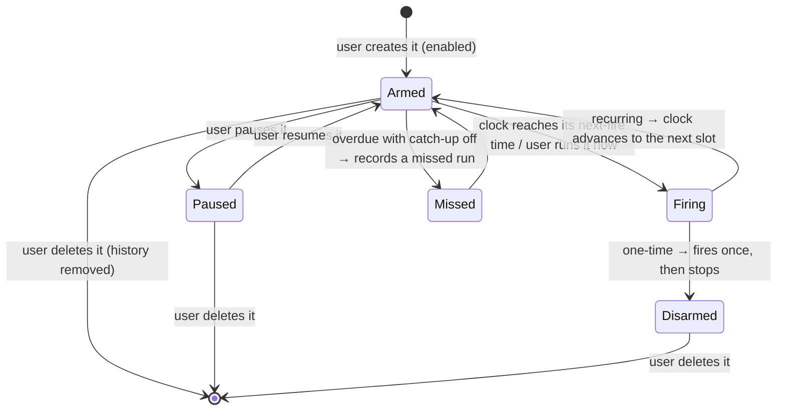

# Schedules — Overview

> Vynel's clock: the recurring and one-time triggers that wake the assistant on a schedule — a morning briefing, a weekly summary, an email watch, a plain reminder — run the work, and can hand the result to a connected channel.
>
> **Status:** shipped · **Depends on:** [db](../db/overview.md) (kernel), [contracts](../contracts/overview.md), [providers](../providers/overview.md), [errors](../errors/overview.md) · **Code map:** [structure.md](./structure.md)

## Purpose

Schedules is what lets Vynel act on its own initiative instead of only when spoken to. A user sets up a **schedule** — "brief me every weekday at 9am," "summarise the week each Friday," "remind me in fifteen minutes" — and from then on a background clock fires it at the right moment, runs a fresh assistant turn against the workspace, and (optionally) delivers the result to a channel like Telegram.

What makes it a product surface rather than plumbing is that the user builds and owns each schedule directly: they pick a **template**, name it, set when it runs and where the answer goes, pause or resume it, run it once on demand, and read back a history of every past firing. The assistant does not create schedules for itself — schedules are the user's standing instructions to the assistant, kept in a place the user can open and edit.

The second idea is the **reminder** shortcut. Most schedules run a full AI turn, but a reminder is meant to arrive exactly as the user wrote it — no model rewriting it. That one template skips the assistant entirely and delivers the rendered text verbatim, so "attend your 2pm meeting" reaches you as those words, not a paraphrase.

## What it can do

- **Create a schedule** from a template or as a custom one: choose recurring (fires on a repeating clock) or one-time (fires once at an absolute moment, then disarms), set the timezone, edit the prompt, choose whether the answer stays in chat or also goes to a channel.
- **Browse the template catalog** — the built-in starting points (morning briefing, weekly summary, email watch, reminder, custom), each with sensible defaults.
- **List schedules** — everything in one workspace, or everything a user owns across all their workspaces and the global (no-workspace) scope.
- **Edit a schedule** — its name, clock, timezone, prompt, destination, catch-up behaviour, and approval timeout.
- **Pause and resume** a schedule — a paused one is skipped by the clock and cannot be run manually until resumed.
- **Run now** — fire a schedule immediately on demand, without disturbing its next scheduled run.
- **Delete a schedule** — a hard delete that also removes its whole run history.
- **Read the run history** — every firing recorded as a run, newest first, with its outcome and any error message.
- *(background)* **Fire on the clock** — a once-a-minute sweep claims each due schedule, runs its assistant turn (or delivers a verbatim reminder), records the run, and emits a delivery event when the destination is a channel; overdue slots are either caught up once or recorded as missed, never both.

## Responsibilities

**Owns** — the schedule itself and its firing: the schedule record (its clock, prompt, timezone, destination, scope, enabled flag, and cached next-fire time) and the run record for every firing; the full create / list / edit / pause / delete / run-now surface; prompt-placeholder rendering; the channel-message formatting; the once-a-minute claim-and-fire sweep with its atomic anti-double-fire claim; catch-up-versus-missed handling; and the single delivery event it publishes through the outbox when a firing is destined for a channel.

**Does not own** —
- **the assistant turn a firing runs** — that belongs to [chat](../chat/overview.md); schedules never calls it directly, the app-side service injects it into the fire path;
- **the tool surface and capability prompt** a fired turn is equipped with — composed by [mcp](../_apps/mcp/overview.md) and [capabilities](../capabilities/overview.md) and likewise injected, so this leaf imports neither;
- **actually delivering the result to Telegram or another channel** — [channels](../channels/overview.md) consumes the delivery event and sends the message;
- **the once-a-minute timer that drives the sweep** — the [local-api](../_apps/local-api/overview.md) app owns the interval and binds the injected fire dependencies (the desktop runs no separate worker);
- **the underlying AI runtime** — reached only through [providers](../providers/overview.md);
- **the user and workspace rows** a firing reads for its prompt — the [db](../db/overview.md) kernel;
- **the shared template definitions** — those constants live in [contracts](../contracts/overview.md) so the web panel and the api agree on them; this leaf just serves and applies them.

## Concepts & vocabulary

| Term | Meaning |
|---|---|
| **Schedule** | One standing trigger a user owns: a clock (or a single future moment), a prompt, a timezone, a destination, and an on/off flag. |
| **Recurring vs. one-time** | A recurring schedule fires on a repeating clock; a one-time schedule fires once at a fixed instant, then disarms and is never re-listed. |
| **Template** | A named starting point with defaults: *morning-briefing*, *weekly-summary*, *email-watch*, *reminder*, *custom*. |
| **Verbatim reminder** | The reminder template's behaviour: fire without an AI turn and deliver the rendered text exactly as written. |
| **Destination** | Where the result goes: *chat-only* (it lives in the chat session) or *chat-and-channel* (it is also delivered to a connected channel). |
| **Scope** | A schedule belongs to a user and optionally a workspace; with no workspace it is a **global** user-level schedule. |
| **Run** | One recorded firing of a schedule. Its outcome is *pending*, *running*, *completed*, *failed*, or *missed*. |
| **Trigger kind** | Why a run happened: *poll* (fired on time by the sweep), *catchup* (an overdue slot fired late), or *manual* (the user hit "Run now"). |
| **Catch-up** | Whether an overdue slot (Vynel was offline) is fired late or instead recorded as a single missed run. |
| **Next-fire time** | The cached instant the schedule is next due — advanced only by the sweep's claim, so a manual run never skips the next scheduled one. |
| **Placeholders** | `{{...}}` markers in a prompt (the user's display name, the workspace, the current day/date) resolved against live rows at fire time; unknown ones pass through untouched. |

## Rules & invariants

- **A schedule belongs to exactly one user, and optionally one workspace.** Every single-schedule operation is ownership-guarded — a schedule you don't own answers as a plain not-found, never a leak that it exists. A null workspace means the schedule is global.
- **The clock is the only writer of the next-fire time.** Firing — whether by the sweep or by "Run now" — never advances it; only the sweep's claim does. That is why a manual run can never skip an upcoming scheduled one.
- **A firing is claimed before it runs.** The sweep advances the next-fire time atomically, only if it still matches what it observed, so two overlapping sweeps can never fire the same slot twice.
- **An overdue slot fires once or is recorded once — never both, never a flood.** If Vynel was offline through several missed slots, catch-up either fires the observed slot a single time or records a single missed run, and the clock jumps past the whole overdue window in one step.
- **Every firing's terminal writes co-commit with its delivery event.** The completed run, the updated last-fired stamp, and the outbox event land in one transaction, or none of them do. The AI turn itself runs outside that transaction.
- **The delivery event fires only on a clean, channel-bound firing.** It publishes only when the firing succeeded, the destination is chat-and-channel, a channel is set, and there is either a chat session or a verbatim reminder to deliver.
- **A paused schedule does nothing.** The sweep skips it, and "Run now" is refused until it is resumed.
- **Deleting a schedule deletes its history.** There is no soft-delete; the hard delete cascades to every run of that schedule.
- **A one-time schedule has no clock.** It fires at its fixed moment and disarms; an attempt to give it a repeating clock is rejected rather than silently accepted.
- **A firing runs a fresh session with pre-approved autonomy.** Every firing starts a new session (it never resumes an old one); it runs with approvals bypassed except that a feature's declared mutating actions still surface an approval card.

## Lifecycle

## Where it sits in the bigger picture

Schedules is Vynel's initiative engine, and it leans on almost every conversational part of the system without importing any of them. When a schedule fires, the [local-api](../_apps/local-api/overview.md) app — which owns the once-a-minute timer — hands the leaf a bound assistant turn from [chat](../chat/overview.md), a tool surface from [mcp](../_apps/mcp/overview.md), and a capability prompt from [capabilities](../capabilities/overview.md), all injected so the leaf itself stays a testable island over the [db](../db/overview.md) kernel. The turn reaches the model only through [providers](../providers/overview.md). When the result is meant for a channel, schedules announces a single delivery event and [channels](../channels/overview.md) picks it up and sends the message to Telegram or wherever the user pointed it. The shared template catalog lives in [contracts](../contracts/overview.md) so the [local-web](../_apps/local-web/overview.md) panel and the api describe schedules the same way. In short: schedules decides *when* and *what to say*; the rest of Vynel decides *how to run it* and *where it lands*.

---
*Mapped from the code on disk, 2026-07-14. If you change this module, update this file and [structure.md](./structure.md).*
