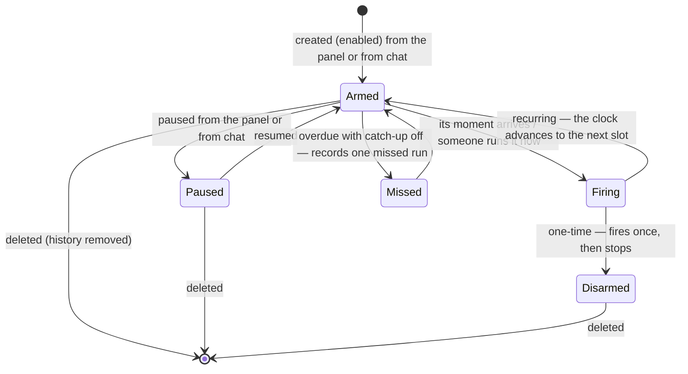

# Schedules — Overview

> Vynel's clock: the standing instructions that wake the assistant at a chosen moment — a morning briefing, a weekly summary, a reminder in twenty minutes — and carry them out **in the open, inside the conversation they belong to**.
>
> **Status:** shipped · **Depends on:** [db](../_platform/database/overview.md) (kernel), [contracts](../_platform/contracts-and-sdk/overview.md), [providers](../providers/overview.md), [errors](../_platform/primitives/overview.md) · **Code map:** [structure.md](./structure.md)

## Purpose

Schedules is what lets Vynel act on its own initiative instead of only when spoken to. A **schedule** is a standing instruction the user sets up once — a repeating clock or a single future moment, some text to carry out, a timezone, and where the answer should go — and from then on a background sweep fires it at the right time and runs the work.

Three ideas shape how a firing feels today.

**A firing happens in the open.** A workspace schedule runs as a turn on that workspace's **continuing conversation** — the very thread the user chats in — so if the thread is open on screen the fired turn streams into it live, and it shows up on the working rail as that named conversation. A global schedule runs the same way on the user's global conversation. This deliberately reverses the original design, where every firing started a hidden fresh session the user never saw: a scheduled task that runs invisibly reads as a broken feature.

**The scheduler speaks, not the user.** A fired prompt is never dressed up as the user typing. What the model reads is framed plainly — Vynel's scheduler is firing *this* schedule *now*, it is the instruction the user set up earlier, carry it out at once — and what the transcript keeps is the plain prompt as a quiet notice authored **"Schedule · \<name\>"**. That framing is what makes a reminder arrive: the model says it in its reply on the spot, and never invents a timer, a sleep, or a question back about what the user meant. (An unframed fire did exactly that before this landed.)

**A plain reminder skips the AI entirely.** Most schedules run a full assistant turn; the reminder template does not. Its text is delivered word for word, so "attend your 2pm meeting" reaches the user as those words rather than a model's paraphrase of them.

What makes this a product surface rather than plumbing is that the user owns each schedule directly — they pick a template, name it, set when it runs and where the answer lands, pause or resume it. Since 2026-08-20 the assistant can also create and manage schedules **on the user's behalf when asked in chat**, on both the workspace and the global level, so "remind me in twenty minutes" becomes a real schedule row instead of an improvised wait.

## What it can do

- **Create a schedule** — from the schedules panel on either level, *or* just by asking in chat: the assistant has create / update / enable / disable tools on both the workspace surfaces and the global ones (the global create picks the scope explicitly — global, or a named workspace). Those tools raise an approval card when the conversation is in ask mode and run straight through in the everyday automatic mode.
- **Choose recurring or one-time** — a repeating clock, or a single absolute moment that disarms after it fires.
- **Browse the template catalogue** — morning briefing, weekly summary, email watch, reminder, custom — each with sensible defaults the user can override.
- **List schedules** — one workspace's, or everything a user owns across every workspace plus the global scope; readable both from the panel and by the assistant.
- **Edit a schedule** — its name, clock, timezone, prompt text, destination, catch-up behaviour and approval timeout.
- **Pause and resume** — a paused schedule is skipped by the sweep and refuses to be run by hand until it is resumed.
- **Run now** — fire immediately, without disturbing the next scheduled run. Deliberately *not* a chat tool (it drives a whole turn rather than editing a row); it lives only on Vynel's own app surface, and today's panel does not yet show a button for it.
- **Delete a schedule** — a hard delete that takes its whole run history with it. Also never a chat tool, and likewise unbuttoned in today's panel.
- **Read the run history** — every firing recorded as a run, newest first, with its outcome and any error; the assistant can read it from a workspace conversation (a global one has no tool for it), and the panel does not display it yet.
- *(background)* **Fire on the clock** — a once-a-minute sweep lists what is due, claims each slot, and runs several firings at once; it records every run, hands a channel-bound result to the channel, and makes sure a failure — or a slot missed while Vynel was off — is told to the user rather than left on a row nobody reads.

## Responsibilities

**Owns** — the schedule itself and its firing: the schedule record (its clock or single moment, prompt, timezone, destination, scope and on/off flag, plus the cached next-fire time) and a run record for every firing; the create / list / edit / pause / delete / run-now surface; the placeholder rendering in a prompt and the formatting of a channel message; the **fire frame** a firing is presented under (the scheduler-is-firing framing for the model and the "Schedule · \<name\>" author line for the transcript); the once-a-minute sweep with its atomic claim, its catch-up-versus-missed decision and its bound on how many firings run at once; and the three outbox events it publishes — one when a channel-bound firing succeeds, one when any firing fails, one when an overdue slot is recorded as missed.

**Does not own** —
- **the assistant turn a firing runs** — that belongs to [chat](../chat/overview.md) and [session](../session/overview.md); schedules never calls them, the app wiring injects a ready-made turn;
- **resuming the continuing conversation, the single-writer lock and the working-time cap** — the [session](../session/overview.md) machinery every background turn shares, applied around the injected turn;
- **the wording of the fire framing** — the instruction text lives in [instructions](../instructions/overview.md) and is handed in;
- **the tool surface and capability prompt** a fired turn is equipped with — composed by [mcp](../_apps/mcp/overview.md) and [capabilities](../capabilities/overview.md) and likewise injected;
- **delivering a result to Telegram or another channel** — [channels](../channels/overview.md) consumes the success event and sends the message;
- **telling the user about a failed or missed firing** — [orchestration](../orchestration/overview.md) turns the failure event into a report on the user's global conversation, and the missed event into one on that schedule's own conversation;
- **the once-a-minute timer and all of the injection above** — the [local-api](../_apps/local-api/overview.md) app owns it (the desktop runs no separate worker);
- **the underlying AI runtime** — reached only through [providers](../providers/overview.md);
- **the user and workspace rows** a firing reads for its prompt — the [db](../_platform/database/overview.md) kernel;
- **the shared template catalogue** — those definitions live in [contracts](../_platform/contracts-and-sdk/overview.md) so the panel and the api agree on them.

## Concepts & vocabulary

| Term | Meaning |
|---|---|
| **Schedule** | One standing instruction a user owns: a clock (or a single future moment), a prompt, a timezone, a destination, and an on/off flag. |
| **Recurring vs. one-time** | A recurring schedule fires on a repeating clock; a one-time schedule fires once at a fixed instant, then disarms and is never listed as due again. |
| **Template** | A named starting point with defaults: *morning briefing*, *weekly summary*, *email watch*, *reminder*, *custom*. |
| **Verbatim reminder** | The reminder template's behaviour: fire without an AI turn and deliver the rendered text exactly as written. |
| **Fire frame** | How a firing is presented: the model is told the scheduler is firing this schedule now (not the user typing), while the transcript keeps the plain prompt as a quiet notice authored "Schedule · \<name\>". |
| **Continuing conversation** | The workspace's (or the user's global) ongoing thread — the one a fired turn resumes and streams into, rather than a fresh hidden session. |
| **Destination** | Where the result goes: *chat-only* (it stays in the conversation) or *chat-and-channel* (it is also pushed to a connected channel). |
| **Scope** | A schedule belongs to a user and optionally a workspace; with no workspace it is a **global** schedule. |
| **Run** | One recorded firing. Its outcome is *pending*, *running*, *completed*, *failed* or *missed*. |
| **Trigger kind** | Why a run happened: *poll* (fired on time), *catchup* (an overdue slot fired late), or *manual* ("Run now"). |
| **Catch-up** | Whether an overdue slot (Vynel was offline) is fired late or instead recorded as a single missed run — which is then announced, not left silent. |
| **Next-fire time** | The cached instant a schedule is next due — advanced only by the sweep's claim, so a manual run never eats the next scheduled one. |
| **Placeholders** | Markers in a prompt (the user's display name, the workspace, the current day or date) resolved against live rows at fire time; unknown ones pass through untouched. |

## Rules & invariants

- **A firing runs where the conversation lives.** A workspace schedule resumes that workspace's continuing conversation; a global one runs on the user's global conversation. The very first firing in a workspace that has no conversation yet starts fresh and *becomes* that conversation, exactly as a first chat message would.
- **A fired prompt is the scheduler speaking, never the user.** The stored message is a quiet system notice attributed to the schedule; only the model-facing copy carries the framing, and the framing itself is never stored.
- **A reminder is delivered now, never re-scheduled.** The framing forbids timers, sleeping and asking the user what they meant — an instruction that reads like a reminder is said in the reply on the spot; a verbatim reminder is pushed out as written, with no turn at all.
- **A firing inherits the settings of the conversation it runs on.** Its mode, model, thinking effort and autopilot come from that conversation's own row, falling back to Vynel's standing defaults; the model choice is trimmed to fit if the conversation has grown too long for it. Nothing about a firing is hard-coded to run unattended, and a feature's declared mutating actions still raise an approval card even when the conversation is set to act freely.
- **A firing takes the same single-writer lock as every other writer of that conversation.** A workspace whose thread is busy with a user turn or a delegated job makes the firing wait its turn in order — it never writes alongside them.
- **A firing is bounded like other background work.** It runs under the same working-time cap delegated turns use; the clock pauses while an approval card waits on a human, and on expiry the turn is interrupted and the run is recorded as failed.
- **Several schedules fire at once, but one schedule never overlaps itself.** A small process-wide allowance (three at a time by default, shared with background delegated work) admits firings and queues the rest in order; a schedule that already has a firing queued or running is left for a later minute rather than stacking copies of itself.
- **A schedule belongs to exactly one user, and optionally one workspace.** Every single-schedule operation is ownership-guarded — a schedule you don't own answers as a plain not-found, never a hint that it exists.
- **The clock is the only writer of the next-fire time.** Firing never advances it; only the sweep's claim does. That is why "Run now" can never eat an upcoming scheduled run.
- **A slot is claimed before it runs, by the worker about to run it.** The claim advances the next-fire time only if it still matches what the sweep observed, so overlapping sweeps can never fire one slot twice — and a crash mid-batch loses nothing that was still waiting.
- **An overdue slot fires once or is recorded once — never both, never a flood.** If Vynel was offline through several missed slots, catch-up either fires the observed slot a single time or records a single missed run, and the clock jumps past the whole overdue window in one step.
- **Every firing's terminal writes co-commit with its event.** The finished run, the updated last-fired stamp and the outbox event land in one transaction, or none of them do. The assistant turn itself runs outside that transaction.
- **A firing that fails is reported, and so is a slot that was missed.** Every failure — including one that ran out of time — publishes an event that becomes a spoken report on the user's global conversation, because a run record has no screen of its own. An overdue slot with catch-up switched off publishes its own event alongside the missed run: the user hears about it on that schedule's own conversation (its workspace's, or the global one), and on its channel too when it has one.
- **The channel delivery event publishes only on a clean, channel-bound firing.** It needs success, a chat-and-channel destination, a channel, and either a conversation the turn ran on or a verbatim reminder to deliver.
- **A paused schedule does nothing.** The sweep skips it, and "Run now" is refused until it is resumed.
- **Deleting a schedule deletes its history.** There is no soft delete; the hard delete cascades to every run.
- **A one-time schedule has no clock.** It fires at its fixed moment and disarms; trying to give it a repeating clock is rejected rather than quietly accepted.
- **A verbatim reminder lands in the conversation, whether or not it has a channel.** It runs no turn, so its words are written straight onto its destination conversation as a quiet notice authored "Schedule · \<name\>" — the reminder text word for word — and pushed to the channel as well when it has one. The one moment it still lands nowhere is a scope that has never held a conversation at all; that is logged rather than announced.

## Lifecycle

## Where it sits in the bigger picture

Schedules is Vynel's initiative engine, and it leans on nearly every conversational part of the system without importing any of them. The [local-api](../_apps/local-api/overview.md) app owns the once-a-minute timer and hands the module everything a firing needs: a turn from [chat](../chat/overview.md) wrapped in [session](../session/overview.md)'s continuing-conversation resume, single-writer lock and time cap; a tool surface from [mcp](../_apps/mcp/overview.md) and a capability prompt from [capabilities](../capabilities/overview.md); the framing words from [instructions](../instructions/overview.md). The turn reaches the model only through [providers](../providers/overview.md). When a result is bound for a channel, schedules announces it and [channels](../channels/overview.md) sends it to Telegram or wherever the user pointed it; when a firing fails, [orchestration](../orchestration/overview.md) turns that announcement into a report the user actually hears on their global conversation. The template catalogue lives in [contracts](../_platform/contracts-and-sdk/overview.md) so the [local-web](../_apps/local-web/overview.md) panel and the api describe schedules identically. In short: schedules decides *when*, *what to say* and *who is speaking*; the rest of Vynel decides *how the turn runs* and *where the answer lands*.

---
*Mapped from the code on disk, 2026-08-20 (schedule-gaps G1/G2 folded in 2026-08-21). If you change this module, update this file and [structure.md](./structure.md).*
