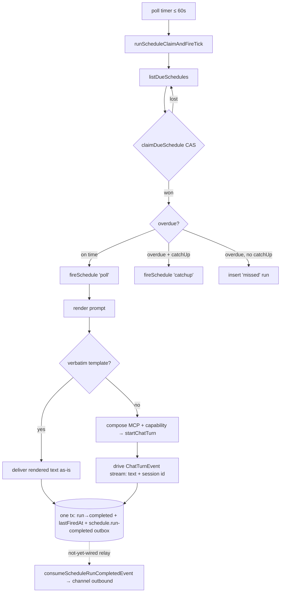
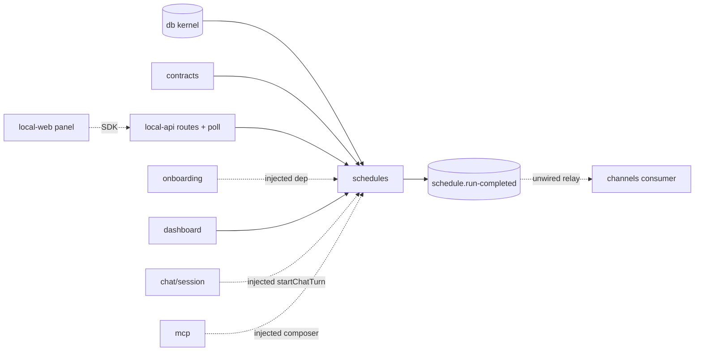

# Schedules — Structure

> The code map and connections for the schedules module. For the concepts behind it, see [overview.md](./overview.md).
>
> Folders touched: `packages/schedules/src/` · `apps/local-api/src/routes/schedules/` · `apps/local-api/src/services/` · `apps/local-api/src/sessions/` · `packages/contracts/src/schedules/` · `apps/local-web/src/{components,composables/schedules,utils}/`

Schedules is a vertical-slice leaf: the package owns its own `schema/`, `repositories/`, and operations (`lifecycle/` · `queries/` · `firing/` · `rendering/`) over the shared `@vynel/db` kernel. The chat turn a fired schedule runs, plus its MCP + capability composition, are **injected** as `FireScheduleDeps` — the leaf never imports the chat/session leaves or `@vynel/mcp` (invariant #2). Deps: `@vynel/contracts`, `@vynel/db`, `@vynel/errors`, `@vynel/providers`, `croner`, `drizzle-orm` (`packages/schedules/package.json`).

## File map

► = entry point.

| Path | Role |
|---|---|
| ► `packages/schedules/src/index.ts` | public barrel — the only production export (`.`); surfaces `Schedule`/`ScheduleRun` row types, the CRUD/render/query ops, the fire path, and the `schedule.run-completed` event constant. Repositories stay internal |
| `packages/schedules/src/schedules-types.ts` | `StructuralLogger` + the `FireScheduleDeps` contract — `startChatTurn`, `composeWorkspaceMcpServers`, `composeSessionCapabilities` declared *structurally* so the leaf imports no chat/mcp code |
| `packages/schedules/src/schedules-events.ts` | the one published event: `SCHEDULE_RUN_COMPLETED_EVENT_TYPE` (`'schedule.run-completed'`) + `ScheduleRunCompletedPayload` |
| `packages/schedules/src/extract-error-message.ts` | pull a message off an unknown throw — used on the run row + the poll log (errors never swallowed) |
| `packages/schedules/src/schema/schedules.ts` | `schedules` table + `ScheduleTemplateKind` / `ScheduleDestinationKind` / `ScheduleKind` types; NO `deletedAt` (hard-delete, D11) |
| `packages/schedules/src/schema/schedule-runs.ts` | `schedule_runs` table + `ScheduleRunStatus` / `ScheduleRunTriggerKind` types |
| `packages/schedules/src/schema/index.ts` | schema barrel — re-exports both tables for the drizzle config glob + parity guard |
| `packages/schedules/src/repositories/schedules.ts` | schedules repo — due-list / list-per-workspace / list-per-user / the atomic `claimDueSchedule` CAS / find / insert / update / hard-delete |
| `packages/schedules/src/repositories/schedule-runs.ts` | runs repo — insert / update / get-or-throw / keyset history list |
| `packages/schedules/src/repositories/index.ts` | repo barrel + row/union type re-exports (barrel and per-file subpath both allowed) |
| `packages/schedules/src/lifecycle/create-schedule.ts` | create from a template (or custom); computes first `nextScheduledFireAt` via croner; one-time (`fireAt`) vs recurring (cron); throws `ValidationError` on bad cron / missing channel / past fireAt |
| `packages/schedules/src/lifecycle/update-schedule.ts` | owner-scoped patch; recomputes next-fire on cron/tz change (recurring only); re-validates the channel requirement; rejects a cron on a one-time row |
| `packages/schedules/src/lifecycle/set-schedule-enabled.ts` | owner-scoped `isEnabled` toggle (pause/resume) |
| `packages/schedules/src/lifecycle/delete-schedule.ts` | owner-scoped hard-delete (cascades to `schedule_runs`; no soft-delete) |
| `packages/schedules/src/firing/fire-schedule.ts` | *(async)* ► the executor — renders the prompt, runs the LLM turn (or delivers a verbatim template), co-commits the terminal writes + optional outbox event in one tx |
| `packages/schedules/src/firing/manual-fire-schedule.ts` | *(async)* "Run now" — owner check, 409 if paused, fires with `triggerKind: 'manual'` |
| `packages/schedules/src/firing/run-schedule-claim-and-fire-tick.ts` | *(async)* ► the per-minute poll body — atomic claim per due schedule, then fire (poll / catchup) or record one `missed` run |
| `packages/schedules/src/queries/list-schedules.ts` | workspace-scoped list |
| `packages/schedules/src/queries/list-schedules-for-user.ts` | user-scoped list — every schedule the user owns, global + workspace |
| `packages/schedules/src/queries/list-schedule-runs.ts` | owner-scoped run history; assembles the keyset cursor from flat query params |
| `packages/schedules/src/queries/list-schedule-templates.ts` | returns the built-in template catalog (pure) |
| `packages/schedules/src/rendering/render-schedule-prompt.ts` | resolve `{{user.*}}` / `{{workspace.*}}` / `{{now.*}}` placeholders against the live rows; unknowns pass through |
| `packages/schedules/src/rendering/render-schedule-channel-message.ts` | build the channel body — `📅 <name> • <time>\n\n<text>` (header baked in; channels enqueues verbatim) |
| `packages/schedules/src/test-support.ts` | exported `./test-support` subpath — seed helpers + `stubFireDeps` (no-op `startChatTurn`, sentinel MCP/capability composition) for route/integration tests |
| ► `apps/local-api/src/routes/schedules/index.ts` | workspace-scoped HTTP entry — 9 routes under `/workspaces/:workspaceId/schedules`, 3 exposed as MCP tools |
| `apps/local-api/src/routes/schedules/user-scoped.ts` | user-scoped HTTP entry — the `/schedules` twin (global + workspace), 8 routes, 1 MCP tool |
| `apps/local-api/src/routes/schedules/{schemas,serializers}.ts` | Zod request/response schemas (incl. the discriminated `scope` create) · row→ISO serializers |
| `apps/local-api/src/services/schedules-service.ts` | the in-process per-minute poll service — started at boot, stopped on shutdown |
| `apps/local-api/src/sessions/build-schedule-fire-deps.ts` | the api-edge composition point — binds `startChatTurn` + the MCP/capability composition into `FireScheduleDeps` (dynamic `@vynel/mcp` import) |
| `apps/local-web/src/components/sections/SchedulesSection.vue` | the panel — schedule list, driven by a `scope` prop (global / workspace) |
| `apps/local-web/src/components/sections/CreateScheduleDialog.vue` | create form — cadence → cron or one-time preset → fireAt |
| `apps/local-web/src/components/onboarding/steps/ScheduleStep.vue` | optional onboarding step — offer a first schedule |
| `apps/local-web/src/composables/schedules/*.ts` | 3 vue-query composables — list / create / toggle |
| `apps/local-web/src/utils/schedule-cadence.ts` | pure cron↔human helpers — build a cron from a cadence, presets → fire instants, describe a row in words |

## Data & persistence

Both tables live in `packages/schedules/src/schema/` and are registered in the kernel's `drizzle.sqlite.config.ts` (repo root, lines 46–47) — the schema-parity check enforces exactly-one-config registration. **No per-feature migration file:** the DDL is folded into the single baseline `packages/db/src/migrations-sqlite/0000_baseline.sql` (`schedules` L392–416, `schedule_runs` L417–431). Loose cross-domain refs are called out below — schedules holds **no** FK into channels or chat.

**`schedules`** — one row per scheduled trigger. **No `deletedAt`** — `deleteSchedule` hard-deletes and cascades (D11).

| Column | Type | Notes |
|---|---|---|
| `id` | id (PK) | UUID supplied by the core op |
| `userId` | id (FK, cascade) | → `users` — the tenant boundary |
| `workspaceId` | text (FK, cascade, null) | → `workspaces`; **NULL = GLOBAL scope** (no workspace). `text().references` since `id()` is NOT NULL by contract |
| `templateKind` | text | `morning-briefing` / `weekly-summary` / `email-watch` / `custom` / `reminder` |
| `scheduleKind` | text | `recurring` / `one-time` — the explicit discriminator (replaced the old `@once` sentinel) |
| `displayName` | text | user-editable; defaults to the template label |
| `cronExpression` | text (null) | 5-field cron; **NULL for a one-time** schedule |
| `timezone` | text | IANA tz (e.g. `America/Los_Angeles`) |
| `promptTemplate` | text | `{{placeholders}}` resolved at fire time |
| `destinationKind` | text | `chat-only` / `chat-and-channel` |
| `channelId` | text (null) | **loose ref** into channels — NO FK, schema not imported; a dangling id is dropped quietly (D7) |
| `catchUpOnMiss` | boolean | fire a missed slot late vs. record it `missed` |
| `isEnabled` | boolean | the poll skips a disabled row |
| `approvalTimeoutMsOverride` | integer (null) | optional per-schedule approval timeout |
| `lastFiredAt` | timestamp (null) | most recent successful fire |
| `nextScheduledFireAt` | timestamp (null) | cached; **advanced ONLY by the poll claim** (D12) |
| `createdAt` / `updatedAt` | timestamp | |

Indexes: `idx_schedules_user_workspace` `(userId, workspaceId)` · `idx_schedules_enabled_next_fire` `(isEnabled, nextScheduledFireAt)` (the poll's due-query).

**`schedule_runs`** — one row per firing (poll / catchup / manual / missed). Child table: **no `userId`** — scopes through `scheduleId → schedules.userId` (the channels child-table precedent). Cascade-deleted with its parent.

| Column | Type | Notes |
|---|---|---|
| `id` | id (PK) | |
| `scheduleId` | id (FK, cascade) | → `schedules` |
| `scheduledFireAt` | timestamp | when it was supposed to fire |
| `startedAt` | timestamp | when it actually started |
| `completedAt` | timestamp (null) | |
| `chatSessionId` | text (null) | **loose ref** into chat — NO FK, schema not imported; null for a verbatim reminder (no session) |
| `status` | text | `pending` / `running` / `completed` / `failed` / `missed` |
| `statusMessage` | text (null) | error / miss reason |
| `triggerKind` | text | `poll` / `catchup` / `manual` |

Indexes: `idx_schedule_runs_schedule_started` `(scheduleId, startedAt, id)` (the keyset history) · `idx_schedule_runs_status` `(status)`.

## Repositories

| Function (db-first) | Purpose |
|---|---|
| `listDueSchedules` | `isEnabled AND nextScheduledFireAt <= now` — the poll's input |
| `listSchedulesForWorkspace` | owner + workspace list, `createdAt ASC`, capped 50/100 |
| `listSchedulesForUser` | all a user's schedules (both scopes), `createdAt ASC`, capped 50/100 |
| `claimDueSchedule` | **guarded UPDATE** — advance `nextScheduledFireAt` only if it still equals the observed value; returns `changes > 0`. Atomic without an explicit tx; the sole writer that advances the next-fire time |
| `findScheduleById` | one row or `null` |
| `insertSchedule` / `updateSchedule` | create (id supplied) / patch |
| `hardDeleteSchedule` | delete (cascades to `schedule_runs`) |
| *(runs)* `insertScheduleRun`, `updateScheduleRun`, `getScheduleRunByIdOrThrow` | run-row lifecycle |
| *(runs)* `listScheduleRunsForSchedule` | keyset history on `(startedAt DESC, id DESC)` via drizzle operators (not raw-sql — a Date can't bind into a raw sql tuple in better-sqlite3), capped 50/100 |

## Core operations

| Operation | What it does | Key calls |
|---|---|---|
| `createSchedule` | template lookup → 400; timezone from input/user/UTC; one-time (`fireAt`, must be future) vs recurring (croner first-fire); channel required for `chat-and-channel`; one-time defaults to catch-up | `findScheduleTemplateByKind`, `Cron`, `insertSchedule` |
| `updateSchedule` | find→404 (also not-owned), reject a cron on a one-time row, recompute next-fire on cron/tz change (recurring only), re-validate channel | `findScheduleById`, `isOneTimeSchedule`, `Cron`, `updateSchedule` |
| `setScheduleEnabled` | owner check → toggle `isEnabled` | `findScheduleById`, `updateSchedule` |
| `deleteSchedule` | owner check → hard-delete (cascade) | `findScheduleById`, `hardDeleteSchedule` |
| `listSchedules` / `listSchedulesForUser` | workspace-scoped / user-scoped list | repos above |
| `listScheduleRuns` | owner check → keyset history | `findScheduleById`, `listScheduleRunsForSchedule` |
| `listScheduleTemplates` | return the built-in catalog (pure) | `SCHEDULE_TEMPLATE_CATALOG` |
| `renderSchedulePrompt` | resolve `{{user.*}}`/`{{workspace.*}}`/`{{now.*}}`; unknowns pass through; null workspace → `''` | `findUserById`, `findWorkspaceById` |
| `renderScheduleChannelMessage` | `📅 <name> • <time>\n\n<text>` (header baked in; tz-safe fallback to ISO) | `Intl.DateTimeFormat` |
| `fireSchedule` *(async)* | insert `pending` run → `running`; render prompt; **verbatim** template delivers as-is (no session) **else** compose MCP + capability + run `startChatTurn`, accumulate text, capture session id / error; **terminal tx**: run→`completed` + `lastFiredAt` + conditional `schedule.run-completed` outbox; on throw → run→`failed` | `renderSchedulePrompt`, `findWorkspaceById`, `deps.*`, `withTransaction`, `insertOutboxEvent` |
| `manualFireSchedule` *(async)* | owner→404, paused→409, fire `manual` | `findScheduleById`, `fireSchedule` |
| `runScheduleClaimAndFireTick` *(async)* | for each due schedule: compute next slot, `claimDueSchedule` (skip if lost), then fire `poll` (on time) / `catchup` (overdue + catchUp) / record one `missed` run | `listDueSchedules`, `claimDueSchedule`, `Cron`, `isOneTimeSchedule`, `fireSchedule` |

## HTTP surface

Two sibling surfaces, both mounted from `apps/local-api/src/app.ts` and both under `featureGate('schedules')` (the hub **entitlement** tier — 403 `feature_locked` when a live entitlement lacks the feature, permissive with no entitlement to read). No error mapping in the routes — typed `VynelError`s hit the global `onError`. `fire-now` builds its `FireScheduleDeps` via `buildScheduleFireDeps(c.var.appRequest, …)`, overridable by an injected `c.var.scheduleFireDeps` for tests.

**Workspace-scoped** — `/workspaces/:workspaceId/schedules` (`app.ts:140`), `...workspaceScoped` bundle:

| Method | Path | Purpose | MCP tool |
|---|---|---|---|
| GET | `/` | list the workspace's schedules | `list_schedules` (read) |
| GET | `/templates` | the built-in template catalog | `list_schedule_templates` (read) |
| POST | `/` | create (cron OR one-time `fireAt`) | — |
| PATCH | `/:scheduleId` | update (recomputes next-fire on cron change) | — |
| POST | `/:scheduleId/enable` | resume | — |
| POST | `/:scheduleId/disable` | pause | — |
| POST | `/:scheduleId/fire-now` | manual run (202; drives a headless turn) — **never** MCP-exposed | — |
| DELETE | `/:scheduleId` | hard-delete (204, cascades) | — |
| GET | `/:scheduleId/runs` | run history (keyset) | `list_schedule_runs` (read) |

**User-scoped** — `/schedules` (`app.ts:153`), `...userScoped` bundle. Spans both scopes (global + every workspace the user owns); id-ops authorize by `userId`, so a global (null-workspace) row is served directly. Same route set **minus `/templates`**; `POST /` takes a discriminated `scope` (`global` | `workspace` + required `workspaceId`). Only `GET /` is MCP-exposed (`list_my_schedules`); its `/:scheduleId/runs` carries no `x-mcp`.

## MCP surface

Schedules ships no descriptor of its own — its tools ride the route-derived `vynel` server: each route's `x-mcp` block is compiled by `scripts/src/generators/generate-mcp-tools.ts` into `apps/mcp/src/generated/api-tools.ts` (tool calls re-enter through the same HTTP routes, so agent and UI see one rulebook).

- **4 tools, all reads** — `list_schedules`, `list_schedule_templates`, `list_schedule_runs` (workspace surface) + `list_my_schedules` (user surface). **No mutating route is exposed — especially not `fire-now`** (it *drives* a turn, it is never an agent tool).
- **No per-workspace capability gate.** Unlike memory, schedules has **no** `capabilityGatedTools.schedules` in `apps/mcp/src/vynel-mcp-feature-descriptor.ts` (only a passing comment). The 4 reads are gated solely by the hub `featureGate('schedules')` entitlement, hit at HTTP re-entry.

## Background jobs

The desktop app runs no `apps/worker` — the poll runs **in-process in the API**: `startSchedulesService` (`apps/local-api/src/services/schedules-service.ts`), started at `server.ts:110` after `createApp(...)`, stopped on shutdown. It lives here (not a worker) because the fired turn is **MCP-intrinsic** — it needs the in-process Vynel MCP server built from the api's own `app.request`, which only exists in the api process (cadence alone is within a worker cron's reach; the MCP-intrinsic turn is what pins it here).

| Tick | Interval | Runs |
|---|---|---|
| schedule poll | every 60 s | `runScheduleClaimAndFireTick(db, fireDeps)` (errors caught + logged, never throw out of the timer) |

## Web surface

Everything speaks the generated SDK (`vynel.schedulesUser.*`) through vue-query; no Pinia store — cache keys under `["schedules", …]`, mutations invalidate the whole `["schedules"]` family.

- **Composables** (`apps/local-web/src/composables/schedules/`) — `use-schedules.ts` (the user-scoped list), `use-create-schedule.ts`, `use-toggle-schedule.ts` (pause/resume via the user-level PATCH, which covers both scopes).
- **Components** — `SchedulesSection.vue` (the list; a `scope` prop selects global vs. workspace), `CreateScheduleDialog.vue` (cadence → cron or one-time preset → `fireAt`, built on `schedule-cadence.ts`), the onboarding `ScheduleStep.vue`.
- **`schedule-cadence.ts`** — pure cron↔human vocabulary: `buildCronExpression`, `fireAtFromPreset`, `describeScheduleCadence` ("Daily at 9:00 AM" / "Once" / raw-cron fallback).
- **Mounting** — global surface: `GlobalChatView.vue` (section `schedules`, `<SchedulesSection :scope="{ kind: 'global' }" />`, locked card when the entitlement lacks it); workspace surface: `WorkspaceSectionPanel.vue` via `workspace-sections.ts`.

## Pipeline — "a due schedule fires a turn, and (would) reach a channel"

1. `apps/local-api/src/services/schedules-service.ts` fires the 60 s timer → `runScheduleClaimAndFireTick(db, fireDeps)` (`firing/run-schedule-claim-and-fire-tick.ts`).
2. `listDueSchedules` returns `isEnabled AND nextScheduledFireAt <= now`. For each, `claimDueSchedule` does the atomic CAS on `nextScheduledFireAt` — the loser skips (no double-fire). This is the **only** place next-fire advances (`run-schedule-claim-and-fire-tick.ts:45`).
3. Overdue (> 90 s past) with no catch-up → one `missed` run and move on; otherwise `fireSchedule` runs (`triggerKind` `poll` / `catchup` / `manual`).
4. `fireSchedule` (`firing/fire-schedule.ts`) inserts a `pending`→`running` run, renders the prompt (`render-schedule-prompt.ts`). A **verbatim** template delivers the rendered text as-is with no session; otherwise it composes the workspace MCP (`deps.composeWorkspaceMcpServers`) + capability prompt (`deps.composeSessionCapabilities`) and drives `deps.startChatTurn` — a fresh session, `permissionMode: 'bypass-with-behavior-gate'` (D10) — reading `session-created` / `text-chunk` / `session-errored` off the stream.
5. Terminal writes co-commit in **one** `withTransaction` (`fire-schedule.ts:184`): run→`completed`, `lastFiredAt`, and — only on success + `chat-and-channel` + a set `channelId` + (a known `chatSessionId` OR a verbatim template) — an `insertOutboxEvent('schedule.run-completed')`. `nextScheduledFireAt` is never touched here.
6. **Would-be delivery (not wired):** `packages/channels/src/delivery/consume-schedule-run-completed-event.ts` enqueues a `scheduled-message` outbound row to the channel's owner — but nothing invokes it in a running process (see Connections / Gotchas).

## Connections

**Summary:** schedules is a **read-side + injected-dep leaf** — its ops are called by the api routes, the boot poll service, onboarding (injected), and the dashboard; its fire path depends on the chat turn + MCP/capability composition only through the injected `FireScheduleDeps`, never a direct leaf import. It publishes one lifecycle event; its consumer lives in channels but is **not registered**.

| Unit | Direction | Mechanism | What crosses |
|---|---|---|---|
| db kernel (`@vynel/db`) | out | import | `Database`, `withTransaction`, `users`/`workspaces` FKs, `findUserById`/`findWorkspaceById`, `insertOutboxEvent` |
| [contracts](../_platform/contracts-and-sdk/overview.md) | out | import | the template catalog, `isOneTimeSchedule`, the wire types (`schedule-http`), `ChatTurnEvent` |
| providers (`@vynel/providers`) | out | import | `DEFAULT_PROVIDER_ID` |
| errors | out | import | `NotFoundError`, `ValidationError`, `ConflictError` |
| [chat / session](../session/overview.md) | out (loose) | **injected dep + loose ids** | `startChatTurn` supplied via `FireScheduleDeps`; `chatSessionId` stored as loose `text()` — no import |
| [mcp](../_apps/mcp/overview.md) | out (loose) | **injected dep** | `composeWorkspaceMcpServers` / capability composition supplied via `FireScheduleDeps` (bound in `build-schedule-fire-deps.ts`, dynamic `@vynel/mcp` import) |
| local-api routes | in | import | the CRUD/list/fire ops; `workspaceScoped`/`userScoped` + `featureGate` enforce access |
| local-api poll service | in | import | `runScheduleClaimAndFireTick` on the 60 s tick |
| [onboarding](../onboarding/overview.md) | in | **injected dep** | `createSchedule` bound into `OnboardingDeps` (`routes/onboarding/build-onboarding-deps.ts`) — the leaf never imports `@vynel/schedules` |
| [dashboard](../dashboard/overview.md) | in | import | `listSchedulesForUser` for the home summary |
| [channels](../channels/overview.md) | both (loose) | outbox event + loose `channelId` | schedules publishes `schedule.run-completed`; channels' consumer reacts (see below); `channelId` is a loose ref |
| local-web | in | SDK | the panel calls list / create / toggle |

**Events published:** `schedule.run-completed` — co-committed in `fireSchedule`'s terminal tx, conditionally (success + `chat-and-channel` + `channelId` + (`chatSessionId` OR verbatim)). Payload matches channels' `ScheduleRunCompletedPayload` field-for-field; `renderedOutput` carries the baked-in `📅` header.

**Events consumed by schedules:** none.

> **Consumer wiring drift (as-built):** `consumeScheduleRunCompletedEvent` is exported from `@vynel/channels` and covered by `apps/local-api/src/services/schedule-channel-delivery.integration.test.ts` (which calls it directly), but the generic relay is **not running**: `OUTBOX_CONSUMERS` (`packages/core/src/_shared/outbox-consumer-registry.ts`) is `{}`, and no app calls `dispatchOutboxEvents`. So a fired `chat-and-channel` schedule writes the outbox event but nothing yet drains it to the channel. Registering the consumer + starting the dispatch loop is the remaining wire-up.

## Config & gotchas

- **The claim is the sole `nextScheduledFireAt` writer.** `fireSchedule` never advances it (D12); only `claimDueSchedule` does — atomically, past the whole overdue window in one step. A manual fire therefore never skips the next scheduled run.
- **Overdue = > 90 s past** (`run-schedule-claim-and-fire-tick.ts:106`, ~1.5 poll intervals). An overdue slot fires **once** as `catchup` (if `catchUpOnMiss`) or records **one** `missed` run — never both, never a flood. The discriminator is overdue-ness, not fire history.
- **One-time schedules disarm to null.** `isOneTimeSchedule` → the next-fire computation returns `null`; the row then fails the `nextScheduledFireAt <= now` filter and is never re-listed. An invalid cron also claims to null (stops firing until edited).
- **The verbatim gate is `(chatSessionId || deliversVerbatim)`** — do NOT tighten it back to `&& chatSessionId`, or every verbatim reminder (which has no session) silently stops delivering to its channel (`fire-schedule.ts:190`).
- **A global (null-workspace) non-verbatim turn fails cleanly.** A workspace-scoped turn needs a workspace; a null one surfaces the same `NotFoundError` as a missing one → the run is marked `failed`. The natural global case is a verbatim reminder, which needs no workspace.
- **`fireSchedule` never throws to its caller** — a failure marks the run `failed`, logs a warn, and returns the row. The poll and `fire-now` both get a run row back, not an exception. (`manualFireSchedule`'s 404/409 are thrown *before* `fireSchedule`.)
- **Fired turns run under `permissionMode: 'bypass-with-behavior-gate'`** (D10) with a fresh session (`resumeSessionId` omitted, D3); a feature's declared `mutatingToolNames` still card even under bypass.
- **The runtime↔wire cast is deliberate.** `build-schedule-fire-deps.ts:56` casts the session runtime's `startChatTurn` (Date timestamps, `ChatSession` rows) to `FireScheduleDeps['startChatTurn']` (the contracts wire union); the fire path reads only `session.id` / `textDelta` / `errorMessage`, present on both — documented as runtime-safe.
- **`featureGate` covers HTTP only** (`middleware/feature-gate.ts`, known limitation): a pro→basic downgrade does **not** stop the boot poll's already-scheduled fires (they run via direct package calls outside HTTP), and it 403s the whole subtree including disable/delete. Pausing background execution per-entitlement is a deliberate follow-on.
- **No soft-delete.** `deleteSchedule` hard-deletes and cascades to `schedule_runs` (D11); there is no `deletedAt` and no purge job — the run history is bounded by keyset pagination instead.

---
*Mapped from the code on disk, 2026-07-14. If you change this module, update this file and [overview.md](./overview.md).*
