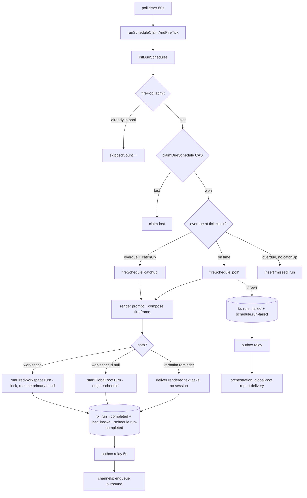
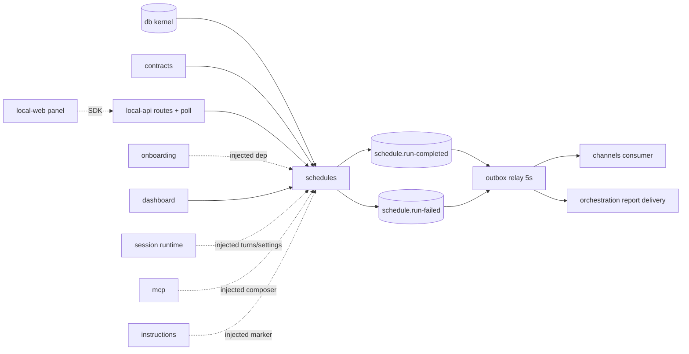

# Schedules — Structure

> The code map and connections for the schedules module. For the concepts behind it, see [overview.md](./overview.md).
>
> Folders touched: `packages/schedules/src/` · `apps/local-api/src/routes/schedules/` · `apps/local-api/src/services/` · `apps/local-api/src/sessions/` · `packages/contracts/src/schedules/` · `packages/instructions/session-instructions/` · `apps/local-web/src/{components,composables/schedules,utils}/`

Schedules is a vertical-slice leaf: the package owns its own `schema/`, `repositories/`, and operations (`lifecycle/` · `queries/` · `firing/` · `rendering/`) over the shared `@vynel/db` kernel. Every turn the fire path runs — the workspace turn, the global-root turn, the settings resolution, the MCP + capability composition, and the fire-marker renderer — is **injected** as `FireScheduleDeps`; the leaf never imports the session/chat/mcp/instructions siblings (invariant #2). Deps: `@vynel/contracts`, `@vynel/db`, `@vynel/errors`, `@vynel/providers`, `croner`, `drizzle-orm` (`packages/schedules/package.json`).

## File map

► = entry point.

| Path | Role |
|---|---|
| ► `packages/schedules/src/index.ts` | public barrel — the only production export (`.`); surfaces `Schedule`/`ScheduleRun` row types, the CRUD/render/query ops, the fire path, `ScheduleFirePool`, and the `schedule.run-completed` event constant. Repositories stay internal |
| `packages/schedules/src/schedules-types.ts` | `StructuralLogger` · `FiredTurnSettings` · `ScheduleFireFrame` · the `FireScheduleDeps` contract — `startChatTurn`, `startGlobalRootTurn`, `renderScheduleFireMarker`, `resolveWorkspaceTurnSettings`, `composeWorkspaceMcpServers`, `composeSessionCapabilities`, all declared *structurally* |
| `packages/schedules/src/schedules-events.ts` | the two published events: `SCHEDULE_RUN_COMPLETED_EVENT_TYPE` + `SCHEDULE_RUN_FAILED_EVENT_TYPE`, with their payload interfaces |
| `packages/schedules/src/extract-error-message.ts` | pull a message off an unknown throw — used on the run row, the failed event, and the poll log (errors never swallowed) |
| `packages/schedules/src/schema/schedules.ts` | `schedules` table + `ScheduleTemplateKind` / `ScheduleDestinationKind` / `ScheduleKind` types; NO `deletedAt` (hard-delete, D11) |
| `packages/schedules/src/schema/schedule-runs.ts` | `schedule_runs` table + `ScheduleRunStatus` / `ScheduleRunTriggerKind` types |
| `packages/schedules/src/schema/index.ts` | schema barrel — re-exports both tables for the drizzle config glob + parity guard |
| `packages/schedules/src/repositories/schedules.ts` | schedules repo — due-list / list-per-workspace / list-per-user / the atomic `claimDueSchedule` CAS / find / insert / update / hard-delete |
| `packages/schedules/src/repositories/schedule-runs.ts` | runs repo — insert / update / get-or-throw / keyset history list |
| `packages/schedules/src/repositories/index.ts` | repo barrel + row/union type re-exports |
| `packages/schedules/src/lifecycle/create-schedule.ts` | create from a template (or custom); timezone from input → user profile → `UTC`; computes the first `nextScheduledFireAt` via croner; one-time (`fireAt`) vs recurring (cron); throws `ValidationError` on bad cron / missing channel / past `fireAt` |
| `packages/schedules/src/lifecycle/update-schedule.ts` | owner-scoped patch; recomputes next-fire on cron/tz change (recurring only); re-validates the channel requirement; rejects a cron on a one-time row |
| `packages/schedules/src/lifecycle/set-schedule-enabled.ts` | owner-scoped `isEnabled` toggle (pause/resume) |
| `packages/schedules/src/lifecycle/delete-schedule.ts` | owner-scoped hard-delete (cascades to `schedule_runs`; no soft-delete) |
| `packages/schedules/src/firing/fire-schedule.ts` | *(async)* ► the executor — renders the prompt, composes the **fire frame**, routes to one of three delivery paths, co-commits the terminal writes + the outbox event in one tx; on throw co-commits the `failed` run + `schedule.run-failed` |
| `packages/schedules/src/firing/run-fired-workspace-turn.ts` | *(async)* the WORKSPACE branch — resolves settings, composes MCP + capabilities, drives the injected `startChatTurn` stream, binds the session from `session-created` **or** `user-message-persisted` |
| `packages/schedules/src/firing/schedule-fire-pool.ts` | `ScheduleFirePool` — the process-wide concurrency bound + the one-fire-per-schedule rule (`admit` answers `null` when the schedule is already in the pool) |
| `packages/schedules/src/firing/manual-fire-schedule.ts` | *(async)* "Run now" — owner check (404), paused check (409), fires with `triggerKind: 'manual'` |
| `packages/schedules/src/firing/run-schedule-claim-and-fire-tick.ts` | *(async)* ► the per-minute poll body — list due, `firePool.admit` each, CAS-claim **inside** the worker, then fire (poll/catchup) or record one `missed` run; returns a `ScheduleTickSummary` |
| `packages/schedules/src/queries/list-schedules.ts` | workspace-scoped list |
| `packages/schedules/src/queries/list-schedules-for-user.ts` | user-scoped list — every schedule the user owns, global + workspace |
| `packages/schedules/src/queries/list-schedule-runs.ts` | owner-scoped run history; assembles the keyset cursor from flat query params |
| `packages/schedules/src/queries/list-schedule-templates.ts` | returns the built-in template catalog (pure) |
| `packages/schedules/src/rendering/render-schedule-prompt.ts` | resolve `{{user.*}}` / `{{workspace.*}}` / `{{now.*}}` placeholders against the live rows; unknowns pass through |
| `packages/schedules/src/rendering/render-schedule-channel-message.ts` | `renderScheduleChannelMessage` (`📅 <name> • <time>\n\n<text>`) + `formatScheduledTime` — the one home for schedule-time text (also feeds the fire marker) |
| `packages/schedules/src/test-support.ts` | exported `./test-support` subpath — seed helpers (workspace / chat-only / chat-and-channel / reminder / **global reminder** / **global custom**) + the fire-dep stub |
| ► `apps/local-api/src/routes/schedules/index.ts` | workspace-scoped HTTP entry — 9 routes under `/workspaces/:workspaceId/schedules`, **7** exposed as MCP tools |
| `apps/local-api/src/routes/schedules/user-scoped.ts` | user-scoped HTTP entry — the `/schedules` twin (global + workspace), 8 routes, **5** MCP tools |
| `apps/local-api/src/routes/schedules/{schemas,serializers}.ts` | Zod request/response schemas (incl. the discriminated `scope` create) · row→ISO serializers |
| `apps/local-api/src/services/schedules-service.ts` | the in-process per-minute poll service — owns the ONE `ScheduleFirePool`; started from `boot.ts`, stopped on shutdown |
| ► `apps/local-api/src/sessions/build-schedule-fire-deps.ts` | the api-edge composition point — binds both turn runners, the settings resolver, the MCP/capability composition and the marker renderer; wraps the workspace turn in the target lock + the delegated wall-clock cap |
| `apps/local-api/src/sessions/build-workspace-background-mcp.ts` | *(shared with the delegation service)* the ONE background-workspace MCP attachment; the schedule binding stamps `surfaceKind: 'schedule'` |
| `apps/local-api/src/sessions/run-global-root-turn.ts` | *(shared with channels)* the global-root runner a GLOBAL fire drives — holds the per-user root lock, arms the cap inside it |
| `packages/instructions/session-instructions/schedule-fire-marker.md` | the marker's **words** — `{{scheduleName}}` / `{{firedAtLocal}}` placeholders |
| `packages/instructions/src/session-instructions/render-schedule-fire-marker.ts` | fills those placeholders; injected into the leaf as `deps.renderScheduleFireMarker` |
| `packages/contracts/src/schedules/schedule-source-label.ts` | `scheduleSourceLabel(name)` → `"Schedule · <name>"` — the one reading of how a schedule presents as a message source |
| `apps/local-web/src/components/sections/SchedulesSection.vue` | the panel — schedule list, driven by a `scope` prop (global / workspace) |
| `apps/local-web/src/components/sections/CreateScheduleDialog.vue` | create form — cadence → cron or one-time preset → `fireAt` |
| `apps/local-web/src/components/onboarding/steps/ScheduleStep.vue` | optional onboarding step — offer a first schedule |
| `apps/local-web/src/composables/schedules/*.ts` | 3 vue-query composables — list / create / toggle |
| `apps/local-web/src/utils/schedule-cadence.ts` | pure cron↔human helpers — build a cron from a cadence, presets → fire instants, describe a row in words |

## Data & persistence

Both tables live in `packages/schedules/src/schema/` and are registered in the kernel's `drizzle.sqlite.config.ts` (repo root) — the schema-parity check enforces exactly-one-config registration. **No per-feature migration file:** the DDL is folded into the single baseline `packages/db/src/migrations-sqlite/0000_baseline.sql` (`schedules` L392–416, `schedule_runs` L417–431), and **no later migration (through `0050`) touches either table**. Loose cross-domain refs are called out below — schedules holds **no** FK into channels or chat.

**`schedules`** — one row per scheduled trigger. **No `deletedAt`** — `deleteSchedule` hard-deletes and cascades (D11).

| Column | Type | Notes |
|---|---|---|
| `id` | id (PK) | UUID supplied by the core op |
| `userId` | id (FK, cascade) | → `users` — the tenant boundary |
| `workspaceId` | text (FK, cascade, null) | → `workspaces`; **NULL = GLOBAL scope**. `text().references` since `id()` is NOT NULL by contract |
| `templateKind` | text | `morning-briefing` / `weekly-summary` / `email-watch` / `custom` / `reminder` |
| `scheduleKind` | text | `recurring` / `one-time` — the explicit discriminator (replaced the old `@once` sentinel) |
| `displayName` | text | user-editable; defaults to the template label. Also the fire's message-source label and the marker's `{{scheduleName}}` |
| `cronExpression` | text (null) | 5-field cron; **NULL for a one-time** schedule |
| `timezone` | text | IANA tz; on create, input → the user profile's tz → `UTC` |
| `promptTemplate` | text | `{{placeholders}}` resolved at fire time |
| `destinationKind` | text | `chat-only` / `chat-and-channel` |
| `channelId` | text (null) | **loose ref** into channels — NO FK, schema not imported; a dangling id is dropped quietly (D7) |
| `catchUpOnMiss` | boolean | fire a missed slot late vs. record it `missed` |
| `isEnabled` | boolean | the poll skips a disabled row |
| `approvalTimeoutMsOverride` | integer (null) | optional per-schedule approval timeout |
| `lastFiredAt` | timestamp (null) | most recent successful fire |
| `nextScheduledFireAt` | timestamp (null) | cached; **advanced ONLY by the poll claim** (D12) |
| `createdAt` / `updatedAt` | timestamp | |

Indexes: `idx_schedules_user_workspace` `(userId, workspaceId)` · `idx_schedules_enabled_next_fire` `(isEnabled, nextScheduledFireAt)` (the poll's due-query).

**`schedule_runs`** — one row per firing (poll / catchup / manual / missed). Child table: **no `userId`** — scopes through `scheduleId → schedules.userId`. Cascade-deleted with its parent.

| Column | Type | Notes |
|---|---|---|
| `id` | id (PK) | |
| `scheduleId` | id (FK, cascade) | → `schedules` |
| `scheduledFireAt` | timestamp | when it was supposed to fire |
| `startedAt` | timestamp | when it actually started |
| `completedAt` | timestamp (null) | |
| `chatSessionId` | text (null) | **loose ref** into chat — NO FK. Since schedule-on-primary this is a segment of the workspace's (or the global root's) **continuing chain**, not a throwaway session; null for a verbatim reminder |
| `status` | text | `pending` / `running` / `completed` / `failed` / `missed` |
| `statusMessage` | text (null) | error / miss reason |
| `triggerKind` | text | `poll` / `catchup` / `manual` |

Indexes: `idx_schedule_runs_schedule_started` `(scheduleId, startedAt, id)` (the keyset history) · `idx_schedule_runs_status` `(status)`.

## Repositories

| Function (db-first) | Purpose |
|---|---|
| `listDueSchedules` | `isEnabled AND nextScheduledFireAt <= now` — the poll's input |
| `listSchedulesForWorkspace` | owner + workspace list, `createdAt ASC`, capped 50/100 |
| `listSchedulesForUser` | all a user's schedules (both scopes), `createdAt ASC`, capped 50/100 |
| `claimDueSchedule` | **guarded UPDATE** — advance `nextScheduledFireAt` only if it still equals the observed value; returns `changes > 0`. Atomic without an explicit tx; the sole writer that advances the next-fire time |
| `findScheduleById` | one row or `null` |
| `insertSchedule` / `updateSchedule` | create (id supplied) / patch |
| `hardDeleteSchedule` | delete (cascades to `schedule_runs`) |
| *(runs)* `insertScheduleRun`, `updateScheduleRun`, `getScheduleRunByIdOrThrow` | run-row lifecycle |
| *(runs)* `listScheduleRunsForSchedule` | keyset history on `(startedAt DESC, id DESC)` via drizzle operators (not raw-sql — a Date can't bind into a raw sql tuple in better-sqlite3), capped 50/100 |

## Core operations

| Operation | What it does | Key calls |
|---|---|---|
| `createSchedule` | template lookup → 400; timezone from input/user/UTC; one-time (`fireAt`, must be future) vs recurring (croner first-fire); channel required for `chat-and-channel`; one-time defaults to catch-up | `findScheduleTemplateByKind`, `Cron`, `insertSchedule` |
| `updateSchedule` | find→404 (also not-owned), reject a cron on a one-time row, recompute next-fire on cron/tz change (recurring only), re-validate channel | `findScheduleById`, `isOneTimeSchedule`, `Cron`, `updateSchedule` |
| `setScheduleEnabled` | owner check → toggle `isEnabled` | `findScheduleById`, `updateSchedule` |
| `deleteSchedule` | owner check → hard-delete (cascade) | `findScheduleById`, `hardDeleteSchedule` |
| `listSchedules` / `listSchedulesForUser` | workspace-scoped / user-scoped list | repos above |
| `listScheduleRuns` | owner check → keyset history | `findScheduleById`, `listScheduleRunsForSchedule` |
| `listScheduleTemplates` | return the built-in catalog (pure) | `SCHEDULE_TEMPLATE_CATALOG` |
| `renderSchedulePrompt` | resolve `{{user.*}}`/`{{workspace.*}}`/`{{now.*}}`; unknowns pass through; null workspace → `''` | `findUserById`, `findWorkspaceById` |
| `renderScheduleChannelMessage` / `formatScheduledTime` | `📅 <name> • <time>\n\n<text>` (header baked in) · the tz-rendered fire time | `Intl.DateTimeFormat` |
| `fireSchedule` *(async)* | insert `pending` run → `running`; render prompt; compose the **fire frame** (`marker` + `sourceLabel`); pick one of three paths (verbatim / workspace turn / global-root turn); **terminal tx**: run→`completed` + `lastFiredAt` + conditional `schedule.run-completed`; on throw **failure tx**: run→`failed` + `schedule.run-failed` | `renderSchedulePrompt`, `deps.renderScheduleFireMarker`, `scheduleSourceLabel`, `deps.startGlobalRootTurn`, `runFiredWorkspaceTurn`, `withTransaction`, `insertOutboxEvent` |
| `runFiredWorkspaceTurn` *(async)* | workspace owner check → `resolveWorkspaceTurnSettings` → `composeWorkspaceMcpServers` + `composeSessionCapabilities` → drive `deps.startChatTurn`; binds the session from `session-created` **or** `user-message-persisted` | `findWorkspaceById`, `deps.*` |
| `manualFireSchedule` *(async)* | owner→404, paused→409, fire `manual` | `findScheduleById`, `fireSchedule` |
| `runScheduleClaimAndFireTick` *(async)* | list due → `firePool.admit` each → inside the worker: CAS-claim, then fire `poll`/`catchup` or record one `missed`; returns `{firedCount, missedCount, failedCount, skippedCount}` | `listDueSchedules`, `ScheduleFirePool.admit`, `claimDueSchedule`, `Cron`, `fireSchedule` |
| `ScheduleFirePool.admit` | queue a fire behind the process-wide bound; answers `null` when that schedule already has a fire queued/running | — |

## HTTP surface

Two sibling surfaces, both mounted from `apps/local-api/src/app.ts` and both under `featureGate('schedules')` (`app.ts:306–307` — the hub **entitlement** tier; 403 `feature_locked` when a live entitlement lacks the feature, permissive with no entitlement to read). No error mapping in the routes — typed `VynelError`s hit the global `onError`. `fire-now` builds its `FireScheduleDeps` via `buildScheduleFireDeps({ appRequest, logger, activityFeed, targetLocks, turnEvents, … })`, overridable by an injected `c.var.scheduleFireDeps` for tests.

**Workspace-scoped** — `/workspaces/:workspaceId/schedules` (`app.ts:349`), `...workspaceScoped` bundle:

| Method | Path | Purpose | MCP tool |
|---|---|---|---|
| GET | `/` | list the workspace's schedules | `list_schedules` (read) |
| GET | `/templates` | the built-in template catalog | `list_schedule_templates` (read) |
| POST | `/` | create (cron OR one-time `fireAt`) | `create_schedule` (ask-tier) |
| PATCH | `/:scheduleId` | update (recomputes next-fire on cron change) | `update_schedule` (ask-tier) |
| POST | `/:scheduleId/enable` | resume | `enable_schedule` (ask-tier) |
| POST | `/:scheduleId/disable` | pause | `disable_schedule` (ask-tier) |
| POST | `/:scheduleId/fire-now` | manual run (202; drives a real turn) — **never** MCP-exposed | — |
| DELETE | `/:scheduleId` | hard-delete (204, cascades) — **never** MCP-exposed | — |
| GET | `/:scheduleId/runs` | run history (keyset) | `list_schedule_runs` (read) |

**User-scoped** — `/schedules` (`app.ts:378`), `...userScoped` bundle. Spans both scopes (global + every workspace the user owns); id-ops authorize by `userId`, so a global (null-workspace) row is served directly. Same route set **minus `/templates`**; `POST /` takes a discriminated `scope` (`global` | `workspace` + required `workspaceId`).

| Method | Path | MCP tool |
|---|---|---|
| GET | `/` | `list_my_schedules` (read; **root + workspace** surface) |
| POST | `/` | `create_my_schedule` (ask-tier, root surface, `ambientWorkspace: false`) |
| PATCH | `/:scheduleId` | `update_my_schedule` (ask-tier, root surface) |
| POST | `/:scheduleId/enable` | `enable_my_schedule` (ask-tier, root surface) |
| POST | `/:scheduleId/disable` | `disable_my_schedule` (ask-tier, root surface) |
| POST | `/:scheduleId/fire-now` · DELETE `/:scheduleId` · GET `/:scheduleId/runs` | — (no `x-mcp`) |

## MCP surface

Schedules ships no descriptor of its own — its tools ride the route-derived `vynel` server: each route's `x-mcp` block is compiled by `scripts/src/generators/generate-mcp-tools.ts` into `apps/mcp/src/generated/api-tools.ts` (tool calls re-enter through the same HTTP routes, so agent and UI see one rulebook).

**12 distinct tools across two surfaces** (2026-08-20, Kafi revising D14 — "remind me for tea at 5" typed in chat must create a real schedule row, never an improvised `sleep`/timer):

| Surface | Array | Schedule tools |
|---|---|---|
| Workspace turn (incl. schedule fires + delegated runs) | `generatedMcpTools` → `WORKSPACE_TOOL_NAMES` | `list_schedules`, `list_schedule_templates`, `list_schedule_runs`, `list_my_schedules`, `create_schedule`, `update_schedule`, `enable_schedule`, `disable_schedule` |
| Global-root turn | `generatedRoutingMcpTools` → `ROUTING_TOOL_NAMES` | `list_my_schedules`, `create_my_schedule`, `update_my_schedule`, `enable_my_schedule`, `disable_my_schedule` |

- **Approval tier:** all 8 mutations carry `mutatingApproved: true` + `askApproval: true`, so they land in `generatedAskModeApprovalToolNames` (`generatedAskModeApprovalToolNames` in the generated registry — line numbers shift on every `api:generate`, cite the symbol) — **carded in ask mode only**, run uncarded in auto/bypass. `mutatingToolNames` stays `[]` on every descriptor in `apps/mcp/src/vynel-mcp-feature-descriptor.ts` (no vynel tool cards in *every* mode).
- **Never exposed:** `fire-now` (it *drives* a turn, never an agent tool) and `DELETE` (destruction stays the user's).
- **Gates:** schedules is deliberately **absent** from `VYNEL_CAPABILITY_GATED_TOOLS` (no per-workspace capability toggle). It *is* tier-filtered at composition — `VYNEL_FEATURE_GATED_TOOLS.schedules` (the 8 workspace names) and `ROUTING_FEATURE_GATED_TOOLS.schedules` (the 5 `*_my_*` names) in `apps/mcp/src/vynel-tool-gates.ts` — which makes an out-of-tier tool **invisible** rather than a 403 at call time. The HTTP `featureGate` remains the backstop at re-entry.

## Background jobs

The desktop app runs no `apps/worker` — the poll runs **in-process in the API**: `startSchedulesService` (`apps/local-api/src/services/schedules-service.ts`), started from `apps/local-api/src/boot.ts:338`, stopped on shutdown. It lives here (not a worker) because the fired turn is **MCP-intrinsic** — it needs the in-process Vynel MCP server built from the api's own `app.request`, which only exists in the api process.

| Tick | Interval | Runs |
|---|---|---|
| schedule poll | every 60 s | `runScheduleClaimAndFireTick(db, fireDeps, firePool)`; the promise's rejection handler logs, so nothing throws out of the timer. `logTickSummary` logs **only** when `failedCount > 0` |
| outbox relay | every 5 s | `dispatchOutboxEvents` over `OUTBOX_CONSUMERS` (`apps/local-api/src/services/outbox-relay-service.ts`) — this is what actually drains `schedule.run-completed` / `schedule.run-failed` |

The service owns **one `ScheduleFirePool` per process** (`new ScheduleFirePool(maxConcurrentFires)`), handed to every tick so the bound holds *across* ticks. `maxConcurrentFires` defaults to `VYNEL_MAX_CONCURRENT_DELEGATIONS` (default 3).

## Web surface

Everything speaks the generated SDK (`vynel.schedules.*` / `vynel.schedulesUser.*`) through vue-query; no Pinia store — cache keys under `["schedules", …]`, mutations invalidate the whole `["schedules"]` family.

- **Composables** (`apps/local-web/src/composables/schedules/`) — `use-schedules.ts` (per-surface: a workspace menu hits the server-filtered workspace route, the global menu hits the user route and narrows to `workspaceId === null` client-side), `use-create-schedule.ts` (always `schedulesUser.create`, scope in the body), `use-toggle-schedule.ts` (pause/resume via the user-level PATCH, which covers both scopes).
- **Components** — `SchedulesSection.vue` (the list; a `scope` prop selects global vs. workspace), `CreateScheduleDialog.vue` (cadence → cron or one-time preset → `fireAt`, built on `schedule-cadence.ts`), the onboarding `ScheduleStep.vue`.
- **`schedule-cadence.ts`** — pure cron↔human vocabulary: `buildCronExpression`, `fireAtFromPreset`, `describeScheduleCadence`.
- **Mounting** — global surface: `views/GlobalChatView.vue`; workspace surface: `components/workspace/WorkspaceSectionPanel.vue`.

## Pipeline — "a due schedule fires a visible turn on the continuing conversation"

1. `services/schedules-service.ts` fires the 60 s timer → `runScheduleClaimAndFireTick(db, fireDeps, firePool)`.
2. `listDueSchedules` returns `isEnabled AND nextScheduledFireAt <= now`. Each due row is handed to `firePool.admit` (`run-schedule-claim-and-fire-tick.ts:68`); a schedule already queued or running in the pool is **not** admitted (`skippedCount`), so an every-minute schedule with a slow turn can't fill the pool with copies of itself.
3. Inside the admitted worker, `claimAndFireDueSlot` does the atomic CAS (`claimDueSchedule`, `:100`) — the only place `nextScheduledFireAt` advances, straight past the whole overdue window. A concurrent tick (or a prior process's abandoned batch) that already advanced it loses and skips.
4. Overdue is judged at the **tick's** clock, not the worker's (`isOverdue`, `:112` / `:156` — > 90 s). Overdue with no catch-up → one `missed` run; otherwise `fireSchedule` runs as `catchup` (overdue) or `poll`.
5. `fireSchedule` (`firing/fire-schedule.ts`) inserts a `pending`→`running` run, renders the prompt, and composes the **fire frame** (`:200–204`): `marker` from the injected `renderScheduleFireMarker` (backed by `packages/instructions/session-instructions/schedule-fire-marker.md`, filled with the display name + `formatScheduledTime`) and `sourceLabel` from `scheduleSourceLabel(displayName)` → `"Schedule · <name>"`.
6. **Three delivery paths.** *Verbatim* (`templateKind: 'reminder'`, `deliversVerbatim`) — the rendered text ships as-is, no session. *Global* (`workspaceId === null`) — `deps.startGlobalRootTurn`, bound to `runGlobalRootTurn` with `channelReplyMarker: frame.marker`, `inboundAttribution: { sourceKind: 'system', sourceLabel }`, `activityOrigin: 'schedule'`, `autoContinue: true`, `wallClock: { maxMs: hardCapMs }` (`build-schedule-fire-deps.ts:277–299`). *Workspace* — `runFiredWorkspaceTurn`.
7. The workspace turn's binder (`build-schedule-fire-deps.ts:139–265`): acquire the workspace key in the shared `SessionTargetLocks` (`:154`) → **inside the lock** `resolvePrimaryConversationTarget` (`:162`, get-or-create) → arm the wall clock → `activityFeed.begin({ origin: 'schedule', primarySessionId, sessionId })` → `startChatTurn` with `resumeSessionId: target.resumeSdkSessionId` (`:217`) and `continuity: { primarySessionId, threshold }`. Settings come from `resolveWorkspaceTurnSettings` → `resolveBackgroundTurnSettings` (`:122`) = the primary head's `chat_sessions` row (mode / model / effort / autopilot) else the defaults, with the model fit-clamped against that head.
8. `run-fired-workspace-turn.ts` sends the plain prompt as `userMessageText` and `prompt + "\n\n" + marker` as `providerUserMessageText` (`:102`), attributed `{ userSourceKind: 'system', userSourceLabel }` (`:103`). It binds the run's session from `session-created` **or** `user-message-persisted` (`:150`) — a resumed head announces only through the latter.
9. Terminal writes co-commit in **one** `withTransaction` (`fire-schedule.ts:115`): run→`completed`, `lastFiredAt`, and — only on success + `chat-and-channel` + a set `channelId` + (a known `chatSessionId` OR verbatim, `:128`) — `insertOutboxEvent('schedule.run-completed')`.
10. Any throw lands in the failure tx (`:157`): run→`failed` + `insertOutboxEvent('schedule.run-failed')`.
11. The 5 s outbox relay drains both: `schedule.run-completed` → `consumeScheduleRunCompletedEvent` (channels enqueues the rendered output verbatim); `schedule.run-failed` → `consumeScheduleRunFailedEvent` (orchestration enqueues a global-root **report delivery**, so the failure reaches the user's chat).

## Connections

**Summary:** schedules is a **read-side + injected-dep leaf** — its ops are called by the api routes, the boot poll service, onboarding (injected), and the dashboard; every turn it fires reaches the session/mcp/instructions leaves only through `FireScheduleDeps`. It publishes two lifecycle events, both registered and drained.

| Unit | Direction | Mechanism | What crosses |
|---|---|---|---|
| db kernel (`@vynel/db`) | out | import | `Database`, `withTransaction`, `users`/`workspaces` FKs, `findUserById`/`findWorkspaceById`, `insertOutboxEvent` |
| [contracts](../_platform/contracts-and-sdk/overview.md) | out | import | template catalog, `isOneTimeSchedule`, `scheduleSourceLabel`, the wire types (`schedule-http`), `ChatTurnEvent`, `ThinkingEffortLevel` |
| providers (`@vynel/providers`) | out | import | `DEFAULT_PROVIDER_ID` |
| errors | out | import | `NotFoundError`, `ValidationError`, `ConflictError` |
| [session](../session/overview.md) | out (loose) | **injected dep + loose ids** | `startChatTurn` (lock-wrapped, primary-resuming), `resolveBackgroundTurnSettings`, `resolvePrimaryConversationTarget` — all via `FireScheduleDeps`; `chatSessionId` stored as loose `text()` |
| [instructions](../instructions/overview.md) | out (loose) | **injected dep** | `renderScheduleFireMarker` — the marker's words live in the sibling leaf's `.md`, injected by the binder |
| [mcp](../_apps/mcp/overview.md) | out (loose) | **injected dep** | `composeWorkspaceMcpServers` / `composeSessionCapabilities` (bound through `buildWorkspaceBackgroundMcpComposer`, dynamic `@vynel/mcp` import) |
| local-api routes | in | import | the CRUD/list/fire ops; `workspaceScoped`/`userScoped` + `featureGate` enforce access |
| local-api poll service | in | import | `runScheduleClaimAndFireTick` + `ScheduleFirePool` on the 60 s tick |
| [onboarding](../onboarding/overview.md) | in | **injected dep** | `createSchedule` bound into `OnboardingDeps` |
| dashboard route (`apps/local-api/src/routes/dashboard/index.ts`) | in | import | `listSchedulesForUser` for the home summary |
| [channels](../channels/overview.md) | both (loose) | outbox event + loose `channelId` | `schedule.run-completed` → `consumeScheduleRunCompletedEvent`; `channelId` is a loose ref |
| [orchestration](../orchestration/overview.md) | out (loose) | outbox event | `schedule.run-failed` → `consumeScheduleRunFailedEvent` → global-root report delivery |
| [monitors](../monitors/overview.md) | out (loose) | outbox event | both event types are watchable (`routes/monitors/watchable-events.ts:50,55`), filterable on `scheduleId` / `workspaceId` |
| local-web | in | SDK | the panel calls list / create / toggle |

**Events published**

| Event | When | Tx guarantee |
|---|---|---|
| `schedule.run-completed` | success **and** `chat-and-channel` **and** `channelId` set **and** (`chatSessionId` OR verbatim) | co-committed with run→`completed` + `lastFiredAt` in one `withTransaction` |
| `schedule.run-failed` | any throw out of the delivery path | co-committed with run→`failed` in one `withTransaction`; `ScheduleRunFailedPayload` is declared in `schedules-events.ts` but NOT barrel-exported — orchestration re-declares it field-for-field (the loose contract), unlike `ScheduleRunCompletedPayload`, which the barrel does export |

**Events consumed by schedules:** none.

## Config & gotchas

- **Pool admission and the CAS claim are two different mechanisms.** `ScheduleFirePool.admit` bounds *concurrency* and enforces one live fire per schedule (`null` → `skippedCount`, re-listed next tick). `claimDueSchedule` prevents *double-firing the same slot* across overlapping ticks — and it runs **inside** the admitted worker, right before the fire, so a kill mid-batch loses nothing that was still waiting for a slot.
- **The claim is the only writer that advances `nextScheduledFireAt` PAST a fired slot** (D12) — `fireSchedule` never touches it, so a manual fire never skips the next scheduled run. It is not the only writer at all: `createSchedule` sets the first value and `updateSchedule` recomputes it on a cron/timezone change (D9). Neither is a bug.
- **Overdue is judged at the tick's clock** (`tickStartedAt`), not the worker's — a slot that waited for a pool slot was not "missed offline". Overdue = > 90 s (~1.5 poll intervals); an overdue slot fires **once** as `catchup` or records **one** `missed` run, never both.
- **`fire-now` is NOT pool-bounded.** The pool belongs to the poll service; the `fire-now` routes build their own `FireScheduleDeps` per request. A manual fire still takes the workspace target lock and the delegated cap, but nothing caps how many manual fires run at once.
- **Schedule-on-primary reverses blueprint D3.** A workspace fire resumes the workspace's continuing conversation (get-or-create primary, resolved *inside* the lock — a pre-lock read could resume a head the queued holder has since pressure-swapped). A first-ever fire starts fresh and *becomes* the conversation. Consequence: the run's `chatSessionId` is a segment of the visible chain, and the turn appears in a thread the user may have open.
- **Two session-announce doors.** A resumed head emits **only** `user-message-persisted`; `session-created` covers the first fire and a mid-turn swap. `bindSession` dedupes both — dropping either door silently leaves the run row unbound.
- **The fire frame is model-facing only.** `marker` rides `providerUserMessageText`; the persisted row keeps the plain prompt under `sourceLabel` = `"Schedule · <name>"`. Without the frame a fired "remind me for tea" read as the *user asking* and the model set a `sleep` timer (the 2026-08-20 bug). Change the words in `packages/instructions/session-instructions/schedule-fire-marker.md`, not in code.
- **`autoContinue: true` is load-bearing on the global path.** An attributed inbound is otherwise treated as a *delivery* turn the root absorbs (no context nudge, no continuation). A fire is real work.
- **Settings = primary row else defaults, fit-clamped.** `resolveBackgroundTurnSettings` reads the head segment's row (mode / model / effort / autopilot) and clamps the model against that head's occupancy. **Drift:** that resolver's header comment still describes a schedule fire as "starting a fresh session" and skipping the fit; `startsFreshSession` is no longer passed by any fire path (see `build-schedule-fire-deps.ts:109–129`).
- **`ambientWorkspace: false` on `create_my_schedule`** — omitting `workspaceId` means scope `global`, never "my current workspace"; the ambient stamp would silently rescope the create.
- **The verbatim gate is `(chatSessionId || deliversVerbatim)`** (`fire-schedule.ts:128`) — do NOT tighten it back to `&& chatSessionId`, or every verbatim reminder (which has no session) silently stops delivering to its channel.
- **`fireSchedule` never throws to its caller** — a failure marks the run `failed`, publishes `schedule.run-failed`, and returns the row. `manualFireSchedule`'s 404/409 are thrown *before* `fireSchedule`. A `failedCount` in the tick summary means something threw *around* the executor (a row write, a schedule disabled between claim and fire).
- **`SCHEDULE_RUN_FAILED_EVENT_TYPE` is not on the package barrel** — only the completed constant is exported from `index.ts`. That's by design (the outbox registry keys on literal strings, so core stays off the producer's dependency list), but the next editor will look for it in the barrel and not find it.
- **Env knobs** (`apps/local-api/src/env.ts`): `VYNEL_MAX_CONCURRENT_DELEGATIONS` (default 3 — the fire pool's size), `VYNEL_DELEGATED_TURN_MAX_MS` (default 3 600 000 — the per-fire wall-clock cap), `VYNEL_CONTEXT_PRESSURE_THRESHOLD` (optional — forwarded to both the fit check and the continuity boundary so "fits" and "will swap" never disagree).
- **The runtime↔wire cast is deliberate.** `build-schedule-fire-deps.ts:317` casts the session runtime's `startChatTurn` to `FireScheduleDeps['startChatTurn']` (the contracts wire union); the fire path reads only `session.id` / `message.sessionId` / `textDelta` / `errorMessage`, present on both.
- **`featureGate` covers HTTP only** (known limitation): a pro→basic downgrade does not stop the boot poll's already-scheduled fires (they run via direct package calls), and it 403s the whole subtree including disable/delete.
- **No soft-delete.** `deleteSchedule` hard-deletes and cascades to `schedule_runs` (D11); there is no `deletedAt` and no purge job — the run history is bounded by keyset pagination instead.

---
*Mapped from the code on disk, 2026-08-20. If you change this module, update this file and [overview.md](./overview.md).*
