# Session Communication — Overview

> How Vynel's sessions talk to each other: one messaging verb that carries a task down the tree, an interim update back up, a final report to whoever asked, or an answer addressed straight to the user — always asynchronously, never with an address the model chose.
>
> **Status:** shipped · **Depends on:** [session](../session/overview.md), [orchestration](../orchestration/overview.md), [chat](../chat/overview.md), [_apps/mcp](../_apps/mcp/overview.md), [_apps/local-api](../_apps/local-api/overview.md) · **Code map:** [structure.md](./structure.md) · **Open items:** [followup.md](./followup.md)

> **This is a cross-cutting doc.** Session communication is a *seam*, not a module — it owns no package and no table. It spans the messaging route in the app shell, the durable queue in [orchestration](../orchestration/overview.md), the turn runners in [session](../session/overview.md), the message markers and rendering in [chat](../chat/overview.md), and the tool exposure in [_apps/mcp](../_apps/mcp/overview.md). This file explains **how those pieces fit together and why**; each neighbor's own docs remain authoritative for what it owns.

## Purpose

Vynel is a tree of conversations: one always-on global brain, a continuing conversation per workspace, spawned sessions and agent colleagues below those. The tree is only useful if its nodes can actually speak — and the hard part was never transport, it was **addressing**.

Two failures shaped this layer. A message sent to the wrong conversation is unrecoverable once queued: nobody can un-deliver a client's report into the wrong workspace. And a model given several near-identical messaging tools has to *choose* between them, where choosing wrong is a silent misroute rather than an error it can see and correct. So the design collapsed every session-to-session message into **one verb with one name on every surface**, and moved every piece of addressing that could be got wrong out of the model's hands entirely.

The result is a small tool with a lot of policy behind it. The sender names only what it legitimately decided — *which workspace*, *which colleague*, or the word "requester" — and the server resolves everything else from the turn itself: who is speaking, who asked for this work, which chain it belongs to, which queued job it settles. A message is enqueued and acknowledged immediately, so a manager never blocks on the worker it just handed something to.

## What it can do

- **Hand a task down to a workspace** — the global brain gives a workspace's continuing conversation a piece of work, and gets a queue handle back at once.
- **Hand a task across to a session or agent colleague** — the same act aimed at a spawned session or a named persona, which picks it up in its own conversation with its own accumulated memory.
- **Choose how a delegated turn runs** — the sender may pick the model and the reasoning effort for the work it hands off, or omit both for the defaults.
- **Acknowledge before starting** — a worker speaks a one-line interim update back to whoever asked ("received, starting now"), so the requester learns work began without waiting for the result.
- **Send progress mid-task** — further interim updates on longer work; these never mark the task finished, and only the most recent one still waiting in the queue survives.
- **Report the final result up** — one closing message carrying the real findings to whoever requested the work; this is what marks the task done.
- **Answer the user directly** — a final result addressed to the *person* rather than to the requesting conversation, under a short headline, shown verbatim as the sender speaking rather than summarised by anyone in between.
- **Read handed-off work back** — list the tasks you sent with their status and destination, or fetch one by its handle for the full text it reported.
- *(background)* **Deliver each message as a real turn** — an upward message becomes an attributed inbound on the requester's own conversation, so the requester absorbs it in context rather than receiving a notification.
- *(background)* **Keep a chain intact across hops** — every message inherits the chain key of the work that caused it, so a task, its acknowledgement, its report, and any onward delegation read as one thread.

## Responsibilities

**Owns** — the addressing and delivery policy for session-to-session messages. Which destinations exist and how each resolves to a real conversation; which voices a message may be sent in and what each one means for the task's lifecycle; the strict cross-validation that makes a contradictory destination-and-voice a loud rejection rather than a quiet misroute; the resolution of "who asked" from ambient turn context rather than model input, including the override that sends a colleague's answer back to the chat it was mentioned in; the rule that only a *final* message closes a task; the coalescing that stops interim updates from flooding a requester; the decision that a direct answer to the user bypasses narration entirely; and the guarantee that the sender is answered immediately with a durable handle it can read back later.

**Does not own** —
- the queue itself — the durable job table, its atomic claim, retry and orphan-reclaim semantics belong to [orchestration](../orchestration/overview.md); this layer only decides what shape of row to write;
- the turn runtime — resuming a conversation, running it against the model, and persisting the exchange belong to [session](../session/overview.md);
- the AI runtime — reached only through the provider seam ([providers](../providers/overview.md));
- message persistence, attribution markers, and how a delivered message renders in a thread — [chat](../chat/overview.md);
- the tool's exposure to a model, its per-surface availability, and the policy layer that can disable it — [_apps/mcp](../_apps/mcp/overview.md) and [_platform/tool-policy](../_platform/tool-policy/overview.md);
- approval cards — this verb never cards; when a delegated turn later reaches for something irreversible, that gate is [approvals](../approvals/overview.md) enforced through the provider seam;
- delivering an answer to an external channel — that is a separate act belonging to [channels](../channels/overview.md), performed when the *task* completes, not when a message is sent;
- workspaces, sessions, and users as entities — [workspaces](../workspaces/overview.md) and the shared kernel.

## Concepts & vocabulary

| Term | Meaning |
|---|---|
| **Destination** | The one thing the sender genuinely chose: a named workspace, a named session or colleague, or the word for "whoever asked me". Never a person, never an inferred address. |
| **Requester** | Whoever handed this turn its work. Resolved server-side from the running turn — the sender cannot name it, so it cannot be named wrongly. |
| **Voice (kind)** | What a message *is*: a task going down, an interim update, a final report, or an answer addressed to the user. The voice decides both the receiver's framing and the task's lifecycle. |
| **Task** | Work handed down the tree. Derived automatically from a downward destination — it can never disagree with where it is going. |
| **Interim update** | An acknowledgement or progress line. Explicitly *not* a result: the task stays running and the requester is told so. |
| **Report** | The single final result addressed to the requesting conversation. Sending it is what marks the task finished. |
| **Direct answer** | A final result addressed to the *user* instead of the requester — carried verbatim under a short headline, shown as the sender speaking, never re-narrated by the conversation it lands in. |
| **Delivery** | The queued hop that carries an upward message. A queue row like any other, but it is the notification *mechanism*, never work anyone handed off. |
| **Notify turn** | The real turn a delivery runs on the requester's conversation, with the child's message as an attributed inbound — so the requester absorbs it in context instead of being pinged. |
| **Attribution marker** | The line prepended to a delivered message naming who sent it and what kind it is. It exists because a system steer alone decayed: the receiver reasoned that the *user* had written the message. Stripped for display. |
| **Chain** | One task and everything it caused, across every hop. Minted when work first leaves a session and carried through the task, its updates, its report, and any re-delegation. |
| **Ambient context** | The server-stamped facts about the running turn — who is speaking, who asked, which chain, which job, which channel it came from. Never visible to the model, so never mis-set. |
| **Coalescing** | The rule that at most one interim update per requester per chain waits in the queue: a newer one replaces the pending body in place, keeping its queue position. |
| **Catch-up net** | How the global brain learns about work whose answer it never narrated — a direct answer is presented to it as "already shown, absorb silently", never echoed back to the user. |

## Rules & invariants

- **The model names a destination, never a requester.** A destination is a choice; "who asked me" is a fact about the turn. Mixing the two would let one wrong token deliver a result to the wrong person's conversation, and there is no undo.
- **One name on every surface.** The same verb, spelled the same way, exists on every kind of turn — interactive chats, background runs, schedule fires, spawned sessions, colleagues. A comms tool named differently depending on who is calling forces the model to pick, and picking wrong is a silent misroute.
- **A voice that contradicts its destination is rejected.** Asking to "report" to a workspace, or to send a "task" to whoever asked, is a loud error. The layer never guesses which half the sender meant.
- **Speaking upward only works on delegated work.** A turn nobody requested — an interactive chat, a schedule fire, the global brain itself — has no requester, and says so plainly with an actionable message instead of delivering somewhere plausible.
- **Sending returns immediately.** The sender is answered with a durable handle the moment the message is queued; it never blocks on the receiver's turn. Freeing the sender is the point of the whole queue.
- **Only a final message closes a task.** Interim updates never mark work finished, however many are sent. Exactly one closing message — a report or a direct answer — settles a task.
- **A task that spoke its result is never harvested.** The receiver's ordinary chat reply is never captured and forwarded as a report; results travel only when deliberately sent by whoever did the work. A silent worker therefore delivers nothing, and that is intentional.
- **A direct answer is not re-narrated.** When the answer was addressed to the user, the conversation it lands in absorbs it as context and stays quiet — restating it would show the user the same thing twice, in a worse voice.
- **A delivery never causes another delivery.** Passing a result further up happens by the receiver *choosing* to send, inside its own turn — never automatically. Upward-only movement plus a tree topology is what bounds the chain; it terminates at the global brain.
- **Unknown and not-owned answer identically.** A message aimed at something that does not exist and one aimed at another user's workspace get the same rejection, so probing reveals nothing.
- **Provenance is never forged.** If the layer cannot establish which conversation is speaking, it fails loudly rather than attributing the message to a plausible one.
- **This verb never asks for approval.** Sending a message is not an irreversible act on the user's machine. What the *receiving* turn later does with its own tools is a separate question, answered by the approval gate.

## Lifecycle

A message becomes a queued row that moves through the shared work queue's states. The voice decides which runner claims it and what the receiver experiences:

```mermaid
stateDiagram-v2
    [*] --> queued: sender addresses a destination — answered immediately with a handle
    queued --> running: a background worker claims it (one per conversation at a time)

    state running {
        [*] --> down: a task — resume the target's conversation and give it the work
        [*] --> up: an update or report — run a notify turn on the requester
        [*] --> direct: an answer to the user — persist it as the sender speaking, no turn at all
    }

    running --> done: the receiver absorbed it
    running --> failed: the turn errored, timed out, or the user stopped it
    failed --> queued: recoverable failures retry; a report is never destroyed
    done --> [*]
    failed --> [*]
```

Interim updates carry one extra rule before they are ever claimed: while one still waits for a given requester on a given chain, a newer one replaces it in place rather than queueing behind it.

## Where it sits in the bigger picture

Session communication is the wiring between the [session](../session/overview.md) spine's nodes. [Orchestration](../orchestration/overview.md) supplies the durable queue and the claim machinery every message rides; [session](../session/overview.md) supplies the runners that turn a claimed row into a real conversation turn; [chat](../chat/overview.md) supplies the persistence, the attribution markers that keep a delivered message from being mistaken for the user's own words, and the rendering that shows a delivered message as an ordinary participant message. [_apps/mcp](../_apps/mcp/overview.md) is what puts the verb in front of a model at all, and [_apps/local-api](../_apps/local-api/overview.md) is where the addressing policy lives and where the ambient turn context is stamped. [Channels](../channels/overview.md) sit alongside rather than underneath: when a task that arrived from Telegram completes, its answer goes back out through the channel at *task completion*, on a different path from the chat-side delivery described here — the two never duplicate each other. Where [orchestration](../orchestration/overview.md) answers "how does work get run somewhere else", session communication answers the question that made a tree of conversations worth building: **how do they tell each other what happened.**

---
*Mapped from the code on disk, 2026-08-16. If you change this layer, update this file and [structure.md](./structure.md).*
