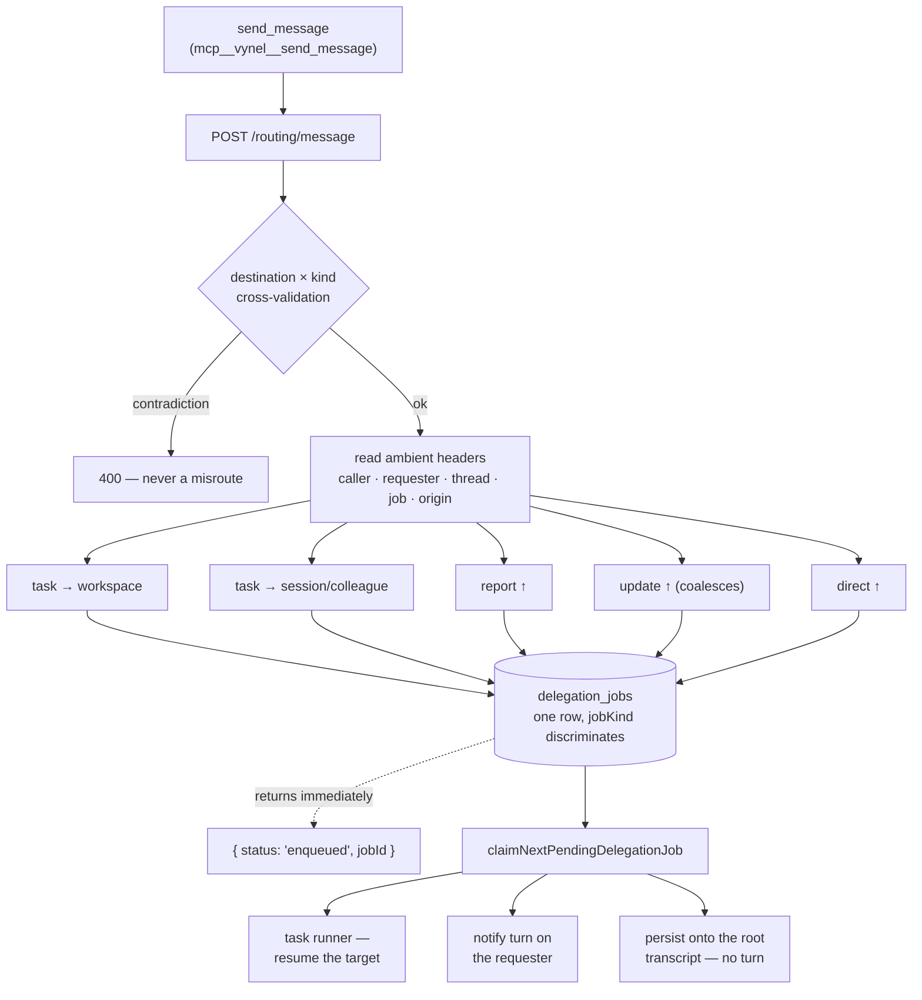
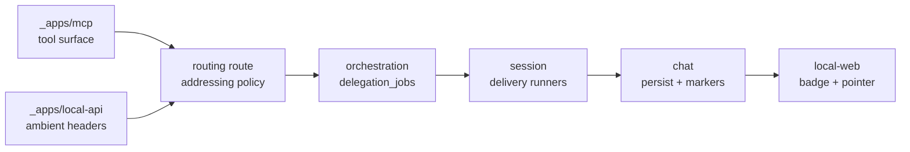

# Session Communication — Structure

> The code map and connections for the session-messaging seam. For the concepts behind it, see [overview.md](./overview.md).
>
> Folders touched: `apps/local-api/src/routes/routing/` · `apps/local-api/src/sessions/` (ambient headers + MCP composers) · `packages/orchestration/src/routing/` · `packages/orchestration/src/repositories/` · `packages/session/src/delegation/` · `packages/contracts/src/chat/` · `apps/mcp/src/` · `apps/local-web/src/components/chat/`

This layer **owns no package and no table.** It is the addressing + delivery policy that binds five documented modules together: the route and the ambient-header stamping live in [`_apps/local-api`](../_apps/local-api/structure.md); the durable queue it writes to belongs to [`orchestration`](../orchestration/structure.md); the runners that consume its rows belong to [`session`](../session/structure.md); the attribution markers and persistence belong to [`chat`](../chat/structure.md); the tool surface belongs to [`_apps/mcp`](../_apps/mcp/structure.md). Read those for what each owns — read this for **how the seam works end to end.**

## File map

► = the entry point a change most likely starts from.

### The tool + route (`apps/local-api`, `apps/mcp`)

| Path | Role |
|---|---|
| ► `apps/local-api/src/routes/routing/index.ts` | the `routing` HTTP surface; `POST /message` (L346–472) is `send_message` — destination/kind cross-validation then a five-way dispatch. Also `GET /workspaces`, `GET /channels`, `POST /send-to-channel`, `POST /reply-to-channel`, `GET /background-runs[/:jobId]` |
| ► `apps/local-api/src/routes/routing/dispatch-message.ts` | the five dispatch cores — one home so the resolutions can never drift; `resolveUpwardSender` (L180–297) is the load-bearing "who asked" resolver |
| `apps/local-api/src/routes/routing/schemas.ts` | Zod request/response shapes; `MessageDestinationSchema` (L84–90) is the `to` grammar |
| `apps/mcp/src/generated/api-tools.ts` | the generated MCP tool — `sendMessage` factory L3000–3043; registered in **both** `generatedMcpTools` (L3866) and `generatedRoutingMcpTools` (L3901) |
| `apps/mcp/src/vynel-mcp-feature-descriptor.ts` | the three `vynel` descriptors (workspace / workspace-interactive / routing) that attach the tool to a turn |
| `apps/mcp/src/vynel-tool-gates.ts` | the declared inventories derived from the generated arrays (L24–29) |
| `scripts/src/generators/generate-mcp-tools.ts` | the generator; `workspaceSurface` (L84–96) is why this one tool rides both arrays |

### Ambient turn context (`apps/local-api/src/sessions/`)

| Path | Header | Carries |
|---|---|---|
| `report-caller-header.ts` | `x-vynel-report-caller` | who is speaking — `workspace-primary` \| `spawned-session` \| `agent-session` |
| `report-requester-header.ts` | `x-vynel-report-requester` | the originating chat's workspace (mention reroute) |
| `delegation-thread-header.ts` | `x-vynel-delegation-thread` | the chain key |
| `delegation-job-header.ts` | `x-vynel-delegation-job` | the queue row this turn is running |
| `delegation-origin-header.ts` | `x-vynel-delegation-origin` | the channel this arrived from |
| ► `build-workspace-background-mcp.ts` | — | stamps them: `buildDelegatedTurnMcpComposer` (L154–307) wraps the dispatcher; the caller identity is derived at L183–193 |

None of these are in the OpenAPI contract. They are internal, server-stamped per turn, and invisible to the model — that is the whole mechanism by which an address cannot be mis-set.

### Queue writes (`packages/orchestration/src/routing/`)

| Path | Writes |
|---|---|
| `enqueue-workspace-delegation.ts` | a `task` row targeting a workspace |
| `enqueue-session-delegation.ts` | a `task` row targeting a spawned session / colleague primary |
| `enqueue-report-delivery.ts` | `report-delivery`, or `direct-delivery` when `deliverDirectly` is set (L107) |
| `enqueue-update-delivery.ts` | `update-delivery` — **coalesces** into a still-pending row first (L77–89) |
| `enqueue-agent-run.ts` | `agent-run` (the `@mention` path — a sibling producer, not a `send_message` destination) |
| `resolve-thread-id.ts` | inherit the chain key, or seed one from this hop |

### Queue reads + claim (`packages/orchestration/src/repositories/delegation-jobs.ts`)

| Function | Purpose |
|---|---|
| `claimNextPendingDelegationJob` (L117–195) | the atomic FIFO claim; excludes busy target keys, gates on retry backoff |
| `findPendingUpdateDelivery` (L208–229) | the coalesce anchor — one pending update per (user, requester, thread) |
| `replacePendingDelegationJobBody` (L243–259) | the in-place coalesce; CAS on `status='pending'` |
| `markDelegationJobReported` (L515–520) | idempotent — first stamp wins |
| `requeueOrphanedClaimedReportDeliveries` (L579–593) | boot reap; a report body is the only copy of a result, so deliveries requeue rather than die |
| `listRecentDelegationJobsForUser` (L449–467) | `list_background_runs` — **task rows only** |
| `listDelegationJobsByThread` (L475–510) | one chain, oldest first |
| `listDelegationJobsSince` (L600–617) | **every** kind — the node screen draws an edge whenever two conversations talk |

`GLOBAL_ROOT_DELIVERY_TARGET_KEY` (L56) is the synthetic exclusion key every global-requester delivery shares, so at most one notify turn runs on the root at a time.

### Delivery runners (`packages/session/src/delegation/`)

| Path | Role |
|---|---|
| ► `run-delegation-claim-and-run-tick.ts` | claims one row and branches on kind: `agent-run` → L199–215, any delivery kind → L222–241, otherwise the task path |
| ► `run-report-delivery-tick.ts` | the notify half — marker + steer selection (L121–153), the **no-turn direct path** (L169–208), global vs workspace requester branches |
| `routed-turn-provider-input.ts` | the four system steers: task (L10–24), report (L33–42), update (L48–56), direct (L62–68) |
| `attach-delegation-tool-outcomes.ts` | enriches the *sender's* tool card with live job status (L81–124); recognised tool names at L21–25 |
| `settle-failed-delegation-attempt.ts` | `hasDeliveredFinalReport` — a turn that already spoke must not resurface as "couldn't complete" |
| `enqueue-job-failure-delivery.ts` | the give-up push when a task dies without ever reporting |
| `classify-turn-failure.ts` | `requeueIfRecoverable` — a transient notify failure retries |

### Markers + rendering (`packages/contracts`, `packages/chat`, `apps/local-web`)

| Path | Role |
|---|---|
| `packages/contracts/src/chat/report-message-marker.ts` | composes/strips the three markers; `isUpdateMessageBody` / `isDirectMessageBody` drive the UI badge |
| `packages/chat/src/records/record-direct-reply-message.ts` | persists a direct answer straight onto the root transcript |
| `apps/local-web/src/components/chat/ThreadStream.vue` | strips the marker for display (L14, L415); places the delegation pointer under the sending tool call (L205–212) |

## Data & persistence

**No owned table.** Every message becomes a row in `delegation_jobs` — orchestration's table (`packages/orchestration/src/schema/delegation-jobs.ts`). `jobKind` (L133) is the discriminator across **five row shapes**, and the columns are deliberately *reused* per kind rather than widened:

| Column | On a `task` row | On a delivery row (`report-` / `update-` / `direct-delivery`) |
|---|---|---|
| `taskText` | the work handed down | **the message body** (a direct answer stores `title\n\nbody`) |
| `workspaceName` | the target's enqueue-time name | **the sender's composed label** (`"Mark · Acme"` / session / agent name) |
| `parentSessionId` | the delegating turn's SDK session | **the sender's** SDK session — provenance, the "from" side |
| `workspaceId` | the target workspace | **the requester** workspace primary; `NULL` = the global root |
| `targetPrimarySessionId` | the target session/colleague | always `NULL` — leaves send messages, never receive them |

Row invariant: a `task` row carries exactly one target. A delivery row is the **only** kind permitted to carry no target at all (both null = the global root).

Columns this seam depends on, and where they came from:

| Column | Meaning here | Migration |
|---|---|---|
| `targetPrimarySessionId` | session/colleague destination | `0012_delegation_session_targets.sql` |
| `model`, `thinkingEffort` | the sender's picks for the delegated turn | `0014_delegation_model_effort.sql` |
| `jobKind` | the five-shape discriminator (`NULL` reads as `task`) | `0015_delegation_job_kind.sql` |
| `threadId` | the chain key (`NULL` = its own thread) | `0020_delegation_thread.sql` |
| `reportedAt` | set when a final message was spoken — stops the double-wake | `0021_delegation_reported.sql` |
| `attemptCount`, `nextAttemptAt`, `errorCode` | delivery retry/backoff | `0023_delegation_retry.sql` |
| `agentSlug`, `requesterWorkspaceId` | mention runs + the report reroute | `0027_delegation_agent_run_mentions.sql` |

All are nullable, so each migration stayed a pure additive `ALTER`. `requesterWorkspaceId` is a **loose ref, not a FK** — a deleted originating workspace must fail the report over to the global root, never cascade the job away.

> **Drift note:** [`orchestration/structure.md`](../orchestration/structure.md) was mapped 2026-07-14 and its `delegation_jobs` column table predates every row above. This file is the current reading for the delivery kinds and the thread/reported/retry columns.

## Core operations

| Operation | What it does | Key calls / boundaries |
|---|---|---|
| `parseMessageDestination` | `to` string → `requester` \| `workspace` \| `session` | `dispatch-message.ts:396–407`; shape already validated by the schema, so a bad value here is a programming error |
| `dispatchTaskToWorkspace` | requires a live global root, ownership-checks the target, enqueues | `dispatch-message.ts:102–125` → `enqueueWorkspaceDelegation` |
| `dispatchTaskToSession` | resolves the creator (calling workspace's primary, else the global root), resolves the target by segment id, enqueues | `dispatch-message.ts:128–167` → `findRoutableSessionBySegmentId`, `enqueueSessionDelegation` |
| `resolveUpwardSender` | **the addressing core** — caller header → reporter identity + label + requester (+ override) | `dispatch-message.ts:180–297` |
| `dispatchReportToRequester` | enqueues a report delivery **and** marks the running job reported | `dispatch-message.ts:306–334` → `enqueueReportDelivery`, `markDelegationJobReported` |
| `dispatchDirectToUser` | same, with `deliverDirectly: true` and the body composed as `` `${title}\n\n${message}` `` | `dispatch-message.ts:342–365` (L353 is the composition) |
| `dispatchUpdateToRequester` | enqueues (or coalesces) an update; **never** marks reported | `dispatch-message.ts:370–387` → `enqueueUpdateDelivery` |

**Transaction boundaries** — two co-commits matter, both outside this layer's own code but caused by it: a direct delivery persists the message *and* completes its job in one transaction (`run-report-delivery-tick.ts:177–186`), and a completing task co-commits `complete` + `markSurfaced` (`run-delegation-claim-and-run-tick.ts:647–650`).

## HTTP surface

Mounted at `/routing` (`apps/local-api/src/app.ts:377`), user-scoped middleware bundle, top-level (the global root has no workspace, so it does **not** nest under `/workspaces/:workspaceId`).

| Method | Path | Purpose | MCP tool |
|---|---|---|---|
| POST | `/routing/message` | **the one comms verb** | `send_message` |
| GET | `/routing/workspaces` | routing targets (id + name) | `list_routing_workspaces` |
| GET | `/routing/channels` | channel targets | `list_routing_channels` |
| POST | `/routing/send-to-channel` | proactive channel push | `send_to_channel` |
| POST | `/routing/reply-to-channel` | answer the channel conversation that drove this turn | `reply_to_channel` |
| GET | `/routing/background-runs` | what you handed off | `list_background_runs` |
| GET | `/routing/background-runs/:jobId` | one run, full result text | `get_background_run` |

### `POST /routing/message` contract

| Field | Bounds | Honored when |
|---|---|---|
| `to` | `^(requester\|workspace:.+\|session:.+)$` | always |
| `body` | 1–50 000 | always |
| `kind` | `task \| report \| update \| direct_to_user` | upward only; downward it is derived and merely validated |
| `title` | 1–200 | **only** with `direct_to_user` |
| `workspaceId` | — | **only** on the `session:` branch; ambiently stamped from MCP scope when omitted (`api-tools.ts:3021–3023`) |
| `model` | curated allowlist | **only** on task branches |
| `thinkingEffort` | `low\|medium\|high\|xhigh\|max` | **only** on task branches |

Returns `{ status: 'enqueued', jobId, deliveredTo, kind }`.

**Error matrix** (`index.ts:409–428` unless noted):

| Condition | Status |
|---|---|
| `kind:'task'` addressed to `requester` | 400 (L409–411) |
| report/update/direct addressed to a workspace/session | 400 (L412–419) |
| `direct_to_user` without `title` | 400 (L421–425) |
| `title` on any other kind | 400 (L426–428) |
| unparseable `to`, empty/oversize `body`, bad `model`/`thinkingEffort` | 400 (schema) |
| no active global-root turn (workspace task) | 400 (`dispatch-message.ts:109`) |
| no active creator conversation (session task) | 400 (`dispatch-message.ts:143`) |
| no caller header on an upward send | 400 (`dispatch-message.ts:184–190`) |
| caller's primary has no linked SDK session | 400 (`dispatch-message.ts:289–295`) |
| unknown **or** not-owned workspace/session | 404, identically |

Pinned end to end in `apps/local-api/src/routes/routing/index.test.ts` (1516 lines; the kind matrix at L1349–1433, the direct-message shape at L1110–1186, the double-report guard at L1451–1515).

## MCP surface

`send_message` is the **only** tool in the repo that lands in both generated arrays, via `x-mcp.workspaceSurface: true` (`index.ts:369`) on top of the `/routing/` path default. The generator comment at `generate-mcp-tools.ts:84–96` records why: routing and workspace are otherwise mutually exclusive, and *"a unified comms tool must have ONE name everywhere, or the model has to pick between near-identical tools and picking wrong is a silent misroute."*

| Surface kind | Descriptor composed | Has the tool | Can send **upward** |
|---|---|---|---|
| `global-interactive` | `vynelRoutingDescriptor` | ✅ | ❌ no caller header |
| `global-channel` | `vynelRoutingDescriptor` | ✅ | ❌ |
| `delegated-global` | `vynelRoutingDescriptor` | ✅ | ✅ |
| `workspace-interactive` | `vynelWorkspaceInteractiveDescriptor` | ✅ | ❌ |
| `delegated-workspace` | `vynelWorkspaceInteractiveDescriptor` | ✅ | ✅ |
| `spawned` | `vynelWorkspaceInteractiveDescriptor` | ✅ | ✅ |
| `agent` | `vynelWorkspaceInteractiveDescriptor` | ✅ | ✅ |
| `workspace-background` | `vynelWorkspaceDescriptor` | ✅ | ❌ |
| `schedule` | `vynelWorkspaceDescriptor` | ✅ | ❌ |

Surface membership is derived, not declared, at `apps/local-api/src/sessions/session-tool-catalog.ts:137–152` (the sets at L59–80) and pinned at `session-tool-catalog.test.ts:16–22`. Upward capability tracks exactly one thing: whether `buildDelegatedTurnMcpComposer` wrapped the dispatcher with the caller header (`build-workspace-background-mcp.ts:183–193`). `buildWorkspaceBackgroundMcpComposer` (L47–72) never does — so a schedule fire holds the tool and can delegate downward, but an upward send answers 400.

**Carding: never.** The generated annotations read `readOnlyHint: false, destructiveHint: true` (`api-tools.ts:3042`), which looks like it should card. It does not:

- `mutatingToolNames: []` in all three descriptors (`vynel-mcp-feature-descriptor.ts:149, 173, 197`)
- absent from `generatedAskModeApprovalToolNames` (`api-tools.ts:3924–3933`)
- card class resolves to `'never'` (`session-tool-catalog.ts:154–156`)

`x-mcp.mutatingApproved: true` means only *"may be emitted as a tool at all"* — the generator keeps that meaning separate from carding on purpose (`generate-mcp-tools.ts:50–54`). It is subject to the admin tool-policy layer like any tool ([`_platform/tool-policy`](../_platform/tool-policy/structure.md)); the resolver's precondition comment names `send_message` explicitly as a multi-surface entry that must be pre-merged (`packages/capabilities/src/tool-policy/resolve-effective-tool-policies.ts:38–42`).

## Worker / background jobs

One consumer, polled in-process by `apps/local-api/src/services/delegation-service.ts`.

| Row kind | Runner | Receiver experience |
|---|---|---|
| `task` | `run-delegation-claim-and-run-tick.ts` task path | a real turn on the target's conversation, under `ROUTED_TASK_INSTRUCTIONS` |
| `report-delivery` | `run-report-delivery-tick.ts` | notify turn, `[Report from …]` marker, `REPORT_DELIVERY_INSTRUCTIONS` |
| `update-delivery` | same | notify turn, `[Update from …]` marker, `UPDATE_DELIVERY_INSTRUCTIONS` — "task NOT done" |
| `direct-delivery` | same, **fast path** | *no turn*: persisted onto the root transcript as the sender speaking (L169–208) |
| `agent-run` | `run-agent-run-job.ts` | the `@mention` sibling path |

Budget is 600 s of *waiting* (`run-delegation-claim-and-run-tick.ts:73`) — a timeout stops the wait, not the turn. Concurrency is one run per target key; global-requester deliveries share one synthetic key so the root is never resumed twice at once.

## Web surface

- The **sending** side renders as a tool call enriched at serve time with the job's live status, destination, and trace key (`attach-delegation-tool-outcomes.ts:81–124`); the pointer persists after the job settles, and `ThreadStream.vue:205–212` places it under the first visible row that carries it.
- The **receiving** side renders a delivered message as an ordinary participant message with a badge — `Report` / `Update` / `Message` read off the marker prefix — with the marker stripped for display (`ThreadStream.vue:14, 415`).
- A direct answer's `title` needs no separate storage: it leads the body, so the compact box's teaser line *is* the title and the popup shows the full text under it.

## Pipeline

The five paths converge on one queue, then diverge into three delivery behaviours.

A worker acknowledging and reporting, step by step:

1. The turn is composed by `buildDelegatedTurnMcpComposer` (`build-workspace-background-mcp.ts:154`), which wraps the in-process dispatcher so every tool call carries the caller identity, chain, and job id (L183–209).
2. The steer tells it to acknowledge first (`routed-turn-provider-input.ts:10–24`), so it calls the tool with `to: "requester", kind: "update"`.
3. The route validates the pair (`index.ts:412–419`) and dispatches upward (`index.ts:432`).
4. `resolveUpwardSender` reads the caller header, resolves the reporter's label and *its* requester — a workspace primary reports to the global root unless the requester-override reroutes it to the chat that mentioned it (`dispatch-message.ts:260–288`).
5. `enqueueUpdateDelivery` looks for a still-pending update on this chain and replaces its body in place if one exists (`enqueue-update-delivery.ts:77–89`); the sender gets its handle back at once.
6. The tick claims the row, sees a delivery kind (`run-delegation-claim-and-run-tick.ts:222`) and hands it to `runReportDeliveryJob`.
7. That prepends `[Update from …]` and runs a notify turn on the requester under the update steer (`run-report-delivery-tick.ts:147–153`, L284–365). The requester absorbs it; the task is *not* marked done.
8. Work finishes. The worker sends `kind: "report"` — same path, except `dispatchReportToRequester` also stamps `reportedAt` on the running row (`dispatch-message.ts:328–331`), which is what stops the tick from *also* harvesting the chat reply and waking the requester twice.
9. Had it chosen `direct_to_user`, step 7 would instead persist the message straight onto the root transcript and complete the job in one transaction (`run-report-delivery-tick.ts:177–186`) — and the work row would stay **unsurfaced** so the root absorbs it via the catch-up net rather than echoing it (`run-delegation-claim-and-run-tick.ts:645–649`).

## Connections

**Summary:** a seam, not a hub — it *writes* rows other modules own and *reads* ambient context other modules stamp. It publishes no outbox events of its own.

| Unit | Direction | Mechanism | What crosses |
|---|---|---|---|
| [orchestration](../orchestration/structure.md) | out | import | enqueue ops, the claim, `DelegationJob` rows |
| [session](../session/structure.md) | both | import + injected deps | delivery runners consume the rows; `findRoutableSessionBySegmentId`, `resolveColleagueAgent`, display names resolve destinations |
| [chat](../chat/structure.md) | out | import | `recordDirectReplyMessage`, `composeManagerSourceLabel`, `findChatSessionById` |
| [workspaces](../workspaces/structure.md) | out | import | ownership-checked target + requester resolution |
| [_apps/mcp](../_apps/mcp/structure.md) | in | generated registry | the tool factory + the three descriptors |
| [_apps/local-api](../_apps/local-api/structure.md) | both | route + composers | the route itself; the ambient-header wrapping |
| [_platform/tool-policy](../_platform/tool-policy/structure.md) | in | catalog entry | surfaces, card class `never`, admin override |
| [channels](../channels/structure.md) | sideways | loose ref | origin columns thread onto a task; the channel answer is delivered at *task completion*, a different path |
| [approvals](../approvals/structure.md) | sideways | provider seam | never cards for this verb; the *delegated turn's* tools may |

**Events published:** none. This layer writes queue rows; the cross-feature signal (`session.delegated`) is emitted by orchestration at execution, not at enqueue.

**Events consumed:** none.

## Config & gotchas

- **`orchestration/structure.md` is stale on this table.** Mapped 2026-07-14, it predates `jobKind`, `threadId`, `reportedAt`, retry, and mentions entirely. Code wins; this file is current for those columns.
- **The route test's header comment is stale.** `apps/local-api/src/routes/routing/index.test.ts:1–6` says `routingApp` "is not mounted in app.ts yet" and builds its own harness. It *is* mounted (`app.ts:377`) — the harness is now redundant, not wrong.
- **`model` and `thinkingEffort` are silently dropped on an upward send.** The handler destructures them into `taskOptions` (`index.ts:401–406`) but spreads it only on the two task branches. An *illegal* model still 400s (schema runs first, pinned at `index.test.ts:353–358`); a legal one is accepted and discarded. Asymmetric with `kind`/`title`, which are strictly cross-validated.
- **`deliveredTo` names the sender, not the destination, for a workspace-grounded spawned session.** `requesterLabel` is assigned only in the workspace-primary and agent-session branches (`dispatch-message.ts:259, 287`); the spawned branch leaves it null, so `upwardDeliveredTo` (L299–303) falls back to the *reporter's* label. **Read from code — no test pins this path.**
- **The no-turn direct path is global-requester only.** `run-report-delivery-tick.ts:169` gates on `isGlobalRequester`. With a *workspace* requester, `direct_to_user` still runs a full notify turn, just under `DIRECT_DELIVERY_INSTRUCTIONS` ("absorb silently, do not restate"). There is no workspace-side absorb net yet.
- **A mention chain's reply delivers direct whatever kind it spoke** (`run-report-delivery-tick.ts:126–132`) — a colleague answering a user's `@mention` must never be re-narrated, so the direct steer is the floor for that whole chain.
- **No harvest, by decision (2026-07-27).** The receiver's ordinary chat reply is never captured as a report. A silent worker therefore delivers *nothing*; the reply still lives on `resultText` and in its own transcript. Completed rows are marked surfaced unconditionally so the catch-up net cannot leak the capture back through another door.
- **`update` rows are never requeued.** The boot reap requeues orphaned `report-delivery` rows (the body is the only copy of a result) but drops update rows — ephemeral status, deliberately terminal (`delegation-jobs.ts:548–593`).
- **The attribution marker exists because a system steer decayed.** A 2026-07-27 smoke caught a workspace reasoning *"the user is reporting back…"* about a system-delivered report. The marker rides on the message body so the model always sees it; the UI strips it. Do not remove one end without the other (`report-message-marker.ts:1–10`).

---
*Mapped from the code on disk, 2026-08-16. If you change this layer, update this file and [overview.md](./overview.md).*
