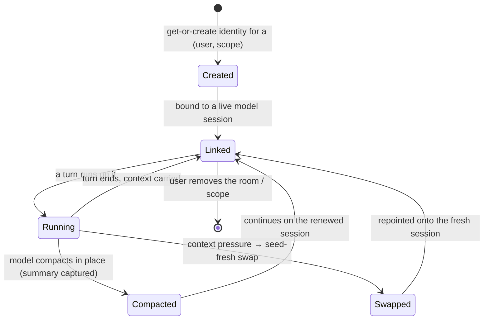

# Session — Overview

> The keystone tier where *everything is a session*: one durable-identity primitive underlies the global brain, each workspace's conversation, and voice — and every conversational turn is run from here, reaching the AI runtime only through the sacred provider seam.
>
> **Status:** shipped · **Depends on:** [chat](../chat/overview.md) (persistence), [orchestration](../orchestration/overview.md) (delegation queue), [providers](../providers/overview.md) (AI runtime), [capabilities](../capabilities/overview.md), [memory](../memory/overview.md), [channels](../channels/overview.md), [workspaces](../workspaces/overview.md), [db](../db/overview.md) (kernel) · **Code map:** [structure.md](./structure.md)

## Purpose

Session is the tier that makes a Vynel conversation *continue*. Underneath the visible chat there is a single primitive — a **continuing session identity** — and the whole product hangs off it: the global brain that spans every workspace, the individual brain of each workspace room, and the voice line are all the same kind of thing, differing only in their *scope*. That is the spine: **everything is a session.**

It is also where a **turn** is run. Any part of the system that needs the assistant to think — a web chat, an inbound channel message, a scheduled job, a task routed from the brain into a workspace — calls into session and gets back either a live stream of events or a single drained result. Session composes the turn (which capability instructions to inject, which memory snapshot, which permission mode), drives it through the one shared persist-and-translate pipeline, and — crucially — reaches the actual AI runtime *only* through the provider seam. No other package touches the model directly on session's behalf.

What makes it the keystone rather than plumbing is that continuity lives here. A raw model session eventually fills its context window and gets compacted or replaced; session is what keeps a *stable identity* pointed across those swaps, so a workspace's brain remembers yesterday even though the underlying model session has been renewed several times since.

## What it can do

- **Run a workspace turn** — the everyday chat turn: resume (or start) that workspace's continuing conversation, stream the assistant's reply, tool calls, and thinking live as they persist.
- **Run the global-brain turn** — the assistant *above* all workspaces, serialized to one live model session per user, that can answer directly or route work down into a specific workspace.
- **Route a task into a workspace's brain** — delegation: hand a task to a workspace's own continuing conversation so "in Acme, summarize the notes" reaches Acme's real context, running through the same live pipeline as any other turn.
- **Surface an approval up to its origin** — when a routed background turn hits an irreversible action, park it, carry the approval card back to the channel the task arrived on, and wait for the decision.
- **Read a delegation's trace** — the condensed cross-session story of one routed request, spanning the global brain and the workspace it landed in.
- **Resolve the standing conversation** for a scope and stitch continuity across a turn — link the identity to its live model session before, bridge it after.
- **Model the permission mode** — the three user-facing session modes (ask / auto / bypass) and their mapping to the provider's permission floor, in a browser-safe form the web UI can render without pulling the backend in.
- *(background)* **Renew a session before it breaks** — detect context pressure, capture the model's compaction summary, and perform a seed-fresh swap onto a new model session, announcing the change so downstream consumers can react. Drive the durable delegation queue tick-by-tick to completion.

## Responsibilities

**Owns** — the durable session identity for every scope (workspace, global, voice) and its whole continuity lifecycle: get-or-create of the identity, linking it to the live model session, detecting context pressure, capturing the compaction summary, the seed-fresh swap, and the two continuity events it announces through the outbox. It owns the *turn runners* — scope-specific by design, not one generic runner — for the workspace chat and the global brain, the seeded-swap run, and the delegation compositions that route work down into a workspace and carry approvals back up. It owns the per-turn *composition* seams (which capability prompt contributions and memory snapshot go into a turn's system prompt, the permission-mode model), the per-user turn lock, and the sink contract that lets one turn body serve both a live SSE stream and a background drain.

**Does not own** —
- persisting messages and the shared consume/translate pipeline every turn runs through — [chat](../chat/overview.md); session is chat's parent and drives that pipeline, but chat itself is continuity-free;
- the delegation *queue* and its records — [orchestration](../orchestration/overview.md); session composes on top of it but the queue engine lives there;
- the AI runtime itself — the model session, streaming, compaction hooks — [providers](../providers/overview.md), reached only through the provider seam;
- whether a capability is switched *on* for a workspace, and each capability's own prompt contribution — [capabilities](../capabilities/overview.md);
- the memory snapshot's content and its indexing — [memory](../memory/overview.md); session only injects it;
- delivering a surfaced approval or a reply to a channel — [channels](../channels/overview.md);
- the workspace room, its folder on disk, and ownership — [workspaces](../workspaces/overview.md);
- the tool surface a turn exposes — the MCP composition stays at the app edge, injected into the runner opaquely;
- firing a turn on a schedule or a channel event — those trigger a turn through the outbox or an injected dependency, never by importing the runner upward.

## Concepts & vocabulary

| Term | Meaning |
|---|---|
| **Session (the primitive)** | One durable, continuing conversation identity for a user in a given scope. The single idea the global brain, each workspace, and voice are all instances of. |
| **Scope** | Which kind of session: **workspace** (one live per user + room), **global** (one live per user, the brain above all rooms), **voice** (one live per user). *Agent* is a planned future kind, keyed differently — not yet a live scope. |
| **Primary session** | The durable-identity record for the singleton scopes — the stable thing continuity keeps pointed across model-session swaps. (Renamed from "root" during the pull; a filesystem "root directory" is a different, untouched thing.) |
| **Turn** | One request-and-response cycle: a user (or routed) message in, a stream of events out, all persisted live. |
| **Turn runner** | The body that runs a turn for a given scope. Scope-specific by design — the workspace runner and the global-brain runner share only a short loop, not one generic runner. |
| **Sink** | The one axis a turn diverges on: where its events go. Stream them to a live SSE client, or accumulate them for a single drained result. Everything else about the turn is identical. |
| **Continuity** | Keeping a session's identity alive across the underlying model session being compacted or replaced, so context carries forward. |
| **Context pressure** | The signal that a model session is nearing its context limit — the trigger to renew it. |
| **Compaction / seed-fresh swap** | Two ways a model session is renewed: the model compacts in place (its summary is captured), or the identity is repointed onto a fresh session seeded with carry-over. |
| **Delegation** | Routing a task from the global brain down into a workspace's own continuing conversation, run through the shared live pipeline. |
| **Delegation trace** | The condensed cross-session story of one routed request — spanning the global-brain session (the acknowledgement) and the workspace session (the work). |
| **Session mode** | The user-facing permission stance for a turn: **ask** (approve every tool), **auto** (safety-gated, irreversible floor still cards), **bypass** (silent, only the irreversible floor cards). |
| **Provider seam** | The single boundary through which session reaches the AI runtime — the model is never touched directly. |

## Rules & invariants

- **Everything is a session.** Global, workspace, and voice are scopes of one identity primitive, resolved through one get-or-create path. Agent is a designed-for future scope, not yet implemented — the code says so plainly, ahead of the prime directive's shorthand.
- **The AI seam is sacred.** Session reaches the model runtime only through the provider seam; it never imports the underlying SDK runtime.
- **The runners are scope-specific, not unified.** The one-generic-runner goal was dropped as wrong-shaped. Unification lives at the *identity* level (the primary session) and in the *shared persist/translate pipeline* every turn runs through — not in a single runner.
- **One live model session per user for the global brain, serialized.** The whole global turn runs under a per-user lock so a web turn and a channel turn can't race and clobber the session-swap write. The lock is acquired in exactly one place and never re-wrapped.
- **Imports point down only.** As a composition tier, session imports the leaves it drives (chat, orchestration, providers, and the rest); nothing imports the runner back upward. A schedule or channel triggers a turn through the outbox or an injected dependency, never a direct call up.
- **The public surface is split for bundle safety.** The default surface carries only the web-safe permission-mode model, which the browser can import without dragging the database or provider runtime into its bundle; the turn-execution and continuity surfaces are separate and backend-only.
- **The identity follows its live model session.** A new or swapped model segment is linked to the identity as it appears; linking is best-effort and never breaks a live turn.
- **Only cross-domain changes announce an event.** The compaction and the seed-fresh swap each emit one outbox event; creating an identity and the initial link mutate silently, because nothing downstream consumes them.
- **The turn's tool surface is injected, not built here.** MCP composition and the environment-coupled resolution (the global brain's hidden working directory) stay at the app edge and are passed into the runner; the package itself stays environment-free.

## Lifecycle

## Where it sits in the bigger picture

Session is the composition tier directly above the conversational leaves and directly below the apps. Above it, the [local-api](../_apps/local-api/overview.md) app and the channel and schedule surfaces call into session to run a turn and stream or drain the result; they never reach the runner by importing it upward. Below it, session drives [chat](../chat/overview.md) for the one shared persist-and-translate pipeline (session is chat's parent, and chat is deliberately continuity-free so the two don't cycle), [orchestration](../orchestration/overview.md) for the delegation queue it composes on top of, and [providers](../providers/overview.md) for the model runtime it only ever touches through the seam. Each turn it composes pulls a memory snapshot from [memory](../memory/overview.md) and the enabled prompt contributions from [capabilities](../capabilities/overview.md), runs inside the room owned by [workspaces](../workspaces/overview.md), and — when a routed task needs a human decision — carries the approval back out through [channels](../channels/overview.md). It is the smallest possible keystone: not a grand unifier of every turn into one runner, but the single home of the *continuing identity* every conversation shares and the composition that turns a message into a persisted, streamed, model-backed reply.

---
*Mapped from the code on disk, 2026-07-14. If you change this module, update this file and [structure.md](./structure.md).*
