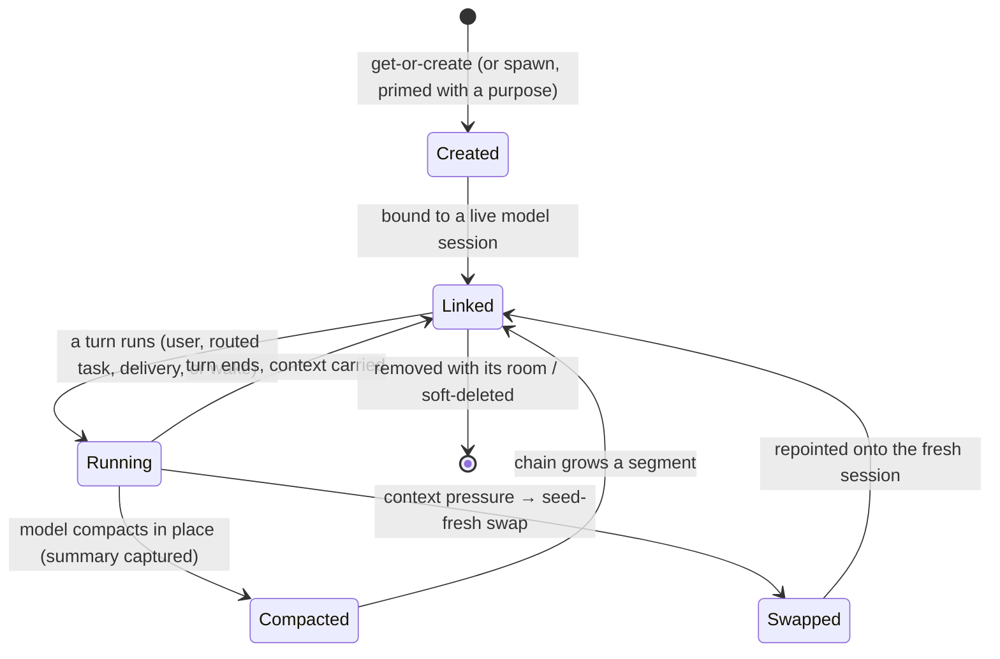

# Session — Overview

> The keystone tier where *everything is a session*: one durable continuing-conversation primitive underlies the global brain, each workspace's brain, voice, spawned worker sessions, and agent colleagues — every AI turn in the product runs from here, every session is listable, watchable, searchable, and addressable, and the model reaches the AI runtime only through the sacred provider seam.
>
> **Status:** shipped · **Phase:** 1 · **Depends on:** [chat](../chat/overview.md) (persistence pipeline), [orchestration](../orchestration/overview.md) (delegation queue), [providers](../providers/overview.md) (AI runtime), [capabilities](../capabilities/overview.md), [memory](../memory/overview.md), [instructions](../instructions/overview.md), [monitors](../monitors/overview.md), [agents](../agents/overview.md), [channels](../channels/overview.md), [workspaces](../workspaces/overview.md), [db](../_platform/database/overview.md) (kernel) · **Code map:** [structure.md](./structure.md)

> **Scope of this document.** "Session" is documented here as the whole domain: the session package (runtime, continuity, delegation, spawned sessions, the unified overview, the monitor tick, the durable turn envelope) plus its HTTP surfaces in the local API — the cross-scope sessions surface, the global-root surface, and the deliberately thin app-edge glue that composes what only an app may compose (environment paths, the in-process tool servers, wire headers).

## Purpose

Session is the tier that makes a Vynel conversation *continue*, and the tier from which every conversation *runs*. Underneath every visible chat there is a single primitive — a durable, continuing session identity — and the whole product hangs off it. What began as two scopes has grown into five kinds of the same thing: the global brain above all workspaces, each workspace's own brain, the voice line, **spawned sessions** the assistant creates as tools for itself, and **agent colleagues** — persona sessions a mention always resumes. All five are rows of one table, and all five get the same continuity machinery for free.

It is also where a **turn** is run. A web chat, a channel message, a schedule fire, a monitor wake, a routed task, a delivered report — anything that needs the assistant to think calls into session and gets back either a live stream of events or a drained result. Session composes the turn (capability prompt contributions, the memory snapshot, the permission mode), drives it through the one shared persist-and-translate pipeline, and reaches the actual AI runtime *only* through the provider seam.

Since the session-library work, this domain is also a *product surface* in its own right: sessions are first-class things the user browses. One unified list shows every session across every scope — continuity chains folded into single entries, each with its live context-usage numbers — and the same list is handed to the planning model as a tool, so the user and the assistant always see the same truth. The user can open a spawned session and chat into it directly, watch any session's live turn as it happens, and the assistant on any tier can search across all of the user's conversations and read any of them in full.

## What it can do

- **Run a workspace turn** — the everyday chat turn: resume (or start) that workspace's continuing brain and stream the reply, tool calls, and thinking live as they persist.
- **Run the global-brain turn** — the assistant above all workspaces, serialized to one live turn per user, reachable as a streamed web turn or a background drained turn (channels, deliveries); it can answer directly or route work down.
- **List every session in one place** — the unified cross-scope overview: workspace brains, spawned sessions, agent colleagues, and the otherwise-hidden global brain surfaced as a single "Assistant" entry; continuity chains fold into one entry each, newest-used first, every entry carrying its context-tokens-used-of-window numbers. The same read backs the user's Sessions panel and the model's session-listing tool.
- **Spawn a session as a tool** — the assistant (global or workspace tier) creates a *normal* named continuing session, primed with a stated purpose, grounded in its creator's world (the creating workspace's folder and memory, or the global brain's own ground). It is listed, metered, and chainable from birth — a durable coworker, not a throwaway.
- **Chat directly into a spawned session** — the user can open a spawned session and run their own streamed turn on it; a user turn arriving while a delegated task is running queues politely behind it.
- **Observe any owned session live** — every turn, no matter which surface drove it, is teed onto a per-session live channel; a watch stream subscribes and replays the turn's events as they happen, one attach per turn.
- **Search and read across all owned conversations** — two read-only tools carried by every tier: full-text search over all of the user's conversations (optionally narrowed to one workspace) with ranked, highlighted hits, and a full read of any single owned session's messages and tool calls. The global brain's own private thread is deliberately excluded from both.
- **Route a task into another session** — delegation, in four target shapes: a workspace's continuing brain (so "in Acme, summarize the notes" reaches Acme's real context), a spawned session, an agent colleague (the persona session a mention resumes, its grants applied every turn), or a one-shot throwaway leaf. All routed turns run through the same live persist pipeline as any chat.
- **Deliver messages upward** — the session-comms pipeline: a child session's message becomes a real, attributed turn on its requester's conversation. Three kinds: a **report** (the final result, absorbed and narrated), an **update** (interim status, absorbed quietly, the task is not done), and a **direct-to-user** message (delivered verbatim to the user's own thread). Delivered messages are regular participant messages in the receiving conversation, not a side channel.
- **Surface an approval up to its origin** — when a routed background turn hits an irreversible action, park it, carry the approval card back to where the task came from, and wait for the decision; repeated denials trip a circuit-breaker that ends the turn cleanly.
- **Read a request's story and control it** — the condensed cross-session trace of one routed request, the drill-down into any single owned session, the list of in-flight delegations, stopping a delegation, interrupting the global turn.
- *(background)* **Renew a session before it breaks** — detect context pressure, capture the model's compaction summary, and seed-fresh-swap the identity onto a new model session, announcing each renewal. **Drive the delegation queue** — claim one job at a time and run it to a terminal state, work jobs and delivery jobs alike. **Wake sessions from monitors** — match armed watches against the event stream and wake the owning session through the queues that already exist. **Keep the live picture durable** — record every running turn in a durable envelope so the activity view survives a refresh or restart, reaping orphans at boot.

## Responsibilities

**Owns** — the durable session identity for all five kinds and its whole continuity lifecycle: get-or-create, linking the identity to its live model session, pressure detection, compaction capture, the seed-fresh swap, and the two continuity events it announces. It owns the turn runners (workspace, global-brain, seeded-swap), the delegation compositions for all four target shapes, the session-comms delivery turns and their anti-cascade discipline, the routed-approval surfacing, and the trace read. It owns the session-library composition: the unified overview, spawned-session creation, and the serve-time enrichments that make delegation activity legible in any transcript. It owns the per-turn composition seams (capability prompt contributions and the memory snapshot into the system prompt; the ask/auto/bypass mode model), the per-user global-turn lock and per-target locks, the sink contract that lets one turn body serve a live stream or a background drain, the per-session live channels and the turn-liveness feed with its durable envelope, and the monitor tick that turns a matched watch into a wake.

**Does not own** —
- persisting messages and the shared consume/translate pipeline every turn runs through — [chat](../chat/overview.md); session drives that pipeline, and the cross-conversation search and full-conversation reads are chat's reads that session's surface exposes;
- the delegation *queue rows*, routing coordination, and run telemetry — [orchestration](../orchestration/overview.md); session composes on top of the queue but the engine's records live there;
- the AI runtime itself — [providers](../providers/overview.md), reached only through the seam;
- whether a capability is on for a workspace and each capability's contribution — [capabilities](../capabilities/overview.md); the memory snapshot's content — [memory](../memory/overview.md); the operating-rules text — [instructions](../instructions/overview.md);
- whether a monitor should fire — [monitors](../monitors/overview.md) owns the watches and the matcher; session only composes the wake;
- agent definitions, their personas and grants — [agents](../agents/overview.md); session runs the colleague's turn but the identity behind the slug lives there;
- delivering an approval card or a reply to an outside channel — [channels](../channels/overview.md);
- the workspace room, its folder, and ownership — [workspaces](../workspaces/overview.md);
- the tool surface a turn exposes — the tool-server composition stays at the app edge, injected into the runners opaquely;
- firing a turn on a schedule — [schedules](../schedules/overview.md) triggers through injected seams, never by importing the runner upward.

## Concepts & vocabulary

| Term | Meaning |
|---|---|
| **Session (the primitive)** | One durable, continuing conversation identity for a user. The single idea all five kinds are instances of. |
| **Kind / scope** | Which kind of session: **global** (the brain above all workspaces, one live per user), **workspace** (one live per user + room), **voice** (one live per user), **spawned** (created by the assistant as a tool — deliberately many per user and per workspace), **agent** (a colleague — one per user + grounding + agent, resumed by every mention). |
| **Primary session** | The durable-identity record continuity keeps pointed across model-session swaps. The stable id never changes; the model session under it does. |
| **Spawned session** | A normal continuing session the assistant creates deliberately: named, primed with a purpose, grounded in its creator's world, visible in the Sessions panel from birth, addressable for both delegated tasks and direct user turns. |
| **Agent colleague** | A configured agent's own continuing session. Its persona rides every turn (so it survives swaps), its memory accumulates, and its replies arrive as its own words — never a harvested result. |
| **Segment / chain** | One model conversation is a segment; continuity links renewed segments into a chain. The overview folds a chain into one entry; the first listed segment's title is the session's identity. |
| **Turn** | One request-and-response cycle: a message in, a stream of persisted events out. |
| **Sink** | The one axis a turn diverges on: stream its events live to a client, or accumulate them for a drained result. Everything else is identical. |
| **Continuity** | Keeping a session's identity alive across the underlying model session being compacted or replaced. |
| **Context pressure** | The signal that a model session nears its context limit — the trigger to renew. |
| **Compaction / seed-fresh swap** | The two renewals: the model compacts in place (its summary is captured), or the identity is repointed onto a fresh session seeded with carry-over. |
| **Delegation** | Routing a task from one session into another's continuing conversation, run through the shared live pipeline. Four target shapes: workspace brain, spawned session, agent colleague, throwaway leaf. |
| **Thread / trace** | A routed request's chain key, carried across hops; the trace is its condensed cross-session story, read back for the user. |
| **Report / update / direct-to-user** | The three delivery kinds of session-comms: final result (narrated by the requester), interim status (absorbed quietly), and a message handed verbatim to the user's own thread. |
| **Delivered message** | A child's message landing as a regular, attributed participant message in the requester's conversation — full body, real turn, no side channel. |
| **Session mode** | The user-facing permission stance: **ask** (approve every tool), **auto** (the safety classifier gates each action, asking only when unsure), **bypass** (runs everything without prompts — the user's explicit grant). Unattended background turns keep their own gated default. |
| **Sessions overview (the library)** | The unified cross-scope list — chains folded, context numbers per entry, the hidden global brain surfaced as the "Assistant" entry — served identically to the user's panel and the model's planning tool. |
| **Watch stream** | The live observation feed of any owned session's running turn; one attach observes one turn. |
| **Turn envelope** | The durable record of a running turn — begun and ended around every turn so liveness survives a restart; orphans are reaped at boot. |
| **Monitor wake** | An armed watch matching an event becomes a queued turn on its owning session, composed from the queues that already exist. |
| **Provider seam** | The single boundary through which session reaches the AI runtime. |

## Rules & invariants

- **Everything is a session.** Five kinds through one table and one get-or-create path; the continuity mechanism is kind-agnostic, so any kind added gets renewal for free. Singleton kinds carry a one-live-per-owner guarantee; spawned sessions are deliberately many.
- **The AI seam is sacred.** Session reaches the model runtime only through the provider seam; it never imports the underlying SDK runtime.
- **One truth for the user and the model.** The Sessions panel and the assistant's session-listing tool read the same overview operation, so both always see the same context numbers before choosing where work goes.
- **The global brain is private but present.** Its own segments are hidden and the user sees it only as the single "Assistant" entry; its thread is excluded from both cross-session tools, and asking for it looks exactly like asking for a session that doesn't exist — ownership misses and the wall are indistinguishable, so nothing can be enumerated.
- **The global turn is serialized per user.** One lock, acquired in exactly one place, so a web turn, a channel turn, and a delivery turn can never race the session-swap write.
- **Every routed turn runs through the one shared persist pipeline.** Tasks, colleague turns, and delivery turns persist live — the task row, the growing reply, tool calls, thinking — never as flat after-the-fact records.
- **Deliveries never cascade.** A completed delivery never enqueues another delivery; reporting upward happens only through the reporting tool inside the notify turn, upward-only, terminating at the global brain.
- **Delivery targets an identity, not a moment.** A report addresses its requester by identity (the workspace, or the global brain) and resolves the *current* model session at run time, so a compaction swap between enqueue and delivery loses nothing.
- **A monitor wake is enqueued before it is marked fired.** A crash between the two writes produces harmless noise; the inverse would produce the exact silence the feature exists to end.
- **The identity follows its live model session.** Linking is best-effort and never breaks a live turn; only the two renewals (compaction, swap) announce events — creation and first-link mutate silently, and the high-churn turn envelope announces nothing.
- **The public surface is split for bundle safety.** The default surface carries only the browser-safe mode model; turn execution, continuity, delegation, spawned creation, and the overview are separate backend-only surfaces.
- **The tool surface is injected, not built here.** Tool-server composition and environment-coupled resolution (the global brain's hidden working directory) stay at the app edge, kept deliberately thin, and are passed into the runners opaquely.
- **Bypass means bypass.** Ask cards every tool; auto lets the safety classifier gate each action; bypass runs without prompts as the user's explicit grant. Turns no user mode reaches keep a separate gated default.

## Lifecycle

## Where it sits in the bigger picture

Session is the composition tier directly above the conversational leaves and directly below the apps. Above it, the [local-api](../_apps/local-api/overview.md) app exposes its three doors — the workspace and global turn surfaces, and the cross-scope sessions surface — and injects the pieces only an app may own: environment paths, the per-turn tool servers from [mcp](../_apps/mcp/overview.md), and the wire encodings of routing context. Below it, session drives [chat](../chat/overview.md) for the one shared persist-and-translate pipeline and the cross-conversation reads, [orchestration](../orchestration/overview.md) for the queue it runs tick-by-tick, and [providers](../providers/overview.md) for the runtime it touches only through the seam. Each turn it composes pulls the memory snapshot from [memory](../memory/overview.md) and the enabled contributions from [capabilities](../capabilities/overview.md), runs in a room owned by [workspaces](../workspaces/overview.md), resumes personas defined in [agents](../agents/overview.md), wakes for watches owned by [monitors](../monitors/overview.md), and carries approvals and replies out through [channels](../channels/overview.md). What was once only the invisible continuity spine is now also the session library the user browses: every conversation in the product — the brains, the spawned workers, the colleagues — is one primitive, listed in one place, watchable live, searchable from any tier, and kept continuous underneath it all.

---
*Mapped from the code on disk, 2026-08-10. If you change this module, update this file and [structure.md](./structure.md).*
