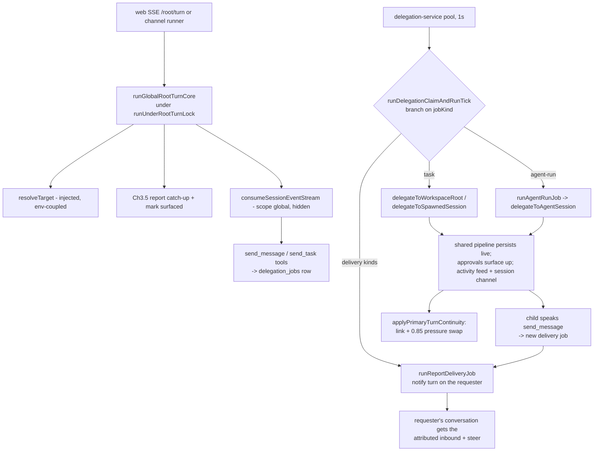
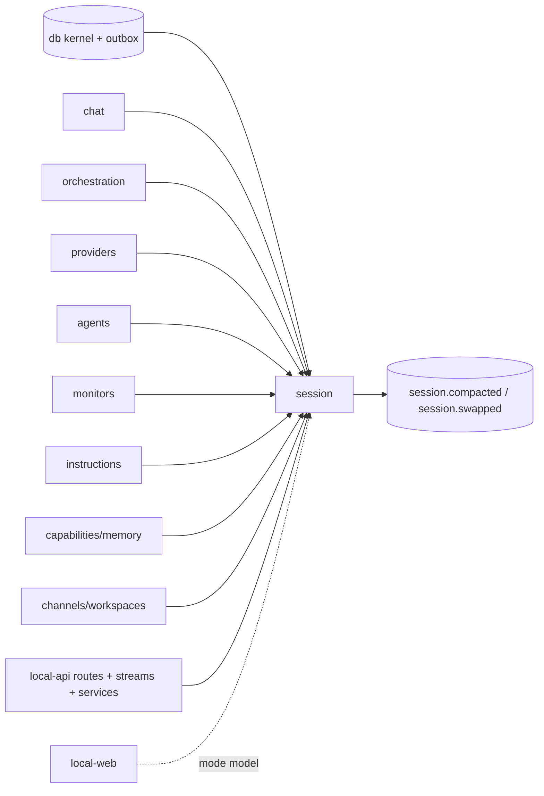

# Session — Structure

> The code map and connections for the session module. For the concepts behind it, see [overview.md](./overview.md).
>
> Folders touched: `packages/session/src/{runtime,delegation,continuity,spawned,overview,monitors,repositories,schema}/` · `apps/local-api/src/routes/{sessions,root}/` · `apps/local-api/src/sessions/` (the thin edge) · `apps/local-api/src/streams/{session-turn,global-root-turn,chat-turn}.ts` · `apps/local-api/src/services/{delegation,monitors}-service.ts`

`@vynel/session` is the **keystone composition tier**, not a plain leaf: it is the *parent of chat* and the turn service — *any caller invokes session and gets back a stream or a response*. It OWNS continuity (`primary_sessions` — now five scopes: workspace/global/voice/spawned/agent), turn liveness (`session_turns` + the `SessionActivityFeed`), the turn runners (global-root core, workspace/spawned `start-chat-turn`, seeded-swap), the whole delegation engine (three job runners + delivery ticks + failure settlement), spawned-session creation, the unified sessions overview, and the monitor-wake tick. It imports **down** into chat/orchestration/providers/agents/monitors/instructions + the kernel; nothing below it imports back up. Deps: `@vynel/agents` `@vynel/capabilities` `@vynel/channels` `@vynel/chat` `@vynel/contracts` `@vynel/db` `@vynel/errors` `@vynel/instructions` `@vynel/logger` `@vynel/memory` `@vynel/monitors` `@vynel/orchestration` `@vynel/providers` `@vynel/workspaces` `drizzle-orm` `pino`; dev `@vynel/approvals` `@vynel/testing` (`packages/session/package.json`).

**Seven export surfaces** (`package.json` `exports`):
- **`.`** — the WEB-SAFE barrel: only the `session-mode` model (`ask`/`auto`/`bypass`). `apps/local-web` may import it without dragging `@vynel/db`/providers into its bundle.
- **`./runtime`** — turn execution: runners, `SessionSink`, composers, the activity feed + recorder, the session turn channel.
- **`./continuity`** — durable-session identity + seed-fresh swap machinery.
- **`./delegation`** — the delegation composition tier (runners, ticks, registries, trace + DTO enrichers).
- **`./spawned`** — sessions the root creates as a tool (create + the by-id/by-segment resolvers).
- **`./overview`** — the unified cross-scope session list (`getSessionsOverview`).
- **`./monitors`** — the monitor-wake tick (`runMonitorTick`), its own subpath so the api's service loop doesn't pull the rest.

## File map

`► ` = entry point / primary export. Test files omitted.

### `.` (package root)

| Path | Role |
|---|---|
| ► `src/index.ts` | the WEB-SAFE package barrel — re-exports `session-mode` ONLY |
| `src/session-mode.ts` | user-facing `SessionMode` (`ask`/`auto`/`bypass`) + `toPermissionMode` → provider mode; `SESSION_MODES` + `DEFAULT_SESSION_MODE` (`ask`) |

### `runtime/` — turn execution + liveness

| Path | Role |
|---|---|
| ► `runtime/index.ts` | the `./runtime` subpath barrel |
| `runtime/session-types.ts` | the `SessionSink` contract — per-turn divergence axis (SSE stream vs background drain); two-channel error model (in-stream `session-errored` via `onEvent` vs thrown → `onError`) |
| `runtime/run-global-root-turn-core.ts` | the SHARED global-root turn body — sink-parameterized; whole turn under `runUnderRootTurnLock`; injected `resolveTarget` (env-coupled) + opaque pre-composed `mcpServers`; Ch3.5 delegation-report catch-up; prepends the `global-root` instruction (`loadSessionInstruction`); tees onto the session channel |
| `runtime/start-chat-turn.ts` | the WORKSPACE + SPAWNED turn runner — resolve provider → `startChatSession` → `consumeSessionEventStream`; `workspaceId` now nullable (spawned direct turns); wires the `onCompaction` capture bridge; tees onto the session channel |
| `runtime/root-turn-lock.ts` | `runUnderRootTurnLock` — in-process per-user promise-chain serializer for global-root turns (one root SDK session per user) |
| `runtime/resolve-primary-conversation.ts` | `resolvePrimaryConversationTarget` — PRE-turn workspace primary get-or-create + resume id |
| `runtime/apply-primary-turn-continuity.ts` | POST-turn: LINK the primary to the SDK session the turn ran on, then BRIDGE if under context pressure |
| `runtime/bridge-primary-session-after-turn.ts` | the provider-bound bridge wrapper (owns the seeded-swap deps + the segment row) |
| `runtime/run-seeded-swap-session.ts` | run a fresh SDK session seeded with a carry text — the swap's `startSeededSession` AND `createSpawnedSession`'s priming turn |
| `runtime/compose-session-capabilities.ts` | per-turn PROMPT contribution — `workspace-agent` instruction (from `@vynel/instructions/session-instructions`) + each enabled capability's contribution (memory today) |
| `runtime/resolve-global-root-transcript.ts` | the global root's settled-transcript read (`/root/transcript`) |
| `runtime/session-activity-feed.ts` | ► `SessionActivityFeed` — per-user turn-liveness registry behind `GET /activity/stream`; every producer `begin()`s; subscribe replays in-flight turns + each turn's last step; mirrors into the recorder seam |
| `runtime/session-turn-recorder.ts` | `buildSessionTurnRecorder` — the DB-backed recorder: begin/resolve/end mirror into `session_turns` (log-never-throw by contract) |
| `runtime/session-turn-channel.ts` | `sessionChannelKey` + `publishTurnEventsToSessionChannel` — tee any turn's `ChatTurnEvent`s onto `session:<id>` (Watch everywhere); ends the channel in a `finally` |
| `runtime/activity-turn-steps.ts` | the ONE `ChatTurnEvent` → feed-step mapping (`turnStepFromChatTurnEvent`, `publishTurnActivityStep`) — tool start/settle + approval bell, tool input bounded at 2 KB |
| `runtime/test-support/fake-ai-agent-provider.ts` | in-package fake provider (approval park/resolve); package-internal, unexported |

### `delegation/` — the delegation engine

| Path | Role |
|---|---|
| ► `delegation/index.ts` | the `./delegation` subpath barrel |
| ► `delegation/run-delegation-claim-and-run-tick.ts` | the durable-queue CONSUMER — claim one job, branch by `jobKind` (`agent-run` → `runAgentRunJob`; delivery kinds → `runReportDeliveryJob`; else the task path), run the routed turn (`routeRequest`), complete/fail; distill + channel delivery; direct-report exception; complete + mark-surfaced co-commit |
| `delegation/run-report-delivery-tick.ts` | `runReportDeliveryJob` — a child's message becomes a REAL notify turn on the requester's conversation (workspace primary via `delegateToWorkspaceRoot`, or the injected `RunGlobalRootReportTurn` for the global root); kind-specific steer (report / update / direct fallback); anti-cascade invariant |
| `delegation/run-agent-run-job.ts` | `runAgentRunJob` — one `@agent` mention job: resume the COLLEAGUE session via `delegateToAgentSession`; no harvest — the colleague speaks via `send_message` |
| `delegation/delegate-to-workspace-root.ts` | route a task INTO a workspace's continuing PRIMARY brain (shared consume pipeline, live persistence, surface-up approvals, denial breaker, `recordDelegation` edge) |
| `delegation/delegate-to-spawned-session.ts` | the SESSION-target sibling — resume a spawned primary's current SDK session (always-resume; the session's NAME plays the manager role) |
| `delegation/delegate-to-agent-session.ts` | the COLLEAGUE runner — fresh-or-resume a scope-`agent` primary; persona rides `systemPromptAppend` every turn; agent allow/deny lists apply |
| `delegation/delegate-to-leaf-session.ts` | by-reference delegation to a fresh hidden leaf — *kept as a building block; the mention path now uses colleagues (`delegateToAgentSession`)* |
| `delegation/settle-failed-delegation-attempt.ts` | one home for a failed attempt: requeue if recoverable, else fail terminally + push a failure report; `hasDeliveredFinalReport` (fresh `reportedAt` read) |
| `delegation/classify-turn-failure.ts` | transient-vs-terminal classifier (`RECOVERABLE_PATTERNS`), backoff 30 s / 5 m, `DELEGATION_MAX_ATTEMPTS` 3, embedded error-code recovery |
| `delegation/enqueue-job-failure-delivery.ts` | one home for "tell the requester this job died" — requester resolution (`requesterWorkspaceId` → workspace, else global root), task preview, retry hint |
| `delegation/routed-turn-provider-input.ts` | the shared routed-turn shape: `ROUTED_TASK_INSTRUCTIONS` (acknowledge-first, send_message lifecycle), `REPORT/UPDATE/DIRECT_DELIVERY_INSTRUCTIONS`, `composeRoutedTurnSystemPrompt`, MCP-attachment fields |
| `delegation/build-routed-approval-handler.ts` | surface-up: origin-channel card push + `ApprovalWaitGate` park/resolve + `abandonParked` (fail-closed) |
| `delegation/resolve-delegation-trace.ts` | the condensed, attributed trace of ONE request (`partialSessionId`) — job anchor + chat messages, no heavy sessions |
| `delegation/resolve-colleague-agent.ts` | the ONE @mention agent-resolution rule: workspace scope, then user scope |
| `delegation/resolve-spawned-session-name.ts` | a spawned session's display name off its current LISTED segment title (fallback `'Session'`) — one home for chip + attribution |
| `delegation/attach-delegation-task-labels.ts` | message-DTO enricher: `partialSessionId` → the job's short task label (Watch chip naming) |
| `delegation/attach-delegation-tool-outcomes.ts` | tool-call-DTO enricher: `send_message`/`send_task_*` cards gain their delegation's settled outcome + trace key |
| `delegation/attach-delivered-run-stats.ts` | delivered-report enricher: the producing WORK hop's model/tool-count/tokens/duration (info hover card) |
| `delegation/attach-spawned-session-names.ts` | in-flight-delegation enricher: `targetPrimarySessionId` → session name + current segment id |
| `delegation/turn-event-broadcaster.ts` | `TurnEventBroadcaster` — generic in-process pub/sub (trace channels, session channels, the activity feed rides it); `traceChannelKey` |
| `delegation/delegation-cancel-registry.ts` | `DelegationCancelRegistry` — the Stop bridge: tick registers per `partialSessionId`, stop route flags + interrupts; cancelled runs fail, never complete |
| `delegation/session-target-locks.ts` | `SessionTargetLocks` — single-writer FIFO per target key (workspace id / primary id), shared by the pool and the session-turn stream; sync-registration contract |

### `continuity/` — durable-session identity + swap

| Path | Role |
|---|---|
| ► `continuity/index.ts` | the `./continuity` subpath barrel |
| `continuity/session-continuity-types.ts` | `PrimarySessionRow`/`NewPrimarySessionRow` + `StructuralLogger` re-exports |
| `continuity/session-continuity-events.ts` | the two outbox events — `session.compacted` + `session.swapped` |
| `continuity/get-or-create-continuing-session.ts` | GENERIC identity getter by `(user, scope[, scopeRef])` — race-safe re-read on the partial-unique conflict; enforces `scopeRef` only for `agent` |
| `continuity/get-or-create-primary-session.ts` | thin workspace/global-primary wrapper over the generic getter |
| `continuity/find-primary-conversation.ts` | read-only resolve (never creates) — workspace scope or global |
| `continuity/list-primary-sessions-for-user.ts` | published read (overview + monitor aggregation) |
| `continuity/link-primary-session-to-sdk-session.ts` | repoint the primary at the SDK session a turn ran on (non-emitting — deliberate) |
| `continuity/detect-context-pressure.ts` | pure pressure test — occupancy ÷ window vs `DEFAULT_CONTEXT_PRESSURE_THRESHOLD` (0.85) |
| `continuity/capture-compaction-summary.ts` | Layer-1 capture — resolve the primary by SDK session id, emit `session.compacted` (no-op when untracked) |
| `continuity/bridge-primary-session.ts` | Layer-2 seed-fresh SWAP — distill → seed fresh → repoint + `session.swapped` (one tx); `…IfUnderPressure` trigger |
| `continuity/session-store.ts` · `continuity/internal/filesystem-session-store.ts` | `SessionStore`/`SessionLocation` contract + the filesystem impl |

### `spawned/` — sessions the root creates as a tool

| Path | Role |
|---|---|
| ► `spawned/index.ts` | the `./spawned` subpath barrel |
| `spawned/create-spawned-session.ts` | `createSpawnedSession` — mint a PRIMED SDK session (`runSeededSwapSession` with the purpose as seed) → insert a scope-`spawned` primary + link → `recordSpawnedSessionSegment` (chat) records the LISTED, NAMED first segment. Grounding = the creator's (workspace id+path, or the global hidden cwd) |
| `spawned/find-spawned-session-by-segment.ts` | resolve a spawned primary from the handle the tools speak (its CURRENT segment id); `findRoutableSessionBySegmentId` also accepts agent colleagues |
| `spawned/find-spawned-session-by-id.ts` | by-primary-id resolvers: `findSpawnedSessionById` / `findAgentSessionById` / `findRoutableSessionById` (the post-lock head re-read) |

### `overview/` + `monitors/`

| Path | Role |
|---|---|
| ► `overview/get-sessions-overview.ts` | `getSessionsOverview` — the unified cross-scope list: chat rows + primary liveness pointers; folds continuity chains (`continuedFromSessionId`) into single entries; surfaces the global brain as the "Assistant" entry; per-entry contextTokens/contextWindow. ONE op behind both the Sessions panel and `list_sessions` |
| ► `monitors/run-monitor-tick.ts` | `runMonitorTick` — expire deadlines → scan armed monitors against the outbox (paged keyset window `(lastCheckedAt, now]`) → on match ENQUEUE the wake FIRST, then record the fire. Wakes: spawned owner → `enqueueSessionDelegation`; workspace primary → `enqueueReportDelivery`; fallback → global root |

### `schema/` + `repositories/`

| Path | Role |
|---|---|
| `schema/primary-sessions.ts` | the `primary_sessions` table + `PrimarySessionScope` (5 scopes) + 5 partial-unique liveness indexes |
| `schema/session-turns.ts` | the `session_turns` table — the durable turn envelope |
| `repositories/primary-sessions.ts` · `repositories/session-turns.ts` | the functional repos (db-first) |
| `schema/index.ts` · `repositories/index.ts` | barrels |

### The api edge (`apps/local-api`)

| Path | Role |
|---|---|
| ► `routes/sessions/index.ts` (+ `schemas.ts`) | the `/sessions` surface — overview, search, detail, spawn, observe, direct turn (route table below) |
| ► `routes/root/index.ts` (+ `schemas.ts`) | the `/root` surface — the global brain's turn entry + trace/stop/interrupt reads (route table below) |
| ► `streams/session-turn.ts` | `streamSpawnedSessionTurn` — the direct user turn into a spawned/agent session: routable resolve → background/delegated MCP set → mention plan → `SessionTargetLocks` FIFO (`turn-queued` sentinel) → head re-read → `startChatTurn` |
| ► `streams/global-root-turn.ts` | `streamGlobalRootTurn` — the SSE `SessionSink` over `runGlobalRootTurnCore` (routing MCP composition, mention plan, mode header, activity handle) |
| `streams/chat-turn.ts` | the workspace chat stream — calls `startChatTurn` + the primary resolve/continuity ops (documented in [chat/structure.md](../chat/structure.md)) |
| `sessions/README.md` | the edge contract: what stays app-side and why |
| `sessions/compose-session-mcp-servers.ts` | `composeSessionMcpServers` — descriptor list → `{ mcpServers, allow/deny patterns, mutating + ask-mode tool names, systemPromptAppend }` (locked `api-side-turn-execution-with-mcp`) |
| `sessions/build-workspace-background-mcp.ts` | the two background composers: `buildWorkspaceBackgroundMcpComposer` (plain background set — schedules) and `buildDelegatedTurnMcpComposer` (target-aware: workspace-root/spawned/agent get the interactive or routing set; wraps the dispatcher with the caller/requester/thread/job headers) |
| `sessions/run-global-root-turn.ts` | `runGlobalRootTurn` — the background (drain-sink) global-root runner for channels + report deliveries; composes routing + notebook + desktop descriptors; origin header wrapping |
| `sessions/resolve-global-root-conversation.ts` | the injected `resolveTarget` seam — get-or-create the global primary + resume id + hidden cwd |
| `sessions/global-root-workspace.ts` | the hidden user-data cwd (`VYNEL_USER_DATA_DIR` ?? `~/.vynel` → `/global-root`) — the one env/homedir read |
| `sessions/spawned-session-ground.ts` | `resolveSpawnedSessionRunCwd` — workspace folder, or the global dir; deleted-workspace fallback |
| `sessions/composer-mention-turn.ts` | `prepareComposerMentionTurn` — server re-parse of `@agent`/`@Persona`/`#workspace` tokens: deterministic background dispatches (agent-run / workspace delegation, requester = the originating chat) + the per-turn study descriptor; never-throw by design |
| `sessions/delegation-origin-header.ts` | `x-vynel-delegation-origin` — channel origin, runner → `/routing/message` |
| `sessions/delegation-mode-header.ts` | `x-vynel-delegation-mode` — the delegating turn's permission mode |
| `sessions/delegation-thread-header.ts` | `x-vynel-delegation-thread` — the chain key, so an in-turn hop CONTINUES its thread |
| `sessions/delegation-job-header.ts` | `x-vynel-delegation-job` — the running job's id, so a tool report marks its own row |
| `sessions/report-caller-header.ts` | `x-vynel-report-caller` — WHO runs the background turn (`workspace-primary` / `spawned-session` / `agent-session`), so `report_to_requester` can never mis-address |
| `sessions/report-requester-header.ts` | `x-vynel-report-requester` — the originating chat's workspace override (chat-mentions) |
| `sessions/turn-session-header.ts` | `x-vynel-turn-session` — the turn's OWN session identity, via a MUTABLE carrier (`createTurnSessionCarrier`) that re-stamps after mid-turn resolve/swap |
| `sessions/build-schedule-fire-deps.ts` | binds `startChatTurn` + the background MCP composer + `composeSessionCapabilities` into `FireScheduleDeps` (schedules leaf DI) |
| `sessions/build-record-discovered-models.ts` | the interactive turns' `onModelsDiscovered` persist (best-effort) |

All headers are AMBIENT turn context — server-stamped on the in-process dispatcher, never model-visible, never in the OpenAPI contract.

## Data & persistence

Two owned tables, both registered in the root `drizzle.sqlite.config.ts` (`../session/src/schema/primary-sessions.ts` + `session-turns.ts`, lines 63–64).

### `primary_sessions` — one row per continuing-session identity

The stable identity that maps to the CURRENT SDK session id; the primary id never changes, the SDK session under it swaps invisibly. Baseline-folded in `0000_baseline.sql`; `0013_spawned_workspace_grounding.sql` scope-gated the workspace index; `0030_primary_sessions_agent_scope.sql` added `scope_ref` + the two agent indexes.

| Column | Type | Notes |
|---|---|---|
| `id` | id (PK) | UUID supplied by the core op |
| `userId` | id (FK → users, cascade) | tenant boundary; on every row |
| `workspaceId` | text (FK → workspaces, cascade, **nullable**) | non-null for `workspace` primaries, workspace-grounded `spawned` sessions (Slice ④b) and workspace-grounded `agent` colleagues; NULL for `global`/`voice`/global-grounded rows |
| `scope` | text (`PrimarySessionScope`) | `workspace` (default) / `global` / `voice` / `spawned` / `agent` — NOT NULL DEFAULT `'workspace'` |
| `scopeRef` | text (null) | the agent SLUG for an `agent` colleague (loose ref to `agents` + `delegation_jobs.agentSlug`); NULL for every other scope (op-layer enforced) |
| `currentSdkSessionId` | text (null) | the live SDK session the primary points at; repointed on swap |
| `supersededFromSdkSessionId` | text (null) | the SDK session the current one replaced at the last swap |
| `createdAt` / `updatedAt` / `deletedAt` | timestamp | `deletedAt` = soft-delete (30 d retention) |

Indexes: `userId` · `workspaceId` · `deletedAt`. **Five partial-unique liveness pins** (all `WHERE deleted_at IS NULL`, all scope-gated): one live WORKSPACE brain per `(user, workspace)` (`scope='workspace'` — the gate keeps many spawned rows per workspace legal); one live GLOBAL primary per user; one live VOICE session per user; one live AGENT colleague per `(user, workspace, slug)` + its NULL-workspace global sibling per `(user, slug)`. **`spawned` deliberately has NO liveness index** — many per user and per workspace by design.

**Loose refs out:** `currentSdkSessionId`/`supersededFromSdkSessionId` correlate to chat's `chat_sessions`; `scopeRef` correlates to `agents.slug` — plain `text()`, no cross-feature FK.

### `session_turns` — the durable turn envelope (`0032_session_turns.sql`)

One row per AI turn, written ONLY through the `SessionActivityFeed`'s recorder seam, so the live picture survives a refresh or api restart. Envelope only — steps/tasks derive at read time from `chat_tool_calls` / `delegation_jobs`. **Deliberately no outbox event** (high-churn runtime liveness, the `chat_tool_calls` precedent).

| Column | Type | Notes |
|---|---|---|
| `id` | id (PK) | the feed's turnId — one identity across live stream + row |
| `userId` | id (FK, cascade) | tenant |
| `scopeKind` | text | `'global'` / `'workspace'` |
| `workspaceId` | text (FK, cascade, null) | scope |
| `origin` | text (`SessionTurnOrigin`) | which producer (web / voice / channel / delegation / schedule…) |
| `sessionId` | text (null) | the SDK session — null until the runtime resolves it; LOOSE ref |
| `primarySessionId` / `jobId` / `threadId` / `partialSessionId` | text (null) | correlation — continuing identity, queue row, chain, per-hop trace key; all LOOSE |
| `startedAt` | timestamp | |
| `endedAt` | timestamp (null) | **null while running — the liveness predicate** |
| `endedReason` | text (null) | `'ended'` (producer's finally) / `'orphaned'` (boot reap) |

Indexes: `(userId, endedAt)` · `jobId` · `(primarySessionId, startedAt)`.

## Repositories

Functional, `db`-first, tenant-filtered; `deletedAt IS NULL` on normal primary reads.

### `repositories/primary-sessions.ts`

| Function | Purpose |
|---|---|
| `findPrimarySessionById` | one live primary or null |
| `findPrimarySessionByCurrentSdkSessionId` | resolve the live primary pointing at an SDK session id (PostCompact + segment-handle resolution) |
| `findPrimarySessionForWorkspace` | the single live `scope='workspace'` brain for `(user, workspace)` — scope filter is load-bearing (spawned rows share the workspaceId) |
| `findGlobalPrimarySessionForUser` / `findVoicePrimarySessionForUser` | the single per-user global / voice session |
| `findAgentPrimarySession` | the single live colleague for `(user, workspace\|global, scopeRef)` — NULL-workspace branch mirrors the index pair |
| `listPrimarySessionsForUser` | all live primaries (overview + monitor top level; bounded, no cursor) |
| `insertPrimarySession` / `repointPrimarySession` | create; set `currentSdkSessionId` + supersession marker |
| `softDeletePrimarySession` / `hardDeletePrimarySessionsDeletedBefore` | soft-delete; retention-purge primitive (**no scheduled caller yet**) |

### `repositories/session-turns.ts`

| Function | Purpose |
|---|---|
| `insertSessionTurn` / `resolveSessionTurnSession` / `endSessionTurn` | the recorder's three writes (resolve/end touch only still-running rows) |
| `reapOrphanedSessionTurns` | boot recovery — close still-open rows as `'orphaned'` |
| `listRunningSessionTurnsForUser` | the refresh/restart rebuild seed (`endedAt IS NULL`) |
| `purgeEndedSessionTurnsBefore` | retention-purge primitive (**no scheduled caller yet**) |

## Core operations

### Continuity (`continuity/`)

| Operation | What it does | Key calls / events |
|---|---|---|
| `getOrCreateContinuingSession` | generic identity get-or-create by `(user, scope[, scopeRef])`; race-safe re-read | `find*` + `insertPrimarySession` |
| `getOrCreatePrimarySession` / `findPrimaryConversation` / `listPrimarySessionsForUser` | wrappers + published reads | repo |
| `linkPrimarySessionToSdkSession` | repoint the primary at the SDK session a turn ran on | `repointPrimarySession` — **no outbox** (intentional) |
| `captureCompactionSummary` | Layer-1: emit `session.compacted` for a compacted primary | `insertOutboxEvent` |
| `bridgePrimarySession` / `…IfUnderPressure` | Layer-2 seed-fresh swap: distill → seed fresh (async, OUTSIDE the tx) → repoint + `session.swapped` in ONE tx | injected `summarizeSession`/`startSeededSession`, `insertOutboxEvent` |
| `detectContextPressure` | pure occupancy ÷ window test (0.85) | — |

### Runtime (`runtime/`)

| Operation | What it does | Key calls |
|---|---|---|
| `runGlobalRootTurnCore` | the global-root turn — under the per-user lock: `resolveTarget` (injected), Ch3.5 `collectDelegationReportsForRoot` + `markDelegationsSurfacedToRoot`, `startChatSession`, `consumeSessionEventStream` (scope global, hidden), link on `session-created`, tee onto `session:<id>`, drive the `SessionSink` | provider, chat, orchestration, `linkPrimarySessionToSdkSession` |
| `startChatTurn` | the workspace/spawned turn — provider + `consumeSessionEventStream`; registers `onCompaction` capture; tees onto the session channel | `resolveAiAgentProvider`, `captureCompactionSummary` |
| `resolvePrimaryConversationTarget` / `applyPrimaryTurnContinuity` | PRE-turn resolve; POST-turn link + pressure-bridge (best-effort) | continuity ops, `bridgePrimarySessionAfterTurn` |
| `composeSessionCapabilities` | the per-turn prompt append (`workspace-agent` instruction + memory) | `@vynel/instructions`, `@vynel/memory` |
| `resolveGlobalRootTranscript` | the global root's settled-transcript read | chat reads |
| `SessionActivityFeed.begin/subscribe` | turn liveness: announce, resolve, per-turn steps, replay-on-subscribe; mirrors into `session_turns` via the recorder | `TurnEventBroadcaster`, `buildSessionTurnRecorder` |
| `publishTurnActivityStep` / `turnStepFromChatTurnEvent` | the one event→step mapping every producer taps | — |

### Delegation (`delegation/`)

| Operation | What it does | Key calls / events |
|---|---|---|
| `runDelegationClaimAndRunTick` | claim one job (exclusion keys honored) → branch by kind → run under a 600 s wait budget → terminal bookkeeping. Task path: resolve target persona (workspace / spawned name / colleague agent), compose the MCP attachment via the injected `composeWorkspaceMcpServers`, `routeRequest` → the right delegate; on complete: **tx {complete + mark-surfaced}** (the `direct_to_user` exception stays unsurfaced), optional distill (`summarizeReport`, > 700 chars) + channel delivery; on fail: `settleFailedDelegationAttempt`; Stop wins at terminal time | orchestration queue ops, all three delegates, `buildRoutedApprovalHandler`, `DelegationCancelRegistry`, `SessionActivityFeed` |
| `runReportDeliveryJob` | run one delivery job (`report-delivery` / `update-delivery` / direct fallback) as a REAL notify turn on the requester — workspace primary via `delegateToWorkspaceRoot`, global root via the injected `RunGlobalRootReportTurn`; never enqueues a further delivery | `findPrimaryConversation`, markers from `@vynel/contracts` |
| `runAgentRunJob` | run one `agent-run` job on the mentioned agent's colleague session; completed = unsurfaced (spoken reply lands direct; the catch-up net informs the root) | `resolveColleagueAgent`, `getOrCreateContinuingSession`, `delegateToAgentSession` |
| `delegateToWorkspaceRoot` / `delegateToSpawnedSession` / `delegateToAgentSession` | the three target runners over the ONE shared pipeline (`consumeSessionEventStream`): live persistence, attributed task row, approvals record+park, denial breaker, `recordDelegation`, event-driven relink on `session-created` | chat, orchestration, continuity |
| `settleFailedDelegationAttempt` | requeue-if-recoverable (30 s / 5 m backoff, 3 attempts) else fail + `enqueueJobFailureDelivery`; a turn that already SPOKE its report settles silently | `classify-turn-failure`, orchestration |
| `buildRoutedApprovalHandler` | surface-up: origin-channel card push + wait-gate park/resolve + `abandonParked` | channels, `ApprovalWaitGate` |
| `resolveDelegationTrace` | one request's condensed attributed trace | orchestration job + chat repos |
| `attach*` (4) | serve-time DTO enrichers joining chat rows/tool calls with orchestration jobs + spawned names | loose-ref reads |

### Spawned / overview / monitors

| Operation | What it does | Key calls |
|---|---|---|
| `createSpawnedSession` | prime (seeded session) → scope-`spawned` primary + link → listed named first segment | `runSeededSwapSession`, `recordSpawnedSessionSegment` (chat) |
| `find[Routable\|Spawned\|Agent]SessionBy{SegmentId,Id}` | tenant- + scope-checked target resolution for tools, streams and the report route | repo |
| `getSessionsOverview` | the unified chain-folded cross-scope list (cap 50, max 100) | chat repos, `findWorkspaceById`, `resolveContextWindow` |
| `runMonitorTick` | expire → paged outbox scan per armed monitor → enqueue wake FIRST, then record fired | `@vynel/monitors`, `listOutboxEventsByTypesInWindow`, orchestration enqueues |

## HTTP surface

The package ships no routes; `apps/local-api` mounts two session-owned surfaces (`app.ts:353,361`) plus the streams. Both are **user-scoped** (`...userScoped`) — no workspace prefix.

### `/sessions` (`routes/sessions/index.ts`)

| Method | Path | Purpose | MCP tool (`x-mcp`) |
|---|---|---|---|
| GET | `/overview` | the unified session list — the Sessions panel AND the planning tool read ONE op | `list_sessions` (rootSurface + workspaceInteractiveSurface) |
| GET | `/search` | FTS across ALL owned sessions (optional `workspaceId` filter; repo-layer wall excludes `scope='global'`) — 2026-08-10 | `search_chat_messages` (rootSurface + workspaceSurface, `ambientWorkspace: false`) |
| GET | `/:sessionId/messages` | one owned session's full detail (same enrichers as `root.getSession`); **404s the global thread** — 2026-08-10 | `get_chat_session` (rootSurface + workspaceSurface) |
| POST | `/spawned` | create a named, purpose-primed spawned session (workspace- or global-grounded) | `create_session` (mutatingApproved — uncarded; rootSurface + workspaceInteractiveSurface) |
| GET | `/:sessionId/stream` | observe ANY owned session's live turn (SSE over `session:<id>`; one turn per attach, `turn-stream-ended`) | — |
| POST | `/:sessionId/turn` | the user chats DIRECTLY into a spawned/agent session (SSE; `turn-queued` sentinel while parked on the target lock) | — |

### `/root` (`routes/root/index.ts`)

| Method | Path | Purpose |
|---|---|---|
| GET | `/continuing` | resolve the global root conversation (wire keys keep `rootSessionId`) |
| GET | `/transcript` | the global root history across swap segments |
| GET | `/trace/:partialSessionId` | TIER 1 — the condensed delegation trace |
| GET | `/trace/:partialSessionId/stream` | observe a LIVE delegation's turn (SSE, trace channel; safety-timer close) |
| GET | `/sessions/:sessionId` | TIER 2 — full owned-session detail (trace drill-down; enriched) |
| GET | `/delegations` | in-flight delegations (+ spawned target names) for the processing indicator |
| POST | `/delegations/:partialSessionId/stop` | Stop: fail-before-claim (CAS) or cancel-flag + interrupt via `DelegationCancelRegistry` |
| POST | `/turn` | start a global-root turn — SSE via `streamGlobalRootTurn` |
| POST | `/turn/interrupt` | interrupt the brain's running turn server-side |

None of `/root` opts into MCP. Related but owned elsewhere: `GET /activity/stream` (`routes/activity/index.ts`) subscribes to the `SessionActivityFeed` and seeds from `listRunningSessionTurnsForUser`; the workspace chat stream (`streams/chat-turn.ts`) is documented in [chat/structure.md](../chat/structure.md).

## MCP surface

Still **no `McpFeatureDescriptor`** — the four session tools above ride `x-mcp` route annotations, generated into the toolsets by surface flag (`rootSurface` → the root's set, `workspaceSurface` → every workspace turn, `workspaceInteractiveSurface` → interactive workspace chat only, so autonomous schedule fires never gain spawning tools). The runners forward an **opaque, pre-composed** `mcpServers` (composition stays at the edge). The delegated-turn composer additionally stamps four ambient headers (caller / requester / thread / job) onto the in-process dispatcher so `report_to_requester` and chain continuation can never be mis-addressed by model input. **The global root's own thread never leaves through the tool surface**: search excludes `scope='global'` in SQL; the detail route 404s it like not-found.

## Background jobs & wiring

The package owns no worker; `apps/local-api` runs the loops in-process:

| Service | Cadence | What runs |
|---|---|---|
| `services/delegation-service.ts` | 1 s poll | `runDelegationClaimAndRunTick` under a bounded pool (`MAX_CONCURRENT_DELEGATIONS` = 3) with per-target exclusion via the shared `SessionTargetLocks`; startup recovery fails/requeues orphaned claimed rows + pushes failure deliveries |
| `services/monitors-service.ts` | 10 s tick | `runMonitorTick` with the app-tier `resolveSpawnedSessionRunCwd` injected; in-flight guard |
| `services/schedules-service.ts` (+ fire-now routes) | schedules | `buildScheduleFireDeps` binds `startChatTurn` + the background MCP composer + activity announces |
| `services/channels-service.ts` | channel poll | inbound channel messages → `runGlobalRootTurn` (drain sink) |

Boot (`boot.ts:150-155, 251`): the `SessionActivityFeed` is constructed with `buildSessionTurnRecorder(db, logger)`, and `reapOrphanedSessionTurns` closes rows the previous process left running. The two retention purges (`hardDeletePrimarySessionsDeletedBefore`, `purgeEndedSessionTurnsBefore`) have **no scheduled caller yet** — follow-up units.

## Web surface

`apps/local-web` touches **only** the web-safe `.` barrel — `SessionMode`/`SESSION_MODES` in `stores/ui-store.ts`, `composables/chat/chat-turn-stream.ts`, `components/chat/AppComposer.vue`. Everything else reaches session over the API: the Sessions panel reads `/sessions/overview`, Watch attaches `/sessions/:id/stream` + `/root/trace/:id/stream`, liveness rides `/activity/stream`, direct session chat uses `/sessions/:id/turn`.

## Pipeline — "the brain routes work into a target's continuing conversation; the report travels back as a spoken message"

1. A turn enters via `apps/local-api/src/streams/global-root-turn.ts` (SSE) or `apps/local-api/src/sessions/run-global-root-turn.ts` (drain — channels + global report deliveries); both reduce to `runGlobalRootTurnCore` differing only in the `SessionSink`, and both announce on the `SessionActivityFeed`.
2. The whole turn runs under `runUnderRootTurnLock(userId, …)`; `deps.resolveTarget()` (injected from `sessions/resolve-global-root-conversation.ts`) get-or-creates the global primary + resume id + the hidden cwd.
3. Ch3.5 catch-up prepends unseen terminal reports to PROVIDER input only, then marks them surfaced (`runtime/run-global-root-turn-core.ts`).
4. The brain's `send_message`/`send_task_*` tools hit `/routing/*` routes carrying the ambient origin/mode/thread headers and enqueue `delegation_jobs` rows (orchestration). Composer `@mentions` enqueue deterministically via `sessions/composer-mention-turn.ts` — no model choice.
5. The pool (`services/delegation-service.ts`) claims via `runDelegationClaimAndRunTick` (`packages/session/src/delegation/run-delegation-claim-and-run-tick.ts`), reserving the target key in the shared `SessionTargetLocks` — never two live runs on one conversation; user turns FIFO behind delegated runs and vice versa.
6. The kind branch: a `task` runs `routeRequest` → `delegateToWorkspaceRoot` (workspace brain) or `delegateToSpawnedSession` (spawned primary) — resolved fresh, MCP attachment composed target-aware by `sessions/build-workspace-background-mcp.ts` with the caller/requester/thread/job headers; an `agent-run` resumes the colleague (`run-agent-run-job.ts`); a delivery kind runs the notify turn (`run-report-delivery-tick.ts`).
7. Everything persists LIVE through chat's `consumeSessionEventStream`; events tee onto the trace channel AND `session:<id>` (Watch everywhere); approvals record + park and surface up (`build-routed-approval-handler.ts`); Stop rides `DelegationCancelRegistry`.
8. **No harvest**: the child's ack/updates/final report are its OWN `send_message` calls (steered by `ROUTED_TASK_INSTRUCTIONS`), which enqueue delivery jobs addressed by identity (`resolveJobReportRequester`) — swap-safe, resolved at run time. `direct_to_user` messages land verbatim with no notify turn; the root learns via the catch-up net.
9. At every turn boundary the target's primary is linked (`linkPrimarySessionToSdkSession`), and interactive workspace turns run `applyPrimaryTurnContinuity` — the 0.85 pressure check triggers the seed-fresh swap (`bridgePrimarySession`) so the thread identity survives the context limit. `getSessionsOverview` folds the resulting segment chains back into single entries for the panel and `list_sessions`.

## Connections

**Summary:** session is the **top composition tier** (hub that imports down); only `apps/local-api` (all seven subpaths) and `apps/local-web` (the `.` mode model) import it. It publishes two continuity events; it registers no outbox consumer, but the monitors tick READS the outbox window as a scan.

| Unit | Direction | Mechanism | What crosses |
|---|---|---|---|
| db kernel (`@vynel/db`) | out | import | `Database`, `withTransaction`, `insertOutboxEvent`, `listOutboxEventsByTypesInWindow`, `users`/`workspaces` FKs, `agents` row types |
| [chat](../chat/structure.md) | out | import (+ `/repositories`) | `consumeSessionEventStream`, `recordSpawnedSessionSegment`, `recordDirectReplyMessage`, `recordLeafSession`, session/message/tool-call reads, `composeManagerSourceLabel` |
| [orchestration](../orchestration/overview.md) | out | import | the delegation queue (claim/complete/fail/requeue, all enqueues), `routeRequest`, `ApprovalWaitGate`, job-kind predicates, `collect`/`markDelegationsSurfacedToRoot`, `recordDelegation`, mention resolution |
| [providers](../providers/overview.md) | out | import (+ injected) | `resolveAiAgentProvider`, `AiAgentProvider` (`summarizeReport`, `interruptChatSession`), swap deps injected |
| [agents](../agents/overview.md) | out | import | `findAgentBySlug` (colleague resolution) |
| [monitors](../monitors/overview.md) | out | import | `listArmedMonitors`, `findFirstMatch`, fire/expire/watermark records |
| [instructions](../instructions/overview.md) | out | import | `loadSessionInstruction` (`global-root`, `workspace-agent`) |
| [capabilities](../capabilities/overview.md) · [memory](../memory/overview.md) | out | import | `listEnabledCapabilities`; `buildMemorySessionContribution` |
| [channels](../channels/overview.md) · [workspaces](../workspaces/overview.md) | out | import | approval/report channel delivery; `findWorkspaceById`/`resolveManagerName` |
| [contracts](../_platform/contracts-and-sdk/overview.md) · errors · logger | out | import / type-only | session-activity types, overview wire shapes, task labels, report markers, `resolveContextWindow`; typed errors |
| local-api (routes, streams, services, `sessions/` edge, boot) | in | import (all 7 subpaths) | drives every runner/tick; injects `resolveTarget`, MCP composers, `RunGlobalRootReportTurn`, cwd resolvers; constructs the feed/recorder/registries |
| local-web | in | `.` barrel + SDK/SSE | `SessionMode`/`SESSION_MODES` only; everything else over HTTP |

**Events published** (each co-committed in its state-change tx):
- `session.compacted` — `captureCompactionSummary` (memory-fold consumer is still a follow-up unit).
- `session.swapped` — `bridgePrimarySession` (repoint + event in one `withTransaction`).

**Events consumed:** none registered. (`runMonitorTick` performs windowed outbox READS on behalf of user-armed monitors — a scan, not a consumer registration.)

## Config & gotchas

- **The `.` barrel is web-safe by contract.** Only `session-mode` is re-exported; every other subpath pulls db/providers. Adding a db/provider import to `index.ts` breaks the bundle-safety invariant.
- **The env/edge split is intentional.** The workspace resolver lives in the package; the global-root resolver, MCP composition, env/homedir reads, and the wire headers STAY at `apps/local-api/src/sessions/` (its `README.md` is the contract). Don't "finish the move".
- **The root-turn lock is the SOLE acquirer** and non-reentrant — callers must never re-wrap `runGlobalRootTurnCore`. The report-delivery pool key (`GLOBAL_ROOT_DELIVERY_TARGET_KEY`) exists so at most one global notify turn queues on it at a time.
- **Single-writer per conversation is a three-party contract:** the pool's claim exclusion, `SessionTargetLocks` (shared with the session-turn stream), and the FIFO head re-read after a queue wait (`findRoutableSessionById`) — a user turn must resume the CURRENT segment, never the handle's. Every exit path must release the target lock or the session is silently unwritable forever (pinned in `session-turn.test.ts`).
- **No harvest, ever.** Reports travel exclusively via `send_message`; the tick's completed branch co-commits complete + mark-surfaced so the catch-up net can't leak the reply back — except `direct_to_user`, which deliberately stays unsurfaced (the net is how the root absorbs it). A failed delivery must never enqueue another delivery (anti-cascade).
- **Every background turn MUST attach its target's standing MCP set** (`composeWorkspaceMcpServers` dep is REQUIRED in production) — a bare routed turn strips the resumed session's deferred tools ("server disconnected", the 2026-07-21 bug). Global-grounded spawned sessions get the routing set (their parent's); schedule fires keep the plain background set (no spawning tools for autonomous turns).
- **Ambient headers, never tool inputs.** Caller identity, requester override, thread, job, mode, origin, and the turn's own session all ride server-stamped dispatcher headers — a model-visible field could mis-address a report or splice chains. `turn-session-header` is a MUTABLE carrier because a fresh conversation resolves its id mid-turn.
- **`link*` is deliberately non-emitting**; `session_turns` deliberately has no outbox events at all (runtime liveness, not domain state).
- **The liveness feed is required, not optional,** for the delegation tick and the channel runner (`activityFeed` is a non-optional dep) — an invisible background turn is against the trust doctrine. Announce immediately before `try/finally`; a throwable statement in between leaks a zombie turn.
- **Stop always wins at terminal time** — a turn that outran its interrupt fails with report suppressed, never goes green (`cancelHandle.isCancelRequested()` checked even on the completed path).
- **`delegateToLeafSession` is a kept building block** — the live mention path uses agent COLLEAGUES (`runAgentRunJob`/`delegateToAgentSession`); the leaf runner remains for the future agent hierarchy.
- **Scope filters are load-bearing.** Since Slice ④b spawned rows carry a `workspaceId`, so `findPrimarySessionForWorkspace` and the workspace liveness index both gate on `scope='workspace'` — dropping the filter lets a spawned row masquerade as the brain.
- **The global-root wall (2026-08-10):** `search_chat_messages` excludes `scope='global'` in the repo SQL; `get_chat_session` 404s it identically to not-found. The UI's own `root.*` routes are the only doors to the brain's thread.
- **Vocabulary drift to sweep later:** wire keys on `/root/continuing` still say `rootSessionId`; the filesystem store's `rootDir` is a filesystem root and was deliberately not renamed.

---
*Mapped from the code on disk, 2026-08-10. If you change this module, update this file and [overview.md](./overview.md).*
