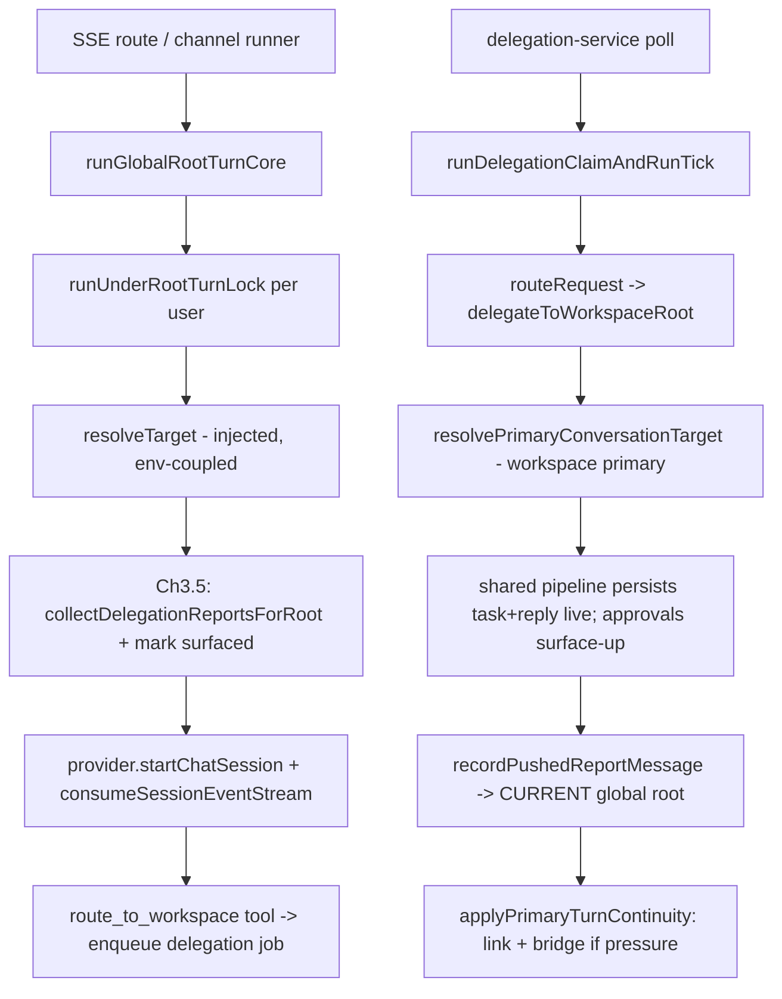
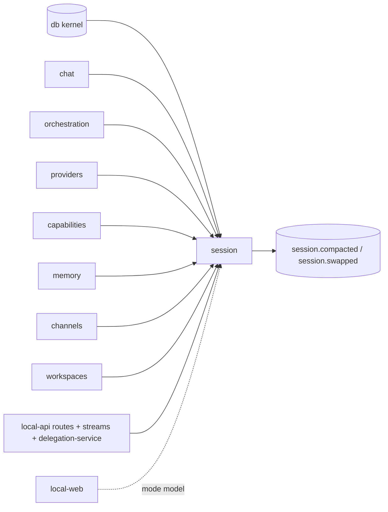

# Session — Structure

> The code map and connections for the session module. For the concepts behind it, see [overview.md](./overview.md).
>
> Folders touched: `packages/session/src/{runtime,delegation,continuity,repositories,schema}/` · `apps/local-api/src/sessions/` (the thin edge) · `apps/local-api/src/{routes/{chat,root,routing},streams,services}/`

`@vynel/session` is the **keystone composition tier**, not a plain leaf: it is the *parent of chat* and the turn service — *any caller invokes session and gets back a stream or a response*. It OWNS continuity (`primary_sessions`), the turn runners (global-root core, workspace `start-chat-turn`, seeded-swap), the per-turn composers, and the delegation engine that routes a task into a workspace's continuing brain. It imports **down** into `@vynel/chat` + `@vynel/orchestration` + `@vynel/providers` + the kernel; nothing below it imports back up (the two package-level mentions in `chat`/`orchestration` are comments, not imports). Deps: `@vynel/capabilities` `@vynel/channels` `@vynel/chat` `@vynel/contracts` `@vynel/db` `@vynel/errors` `@vynel/logger` `@vynel/memory` `@vynel/orchestration` `@vynel/providers` `@vynel/workspaces` `drizzle-orm` `pino`; dev `@vynel/agents` `@vynel/approvals` `@vynel/testing` (`packages/session/package.json`).

**Four export surfaces** (`package.json` `exports`):
- **`.`** — the WEB-SAFE barrel: only the `session-mode` model (`ask`/`auto`/`bypass`). `apps/web` may import it without dragging `@vynel/db`/providers into its bundle (migration-plan hard constraint #1).
- **`./runtime`** — the turn-execution surface (runners + `SessionSink` + composers). Pulls db/providers — never reaches the web bundle.
- **`./continuity`** — the durable-session identity + seed-fresh swap machinery.
- **`./delegation`** — the cross-domain delegation composition tier.

## File map

► = entry point / primary export.

### `.` (package root)

| Path | Role |
|---|---|
| ► `src/index.ts` | the WEB-SAFE package barrel — re-exports `session-mode` ONLY |
| `src/session-mode.ts` | user-facing `SessionMode` (`ask`/`auto`/`bypass`) + `toPermissionMode` → provider `SessionPermissionMode`; `SESSION_MODES` metadata + `DEFAULT_SESSION_MODE` (`ask`) |

### `runtime/` — turn execution

| Path | Role |
|---|---|
| ► `runtime/index.ts` | the `./runtime` subpath barrel — runners, `SessionSink`, resolvers, composers |
| `runtime/session-types.ts` | the `SessionSink` contract — per-turn divergence axis (SSE stream vs background drain); two-channel error model (in-stream `session-errored` via `onEvent` vs thrown → `onError`) |
| `runtime/run-global-root-turn-core.ts` | the SHARED global-root turn body — sink-parameterized; runs the WHOLE turn under `runUnderRootTurnLock`; injects `resolveTarget` (env-coupled) + opaque `mcpServers`; Ch3.5 delegation-report catch-up; voice directive |
| `runtime/start-chat-turn.ts` | the WORKSPACE turn runner — resolve provider → `startChatSession` → `consumeSessionEventStream`; wires the `onCompaction` capture bridge |
| `runtime/root-turn-lock.ts` | `runUnderRootTurnLock` — in-process per-user promise-chain serializer for global-root turns (one root SDK session per user; Phase-2 → Postgres advisory lock) |
| `runtime/global-root-instructions.ts` | `GLOBAL_ROOT_INSTRUCTIONS` — the global brain's operating prompt |
| `runtime/resolve-primary-conversation.ts` | `resolvePrimaryConversationTarget` — PRE-turn workspace primary get-or-create + resume id |
| `runtime/apply-primary-turn-continuity.ts` | POST-turn: LINK the primary to the SDK session it ran on, then BRIDGE if under context pressure |
| `runtime/bridge-primary-session-after-turn.ts` | the provider-bound bridge wrapper (owns the seeded-swap deps + the segment row) |
| `runtime/run-seeded-swap-session.ts` | run a fresh SDK session seeded with the carry summary (the swap's `startSeededSession`) |
| `runtime/compose-session-capabilities.ts` | per-turn PROMPT contribution — `VYNEL_AGENT_INSTRUCTIONS` + each enabled capability's contribution (memory today) |
| `runtime/vynel-agent-instructions.ts` | `VYNEL_AGENT_INSTRUCTIONS` — the always-on operating rules |
| `runtime/resolve-global-root-transcript.ts` | the global root's settled-transcript read (`/root/transcript`) |
| `runtime/test-support/fake-ai-agent-provider.ts` | the in-package fake provider (approval park/resolve + unique message ids); package-internal, unexported |

### `delegation/` — the delegation composition tier (brain-tree Ch 1–4)

| Path | Role |
|---|---|
| ► `delegation/index.ts` | the `./delegation` subpath barrel |
| `delegation/delegate-to-workspace-root.ts` | route a task INTO a workspace's continuing PRIMARY brain; drives the shared pipeline; surfaces approvals; denial circuit-breaker; `recordDelegation` edge; `ROUTED_TASK_INSTRUCTIONS` |
| `delegation/delegate-to-leaf-session.ts` | by-reference ("hand") delegation to a fresh agent leaf — *parked for the Phase-3 agent layer; kept + tested as the building block* |
| `delegation/run-delegation-claim-and-run-tick.ts` | the durable-queue CONSUMER — claim one job, run the workspace-root turn, push the report UP to the current global root, complete/fail; channel-aware output |
| `delegation/build-routed-approval-handler.ts` | the surface-up SURFACING half — origin-channel push + `ApprovalWaitGate` park/resolve + `abandonParked` (fail-closed) |
| `delegation/resolve-delegation-trace.ts` | the condensed, attributed trace of ONE request (`partialSessionId`) — reads orchestration's job + chat's messages, no heavy sessions |
| `delegation/turn-event-broadcaster.ts` | `TurnEventBroadcaster` — in-process pub/sub between a background turn's consume loop and SSE observers; `traceChannelKey` |

### `continuity/` — durable-session identity + swap

| Path | Role |
|---|---|
| ► `continuity/index.ts` | the `./continuity` subpath barrel |
| `continuity/session-continuity-types.ts` | `PrimarySessionRow`/`NewPrimarySessionRow` + `StructuralLogger` re-exports |
| `continuity/session-continuity-events.ts` | the two outbox events — `session.compacted` + `session.swapped` (constants + payload types) |
| `continuity/get-or-create-continuing-session.ts` | GENERIC identity getter by `(user, scope)` — `workspace`/`global`/`voice`; race-safe re-read on the partial-unique conflict |
| `continuity/get-or-create-primary-session.ts` | thin workspace-primary wrapper over the generic getter |
| `continuity/find-primary-conversation.ts` | read-only resolve (never creates) — "is there a continuing conversation, on what SDK session?"; workspace scope or global |
| `continuity/list-primary-sessions-for-user.ts` | published read for the monitor aggregator (all live primaries for a user) |
| `continuity/link-primary-session-to-sdk-session.ts` | repoint the primary at the SDK session a turn ran on (non-emitting — invariant #8) |
| `continuity/detect-context-pressure.ts` | pure pressure test — occupancy ÷ window vs `DEFAULT_CONTEXT_PRESSURE_THRESHOLD` (0.85) |
| `continuity/capture-compaction-summary.ts` | Layer-1 capture — resolve the primary by SDK session id, emit `session.compacted` (no-op when untracked) |
| `continuity/bridge-primary-session.ts` | Layer-2 seed-fresh SWAP — distill → seed fresh → repoint + `session.swapped` (one tx); `…IfUnderPressure` trigger |
| `continuity/session-store.ts` · `continuity/internal/filesystem-session-store.ts` | `SessionStore`/`SessionLocation` contract + the filesystem impl (its `rootDir` is a filesystem root, deliberately NOT renamed to `primary`) |

### `schema/` + `repositories/`

| Path | Role |
|---|---|
| `schema/primary-sessions.ts` | the `primary_sessions` table + `PrimarySessionScope` |
| `schema/index.ts` | schema barrel |
| `repositories/primary-sessions.ts` | the functional repo (db-first) |
| `repositories/index.ts` | repo barrel |

## Data & persistence

One owned table, `primary_sessions`, defined in `packages/session/src/schema/primary-sessions.ts` and registered in the kernel's `drizzle.sqlite.config.ts:53` (the schema-parity check enforces exactly-one-config registration). The table DDL lives in `packages/db/src/migrations-sqlite/0000_baseline.sql` — the `root_sessions → primary_sessions` rename was **folded into the baseline** (pre-release, zero data), so there is no rename migration.

**`primary_sessions`** — one row per continuing-session identity: the stable "primary" that maps to the CURRENT SDK session id. The primary id never changes; the SDK session under it is swapped invisibly. A DEDICATED table (not an extension of `chat`'s session table).

| Column | Type | Notes |
|---|---|---|
| `id` | id (PK) | UUID supplied by the core op |
| `userId` | id (FK → users, cascade) | the tenant boundary; on every row (Phase-2-ready) |
| `workspaceId` | text (FK → workspaces, cascade, **nullable**) | non-null for a `workspace` primary; NULL for `global`/`voice` (uses `text().references` because `id()` is NOT NULL by dialect contract) |
| `scope` | text (`PrimarySessionScope`) | `workspace` (default) / `global` / `voice`; NOT NULL DEFAULT `'workspace'` — additive |
| `currentSdkSessionId` | text (null) | the live SDK session the primary points at; null until first linked; repointed on swap |
| `supersededFromSdkSessionId` | text (null) | the SDK session the current one REPLACED at the last swap (supersession chain) |
| `createdAt` / `updatedAt` / `deletedAt` | timestamp | `deletedAt` = soft-delete (30 d retention) |

Indexes: `userId` · `workspaceId` · `deletedAt`. **Three partial-unique liveness pins** (all `WHERE deleted_at IS NULL`): one live WORKSPACE primary per `(user, workspace)`; one live GLOBAL primary per user (`scope = 'global'`); one live VOICE session per user (`scope = 'voice'`). The scope-gated globals are separate indexes because SQLite treats NULL `workspaceId`s as distinct, so the workspace index can't pin them.

**Loose refs into other modules:** `currentSdkSessionId` / `supersededFromSdkSessionId` are SDK session ids that correlate to `chat`'s `chat_sessions` — held as plain `text()`, no FK (cross-feature FKs are banned; loose-ref only).

## Repositories

Functional, `db`-first, tenant-filtered, `deletedAt IS NULL` on normal reads (`repositories/primary-sessions.ts`).

| Function (db-first) | Purpose |
|---|---|
| `findPrimarySessionById` | one live primary or null |
| `findPrimarySessionByCurrentSdkSessionId` | resolve the live primary pointing at an SDK session id (the PostCompact correlation) |
| `findPrimarySessionForWorkspace` | the single live primary for `(user, workspace)` |
| `findGlobalPrimarySessionForUser` / `findVoicePrimarySessionForUser` | the single live per-user global / voice session |
| `listPrimarySessionsForUser` | all live primaries for a user (monitor top level; no cursor — bounded) |
| `insertPrimarySession` | create (id supplied) |
| `repointPrimarySession` | set `currentSdkSessionId` + supersession marker (chat-start link + swap) |
| `softDeletePrimarySession` | set `deletedAt` |
| `hardDeletePrimarySessionsDeletedBefore` | retention-purge primitive (scheduled caller is a follow-up unit) |

## Core operations

### Continuity (`continuity/`)

| Operation | What it does | Key calls / events |
|---|---|---|
| `getOrCreateContinuingSession` | generic identity get-or-create by `(user, scope)`; race-safe re-read | `find*` + `insertPrimarySession` |
| `getOrCreatePrimarySession` | thin workspace-primary wrapper | `getOrCreateContinuingSession` |
| `findPrimaryConversation` | read-only resolve (never creates) — workspace or global | `findPrimarySessionForWorkspace` / `findGlobalPrimarySessionForUser` |
| `listPrimarySessionsForUser` | published monitor read | repo |
| `linkPrimarySessionToSdkSession` | repoint the primary at the SDK session a turn ran on | `repointPrimarySession` — **no outbox** (invariant #8, intentional) |
| `captureCompactionSummary` | Layer-1: emit `session.compacted` for a compacted primary; null when untracked | `insertOutboxEvent` |
| `bridgePrimarySession` / `…IfUnderPressure` | Layer-2 seed-fresh swap: distill (provider) → seed fresh (provider) → repoint + `session.swapped` in ONE tx | `summarizeSession`/`startSeededSession` (injected), `repointPrimarySession`, `insertOutboxEvent` |
| `detectContextPressure` | pure occupancy ÷ window test | — |

### Runtime (`runtime/`)

| Operation | What it does | Key calls |
|---|---|---|
| `runGlobalRootTurnCore` | the global-root turn — under the per-user lock: resolve target, Ch3.5 report catch-up + `markDelegationsSurfacedToRoot`, `startChatSession`, `consumeSessionEventStream` (workspaceId null, scope global, hidden), link on `session-created`, drive the `SessionSink` | `resolveTarget` (injected), `collectDelegationReportsForRoot`, `linkPrimarySessionToSdkSession`, provider |
| `startChatTurn` | the workspace turn — provider `startChatSession` + `consumeSessionEventStream`; registers the `onCompaction` capture | `resolveAiAgentProvider`, `captureCompactionSummary` |
| `resolvePrimaryConversationTarget` | PRE-turn workspace primary + resume id | `getOrCreatePrimarySession` |
| `applyPrimaryTurnContinuity` | POST-turn link + pressure-bridge; best-effort | `linkPrimarySessionToSdkSession`, `updateChatSession` (hide first segment), `bridgePrimarySessionAfterTurn` |
| `composeSessionCapabilities` | assemble the per-turn prompt append | `listEnabledCapabilities`, `buildMemorySessionContribution` |
| `resolveGlobalRootTranscript` | the global root's settled-transcript read | chat reads |

### Delegation (`delegation/`)

| Operation | What it does | Key calls / events |
|---|---|---|
| `delegateToWorkspaceRoot` | run the task on the workspace's primary brain through the shared pipeline; link on new/swap segment; surface approvals; denial breaker (`ROUTED_LEAF_MAX_CARDED_DENIALS`); fail-closed interrupt | `resolvePrimaryConversationTarget`, `consumeSessionEventStream`, `linkPrimarySessionToSdkSession`, `recordDelegation` |
| `delegateToLeafSession` | *(parked)* fresh-agent leaf delegation — run leaf, `recordLeafSession`, `recordDelegation` | `createLeafSession`, chat/orchestration |
| `runDelegationClaimAndRunTick` | claim one job → `routeRequest`/`delegateToWorkspaceRoot` → push report to the CURRENT global root → complete/fail; channel-aware delivery | `claimNextPendingDelegationJob`, `routeRequest`, `recordPushedReportMessage`, `enqueueChannelReply`, `completeDelegationJob`/`failDelegationJob` |
| `buildRoutedApprovalHandler` | surface-up: origin-channel card push + wait-gate park/resolve + `abandonParked` | `enqueueApprovalRequestForRecipient`, `ApprovalWaitGate` |
| `resolveDelegationTrace` | assemble a request's condensed trace (job + chat messages) | `findDelegationJobByPartialSessionId`, chat repos |

## HTTP surface — none owned; consumed at the api edge

The package ships **no routes**. Its logic is invoked from `apps/local-api`, which keeps a deliberately thin edge under `apps/local-api/src/sessions/` (`README.md` there). What STAYS app-side — and WHY (per `docs/module-notes/session.md` §"the delegation lift"):

| Edge file | Why it can't move into the package |
|---|---|
| `compose-session-mcp-servers.ts` | LOCKED `api-side-turn-execution-with-mcp` — core stays below the MCP producers; every consumer is app-side |
| `run-global-root-turn.ts` | dynamically imports `@vynel/mcp` (= `apps/mcp`) — a package may never import an app |
| `global-root-workspace.ts` | reads `env.ts` (`VYNEL_USER_DATA_DIR`) — env access lives only in the app |
| `resolve-global-root-conversation.ts` | composes the env-coupled dir; it IS the injected `resolveTarget` seam |
| `delegation-{mode,origin}-header.ts` | HTTP wire encoding of orchestration types — a transport concern |
| `build-schedule-fire-deps.ts` | assembles deps from `factory.ts` — app DI by definition |

The env/edge asymmetry is deliberate: the **workspace** resolver LIFTS into the package (its cwd is a workspace-record field), the **global-root** resolver STAYS at the edge (its cwd is an env read) and is injected as `resolveTarget`.

Routes that consume the package: `apps/local-api/src/routes/chat/` (workspace turn + `findPrimaryConversation` + `SESSION_MODES`), `routes/root/` (global brain — transcript, trace, `traceChannelKey`, session mode), `routes/routing/` (`findPrimaryConversation`); the SSE `streams/{chat-turn,global-root-turn}.ts` drive the runners with `SessionSink`s.

## MCP surface

The session package exposes **no `McpFeatureDescriptor`**. The routing/delegation MCP tools ride the route-derived `vynel` server built at the api edge; the runners forward an **opaque, pre-composed** `mcpServers` (composition stays at `apps/local-api/src/sessions/compose-session-mcp-servers.ts` under the locked `api-side-turn-execution-with-mcp` rule).

## Background jobs

The package owns no worker. The delegation queue's poll loop is the in-process `apps/local-api/src/services/delegation-service.ts`, which calls `runDelegationClaimAndRunTick` on a cadence; the `TurnEventBroadcaster` (constructed in `apps/local-api/src/{app,server}.ts`) is threaded in for live SSE observing. The `primary_sessions` retention purge (`hardDeletePrimarySessionsDeletedBefore`) has no scheduled caller yet — a follow-up unit.

## Web surface

`apps/web` touches **only** the web-safe `.` barrel (the mode model) — never `./runtime`/`./continuity`/`./delegation` (the bundle-safety invariant). Real importers today: `apps/local-web/src/stores/ui-store.ts` and `apps/local-web/src/composables/chat/chat-turn-stream.ts` consume `SessionMode`/`SESSION_MODES`; the actual turn streams flow over the api's SSE endpoints, not a direct package import.

## Pipeline — "voice/channel asks the global brain; it routes into a workspace's brain; the report comes back"

1. A turn enters via `apps/local-api/src/streams/global-root-turn.ts` (SSE) or the channel runner — both reduce to `runGlobalRootTurnCore` (`runtime/run-global-root-turn-core.ts`), differing only in the `SessionSink`.
2. The WHOLE turn runs under `runUnderRootTurnLock(userId, …)` (`runtime/root-turn-lock.ts`) — one root SDK session per user, single writer.
3. `deps.resolveTarget()` (injected from `apps/local-api/src/sessions/resolve-global-root-conversation.ts`) get-or-creates the global primary + resume id + the hidden user-data cwd.
4. Ch3.5 catch-up: `collectDelegationReportsForRoot` prepends unseen terminal reports to the PROVIDER input only, then `markDelegationsSurfacedToRoot` (exactly-once) (`run-global-root-turn-core.ts:140-147`).
5. The brain runs through `consumeSessionEventStream` (workspaceId null, scope global, hidden, no auto-title); `linkPrimarySessionToSdkSession` fires on each `session-created`.
6. When the brain calls `route_to_workspace`, a `delegation_jobs` row is enqueued (orchestration). The in-process `delegation-service.ts` claims it via `runDelegationClaimAndRunTick` (`delegation/run-delegation-claim-and-run-tick.ts`).
7. `routeRequest` → `delegateToWorkspaceRoot` (`delegation/delegate-to-workspace-root.ts`) resumes the workspace's OWN primary (`resolvePrimaryConversationTarget`) and drives the shared pipeline — task, reply, tool calls persist LIVE, attributed "From Global" / "Mark · workspace"; carded approvals surface up via `buildRoutedApprovalHandler`; the denial breaker interrupts a stuck leaf.
8. On completion the report is pushed to the **re-resolved current** global root (`recordPushedReportMessage`) — swap-safe — and, if a channel drove it, delivered back to that channel.
9. At the workspace turn boundary `applyPrimaryTurnContinuity` (`runtime/apply-primary-turn-continuity.ts`) links the primary and, if `detectContextPressure` crosses 0.85, runs the seed-fresh swap (`bridgePrimarySession`) so the next turn starts on a fresh SDK session — the user's thread identity unbroken.

## Connections

**Summary:** session is the **top composition tier** (a hub that imports down, not a read-side leaf). It owns continuity + the runners and reaches into chat/orchestration/providers/channels/workspaces/capabilities/memory; only `apps/local-api` (all surfaces) and `apps/web` (the mode model) import it. It publishes two continuity events; it consumes none.

| Unit | Direction | Mechanism | What crosses |
|---|---|---|---|
| db kernel (`@vynel/db`) | out | import | `Database`, `withTransaction`, `insertOutboxEvent`, `users`/`workspaces` FKs |
| [chat](../chat/overview.md) | out | import (+ `@vynel/chat/repositories` subpath) | `consumeSessionEventStream`, `recordPushedReportMessage`, `recordLeafSession`, `ChatTurnEvent`, `updateChatSession` |
| [orchestration](../orchestration/overview.md) | out | import | delegation-queue ops, `routeRequest`, `ApprovalWaitGate`, `collect`/`markDelegationsSurfacedToRoot`, `recordDelegation` |
| [providers](../providers/overview.md) | out | import (+ injected) | `resolveAiAgentProvider`, `AiAgentProvider`; swap deps injected |
| [capabilities](../capabilities/overview.md) · [memory](../memory/overview.md) | out | import | `listEnabledCapabilities`; `buildMemorySessionContribution` |
| [channels](../channels/overview.md) · [workspaces](../workspaces/overview.md) | out | import | approval/report delivery; `findWorkspaceById`/`resolveManagerName` |
| [contracts](../contracts/overview.md) · errors · logger | out | import / type-only | `resolveContextWindow`; typed errors; `StructuralLogger` |
| local-api (app, routes, streams, services, `sessions/` edge) | in | import (all 4 subpaths) | drives every runner + resolver; injects `resolveTarget`/MCP/DI |
| local-web | in | SDK / `.` barrel | `SessionMode` / `SESSION_MODES` only |

**Events published** (each co-committed in its state-change tx):
- `session.compacted` — `captureCompactionSummary` emits the SDK's compaction summary for a tracked primary (memory-fold consumer is a follow-up unit).
- `session.swapped` — `bridgePrimarySession` emits after a seed-fresh swap (repoint + event in one `withTransaction`).

**Events consumed:** none.

## Config & gotchas

- **The `.` barrel is web-safe by contract.** Only `session-mode` is re-exported from `index.ts`; the runners/continuity/delegation live behind subpaths so `apps/web` never pulls db/providers into its bundle. Adding a db/provider import to `index.ts` breaks the bundle-safety invariant.
- **Env/edge split is intentional.** The workspace resolver lifts into the package; the global-root resolver + MCP composition + env reads STAY at the `apps/local-api/src/sessions/` edge and are injected. Don't try to "finish the move" — each edge file has a live reason (README table above).
- **The root-turn lock is the SOLE acquirer.** `runGlobalRootTurnCore` wraps the whole turn in `runUnderRootTurnLock`; callers must NOT re-wrap it (non-reentrant promise-chain serializer — a nested same-user acquire deadlocks). Phase-2 multi-pod replaces it with a Postgres advisory lock.
- **Two continuity layers, independent.** Layer 1 (`captureCompactionSummary`, ride SDK auto-compaction) and Layer 2 (`bridgePrimarySession`, explicit seed-fresh swap) do not depend on each other. The swap's async provider calls stay OUTSIDE the tx (sqlite txns can't span an await); only the repoint + event are transactional.
- **`link*` is deliberately non-emitting** (invariant #8) — initial-link + identity-create write `primary_sessions` without an outbox event; only compaction/swap are cross-domain events.
- **`delegateToLeafSession` is parked** — kept + tested for the Phase-3 agent hierarchy; the live routing path uses `delegateToWorkspaceRoot`.
- **Swap-safe report push** — `runDelegationClaimAndRunTick` re-resolves the CURRENT global root at push time, never the job's enqueue-time `parentSessionId` (the root may have swapped mid-run).
- **`root → primary` rename folded into `0000_baseline.sql`** (pre-release, zero data) — there is no rename migration. The filesystem store's `rootDir` is a filesystem root and was deliberately NOT renamed.
- **Vocabulary drift to sweep later** (per `docs/module-notes/session.md`): cross-package loose-ref field names `globalRootSessionId` (chat) + `rootSessionId` (contracts) still use the old vocab; they rename when those surfaces are next touched. Doc vocab in `docs/architecture.md §5` / `docs/scaffold.md` still cites `rootSessionId`.

---
*Mapped from the code on disk, 2026-07-14. If you change this module, update this file and [overview.md](./overview.md).*
