# Skills — Overview

> Vynel's layer for installing, configuring, and bridging agent capabilities onto the AI provider's native on-disk skill system. The domain behind the agent knowing how to draft an email in your voice.
>
> **Status:** shipped · **Phase:** 1 (with a Phase 1.5 cloud-install path already landed) · **Depends on:** [users](../users/overview.md), [workspaces](../workspaces/overview.md), [providers](../providers/overview.md), [contracts](../contracts/overview.md) · **Code map:** [structure.md](./structure.md)

## Purpose

A skill is a named, installable bundle of agent behaviour — at heart a SKILL.md file written to the provider's native skill location on disk, optionally paired with MCP server registrations. When the agent opens a session it reads those files as part of its context, and the skill shapes how it works.

This leaf owns the *Vynel side* of that story: the database record of what a user has installed and where, a settings system that personalises each skill through template rendering, a disk bridge that writes the SKILL.md and patches the provider's MCP config, and a synchronisation step that reconciles what Vynel tracks against what the provider actually sees on disk. The leaf is deliberately unopinionated about the provider's skill *runtime* — it writes files; the provider reads them. It is also deliberately thin about the catalog: the set of skills Vynel ships is a compiled-in constant that lives in the shared contracts kernel, not in this leaf.

## What it can do

- **Install a bundled skill** at *user* scope (active in every workspace the user owns) or *workspace* scope (that workspace only). It renders the catalog template with the chosen settings, writes the SKILL.md and MCP config to the provider's disk location first, then commits the database row and a lifecycle event atomically.
- **Install a cloud skill** downloaded from the marketplace — the artifact-sourced twin of a bundled install. It verifies the archive's SHA-256 against the recorded hash *before* anything untrusted is parsed or written, extracts the SKILL.md, then follows the same disk-first, atomic-commit path and records the install as marketplace-sourced.
- **Uninstall a skill** — removes the on-disk files and hard-deletes the row instantly. Settings cascade away with it; there is no soft-delete window, because a skill is fully re-creatable by re-installing.
- **Enable / disable a skill** — disable genuinely removes the on-disk files so the agent stops seeing the skill, while preserving the row and its settings; enable rewrites the files from the current resolved settings.
- **Configure settings** — each bundled skill exposes a typed settings schema (string, number, boolean, string-enum). Updating a value re-renders the SKILL.md in place while the skill is enabled.
- **Introspect the installed set** — a joined read returns each installed skill with its catalog definition (when it has one) and its resolved settings, for the current user-and-workspace context.
- **Synchronise with the provider** *(background)* — at workspace open or on an explicit refresh, reconcile Vynel's records against on-disk reality: rows whose files are gone become *missing-on-disk*, and skills found on disk that Vynel never installed are recorded as *external* installs.

## Responsibilities

**Owns** — the two database tables (installed skills and skill settings) and their repositories; the disk bridge (the SKILL.md writer, the cloud-artifact writer, the MCP-config patcher, and path resolution for each scope); the pure settings resolver (defaults merged with per-installation overrides); the sync reconciler; the six lifecycle operations (bundled install, cloud install, uninstall, enable, disable, settings-update) and the read queries; and the four lifecycle outbox events.

**Does not own** —
- **the verified-skill catalog** — the compiled-in list of skills Vynel ships, their templates, settings schemas, and required-MCP specs live in the [contracts](../contracts/overview.md) kernel; this leaf reads it but does not define it;
- **the provider's skill *runtime*** — this leaf writes the files, the [providers](../providers/overview.md) layer's provider reads them and, via its skill-discovery method, is what surfaces external installs to the sync;
- **the HTTP surface** — the routes that expose these operations live in the local-api app, not the package (apps are thin adapters over this core);
- **the [marketplace](../marketplace/overview.md) storefront** — marketplace is a read-only annotation layer over the catalog and install state; when a user installs from it, it calls back into this leaf's own install operations, so there is one install code path and this leaf owns it;
- **onboarding's auto-install decisions** — [onboarding](../onboarding/overview.md) decides *when* to seed a skill and calls the install operation directly; the system-installed flag it keys on lives on the catalog entry, not here.

## Concepts & vocabulary

| Term | Meaning |
|---|---|
| **Verified skill** | A catalog entry compiled into the app — a definition carrying a display name, category, version, SKILL.md template, settings schema, required-MCP spec, and a system-installed flag. Lives in the contracts kernel. |
| **Verified catalog** | The compiled-in constant array of verified skills. There is no runtime catalog fetch in Phase 1 — bundling keeps offline reliability and the trust story simple. Phase 1 ships one entry: an email drafter. |
| **Installed skill** | One database row — a specific catalog entry (or an external skill) installed at a particular scope for a particular user. Each row records where its SKILL.md lives on disk, its source, its version, and its install health. |
| **Scope** | `user` — active in every workspace the user owns (files written under the user's home skill directory); `workspace` — active only in one workspace (files written under that workspace's skill directory). A user-scope row and a workspace-scope row for the same skill can coexist. |
| **Install source** | Where a row came from: *verified-catalog* (installed from the bundled catalog), *marketplace* (installed from a downloaded cloud artifact), or *external* (installed by the user via raw provider tooling outside Vynel, discovered by the sync). |
| **Install health** | An on-disk reality snapshot: *healthy*, *missing-on-disk* (row exists, files gone), *mcp-config-drift* (files present, MCP config mismatched), or *failed-install* (partial error). Refreshed on each sync. |
| **Disk-first ordering** | Every install writes the files and patches MCP config *before* the database transaction opens. If the file write fails, no row is created; if the write succeeds but the commit fails, the orphaned files are recoverable — the next sync records them as an external install. |
| **Provider bridge** | The path from a Vynel install to the provider's native location: the SKILL.md under the scope's skill directory, plus the scope's MCP config file, which is *patched* (only this skill's server entries added or removed), never replaced. |
| **Template rendering** | Settings values are substituted into placeholders in the catalog's SKILL.md template to produce the final file. Re-rendered on enable and on every settings update. |
| **Resolved settings** | The merge of catalog defaults with per-installation stored overrides — the view both the renderer and the settings surface consume. Computed by a pure function; a malformed stored value falls back to the catalog default. |
| **Sync** | The reconciliation run at workspace open (or on explicit refresh, never on a timer): mark rows whose files are gone, insert on-disk-only skills as external rows, refresh every row's health. Idempotent. |
| **System-installed flag** | A catalog-entry flag: system-installed skills are auto-installed by onboarding and cannot be uninstalled (the attempt is refused), though they may still be disabled. The mechanism is retained but currently dormant — Phase 1 has no active system-installed skill after an earlier entry was retired. |

## Rules & invariants

- **Every installed-skill row belongs to exactly one user.** Reads and mutations carry the tenant filter; a row owned by another user matches nothing and reads as not-found — no enumeration leak.
- **Disk-first on every install.** The file write precedes the database transaction. A failed write leaves no row; a failed commit after a good write leaves recoverable orphans, not corruption.
- **Cloud installs verify integrity before touching anything.** A downloaded skill's SHA-256 is checked against the recorded hash first; a mismatch aborts the install before the archive is parsed or written.
- **Uninstall is an instant hard-delete.** No soft-delete, no retention window; settings cascade with the parent row. Skills carry no audit value because they are fully re-creatable by re-installing.
- **Disable is real, not a flag.** Disabling removes the on-disk files so the agent genuinely stops seeing the skill; the row and settings are preserved so enable can rebuild the files.
- **System-installed skills cannot be uninstalled.** The catalog flag is the only check; the attempt is refused. Disable remains available.
- **Every state change emits an outbox event in the same transaction.** Install, uninstall, enable/disable, and settings-update each co-commit a lifecycle event. Phase 1 has no consumers — the events are published from day one so later subscribers need no producer-side change.
- **Settings are stored JSON-encoded and decoded defensively.** The core encodes on write; the resolver decodes on read and falls through to the catalog default on anything malformed or non-scalar.
- **MCP config files are patched, not replaced.** The bridge reads the existing config, adds or removes only this skill's server entries, and writes back the merged object — the user's hand-edited keys survive.
- **User-scope and workspace-scope rows for the same skill can coexist.** A partial unique index handles the NULL-workspace case correctly, after the original design's NULL assumption proved wrong under test.

## Lifecycle

```mermaid
stateDiagram-v2
    [*] --> Available: entry exists in catalog
    Available --> Installed: install (disk write + row + event)
    Available --> Installed: cloud install (verify sha, then disk write + row + event)
    Installed --> Enabled: enabled on install
    Enabled --> Disabled: disable (files removed; row + settings kept)
    Disabled --> Enabled: enable (files rewritten from resolved settings)
    Enabled --> SettingsUpdated: update settings (SKILL.md re-rendered)
    SettingsUpdated --> Enabled: remains enabled
    Enabled --> Uninstalled: uninstall (files removed + hard-delete + cascade)
    Disabled --> Uninstalled: uninstall
    Uninstalled --> [*]
    Enabled --> MissingOnDisk: user removes files externally (sync flags health)
    MissingOnDisk --> Enabled: recover via disable then enable (rewrites files)
    Available --> ExternalInstalled: user installs via raw provider tooling
    ExternalInstalled --> Installed: sync discovers + inserts external row
```

## Where it sits in the bigger picture

Skills is the domain that makes agent capabilities installable and configurable, and it lives close to several neighbours. [Onboarding](../onboarding/overview.md) seeds a user's first skills on first run by calling this leaf's install operation directly. [Marketplace](../marketplace/overview.md) is the storefront: a read-only projection of the catalog and install state that delegates every write back to this leaf's install operations — the cloud-install path with its integrity check is the single door through which downloaded skills enter. When [chat](../chat/overview.md) or [channels](../channels/overview.md) start a session, the agent reads the SKILL.md files this leaf wrote; the capabilities layer decides which are active for that session. [Providers](../providers/overview.md) supply the skill-discovery method the sync leans on to surface external installs. Two of this domain's read operations are exposed to the agent as safe MCP tools through their route annotations; mutating operations are deliberately not — MCP exposure is safe-by-default and waits for a reviewed use case. Finally, this leaf's "every installable thing lands as a visible file under the scope's directory" convention is the precedent the [agents](../agents/overview.md) domain follows with its own on-disk transparency mirror.

---
*Mapped from the code on disk, 2026-07-14. If you change this module, update this file and [structure.md](./structure.md).*
