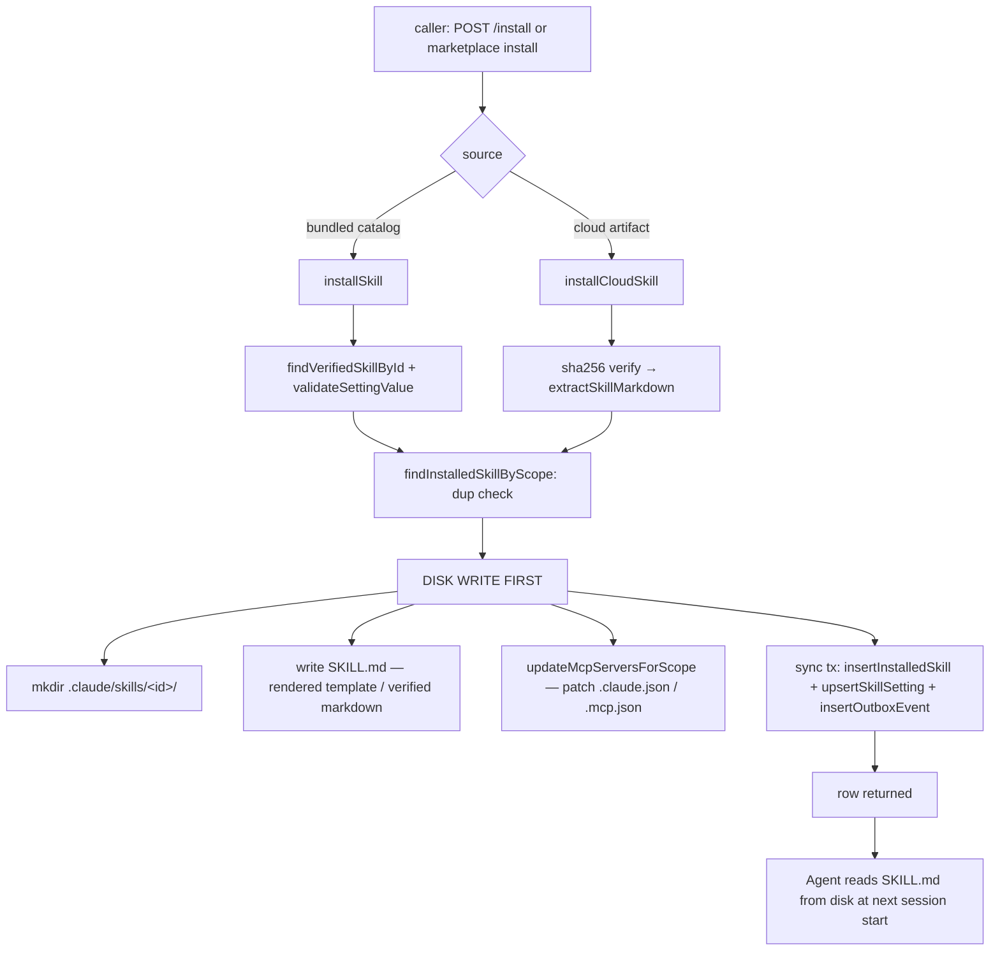
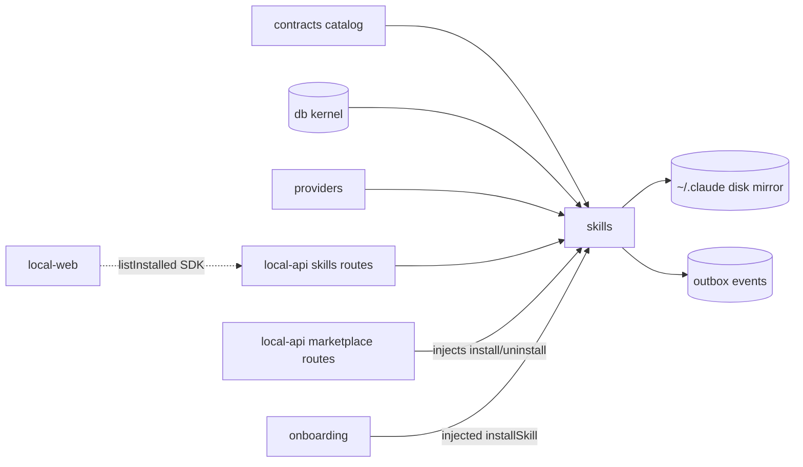

# Skills — Structure

> The code map and connections for the `skills` leaf. For the concepts behind it, see [overview.md](./overview.md).
>
> Folders touched: `packages/skills/src/` · `apps/local-api/src/routes/skills/` · `apps/local-web/src/composables/skills/` · migration DDL in `packages/db/src/migrations-sqlite/0000_baseline.sql`

`skills` is a vertical-slice leaf: it owns its own `schema/`, `repositories/`, and operations
(`queries/` · `lifecycle/` · `settings/` · `internal/`) under `packages/skills/src/`, exposed
through one barrel (`index.ts`) and wired into `apps/local-api` routes. Its defining trait is a
**disk mirror**: every install/enable/disable/uninstall writes or removes real files under
`~/.claude/skills/` (or `<workspace>/.claude/skills/`) plus the matching MCP config — the DB row
is bookkeeping for what is physically on disk.

## File map

`► ` = entry point.

| Path | Role |
|---|---|
| ► `packages/skills/src/index.ts` | Public barrel of `@vynel/skills` — re-exports domain types + 4 outbox event constants, then the queries · lifecycle · settings ops. Schema + repositories are internal |
| `packages/skills/src/skills-types.ts` | Domain-only types: re-exports row types from repositories + `StructuralLogger`; defines `ResolvedSkillSettings` |
| `packages/skills/src/skills-events.ts` | 4 outbox event constants (`SKILL_INSTALLED` / `SKILL_UNINSTALLED` / `SKILL_ENABLED_CHANGED` / `SKILL_SETTINGS_UPDATED`) + payload interfaces |
| `packages/skills/src/schema/installed-skills.ts` | `installed_skills` table + `SkillScope` / `InstalledFromSource` / `InstallHealth` enums + row types |
| `packages/skills/src/schema/skill-settings.ts` | `skill_settings` table — composite PK `(installedSkillId, settingKey)`, JSON-encoded values |
| `packages/skills/src/schema/index.ts` | Schema barrel — re-exports both tables |
| `packages/skills/src/repositories/installed-skills.ts` | `findInstalledSkillById`, `findInstalledSkillByScope`, `listInstalledSkillsForUserAndWorkspace`, `insertInstalledSkill`, `updateInstalledSkill`, `hardDeleteInstalledSkill` |
| `packages/skills/src/repositories/skill-settings.ts` | `listSettingsForInstalledSkill`, `upsertSkillSetting`, `deleteAllSettingsForInstalledSkill` |
| `packages/skills/src/repositories/index.ts` | Repository barrel (mandatory — `@vynel/db` exports map wires `./repositories/*`) |
| `packages/skills/src/queries/list-available-skills.ts` | Pure read of `VERIFIED_SKILL_CATALOG` (imported from contracts) |
| `packages/skills/src/queries/list-installed-skills-for-context.ts` | Join: rows → catalog definition lookup → resolved settings; feeds `GET /installed` |
| `packages/skills/src/queries/list-installed-skills-for-user-and-workspace.ts` | Published RAW-row read surface — the cross-domain seam marketplace annotates against |
| `packages/skills/src/lifecycle/install-skill.ts` | Bundled-catalog install: catalog lookup → settings validation → dup check → **disk write first** → sync tx (row + settings + outbox) |
| `packages/skills/src/lifecycle/install-cloud-skill.ts` | Artifact twin of install: sha256 verify → extract SKILL.md → disk write → sync tx (row + outbox); `installedFromSource: 'marketplace'` |
| `packages/skills/src/lifecycle/uninstall-skill.ts` | System-install guard → FS remove → sync tx (hard-delete + outbox) |
| `packages/skills/src/lifecycle/enable-skill.ts` | No-op if enabled → rewrite SKILL.md from resolved settings → flip `isEnabled` true + outbox |
| `packages/skills/src/lifecycle/disable-skill.ts` | No-op if disabled → remove on-disk files → flip `isEnabled` false + outbox (row + settings kept) |
| `packages/skills/src/lifecycle/synchronize-skills-with-provider.ts` | Reconcile DB rows vs `provider.discoverInstalledSkills`; FS presence reads outside tx, state committed inside |
| `packages/skills/src/settings/update-skill-settings.ts` | Validate → sync tx (upsert + outbox) → re-render SKILL.md if enabled |
| `packages/skills/src/settings/resolve-skill-settings.ts` | Pure merge: catalog defaults + stored rows → `ResolvedSkillSettings`; malformed JSON falls through to default |
| `packages/skills/src/internal/install-skill-on-disk.ts` | **Only FS writer** for bundled skills — mkdir + template render + MCP config patch |
| `packages/skills/src/internal/write-cloud-skill-on-disk.ts` | FS writer for cloud skills — `SAFE_SKILL_ID` guard + mkdir + write verbatim SKILL.md (no template, no MCP) |
| `packages/skills/src/internal/uninstall-skill-from-disk.ts` | Removes the skill folder + patches MCP config to drop the skill's servers; idempotent |
| `packages/skills/src/internal/update-mcp-servers-for-scope.ts` | Read-merge-write of `~/.claude.json` (user) or `<workspace>/.mcp.json` (workspace); touches only `mcpServers`, preserves all other keys |
| `packages/skills/src/internal/extract-skill-markdown.ts` | Reads `SKILL.md` out of a verified zip artifact; zip-bomb caps (artifact 10 MB · entries 200 · markdown 512 KB) + declared-size + post-inflate backstops |
| `packages/skills/src/internal/read-declared-uncompressed-size.ts` | Defensive read of jszip's internal declared uncompressed size (returns null if the field moves) |
| `packages/skills/src/internal/render-skill-markdown-template.ts` | `{{ settings.<key> }}` substitution in the SKILL.md template; unknown placeholders ship as-is (D7) |
| `packages/skills/src/internal/validate-setting-value.ts` | Validates a scalar against a `SkillSettingSchema` (string / number / boolean / string-enum + constraints) |
| `packages/skills/src/internal/require-workspace-install-binding.ts` | Fail-fast guard: a workspace-scope install must carry both `workspaceId` + `workspacePath` |
| `packages/skills/src/internal/resolve-skills-root.ts` | User scope → `~/.claude/skills/`; workspace scope → `<workspacePath>/.claude/skills/` |
| `packages/skills/src/internal/resolve-mcp-config-path.ts` | User scope → `~/.claude.json`; workspace scope → `<workspacePath>/.mcp.json` |
| `packages/skills/src/internal/resolve-host-home-dir.ts` | The test seam — `os.homedir()` behind `resolveHostHomeDir()` + `withHomeDir(...)` override |
| `packages/skills/src/internal/check-install-location-exists.ts` | `fs.access` wrapper — used by sync to check on-disk presence |
| `packages/skills/src/test-support/host-home-dir.ts` | Cross-package test export of `withHomeDir` (for the local-api route tests that drive real installs) |
| ► `apps/local-api/src/routes/skills/index.ts` | 8 routes mounted at `/workspaces/:workspaceId/skills`; 2 GETs carry `x-mcp` |
| `apps/local-api/src/routes/skills/schemas.ts` | Zod request/response schemas (`InstallSkillRequestSchema`, `UpdateSkillSettingsRequestSchema`, `InstalledSkillIdParamSchema`, response schemas) |
| `apps/local-api/src/routes/skills/serializers.ts` | `serializeVerifiedSkill`, `serializeInstalledSkillRow`, `serializeInstalledSkillWithDefinition`, `serializeResolvedSettings` |
| ► `apps/local-web/src/composables/skills/use-installed-skills.ts` | vue-query wrapper — `skills.listInstalled(workspaceId)`, fetches only while the skills drawer is active |
| `apps/local-web/src/components/workspace/WorkspaceSectionPanel.vue` | The only skills UI — read-only list of installed skills (name/description + On/Off pill) |

## Data & persistence

DDL is **baseline-folded** into `packages/db/src/migrations-sqlite/0000_baseline.sql` (there is no
per-table migration file). The schema files are registered for drizzle-kit migration generation by
relative path in `drizzle.sqlite.config.ts` (lines 38–39); the `@vynel/db` kernel does not import
the skills schema at runtime — repositories import their own table files directly.

**`installed_skills`** — one row per installed skill per scope. No `deletedAt` — uninstall is an
instant hard-delete (D13).

| Column | Type | Notes |
|---|---|---|
| `id` | text (PK) | UUID supplied by the core layer |
| `userId` | text (FK → `users.id`, cascade) | Tenant boundary — hard FK to a **kernel** table (allowed) |
| `workspaceId` | text (FK → `workspaces.id`, cascade, **nullable**) | `null` = user-scope; non-null = workspace-scope. `text().references()` because `id()` is NOT NULL by dialect contract |
| `skillId` | text | **Loose ref** to the catalog id (e.g. `email-drafter`) — no FK; provider-reported name for `external` |
| `scope` | text | `user` \| `workspace` |
| `installedFromSource` | text | `verified-catalog` \| `marketplace` \| `external` |
| `versionInstalled` | text | Semver at install; `unknown` for external |
| `installLocation` | text | Absolute path to the SKILL.md — used by sync's `fs.access` check |
| `installHealth` | text | `healthy` \| `missing-on-disk` \| `mcp-config-drift` \| `failed-install` |
| `installHealthMessage` | text (null) | Human-readable health note |
| `isEnabled` | boolean | Whether the on-disk files are currently present |
| `installedAt`, `updatedAt` | timestamp | |

Indexes: `idx_installed_skills_user` (`userId`); `idx_installed_skills_workspace` (`workspaceId`);
3-column unique `uniq_installed_skills_user_workspace_skill` (`userId, workspaceId, skillId`) for
cross-scope coexistence; **partial** unique `uniq_installed_skills_user_scope_skill`
(`userId, skillId` `WHERE workspace_id IS NULL`) — the D9 corrective fix (two NULLs are DISTINCT in
a plain unique index, so the 3-col index alone does not block duplicate user-scope rows).

**`skill_settings`** — per-installation key/value pairs. Composite PK `(installedSkillId, settingKey)`.

| Column | Type | Notes |
|---|---|---|
| `installedSkillId` | text (FK → `installed_skills.id`, cascade) | No `userId` — isolation is FK-transitive; cascade purges settings on uninstall |
| `settingKey` | text | Matches a `settingKey` in the catalog's `settingsSchema` |
| `settingValue` | text | JSON-encoded scalar (string / number / boolean) |
| `updatedAt` | timestamp | |

## Repositories

Functional, `db`-first, stateless. `find*` returns `null`; mutating fns encode the `userId` tenant
filter in the WHERE clause (a cross-tenant miss returns null/false → core maps to `NotFoundError`).

| Function | Purpose |
|---|---|
| `findInstalledSkillById(db, id)` | One row by id or `null` — ownership check reads `row.userId` at the core layer |
| `findInstalledSkillByScope(db, {userId, workspaceId, skillId})` | Scope-aware lookup (`workspaceId: null` = user-scope) — dup detection on install |
| `listInstalledSkillsForUserAndWorkspace(db, {userId, workspaceId})` | With workspace: union of user-scope (NULL) + that workspace's rows, `installedAt desc`. `null` = user-scope rows only |
| `insertInstalledSkill(db, newRow)` | Create (id supplied by caller); throws if no row returned |
| `updateInstalledSkill(db, id, userId, patch)` | Tenant-filtered update; auto-sets `updatedAt`; returns `null` on miss |
| `hardDeleteInstalledSkill(db, id, userId)` | Tenant-filtered hard-delete; cascades to `skill_settings`; returns `boolean` |
| `listSettingsForInstalledSkill(db, id)` | All settings rows for one install |
| `upsertSkillSetting(db, input)` | Insert-or-update on the composite PK |
| `deleteAllSettingsForInstalledSkill(db, id)` | Bulk purge (available; cascade normally handles this) |

## Core operations

Every mutating op writes/removes disk **first**, then co-commits state + outbox in one
`withTransaction(db, tx => …)`. FS work never happens inside the tx (the sync tx body cannot await).

| Operation | What it does | Key calls (incl. outbox / tx) |
|---|---|---|
| `listAvailableSkills()` | Pure read of `VERIFIED_SKILL_CATALOG` | — |
| `listInstalledSkillsForContext(db, {userId, workspaceId})` | rows → definition lookup → settings → resolve | `listInstalledSkillsForUserAndWorkspace`, `findVerifiedSkillById`, `resolveSkillSettings` |
| `listInstalledSkillsForUserAndWorkspace(db, input)` | Published RAW-row read for cross-domain consumers | repo passthrough |
| `installSkill(db, input)` *(async)* | catalog check → validate → dup check → disk write → tx | `findVerifiedSkillById`, `validateSettingValue`, `findInstalledSkillByScope`, `installSkillOnDisk`, `insertInstalledSkill`, `upsertSkillSetting`, `insertOutboxEvent('skill.installed')` |
| `installCloudSkill(db, input)` *(async)* | sha256 verify → extract → dup check → disk write → tx | `createHash`, `extractSkillMarkdown`, `findInstalledSkillByScope`, `writeCloudSkillOnDisk`, `insertInstalledSkill`, `insertOutboxEvent('skill.installed')` |
| `uninstallSkill(db, input)` *(async)* | ownership → system-install guard → FS remove → tx | `findInstalledSkillById`, `findVerifiedSkillById`, `uninstallSkillFromDisk`, `hardDeleteInstalledSkill`, `insertOutboxEvent('skill.uninstalled')` |
| `enableSkill(db, input)` *(async)* | ownership → no-op if enabled → rewrite SKILL.md → tx | `findInstalledSkillById`, `resolveSkillSettings`, `installSkillOnDisk`, `updateInstalledSkill`, `insertOutboxEvent('skill.enabled-changed')` |
| `disableSkill(db, input)` *(async)* | ownership → no-op if disabled → remove files → tx | `findInstalledSkillById`, `uninstallSkillFromDisk`, `updateInstalledSkill`, `insertOutboxEvent('skill.enabled-changed')` |
| `updateSkillSettings(db, input)` *(async)* | ownership → catalog check → validate → tx → re-render if enabled | `findInstalledSkillById`, `findVerifiedSkillById`, `validateSettingValue`, `upsertSkillSetting`, `insertOutboxEvent('skill.settings-updated')`, `installSkillOnDisk` |
| `resolveSkillSettings(definition, stored)` | Pure merge; malformed JSON → default | — |
| `synchronizeSkillsWithProvider(db, input)` *(async)* | FS presence (outside tx) → tx: reconcile health + insert externals + outbox | `provider.discoverInstalledSkills`, `listInstalledSkillsForUserAndWorkspace`, `checkInstallLocationExists`, `updateInstalledSkill`, `insertInstalledSkill`, `insertOutboxEvent('skill.installed')` |

## HTTP surface

Mounted at `/workspaces/:workspaceId/skills` (from `apps/local-api/src/app.ts`). Every route runs
the `...workspaceScoped` bundle (resolves user + verifies workspace ownership). Protocol per route:
`describeRoute` (with `x-sdk-name`, optional `x-mcp`) → `validator` → `...workspaceScoped` → handler.
Errors are not mapped here — core ops throw typed `VynelError`s that the global `onError` catches.

| Method | Path | Purpose | MCP tool |
|---|---|---|---|
| GET | `/available` | Catalog list (definitions only, no install state) | `list_available_skills` (read) |
| GET | `/installed` | Installed list joined with definition + resolved settings | `list_installed_skills` (read) |
| POST | `/install` | Install a Verified skill at user or workspace scope | — |
| DELETE | `/installed/:installedSkillId` | Uninstall (hard-delete + cascade) | — |
| POST | `/installed/:installedSkillId/enable` | Enable — rewrites SKILL.md from current settings | — |
| POST | `/installed/:installedSkillId/disable` | Disable — removes files, preserves row + settings | — |
| PATCH | `/installed/:installedSkillId/settings` | Update settings; re-renders SKILL.md if enabled | — |
| POST | `/synchronize` | Reconcile DB with the provider's on-disk state | — |

There is **no route for `installCloudSkill`** — cloud installs are reached only through the
marketplace routes (see Connections). The mutating routes carry no `x-mcp` (D17 safe-by-default —
LLM autonomy for installs/settings is deferred pending per-route scope review).

## MCP surface

**No `McpFeatureDescriptor`.** Unlike the CLAUDE.md "a feature ships one `McpFeatureDescriptor`"
pattern, `skills` exposes tools purely via `x-mcp` annotations on 2 read-only GET routes
(`list_available_skills`, `list_installed_skills`) that the api's SDK/MCP generation picks up. No
mutating tool, so nothing here auto-cards. *(Flag: divergence from the descriptor convention — worth
revisiting if skills ever needs to ship mutating tools.)*

## Worker / background jobs

**None.** Sync runs on demand at workspace-open / "refresh skills" via `POST /synchronize`, never on
a timer (D12).

## Web surface

Thin and **read-only** in `apps/local-web`:

- **Composable** `use-installed-skills.ts` — a vue-query wrapper over `vynel.skills.listInstalled(workspaceId)`, gated to fetch only while the skills drawer panel is active.
- **View** `WorkspaceSectionPanel.vue` — the sole skills UI, an inline drawer section listing installed skills with `definition?.displayName ?? skillId`, the one-line description, and an On/Off pill from `isEnabled`.

*Gap:* there is **no install / enable / disable / settings UI** in `local-web`. Those mutating routes
exist and are exercised by tests + the marketplace/onboarding paths, but the desktop web surface only
reads. A dedicated skills-management panel is not present in the code on disk.

## Pipeline — "install a skill → it appears in the agent's context"

1. Entry is either `POST /skills/install` → `installSkill`, or the marketplace install path → `installCloudSkill` (cached cloud item) / `installSkill` (bundled fallback).
2. **Bundled:** catalog membership confirmed (`NotFoundError` if unknown), each initial setting validated against the schema. **Cloud:** `sha256(bytes)` checked against the recorded hash *first* (`ValidationError` on mismatch), then `extractSkillMarkdown` reads `SKILL.md` from the verified zip under zip-bomb caps.
3. `requireWorkspaceInstallBinding` enforces that a workspace-scope install carries both `workspaceId` + `workspacePath`.
4. Duplicate check at the requested scope via `findInstalledSkillByScope` (`ConflictError` if present).
5. **Disk write first (D8):** `resolveSkillsRoot` → `mkdir` the skill folder → write SKILL.md (bundled: `renderSkillMarkdownTemplate` `{{ settings.* }}`; cloud: verbatim, `SAFE_SKILL_ID`-guarded) → bundled skills with `requiredMcpServers` patch the MCP config (preserving all other keys). If this throws, no DB row exists — no orphan.
6. **Sync tx:** `insertInstalledSkill` (embedding `installLocation`) + per-setting `upsertSkillSetting` + `insertOutboxEvent('skill.installed')`, all atomic.
7. On the next provider session start the agent reads the on-disk SKILL.md — the skill is active. A DB row without files on disk is what `synchronizeSkillsWithProvider` flags `missing-on-disk`; files without a row get adopted as `external`.

## Connections

**Summary:** skills is an **install hub / disk-mirror leaf**. It depends *down* on the kernel + shared
packages and contracts (catalog) + providers (sync), and is consumed only by `apps/local-api` — which
also *injects* its lifecycle functions into the marketplace and onboarding leaves (invariant #2:
those leaves never import `@vynel/skills`).

| Unit | Direction | Mechanism | What crosses |
|---|---|---|---|
| `@vynel/contracts` (skills catalog) | out | import | `VERIFIED_SKILL_CATALOG`, `findVerifiedSkillById`, `VerifiedSkillDefinition`, `SkillSettingSchema`, `SkillRequiredMcpServer` |
| `@vynel/db` | out | import | `Database`, `withTransaction`, `insertOutboxEvent`, kernel `users`/`workspaces` tables |
| `@vynel/providers` | out (sync only) | type import + injected instance | `AiAgentProvider.discoverInstalledSkills({workspacePath})` → on-disk skill list |
| `@vynel/errors` / `@vynel/logger` | out | import | `NotFoundError`, `ConflictError`, `ValidationError`, `ForbiddenError`, `StructuralLogger` |
| host FS (`~/.claude/skills`, `~/.claude.json`, workspace `.mcp.json`) | out | Node `fs` | SKILL.md files + MCP server config (the disk mirror) |
| `apps/local-api` (skills routes) | in | route mount | 8 routes at `/workspaces/:id/skills` |
| `apps/local-api` (marketplace routes) | in | **injected dep** | `item-lifecycle.ts` injects `installSkill` / `installCloudSkill` / `uninstallSkill` / `listInstalledSkillsForUserAndWorkspace` via `marketplaceDeps` |
| `@vynel/onboarding` | in | **injected dep** | `installSkill` passed as `OnboardingDeps.installSkill` (wired in `build-onboarding-deps.ts`) |
| `@vynel/marketplace` (leaf) | — | **not an edge** | matches on `skillId` for install-status, but reads via the injected `listInstalledSkills` dep — the leaf never imports `@vynel/skills` |
| `apps/local-web` | in | SDK (read) | `skills.listInstalled` only |

**Events published** (all co-committed in the state-change tx): `skill.installed` ·
`skill.uninstalled` · `skill.enabled-changed` · `skill.settings-updated`.
**Events consumed:** none — published from day one for future subscribers.

## Config & gotchas

- **`resolveHostHomeDir` is the test seam.** All user-scope path resolution flows through it so route/integration tests redirect writes to an `os.tmpdir()` path via `withHomeDir(...)` (re-exported from `@vynel/skills/test-support`). Vitest workers are separate processes; within a worker a test that forgets to wrap in `withHomeDir` leaks the override.
- **Disk-first ordering (D8).** FS write happens before the DB tx. A crash after disk but before commit leaves an on-disk orphan that `synchronizeSkillsWithProvider` adopts as `external` — never a DB row without files.
- **Disable is a real FS operation (D11), not a flag.** `isEnabled: false` means SKILL.md + MCP entries are physically gone; the agent cannot see the skill. Re-enable rewrites the files from current resolved settings.
- **Uninstall is instant hard-delete (D13).** No `deletedAt`; the FK cascade purges `skill_settings`. Rows are 100% re-creatable by re-installing, so there's no soft-delete/restore story.
- **MCP config patch is protective.** `updateMcpServersForScope` touches only `mcpServers` and preserves every other key. It treats only `ENOENT` as "write fresh"; malformed JSON or a non-object parse throws a descriptive error rather than clobbering a hand-edited `~/.claude.json`.
- **Cloud-skill integrity chain.** `installCloudSkill` verifies sha256 *before* parsing, then `extractSkillMarkdown` enforces caps (artifact ≤ 10 MB, ≤ 200 entries, SKILL.md ≤ 512 KB) with a declared-size pre-check and a post-inflate backstop; `writeCloudSkillOnDisk` rejects any `skillId` that isn't a safe single kebab segment. Cloud skills are settings-free (no template render, no MCP config).
- **`skillId` is a loose ref, not an FK.** It points at the contracts catalog id for `verified-catalog`/`marketplace`, or the provider-reported name for `external`. `external` rows have no catalog definition — `findVerifiedSkillById` returns `null`, and `updateSkillSettings` throws `NotFoundError('skill', …)` for them (nothing to validate against).
- **No `McpFeatureDescriptor`.** MCP exposure is 2 read GETs via `x-mcp` only (see MCP surface) — a deliberate divergence from the one-descriptor-per-feature convention.
- **Schema location vs migration location.** Tables live in `packages/skills/src/schema/`; their DDL is baseline-folded into `packages/db/src/migrations-sqlite/0000_baseline.sql`. drizzle-kit finds them via explicit paths in `drizzle.sqlite.config.ts` — adding a skills table means editing that config, not just the leaf.

---
*Mapped from the code on disk, 2026-07-14. If you change this module, update this file and [overview.md](./overview.md).*
