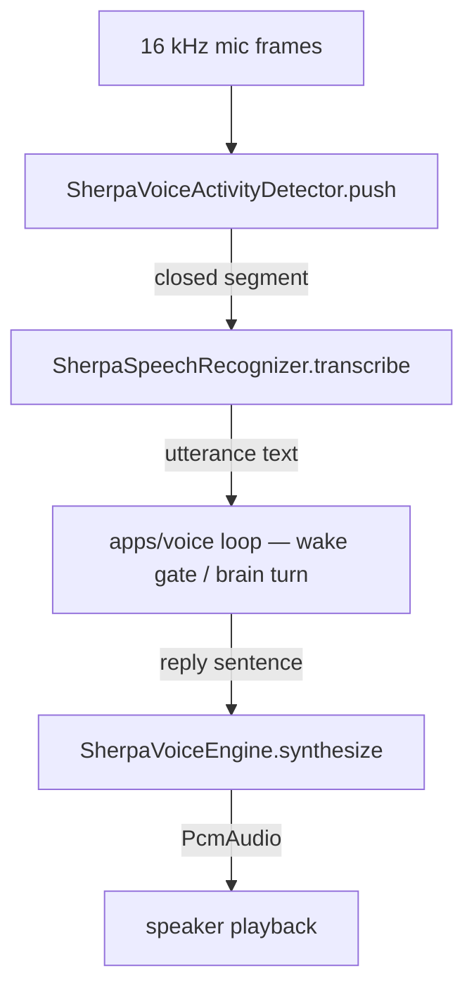
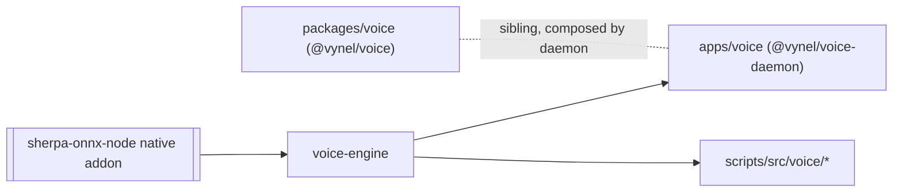

# Voice-engine — Structure

> The code map and connections for the voice-engine module. For the concepts behind it, see [overview.md](./overview.md).
>
> Folders touched: `packages/voice-engine/src/` · consumed by `apps/voice/src/` (the `@vynel/voice-daemon`) and `scripts/src/voice/`.

Voice-engine is **not** a vertical-slice feature leaf — it owns no schema, no repositories, no routes, no MCP descriptor, no outbox events. It is a **stateless native-wrapper package** (the same shape as `providers` / `desktop-control`): a model-agnostic STT/TTS/VAD contract plus a first `sherpa-onnx-node` backend, so the imperative voice loop in `apps/voice` talks to *audio* through one seam. Its only dependency is the native addon `sherpa-onnx-node` (`packages/voice-engine/package.json`) — it imports **nothing** from `@vynel/*`, not even the kernel or shared packages.

Three names, do not confuse them:
- **`packages/voice-engine`** (this unit, `@vynel/voice-engine`) — the native audio engine: STT · TTS · VAD.
- **`packages/voice`** (`@vynel/voice`) — the pure turn-taking / relay / sentence-buffer logic; its sole dep is the type-only `@vynel/providers`. It does **not** import voice-engine.
- **`apps/voice`** (`@vynel/voice-daemon`) — the background sidecar process that composes *both* packages plus `node-cpal` into the always-on wake→talk→speak loop.

## File map

► = entry point (public export surface).

| Path | Role |
|---|---|
| ► `packages/voice-engine/src/index.ts` | public barrel (export `.`) — the 8 contract types + the 3 sherpa backend classes + their option types + `writeWavFile`/`readWavFile` |
| `packages/voice-engine/src/voice-engine.ts` | **the contract** — the stable seams every consumer talks to: `PcmAudio`, `SynthesizeOptions`, `VoiceEngine`, `SpeechRecognizer`, `VoiceActivityDetector`, and the three model-config unions (`TtsModelConfig` / `SttModelConfig` / `VadModelConfig`). No native code. |
| `packages/voice-engine/src/sherpa/native.ts` | **the anti-corruption boundary** — the ONE file that imports `sherpa-onnx-node`. Re-exports `OfflineTts` · `OfflineRecognizer` · `Vad` · `writeWave`/`readWave` + native config types as normal ESM bindings. |
| `packages/voice-engine/src/sherpa/sherpa-onnx-node.d.ts` | ambient type shim for the untyped native addon (referenced by `native.ts`) |
| `packages/voice-engine/src/sherpa/sherpa-voice-engine.ts` | `SherpaVoiceEngine implements VoiceEngine` — loads a TTS model once (Kokoro / vits-piper), `synthesize` via `generateAsync` (off the event loop) |
| `packages/voice-engine/src/sherpa/sherpa-speech-recognizer.ts` | `SherpaSpeechRecognizer implements SpeechRecognizer` — loads Moonshine once, `transcribe` a complete segment via `decodeAsync` (non-streaming) |
| `packages/voice-engine/src/sherpa/sherpa-voice-activity-detector.ts` | `SherpaVoiceActivityDetector implements VoiceActivityDetector` — silero-VAD over a 30 s ring buffer; `push`/`flush` drain closed speech segments (**16 kHz only**) |
| `packages/voice-engine/src/sherpa/build-offline-tts-config.ts` | **pure** mapper — `TtsModelConfig` → sherpa `OfflineTtsConfig`; exhaustive `kokoro`/`vits` switch, CPU-fixed, 2 threads default |
| `packages/voice-engine/src/sherpa/build-offline-recognizer-config.ts` | **pure** mapper — `SttModelConfig` → `OfflineRecognizerConfig`; one kind (`moonshine`), CPU-fixed |
| `packages/voice-engine/src/sherpa/build-vad-config.ts` | **pure** mapper — `VadModelConfig` → `VadConfig`; silero, 16 kHz fixed, optional tuning omitted when unset |
| `packages/voice-engine/src/sherpa/wave-file.ts` | `writeWavFile`/`readWavFile` — diagnostic .wav codec via the native lib (used by smoke/benchmark scripts, never by the live loop) |
| `packages/voice-engine/src/test-support/fake-voice-engine.ts` | `FakeVoiceEngine implements VoiceEngine` — deterministic, model-free; records `spoken[]`, returns silence sized to the text |
| `packages/voice-engine/src/test-support/index.ts` | the `./test-support` subpath barrel — kept off the main barrel so production code can't reach the fake |

Tests colocated: `build-offline-recognizer-config.test.ts` · `build-offline-tts-config.test.ts` · `build-vad-config.test.ts` (the three pure mappers) · `test-support/fake-voice-engine.test.ts`. The sherpa backend classes and `wave-file.ts` have **no unit tests** — they need real ONNX model files, which are gitignored and can't ride the gate (they're Chad live-smoke; see [module-notes](../../../docs/module-notes/voice-engine.md)).

## The contract (`voice-engine.ts`)

The whole point of the package: consumers depend on these types, never on `sherpa-onnx-node`, so swapping the backend (an optional Python LuxTTS/Chatterbox sidecar later) never reaches a consumer's signatures.

| Type | Shape / purpose |
|---|---|
| `PcmAudio` | `{ samples: Float32Array; sampleRate: number }` — mono PCM in [-1, 1], the lingua franca between engine and loop |
| `VoiceEngine` | `synthesize(text, options?) → Promise<PcmAudio>` — the TTS seam |
| `SpeechRecognizer` | `transcribe(audio) → Promise<string>` — the STT seam (empty string = nothing said) |
| `VoiceActivityDetector` | `push(audio) → PcmAudio[]` + `flush() → PcmAudio[]` — segments a 16 kHz stream into utterances |
| `SynthesizeOptions` | `{ voiceId?; speed? }` — per-utterance knobs |
| `TtsModelConfig` | discriminated union `kokoro` \| `vits` — model file paths (app resolves them from env, engine never reads env) |
| `SttModelConfig` | `moonshine` — the 4-file Moonshine model + tokens |
| `VadModelConfig` | `silero_vad.onnx` path + optional threshold / silence / speech-duration tuning |

## Backends (the sherpa impls)

Class-based is deliberately sanctioned here (per `CLAUDE.md`, classes only for genuinely stateful services): each holds a loaded native ONNX model.

| Class | Contract | Model | Notes |
|---|---|---|---|
| `SherpaVoiceEngine` | `VoiceEngine` | Kokoro (11 voices) / vits-piper | exposes `sampleRate` + `voiceCount`; `generateAsync` off-thread |
| `SherpaSpeechRecognizer` | `SpeechRecognizer` | Moonshine tiny/base (int8) | non-streaming — feed it a complete VAD segment; `decodeAsync` off-thread |
| `SherpaVoiceActivityDetector` | `VoiceActivityDetector` | silero-VAD | 30 s ring buffer; **trusts its 16 kHz config, does not resample** (unlike the recognizer) |

## Config mappers (pure, tested)

The three `build*Config` functions are the only unit-testable seam that touches the sherpa config shape. Each is pure, CPU-provider-fixed, and omits optional knobs when unset so the model's own defaults win. Invalid model kinds throw a **bare `Error`** (an internal invariant breach that slipped past the types → 500 via the API's `onError`, not user input).

## Native quarantine (the load-bearing boundary)

`sherpa-onnx-node` is imported in **exactly one file** — `sherpa/native.ts` — and via a **default import** (`import sherpaOnnxNode from 'sherpa-onnx-node'`), NOT named imports. The addon is CommonJS with non-lexable named exports, so `import { OfflineTts }` throws at load under Node ESM; the default import (= `module.exports`) is the only reliable form. Everything else in the package imports normal ESM bindings from `./native.js`. This mirrors the SDK quarantine in `packages/providers/src/claude/base/`.

## Pipeline — "mic frames in, speech out" (the seam this package provides)

Voice-engine has no end-to-end flow of its own — it hands three primitives to the loop in `apps/voice`. The flow *through* it:

1. `apps/voice/src/main.ts:8` constructs all three backends from `apps/voice/src/models.ts` (paths resolved from env).
2. Mic frames → `SherpaVoiceActivityDetector.push` (`sherpa-voice-activity-detector.ts:26`) drains any closed segment.
3. Each segment → `SherpaSpeechRecognizer.transcribe` (`sherpa-speech-recognizer.ts:23`) → text; the loop's wake/turn logic (`@vynel/voice` + the driver) decides what to do.
4. A reply sentence → `SherpaVoiceEngine.synthesize` (`sherpa-voice-engine.ts:32`) → `PcmAudio` at the model's native rate; the app resamples to the device rate and plays it.

## Connections

**Summary:** a pure **outbound leaf** — it publishes no events, consumes no events, imports no `@vynel/*` package. It depends only on the native addon and is consumed (by import) by the voice daemon and the dev scripts.

| Unit | Direction | Mechanism | What crosses |
|---|---|---|---|
| `sherpa-onnx-node` | out | native import (quarantined to `native.ts`) | `OfflineTts` · `OfflineRecognizer` · `Vad` · `writeWave`/`readWave` |
| [apps/voice](../../../apps/voice) (`@vynel/voice-daemon`) | in | import | 3 backend classes + `FakeVoiceEngine` (test) + all contract types — `main.ts`, `models.ts`, `loop/voice-session-driver.ts`, `audio/*` |
| `scripts/src/voice/` | in | import | `SherpaVoiceEngine`/`SherpaSpeechRecognizer` + `readWavFile`/`writeWavFile` + config types — `synthesize-smoke.ts`, `benchmark.ts`, `voice-models.ts` |
| `packages/voice` (`@vynel/voice`) | — | **none** | the two are siblings; the daemon composes them but they never import each other |

**Events published:** none. **Events consumed:** none — this package has no outbox involvement whatsoever.

## Config & gotchas

- **`sherpa-onnx-node` is NOT hoisted under pnpm** — it's only a dep of this package, so it resolves from `packages/voice-engine/node_modules`. A root-level `require('sherpa-onnx-node')` fails; always reach it through the package (module-notes watch-out).
- **Named ESM imports of the addon throw at load** — the CJS interop forces the default import in `native.ts`. Never `import { OfflineTts } from 'sherpa-onnx-node'`.
- **The VAD is 16 kHz only** — it does not resample; feed it exactly 16 kHz mono or segmentation misbehaves. The recognizer, by contrast, resamples internally and accepts any rate.
- **No model files in git** — the ONNX models (Moonshine, silero, Kokoro/piper) are tens–hundreds of MB, gitignored, fetched by `pnpm voice:fetch-models`. The backend classes and `wave-file.ts` are therefore **untested by the gate** (real-model smoke is Chad-live); only the pure config mappers + the fake ride `pnpm test`.
- **Model paths come from the consumer, never from env here** — `apps/voice/src/models.ts` resolves the on-disk layout and hands paths in; the engine knows nothing of env or the download layout.
- **Invalid model kinds throw a bare `Error`** (→ 500), deliberately, because they are an internal invariant breach, not validated user input.
- **Wake-word (acoustic KWS) is not in this package** — the shipped wake path is VAD-segment → transcribe → the `@vynel/voice` leaf's `detectWakeWord`; a sherpa `KeywordSpotter` backend is a deferred later pass (module-notes §Increment 2b / Deferred).

---
*Mapped from the code on disk, 2026-07-14. If you change this module, update this file and [overview.md](./overview.md).*
