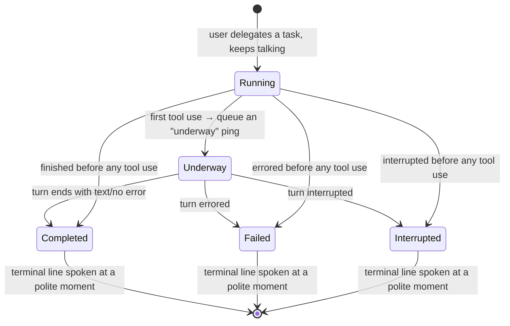

# Voice — Overview

> The headless brain of Vynel's spoken assistant ("Jarvis"): the pure decisions that turn an always-listening mic and a streaming answer into a natural back-and-forth conversation — hearing its name, knowing when to speak, and saying results aloud instead of showing them.
>
> **Status:** shipped (pure core, fully tested) · **Depends on:** [providers](../providers/overview.md) (the normalized session-event shape only) · **Code map:** [structure.md](./structure.md)

## Purpose

Voice is the *reasoning* layer of Vynel's spoken channel — the part that decides **whether**, **what**, and **when** to speak, kept deliberately separate from the machinery that actually captures and plays sound. It is a pure, headless package: it takes in text and audio samples and hands back decisions and spoken lines, and touches no microphone, speaker, model, network, or database itself.

That separation is the whole point. Spoken conversation has a handful of genuinely tricky judgment calls — did the user say the wake word? has this utterance finished, or is it a mid-sentence pause? is now a polite moment to interrupt, or is someone talking? which sentence is complete enough to start speaking? — and each one is easier to get right, and far easier to test, when it's a small deterministic function with no audio hardware attached. This package is exactly that collection of judgment calls. The imperative shell that owns the mic, the speaker, the speech models, and the HTTP connection drives them; this leaf just answers.

It splits into two concerns. **Turn-taking** governs the listening side: catching the wake phrase, carving a stream of samples into complete utterances, and holding the mic shut while the assistant is thinking or talking. **The relay** governs the speaking side: an instant acknowledgment, sentence-by-sentence buffering so speech starts early, stripping markup a voice can't read, watching backgrounded tasks, and reducing a finished turn to one short spoken line.

## What it can do

- **Hear its name** — decide whether an utterance opens with the wake phrase ("hey jarvis", "hey claude", "hey vynel") and, if so, peel off the command that follows. Deliberately tolerant of how a small speech model mishears an uncommon name.
- **Carve speech into utterances** — consume a stream of raw audio samples and emit one complete segment each time speech is followed by a gap of silence, so the wake path transcribes whole natural phrases rather than fixed windows (no clipped first word, no transcribing dead air).
- **Pick an instant acknowledgment** — match the user's request to a short, contextual first line by keyword ("Checking your schedules.") with zero model call, so the assistant can confirm it heard *what* was asked before any real work starts.
- **Speak an answer as it streams** — buffer a streaming reply and release it one complete sentence at a time, so speech begins on the first finished sentence instead of after the whole reply, and sentences never overlap or arrive out of order.
- **Clean text for the ear** — strip the markdown a text-to-speech voice would otherwise read aloud (asterisks, table pipes, code fences, link syntax) so none of it is heard.
- **Summarize a finished turn** — reduce a completed background turn's event stream to one short spoken line, distinguishing a normal completion from a failure or an interruption, and capping the length (the full answer lives in the chat transcript; voice gets the gist).
- **Decide when to interrupt** — judge whether *now* is a polite moment to speak a pending notification: there is something to say, the user is not mid-utterance, and the assistant is not already speaking.
- *(background)* **Track fired-and-forgotten tasks** — hold a registry of tasks the user delegated and kept talking past; fold each task's incoming events into a one-time "underway" ping and a terminal "done / had a problem / was interrupted" announcement, queued to be spoken at the next polite moment, and answer "how many are still running?".
- *(background)* **Keep the mic shut at the right time** — a sticky gate the shell closes at the start of a turn and opens once the turn is done and all queued audio has played, so the assistant never hears itself, and an early "open" is never lost.

## Responsibilities

**Owns** — the pure decision logic of a spoken conversation and nothing physical: wake-phrase recognition and command extraction, energy-based speech segmentation, the keyword acknowledgment library, sentence-boundary buffering, spoken-markup stripping, the spoken-summary reducer, the background-task registry that turns a task's event stream into queued spoken notifications, the barge-in "is now polite?" rule, and the sticky mic gate. Everything here is deterministic and headless-testable: same input, same decision, no I/O.

**Does not own** —
- the microphone, the speaker, the audio stream, the HTTP client, and the imperative loop that stitches these decisions together — the voice daemon shell ([apps/voice](../_apps/voice/overview.md));
- the actual speech-to-text, text-to-speech, and voice-activity models — the separate engine sibling ([voice-engine](../voice-engine/overview.md));
- running the delegated task, streaming its turn, and producing the answer text — the root brain reached through the session/provider stack ([session](../session/overview.md), [providers](../providers/overview.md));
- the shape of the streamed events it reads (the normalized session event) — defined by [providers](../providers/overview.md); this package only consumes that type;
- where the spoken summary's full answer is kept — the [chat](../chat/overview.md) transcript.

## Concepts & vocabulary

| Term | Meaning |
|---|---|
| **Turn-taking** | The listening-side concern: knowing when the user is addressing the assistant and when an utterance is complete, and keeping the mic shut while the assistant holds the floor. |
| **Relay** | The speaking-side concern: turning a streaming answer — including one from a backgrounded task — into spoken lines. |
| **Wake phrase** | The greeting-plus-name opener ("hey jarvis", "hey claude", "hey vynel") that tells the always-listening service the utterance is meant for it. Matched tolerantly against a list of common mishearings. |
| **Command** | Whatever the user said *after* the wake phrase — the actual request, with its original casing preserved. |
| **Speech segment** | One complete utterance carved out of the raw audio stream: speech bracketed by silence, with a little audio kept before the first sound so the opening phoneme isn't clipped. |
| **Acknowledgment (ack)** | The instant, contextual first line spoken back — a cheap keyword match, not understanding, chosen to add zero latency before real work begins. |
| **Sentence buffer** | The accumulator that releases a streaming reply one complete sentence at a time, so speech can start early and stay in order (a decimal like "3.14" is never mistaken for a boundary). |
| **Spoken markup stripping** | Removing markdown a voice can't read (asterisks, pipes, code fences, link syntax) — a safety net beneath the real fix of prompting the model to speak plainly. |
| **Relay task** | A task the user delegated and then kept talking past; watched in the background and announced when it lands. |
| **Spoken notification** | A queued line about a relay task — an "underway" progress ping or a terminal outcome — waiting for a polite moment to be spoken. |
| **Outcome** | How a finished turn ended: *completed*, *failed*, or *interrupted* — the three shapes a spoken summary can take. |
| **Barge-in** | Speaking a pending notification at a polite moment: something to say, the user not talking, the assistant not talking. |
| **Turn-taking gate** | The sticky open/shut switch on the mic: closed while the assistant thinks and speaks, opened once the turn is fully done and drained. |

## Rules & invariants

- **Nothing here touches the outside world.** Every piece is pure — audio math, string matching, event folding — and produces a decision or a line of text. Hardware, models, and network all live in the shell, which is what makes every rule in this package testable without a microphone.
- **Every decision is deterministic.** The same transcript yields the same acknowledgment; the same samples yield the same segment; the same events yield the same summary. Variety across requests comes from the input, never from randomness.
- **Wake-word matching favors tolerance over precision.** A small speech model mangles an uncommon name badly (an invented one worst of all), so the wake list deliberately includes near-spellings and common-word garbles — a cheap miss-list rather than a dedicated model. Ambiguous everyday openers ("okay, fine…") are held out on purpose.
- **Speech is bracketed, not windowed.** A segment ends only when speech is followed by a real gap of silence; the trailing silence that triggered the close is trimmed off, a pre-roll keeps the first phoneme, and blips too short to be a command are dropped.
- **Speaking starts at the first complete sentence.** The reply is released sentence by sentence, always in order, so the user hears the answer forming instead of a long silence then everything at once — and a final sentence with no trailing boundary is still flushed at turn end.
- **The mic gate is sticky.** "Open" is a persistent state, not a one-shot event, so an open that arrives before the mic loop is listening for it is never lost — no missed-signal deadlock. The gate reopens only when the turn is done *and* all queued audio has finished playing.
- **A relay task must be given a terminal event or it hangs.** The notifier only closes a task on a completed / errored / interrupted event; the shell must map the stream's end-of-stream sentinel onto one of those, or the task stays "running" forever and inflates the running count.
- **A backgrounded task is announced at most twice.** One "underway" ping on its first tool use, then one terminal line when it lands — spoken only at a polite barge-in moment, and drained in arrival order.
- **A spoken summary is short and markup-free.** The voice gets the gist — the first sentence, capped in length, with all markup stripped; the full answer stays in the chat transcript.

## Lifecycle

A backgrounded relay task moves through these states as its turn streams in:

## Where it sits in the bigger picture

Voice is the middle of three siblings that make Jarvis work, and it is the only pure one. Beneath it, [voice-engine](../voice-engine/overview.md) supplies the speech-to-text, text-to-speech, and voice-activity models. Around it, the [apps/voice](../_apps/voice/overview.md) daemon owns the microphone, the speaker, the audio stream, and the HTTP connection to the brain, and drives this package's decisions in its always-listening loop: it segments the mic feed and asks *is this the wake word?*, plays an ack, streams the answer through the sentence buffer and markup stripper, registers delegated tasks with the notifier, and consults the barge-in rule and the mic gate to decide when to speak and when to listen. The brain those turns reach is the ordinary Vynel session ([session](../session/overview.md)) over the [providers](../providers/overview.md) stack — voice reads only the normalized event shape that stack streams, and never the runtime behind it. In short: voice-engine is the ears and mouth, apps/voice is the nervous system, and this package is the reflexes.

---
*Mapped from the code on disk, 2026-07-14. If you change this module, update this file and [structure.md](./structure.md).*
