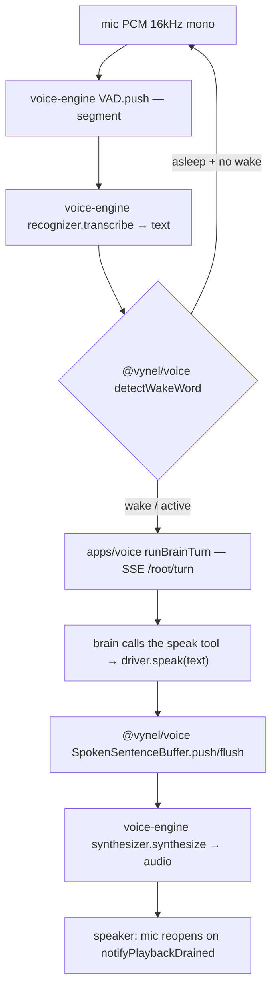
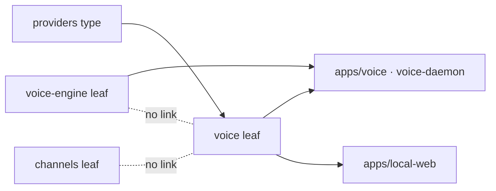

# Voice — Structure

> The code map and connections for the `@vynel/voice` leaf. For the concepts behind it, see [overview.md](./overview.md).
>
> Folders touched: `packages/voice/src/{relay,turn-taking}/` — consumed by `apps/voice/` (the `@vynel/voice-daemon` shell) and `apps/local-web/src/composables/voice/`.

`@vynel/voice` is an **unusual leaf**: it owns no `schema/`, no `repositories/`, no `@vynel/db` kernel — it is a bag of **pure, headless-testable functions and small stateful classes** for the voice interaction (wake detection, sentence buffering, markup stripping, and the dormant async fire-and-notify relay). Its **only** dependency is `@vynel/providers` — and that solely for the `NormalizedSessionEvent` *type* (`packages/voice/package.json`). All audio I/O, models, the SSE brain client, and the imperative loop live in the `apps/voice` shell; the STT/TTS/VAD models live in the separate `@vynel/voice-engine` leaf. See [Connections](#connections) for the three-way boundary — it is the thing to get right about this module.

## File map

`► ` = public barrel export.

| Path | Role |
|---|---|
| ► `packages/voice/src/index.ts` | public barrel — the single `.` export; re-exports all 9 relay + turn-taking modules |
| `packages/voice/src/relay/summarize-turn-for-voice.ts` | reduce a finished background turn's events → ONE short spoken line; outcome = `completed`/`failed`/`interrupted`; caps 240 chars, first sentence only |
| `packages/voice/src/relay/strip-spoken-markup.ts` | **pure** — strip markdown/HTML a TTS engine would voice literally (fences, links, list markers, table pipes, emphasis); markup-only, never truncates. **Wired** (local-web) |
| `packages/voice/src/relay/relay-task-notifier.ts` | `RelayTaskNotifier` — stateful task registry for async fire-and-notify: register → ingest stream events → queue `SpokenNotification`s → drain at a polite moment. *Dormant* |
| `packages/voice/src/relay/sentence-buffer.ts` | `SpokenSentenceBuffer` — stateful; accumulates text deltas, emits COMPLETE sentences for pipelined TTS; never splits a decimal. **Wired** (daemon driver) |
| `packages/voice/src/relay/ack-library.ts` | `pickAckForRequest` — **pure** keyword→instant-ack matcher (no LLM); deterministic per transcript. *Dormant* |
| `packages/voice/src/turn-taking/turn-taking-gate.ts` | `TurnTakingGate` — sticky open/close boolean gate + `waitUntilOpen()` for mic gating; no missed-signal deadlock. *Dormant* |
| `packages/voice/src/turn-taking/barge-in.ts` | `shouldBargeInNow` — **pure** predicate: pending notification ∧ ¬user-speaking ∧ ¬assistant-speaking. *Dormant* |
| `packages/voice/src/turn-taking/wake-word.ts` | `detectWakeWord` (**wired**, daemon) + `stripWakePrefix` (*dormant*) — regex wake match tolerant of tiny-STT mishears ("hey vynel"/"hey claude") |
| `packages/voice/src/turn-taking/audio-segmenter.ts` | `SpeechSegmenter` — RMS-energy speech segmenter (16 kHz mono float → utterance clips). *Dormant — superseded by sherpa VAD in `@vynel/voice-engine`* |

Every source file has a colocated `*.test.ts` (9 test files) — the whole leaf is unit-tested with plain inputs, no fakes/db needed. Design source: `.claude/ceo/agent-base/voice-relay-design.md` (per `index.ts` header).

## Logic units

No repositories, no operations over a db — the module's "operations" are these functions and classes.

| Unit | Kind | What it does | Notable behavior |
|---|---|---|---|
| `detectWakeWord(transcript)` | pure fn | does the utterance open with the wake phrase; returns `{ detected, command }` | greeting (`hey/hi/hello/yo`) + name-variant, anchored at start; slices the ORIGINAL to keep command casing; `okay/ok` deliberately excluded |
| `stripWakePrefix(text)` | pure fn | clean a leading wake phrase off an already-captured command | greeting OPTIONAL here — over-matches on bare garbles; header flags it unsafe to wire without tightening the name list |
| `SpokenSentenceBuffer` | class (stateful) | `push(delta) → string[]` complete sentences, `flush()` the remainder | boundary = `.!?`+whitespace or `\n`; a decimal (period+digit) never splits |
| `stripSpokenMarkup(text)` | pure fn | remove TTS-unsafe markup, collapse whitespace | streaming-safe (one chunk at a time); the spoken-style system prompt is the real fix, this is the safety net |
| `summarizeTurnForVoice(label, events)` | pure fn | fold a turn's `NormalizedSessionEvent[]` → `{ outcome, spokenText }` | reads `text-chunk`/`session-errored`/`session-interrupted`; strips markup + first sentence + 240-char cap; empty-result fallback `"<label> is done."` |
| `pickAckForRequest(transcript)` | pure fn | instant contextual ack by keyword (schedules/memory/workspaces/files/channels/create…) | ordered most-specific-first; deterministic (indexed by transcript length); neutral fallback |
| `RelayTaskNotifier` | class (stateful) | task registry: `registerTask` / `ingestEvent` / `hasPendingNotifications` / `drainNotifications` / `runningTaskCount` | one-time "underway" ping on first `tool-use-started`, terminal notification on `session-completed/-errored/-interrupted`; **caller must map the SSE `turn-stream-ended` sentinel onto a terminal event** or a task stays `running` forever |
| `TurnTakingGate` | class (stateful) | mic gate: `close` / `open` / `await waitUntilOpen()` / `isOpen` | sticky — an `open()` before `waitUntilOpen()` is never lost; reusable across turns |
| `shouldBargeInNow(state)` | pure fn | should the relay speak a queued notification now | true iff pending ∧ ¬user-speaking ∧ ¬assistant-speaking |
| `SpeechSegmenter` | class (stateful) | `push(samples) → Float32Array[]`, `flush()` — energy-gated VAD | 20 ms frames, RMS threshold 0.012, 550 ms end-silence, 250 ms min-speech, 12 s max, 200 ms pre-roll; drops trailing silence-run on close |

## Not present (deliberately)

This leaf has **no** Data & persistence, **no** Repositories, **no** HTTP surface, **no** MCP descriptor, **no** worker jobs, and publishes/consumes **no** outbox events. It is stateless-across-processes pure logic. The `speak` MCP tool, the `/root/turn` SSE stream, audio devices, and the daemon HTTP server all live in `apps/voice` — not here.

## Pipeline — the always-on voice loop (leaf's role)

The end-to-end loop is the `apps/voice` daemon's `VoiceSessionDriver` state machine; `@vynel/voice` supplies two of its steps (wake + sentence buffering) and `@vynel/voice-engine` supplies the models. The leaf never runs the loop itself.

1. `apps/voice/src/loop/voice-session-driver.ts:98` — mic PCM → `vad.push()` (voice-engine) segments an utterance.
2. `voice-session-driver.ts:221` — `recognizer.transcribe()` (voice-engine) → transcript.
3. `voice-session-driver.ts:231` — **`detectWakeWord(transcript)`** (`@vynel/voice`) gates ASLEEP→ACTIVE; a same-breath command runs immediately.
4. `voice-session-driver.ts:258` — `runBrainTurn()` (shell's SSE client) runs the turn; the brain replies by calling the `speak` tool, which loops back to `driver.speak()`.
5. `voice-session-driver.ts:175` — **`new SpokenSentenceBuffer()`** (`@vynel/voice`) chunks the spoken text sentence-by-sentence so `synthesize()` (voice-engine) can pipeline TTS; the mic stays closed until `notifyPlaybackDrained()` (echo defense).

The local-web browser overlay (`apps/local-web/src/composables/voice/voice-command-session.ts:94`) runs a parallel command session using Web Speech APIs; its only `@vynel/voice` touch is **`stripSpokenMarkup`** on each streamed text event before `speechSynthesis`.

## Connections

**Summary:** a **pure logic leaf, import-only** — no db, no events, no HTTP. It imports one type from `@vynel/providers` and is imported by two *apps* (never by another package): the `@vynel/voice-daemon` shell and `@vynel/local-web`. Roughly a third of its exports are wired; the rest (the async fire-and-notify relay, the gate, the RMS segmenter) are landed-and-tested but **dormant**, kept for the design they implement.

| Unit | Direction | Mechanism | What crosses |
|---|---|---|---|
| providers (`@vynel/providers`) | out | import (type-only) | `NormalizedSessionEvent` — the event shape `summarizeTurnForVoice` / `RelayTaskNotifier` fold |
| [voice-engine](../voice-engine/overview.md) (`@vynel/voice-engine`) | — | **none** (siblings, no import either way) | separate leaf: sherpa-onnx STT/TTS/VAD models + `PcmAudio` seams; the two only meet inside `apps/voice` |
| apps/voice (`@vynel/voice-daemon`) | in | import | `detectWakeWord` + `SpokenSentenceBuffer` used by `voice-session-driver.ts`; the app also imports `@vynel/voice-engine` |
| apps/local-web (`@vynel/local-web`) | in | import | `stripSpokenMarkup` in the voice-view composable |
| [channels](../channels/overview.md) (`@vynel/channels`) | — | **none** (verified) | despite CLAUDE.md framing Voice as a "channel", there is **no** code edge: `@vynel/voice` imports nothing from `packages/channels`, and channels references nothing in voice. Voice-as-a-channel is a product/app-surface idea, not a package dependency |

**The three-way boundary (verified):**

- **`packages/voice`** = `@vynel/voice` — pure interaction logic (relay + turn-taking). No models, no audio, no db.
- **`packages/voice-engine`** = `@vynel/voice-engine` — the STT/TTS/VAD *engine* (sherpa-onnx native, CPU). Owns `PcmAudio`, `VoiceEngine`, `SpeechRecognizer`, `VoiceActivityDetector`, `SherpaVoiceEngine`, etc. **Does not import `@vynel/voice`, and `@vynel/voice` does not import it** — they are independent siblings joined only in the daemon.
- **`apps/voice`** = `@vynel/voice-daemon` — the imperative shell (`main.ts`, `audio/` via node-cpal, `brain/` SSE client, `loop/` driver, `overlay/`). Imports **both** leaves and wires them into the running loop; it is the only place they meet.

**Voice ≠ channels (as code).** CLAUDE.md groups the voice channel with Telegram, but that is a *product* grouping. The `@vynel/voice` leaf has **no dependency on `packages/channels`** and channels has none on voice (both directions grepped clean). Voice reaches the brain through the daemon's own SSE `/root/turn` client, not through the channels feature.

**Events published/consumed:** none. **Outbox:** none. **MCP:** none of its own (the `speak` tool lives in the app/session layer, not here).

## Config & gotchas

- **Not a db leaf.** No `schema/`, `repositories/`, migrations, or `@vynel/db` — don't look for them. The style of other module `structure.md`s (tables, indexes, outbox) mostly doesn't apply here; that's expected, not missing.
- **Three names, one word "voice" — keep them straight.** `@vynel/voice` (this leaf, pure logic) vs `@vynel/voice-engine` (models) vs `@vynel/voice-daemon` = `apps/voice` (the shell). The app folder is `apps/voice` but its package name is `@vynel/voice-daemon` (`apps/voice/package.json`).
- **Roughly a third wired; the rest dormant.** Only `detectWakeWord`, `SpokenSentenceBuffer`, and `stripSpokenMarkup` are imported outside the package. `RelayTaskNotifier`, `summarizeTurnForVoice` (used only *inside* the notifier), `pickAckForRequest`, `TurnTakingGate`, `shouldBargeInNow`, `stripWakePrefix`, and `SpeechSegmenter` are **defined + tested but not wired** — the async fire-and-notify relay is designed but not yet live (see `.claude/STATE.md:699`, `docs/module-notes/voice-engine.md:265`).
- **`SpeechSegmenter` is superseded, not broken.** The RMS segmenter proved the loop with zero deps; production segmentation now runs on sherpa's silero-VAD in `@vynel/voice-engine` (`docs/module-notes/voice-engine.md:91`). Kept for reference/tests.
- **`stripWakePrefix` is a trap.** Its greeting is optional, so common-word garbles in `WAKE_NAME` (`fine`/`final`/`cloud`) can eat a command's real first word. The header warns: tighten the name list before wiring a caller. Currently unused in production.
- **`RelayTaskNotifier` needs the SSE sentinel mapped.** `turn-stream-ended` is not a `NormalizedSessionEvent` kind; the shell MUST translate it to a terminal event or a task stays `running` forever and inflates `runningTaskCount()` (see the `ingestEvent` doc comment).
- **`summarizeTurnForVoice`: `interrupted` yields to `failed`.** A later `session-errored` supersedes an earlier interrupt in the same fold.
- **Wake-word variants are intentionally loose.** `WAKE_NAME` includes garbles (`fine`, `final`, `cloud`, `vinyl`) because tiny-Whisper mangles the invented word "vynel"; widen the list when a real mishear slips through rather than swapping in a model.

---
*Mapped from the code on disk, 2026-07-14. If you change this module, update this file and [overview.md](./overview.md).*
