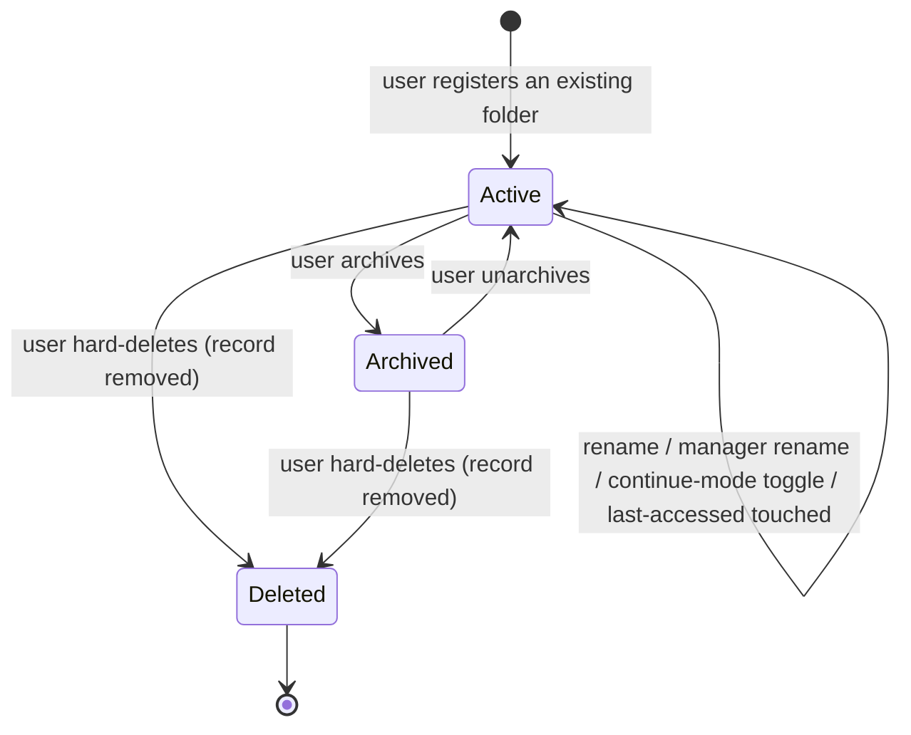

# Workspaces — Overview

> A workspace is an existing folder on the user's disk that they register with Vynel; it becomes the named, manager-led scope every other feature hangs its rows off.
>
> **Status:** shipped · **Depends on:** [users](../users/overview.md) · **Code map:** [structure.md](./structure.md)

## Purpose

A workspace is not a project-management abstraction — it is a *directory on disk* that the user
chooses and hands to Vynel. Vynel does not invent a proprietary layout; it adopts the folder as-is,
drops a single small metadata directory inside it, and records a row that ties that path to the
user's account. From that point on, every other feature's data — files, chat, memory, knowledge,
capabilities, channels, schedules — is scoped to a workspace.

Each workspace also has a **named manager** — a friendly persona ("Mark is handling it") assigned
automatically on registration and renameable by the user. That naming turns a bare folder into a
place with someone in charge of it, which is the product's core framing of what a workspace is.

The module is a **tenancy hub**: it holds the workspace *management* logic, while the workspace
table itself lives in the shared database kernel so that every feature can reference a workspace
without importing this package. That split is deliberate — a hub owns behaviour, not a schema every
sibling would be forced to depend on.

## What it can do

- **Register an existing folder** as a workspace — the user picks a directory that already exists,
  gives it a display name, and Vynel records it. The folder must exist, be a directory, and be
  writable, or registration is refused with a clear reason.
- **Browse the local filesystem** through an API-backed folder picker — because a browser cannot
  read absolute disk paths, the local API lists directories server-side. The picker is
  cross-platform: it surfaces Windows drive letters and the POSIX root, hides dot-folders, and can
  optionally include visible files (a mode the knowledge add-source picker reuses).
- **List a user's workspaces**, most-recently-accessed first; archived ones are hidden unless
  explicitly requested.
- **Get one workspace** by its identifier, owner-scoped.
- **Rename a workspace** and **rename its manager persona**.
- **Toggle continue-mode** — a per-workspace switch (default on) choosing whether the landing
  conversation follows one long root session that swaps context invisibly, or classic per-topic
  sessions.
- **Switch the active workspace** in the UI — selecting which workspace the interface is currently
  showing. This is a client-side choice; the server keeps no notion of a "current" workspace.
- **Archive / unarchive** — a reversible hide that removes a workspace from the default list while
  leaving the folder and all data untouched.
- **Hard-delete** a workspace — a destructive, explicitly-confirmed exit that removes the record.
  The user separately chooses whether the files on disk are also deleted.
- *(background)* **Touch last-accessed** — resolving a workspace on a request quietly bumps its
  recency so the list stays ordered by real use.
- *(background)* **Publish lifecycle events** so other features can react to creation, archiving,
  and deletion.

## Responsibilities

**Owns** — the entire lifecycle of a registered folder: register, list, get, rename (name and
manager persona), the continue-mode toggle, archive, unarchive, and hard-delete. It owns the
path-deduplication guard (case-insensitive, spanning archived workspaces), the canonical-path
resolution that gives a workspace its on-disk identity, the small metadata directory scaffolded on
registration, the manager-persona default-naming, the local filesystem folder-picker browsing, the
three lifecycle events it co-commits, the ownership-checking route bundle that every workspace-scoped
feature composes, and the web UI for all of the above.

**Does not own** —
- the workspace *table's* schema and repositories — those live in the shared database kernel so
  features can reference a workspace without depending on this module;
- workspace *content* — files, chat sessions, memory, knowledge — owned by
  [files](../files/overview.md), [chat](../chat/overview.md), [memory](../memory/overview.md),
  [knowledge](../knowledge/overview.md);
- user identity and the multi-tenancy boundary — that's [users](../users/overview.md);
- per-workspace capability settings — that's [capabilities](../capabilities/overview.md);
- workspace-scoped channels and schedules — those are [channels](../channels/overview.md) and
  [schedules](../schedules/overview.md);
- creating the user's *first* workspace during first-run — that's [onboarding](../onboarding/overview.md),
  which uses this module's helpers.

## Concepts & vocabulary

| Term | Meaning |
|---|---|
| **Workspace** | A named, registered directory on disk — one row tied to one user. The scope every other feature's tenant rows hang off. |
| **Kind** | A classifying label (personal · project · small-business · custom), not a behavioural switch. Defaulted to personal at registration; the user-facing picker was retired. Immutable afterwards. |
| **Path** | The canonical absolute path to the folder, resolved to its real on-disk form (symlinks and casing). It is the folder's identity and is immutable after registration. |
| **Manager persona** | The workspace manager's name ("Mark is handling it"). Auto-assigned a stable default on registration (deterministic, so it never drifts between reads) and renameable by the user. |
| **Continue-mode** | A per-workspace toggle (default on): the landing conversation either follows one long root session that swaps context invisibly, or falls back to classic per-topic sessions. |
| **Archive** | A reversible hide — the workspace drops out of the default list but keeps its path, data, and folder. Unarchive restores it. |
| **Hard-delete** | The permanent exit — the record is removed. The user decides separately whether the on-disk files are also removed. Publishes a deletion event so other features can clean up. |
| **Active workspace** | The workspace the UI is currently showing. A client-side selection; the server has no "current workspace" concept — requests name the workspace explicitly. |
| **The metadata directory** | The single folder Vynel creates inside a registered workspace. The user's own layout is otherwise left untouched. |
| **Workspace-scoped bundle** | The reusable middleware pairing that resolves the user, resolves and ownership-checks the workspace, and hands it to the handler. Every feature nested under a workspace composes it. |

## Rules & invariants

**A workspace identifier scopes which folder you see — it is NOT the security boundary.**
Multi-tenancy is enforced by the user identity: every tenant-scoped read filters by the user at the
repository layer, and the workspace is a *further* scope on top of that. Resolving a workspace
confirms the caller owns it, and returns the same "not found" response for both a missing workspace
and one owned by someone else — so a caller can never probe which identifiers exist.

- **Path and kind are immutable after registration.** Only the display name, the manager persona,
  and the continue-mode toggle can be changed.
- **The same folder cannot be registered twice.** The guard is case-insensitive and spans archived
  workspaces — an archived workspace still owns its folder — so re-adding the same directory, even
  with different casing or a trailing separator, is refused with a clear conflict.
- **Registration validates the folder up front.** It must exist, be a directory, and be writable;
  otherwise registration fails fast with an actionable message rather than creating a broken record.
- **No soft-delete.** This module deliberately departs from the project's usual soft-delete
  discipline. The reversible affordance is archiving; the only true exit is a hard-delete, gated by
  an explicit user confirmation with a separate "also delete the files" choice.
- **Three lifecycle events, each co-committed in the same transaction as its state change** —
  created, archived, and deleted. Unarchive deliberately publishes no event: no current consumer
  needs a "back in the list" signal.
- **On-disk file removal is post-commit and best-effort.** When the user asks to delete the files, a
  recursive delete runs *after* the record is committed. A failed delete logs a warning and leaves an
  orphaned folder — never an orphaned record. The record is gone; the folder is recoverable.
- **The folder picker needs the API** because a browser cannot read absolute filesystem paths; the
  local API browses directories on the machine's behalf. A future native desktop shell can replace
  this with an OS dialog.

## Lifecycle

There is no soft-deleted state between the active/archived states and deletion. Archiving is the
reversible hide; hard-delete is final.

## Where it sits in the bigger picture

Workspaces is the scope rail every other feature rides on. When [memory](../memory/overview.md),
[chat](../chat/overview.md), [files](../files/overview.md), [knowledge](../knowledge/overview.md), or
[capabilities](../capabilities/overview.md) act on tenant data, they do it under a workspace, and
every one of them composes this module's ownership-checking route bundle to resolve and guard that
workspace before running. Its only upstream dependency is [users](../users/overview.md), so it sits
close to the root of the dependency tree. [Onboarding](../onboarding/overview.md) leans on this
module to create the user's first workspace during first-run, so by the time a user reaches the main
UI they always have at least one.

---
*Mapped from the code on disk, 2026-07-14. If you change this module, update this file and [structure.md](./structure.md).*
