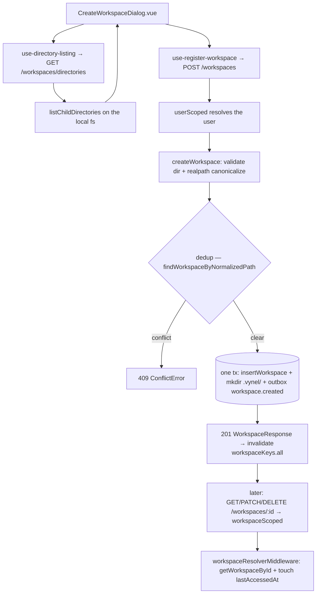
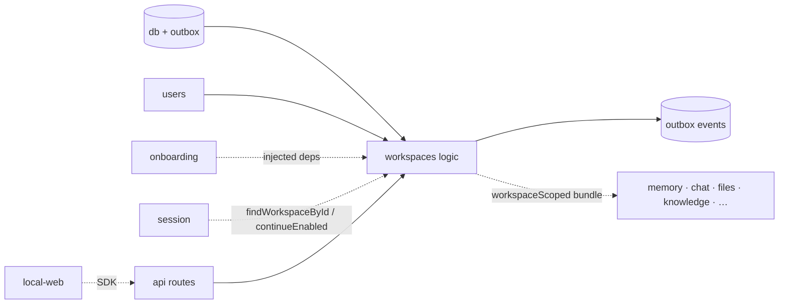

# Workspaces — Structure

> The code map and connections for the workspaces module. For the concepts behind it, see [overview.md](./overview.md).
>
> Folders touched: `packages/workspaces/src/` · `packages/db/src/{schema,repositories}/workspaces/` · `apps/local-api/src/routes/workspaces/` · `apps/local-api/src/{middleware,handler-bundles}/` · `apps/local-web/src/{composables,components,views}/workspace(s)/` · `packages/contracts/src/workspaces/`

Workspaces is a **tenancy hub**, not a plain leaf. The feature package `@vynel/workspaces` owns
**logic only** — its `schema/` and `repositories/` deliberately live in the kernel `@vynel/db`,
because every downstream feature FKs to the `workspaces` table and moving the schema into the
package would force those features to import `@vynel/workspaces` (a cross-feature coupling the
architecture forbids). This is stated at the top of `packages/workspaces/src/index.ts`. Leaf
features (knowledge, …) own their schema; hubs don't.

## File map

`► ` marks entry points.

| Path | Role |
|---|---|
| ► `packages/workspaces/src/index.ts` | package public barrel (`@vynel/workspaces`) — re-exports every op, the 3 event constants + payload types, row types |
| `packages/workspaces/src/workspaces-types.ts` | re-exports `Workspace` / `NewWorkspace` / `WorkspaceKind` for the package layer |
| `packages/workspaces/src/workspaces-events.ts` | 3 event constants + payload types: `workspace.created` / `workspace.archived` / `workspace.deleted` |
| `packages/workspaces/src/manager-name.ts` | manager-persona naming (brain-tree Ch5): `deriveDefaultManagerName` (stable by id) + `resolveManagerName` (explicit-or-default) |
| `packages/workspaces/src/lifecycle/create-workspace.ts` | register an existing folder: validate → canonicalize → dedup → insert → mkdir `.vynel/` → outbox event, one tx |
| `packages/workspaces/src/lifecycle/list-workspaces-for-user.ts` | thin pass-through to the repo list with the defensive cap |
| `packages/workspaces/src/lifecycle/get-workspace-by-id.ts` | ownership-checked get; same `NotFoundError` for not-found and not-owned (no enum leak) |
| `packages/workspaces/src/lifecycle/find-workspace-by-id.ts` | published null-safe cross-domain read (sibling of `getWorkspaceById`) |
| `packages/workspaces/src/lifecycle/update-workspace-metadata.ts` | update `name` / `managerName` / `continueEnabled` (path + kind immutable) |
| `packages/workspaces/src/lifecycle/archive-workspace.ts` | `archiveWorkspace` (isArchived=true + event, one tx) · `unarchiveWorkspace` (false, **no** event) |
| `packages/workspaces/src/lifecycle/hard-delete-workspace.ts` | remove row + `workspace.deleted` event in one tx, then optional post-commit best-effort `rm -rf` |
| `packages/workspaces/src/directory/list-child-directories.ts` | filesystem browser for the folder picker — `realpath` + `readdir` + drive-root probe; optional `includeFiles` |
| `packages/workspaces/src/directory/make-default-workspace-parent-directory.ts` | pure: `~/Documents/Vynel/` (D11) — read by onboarding |
| `packages/workspaces/src/directory/sanitize-folder-name.ts` | pure: replace OS-unsafe chars with `_`, fallback `"workspace"` — used by onboarding's name step |
| `packages/db/src/schema/workspaces/workspaces.ts` | the `workspaces` table, `WorkspaceKind` union, `Workspace` / `NewWorkspace` types |
| `packages/db/src/repositories/workspaces/workspaces.ts` | functional repo — find / list / insert / update / touch / hard-delete |
| ► `apps/local-api/src/routes/workspaces/index.ts` | Hono sub-app — 8 routes (3 exposed as MCP tools); inlines `serializeWorkspaceForResponse` |
| `apps/local-api/src/routes/workspaces/schemas.ts` | Zod request/query + response schemas for the surface |
| `apps/local-api/src/middleware/workspace-resolver.ts` | resolves `:workspaceId`, ownership-checks, sets `c.var.workspace`, fire-and-forgets `touchWorkspaceLastAccessedAt` |
| `apps/local-api/src/handler-bundles/workspace-scoped.ts` | `workspaceScoped` = `[userResolverMiddleware, workspaceResolverMiddleware]`, spread by every `:workspaceId` route across all features |
| `packages/contracts/src/workspaces/workspace-http.ts` | `WorkspaceResponse` + directory-listing wire shapes |
| `packages/contracts/src/workspaces/workspace-kind-bundles.ts` | `WORKSPACE_KIND_BUNDLES` — frontend kind copy (a sync point with `WorkspaceKind`) |
| `apps/local-web/src/composables/workspaces/*.ts` | vue-query composables (see Web surface) |
| `apps/local-web/src/views/WorkspaceView.vue` | the workspace drawer + section navigation shell |
| `apps/local-web/src/components/workspace/*.vue` | switcher, create dialog, section panel, welcome hero (see Web surface) |

## Data & persistence

**`workspaces`** — one row per registered folder. Owned by the kernel schema (hub rule above).
No `deletedAt` column (deliberate carve-out from the soft-delete standard — see Config & gotchas).

| Column | Type | Notes |
|---|---|---|
| `id` | text (PK) | UUID supplied by the core via `crypto.randomUUID()` — no DB default |
| `userId` (`user_id`) | text, FK → `users.id` (cascade) | owner; every tenant read filters on it |
| `name` | text NOT NULL | display name; mutable |
| `managerName` (`manager_name`) | text (nullable) | manager persona (Ch5); auto-set on create, null on pre-persona rows; `resolveManagerName` derives a stable default |
| `kind` | text NOT NULL, `$type<WorkspaceKind>` | `small-business`/`personal`/`project`/`custom`; immutable; core defaults to `'personal'` |
| `path` | text NOT NULL | canonical `realpath`-resolved absolute path; immutable |
| `isArchived` (`is_archived`) | boolean NOT NULL | recoverable hide toggle; the only soft-hide affordance |
| `continueEnabled` (`continue_enabled`) | boolean NOT NULL DEFAULT true | continue-mode toggle (session Slice 2); read by `@vynel/session` |
| `createdAt` / `updatedAt` / `lastAccessedAt` | timestamp NOT NULL | `lastAccessedAt` bumped by the resolver middleware on every scoped request |

**Indexes:** `idx_workspaces_user_id` · `idx_workspaces_user_id_archived` (the default list) ·
`idx_workspaces_last_accessed_at` (desc — the sort key). No child tables, no triggers, no JSON.

**Migration:** created by `packages/db/src/migrations-sqlite/0000_baseline.sql` (lines 21–38).
`managerName` and `continueEnabled` were folded into the baseline rather than shipped as separate
migrations (see gotcha on stale dev DBs). Downstream feature tables carry a loose `workspace_id`
FK back to this table (17 references in the baseline, all `ON DELETE cascade` except one
`ON DELETE set null`).

## Repositories

`packages/db/src/repositories/workspaces/workspaces.ts` — functional, `db`-first, Phase-1 sync
returns (call sites `await`, harmless on sync values).

| Function | Purpose |
|---|---|
| `findWorkspaceById(db, id)` | one workspace or `null` |
| `findWorkspaceByPath(db, path)` | one workspace by exact path or `null` |
| `findWorkspaceByNormalizedPath(db, userId, canonicalPath)` | case-insensitive (`lower()`) path dedup across a user's rows, incl. archived (D3) |
| `listWorkspacesForUser(db, userId, options?)` | `lastAccessedAt DESC`; excludes archived unless `includeArchived`; capped 100 / max 500 |
| `insertWorkspace(db, newWorkspace)` | create (id supplied by caller); throws if no row returned |
| `updateWorkspace(db, id, patch)` | patch type excludes `id`/`userId`/`path`/`kind`/timestamps — auto-sets `updatedAt` |
| `touchWorkspaceLastAccessedAt(db, id)` | bump recency without a full update |
| `hardDeleteWorkspace(db, id)` | permanent row removal; returns `true` if a row was deleted |

## Core operations

`packages/workspaces/src/` — all `db`-first; the mutating ops open a single `withTransaction`.

| Operation | What it does | Key calls (tx / outbox) |
|---|---|---|
| `createWorkspace(db, input, deps?)` | assert dir exists + writable → `realpath` canonicalize → dedup → insert → `mkdir .vynel/` → event, **one tx** | `findWorkspaceByNormalizedPath`, `insertWorkspace`, `deriveDefaultManagerName`, `mkdirSync`, `insertOutboxEvent(workspace.created)` |
| `listWorkspacesForUser(db, input)` | thin pass-through + defensive cap | repo `listWorkspacesForUser` |
| `getWorkspaceById(db, id, userId)` | ownership-checked get; same 404 for not-found / not-owned | `findWorkspaceById` |
| `findWorkspaceById(db, id)` | null-safe cross-domain read (published for siblings) | repo `findWorkspaceById` |
| `updateWorkspaceMetadata(db, id, input)` | update name / managerName / continueEnabled; `NotFoundError` on miss | `updateWorkspace` |
| `archiveWorkspace(db, id)` | isArchived=true + event, **one tx** | `updateWorkspace`, `insertOutboxEvent(workspace.archived)` |
| `unarchiveWorkspace(db, id)` | isArchived=false; **no event** (D14 asymmetry) | `updateWorkspace` |
| `hardDeleteWorkspace(db, input, deps?)` | find→404, remove row + event **one tx**, then post-commit best-effort `rm -rf` | `findWorkspaceById`, repo `hardDeleteWorkspace`, `insertOutboxEvent(workspace.deleted)`, `fs/promises.rm` |
| `listChildDirectories(path?, opts?)` | read local fs for the picker; TOCTOU-guarded → `ValidationError`; drive-root probe | `realpath`, `stat`, `readdir`, `access` |
| `makeDefaultWorkspaceParentDirectory()` | pure `~/Documents/Vynel/` | `os.homedir()` |
| `sanitizeFolderName(raw)` | pure: strip OS-unsafe chars | — |
| `deriveDefaultManagerName(id)` / `resolveManagerName(ws)` | stable-by-id persona default / explicit-or-default | — |

## HTTP surface

Mounted at `/workspaces` from `apps/local-api/src/app.ts:173`. Locked Hono protocol:
`describeRoute` + `validator` (hono-openapi/zod) chained on `factory.createApp()`. The `/`,
`POST /`, and `/directories` routes compose `...userScoped`; the `:workspaceId` routes compose
`...workspaceScoped`. Handlers use `c.var.workspace!` — sound because the bundle sets it before
the handler runs (or throws 404). No error mapping here — typed `VynelError`s bubble to the
global `onError`.

| Method | Path | Purpose | Bundle | MCP tool (`x-sdk-name`) |
|---|---|---|---|---|
| GET | `/` | list the user's workspaces | userScoped | `list_workspaces` — read (`workspaces.list`) |
| POST | `/` | register an existing directory | userScoped | `register_workspace` — **mutating**, `mutatingApproved`, `rootSurface` (`workspaces.register`) |
| GET | `/directories` | browse local fs (folder picker) | userScoped | — (no x-mcp; local fs) (`workspaces.listDirectories`) |
| GET | `/:workspaceId` | get one (owner-scoped, no enum leak) | workspaceScoped | `get_workspace` — read (`workspaces.get`) |
| PATCH | `/:workspaceId` | update name / managerName / continueEnabled | workspaceScoped | — (`workspaces.update`) |
| POST | `/:workspaceId/archive` | archive | workspaceScoped | — (`workspaces.archive`) |
| POST | `/:workspaceId/unarchive` | unarchive | workspaceScoped | — (`workspaces.unarchive`) |
| DELETE | `/:workspaceId` | hard-delete (body: `deleteFilesFromDisk` boolean) | workspaceScoped | — (`workspaces.delete`) |

`/directories` is registered **before** `/:workspaceId` so the static segment wins route
resolution. `serializeWorkspaceForResponse` maps the row to `WorkspaceResponse` (ISO-8601
timestamps) and passes `managerName` through **raw/nullable** — the web layer resolves the
display default.

## MCP surface

Workspaces does **not** ship a `McpFeatureDescriptor`. It exposes tools the older way — inline
`x-mcp` blocks on individual Hono routes, harvested by the MCP app from the OpenAPI spec. Three
tools:

- `list_workspaces` — read-only.
- `get_workspace` — read-only, owner-scoped (404 masks existence).
- `register_workspace` — **mutating** (`mutatingApproved: true` → auto-cards) and `rootSurface:
  true` (set up from the global/brain conversation, not from inside a workspace).

No workspace-specific capability gate. (`packages/db/.../capabilities/workspace-capabilities.ts`
is the separate *capabilities* feature keyed **by** workspace, not a gate this module owns.)

## Worker / background jobs

None owned by this module. `continueEnabled` and `managerName` are *read* by the `@vynel/session`
background ticks (see Connections), but no workspaces-owned job exists.

## Web surface

vue-query composables (this repo uses `@tanstack/vue-query`, not a Pinia store):

- `use-workspace-list.ts` — `useQuery` over `vynel.workspaces.list()`, key `workspaceKeys.lists()`.
- `use-register-workspace.ts` — `useMutation` over `vynel.workspaces.register()`; invalidates `workspaceKeys.all` on settle.
- `use-directory-listing.ts` — drives the folder picker (`workspaceKeys.directories(path)`).
- `use-scope-label.ts` — resolves the active-scope label for the shell.
- `workspace-keys.ts` — the query-key factory (`all` / `lists` / `directories`).

Views & components:

- `views/WorkspaceView.vue` — the workspace shell: sessions/thread panels + the section drawer.
- `components/workspace/WorkspaceSwitcher.vue` — switch active workspace; monogram + accent from `@vynel/ui`.
- `components/workspace/CreateWorkspaceDialog.vue` — name + `use-directory-listing` picker + `use-register-workspace`.
- `components/workspace/WorkspaceWelcomeHero.vue` — first-view hero, uses `WORKSPACE_KIND_BUNDLES`.
- `components/workspace/WorkspaceSectionPanel.vue` + `workspace-sections.ts` — the drawer's section catalog (skills / channels / …).
- `components/onboarding/steps/NameWorkspaceStep.vue` — first-run naming step.
- Presentation helpers `workspaceMonogram` / `workspaceAccentVar` live in `@vynel/ui`
  (`packages/ui/src/lib/workspace-{color,monogram}.ts`), not in this module.

Wire types are cast from `@vynel/contracts/workspaces/workspace-http`.

## Pipeline — "register a folder, then everything scopes to it"

1. `CreateWorkspaceDialog.vue` browses the local fs via `use-directory-listing` →
   `GET /workspaces/directories` → `listChildDirectories`
   (`packages/workspaces/src/directory/list-child-directories.ts`).
2. Submit → `use-register-workspace` → `POST /workspaces`; `...userScoped` resolves the user.
3. `createWorkspace` (`.../lifecycle/create-workspace.ts:45`): assert existing+writable →
   `realpathSync` canonicalize → case-insensitive dedup (`findWorkspaceByNormalizedPath`) → open
   one tx: `insertWorkspace` (with `deriveDefaultManagerName`), `mkdirSync('.vynel/')`,
   `insertOutboxEvent('workspace.created')`.
4. 201 flows back; the composable invalidates the workspace query keys.
5. Every later `/workspaces/:workspaceId/…` request (this module's own + all downstream features)
   passes through `workspaceScoped`, whose `workspaceResolverMiddleware`
   (`apps/local-api/src/middleware/workspace-resolver.ts:19`) calls `getWorkspaceById(db, id,
   user.id)` — same 404 for not-found and not-owned — and fire-and-forgets
   `touchWorkspaceLastAccessedAt`.

## Connections

**Summary:** workspaces is a **foundational scope provider + event source**. It imports *down*
only — `@vynel/db` (kernel schema/repos + outbox) and `@vynel/errors`. Everything else depends
*on* it: features scope their rows to `workspaceId` and gate their routes with the
`workspaceScoped` bundle the API composes.

| Unit | Direction | Mechanism | What crosses |
|---|---|---|---|
| `@vynel/db` | out | import | row types, repo fns, `withTransaction`, `insertOutboxEvent` |
| `@vynel/errors` | out | import | `NotFoundError`, `ConflictError`, `ValidationError` |
| users | out | FK + resolver | `userId` FK (cascade); `userResolverMiddleware` in the bundle; ownership check in `getWorkspaceById` |
| contracts | out (types) | import | `WorkspaceResponse`, directory-listing shapes, kind bundle |
| local-api routes/middleware/factory | in | import | route sub-app; `getWorkspaceById` in the resolver; `Workspace` type on `AppEnv` (`factory.ts:40`) |
| session (`@vynel/session`) | in | import (loose id + published read) | delegation tick reads `findWorkspaceById` + `resolveManagerName`; continue-mode reads `continueEnabled` |
| routing / dashboard / agents (routes) | in | import | `listWorkspacesForUser` / `getWorkspaceById` |
| onboarding | in | **injected dep** | `build-onboarding-deps.ts` injects `createWorkspace` + `makeDefaultWorkspaceParentDirectory` — the onboarding leaf itself never imports `@vynel/workspaces` |
| memory / chat / files / knowledge / channels / schedules / capabilities / marketplace / … | in | `workspaceScoped` spread + `workspace_id` FK | every feature nesting under `/workspaces/:workspaceId/` and carrying a loose `workspace_id` |
| local-web | in | SDK | composables + components call the routes; `@vynel/ui` supplies monogram/accent |

**Events published** (co-committed in the same `db.transaction` as the state change):
- `workspace.created` — on register
- `workspace.archived` — on archive
- `workspace.deleted` — on hard-delete (carries `path` + `deleteFilesFromDisk`)

`unarchive` deliberately publishes nothing (D14).

**Events consumed:** none. `workspace.deleted` is the intended cleanup signal for downstream
features, but no consumer is wired in this module — consumption belongs to the outbox
dispatcher / the features that clean up after a workspace.

## Config & gotchas

- **Schema/repos live in the kernel, not the package — on purpose (hub rule).** Don't "fix" this
  by moving them into `packages/workspaces/`; that would force every feature to import
  `@vynel/workspaces`. Rationale is in `packages/workspaces/src/index.ts`.
- **No `deletedAt` column — by design (D13).** `isArchived` is the recoverable hide; hard-delete
  is the exit. Don't add `deletedAt` without re-opening D13.
- **Path + kind are immutable — enforced at both repo and route.** `updateWorkspace`'s patch type
  excludes them; PATCH accepts only `name` / `managerName` / `continueEnabled`.
- **Case-insensitive dedup uses `lower()` SQL, not a DB UNIQUE (D3).** Spans archived rows; a full
  scan over the user's bounded workspaces. Load-bearing on Windows / case-insensitive APFS.
- **File removal is post-commit and best-effort.** If `deleteFilesFromDisk` fails, the row is
  already gone; the logger warns, no retry.
- **`c.var.workspace` is typed optional on `AppEnv`; handlers use `!`.** Sound because
  `workspaceScoped` runs first and throws 404 on failure.
- **`WorkspaceKind` is duplicated in three synced places:** the schema union
  (`packages/db/.../workspaces.ts`), the route `schemas.ts` `z.enum`, and
  `@vynel/contracts/workspaces/workspace-kind-bundles`. Add a kind → update all three.
- **The kind picker is retired ("stop asking").** `kind` is optional on create and defaults to
  `'personal'` at the core; there is no kind field in the create UI.
- **`managerName` is nullable and resolved at read.** The serializer emits it raw; consumers call
  `resolveManagerName` (or the UI default) — a stable-by-id fallback so it never drifts.
- **`managerName` + `continueEnabled` were folded into `0000_baseline.sql`, not shipped as
  incremental migrations.** Baseline-folding can silently stale a running dev DB (`no such
  column` crashes) — fix is to delete `.data/vynel.dev.db*` and restart.
- **`touchWorkspaceLastAccessedAt` is the one sanctioned fire-and-forget** (coding.md §1.5),
  wrapped in `queueMicrotask` + try/catch so a throw never reaches the handler.

---
*Mapped from the code on disk, 2026-07-14. If you change this module, update this file and [overview.md](./overview.md).*
