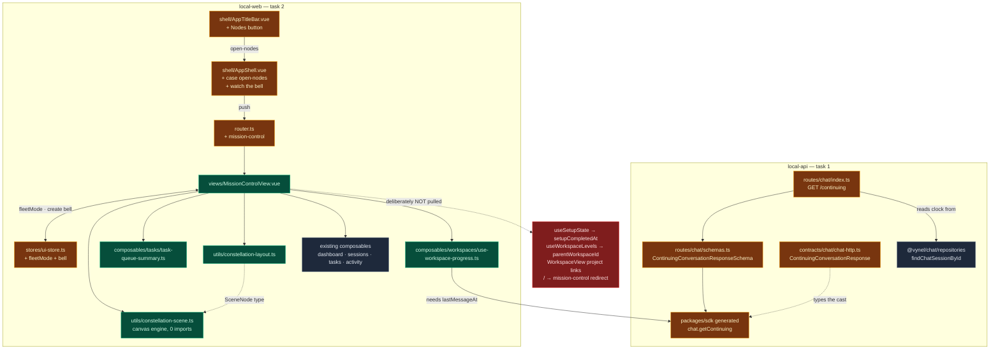

# Plan: Pull the global Nodes screen from the prototype

**Created:** 2026-08-15
**Status:** approved
**Goal:** Bring Chad's "Nodes" screen — the word beside `View` in the title bar and the Mission
Control constellation it opens — out of `design/mission-control-prototype` and onto `main`. The UI
lands exactly as he designed it (the canvas engine, the Nodes/Grid/Race readings, the fleet bar, the
drill into a project, the empty-state invitation). The data underneath is rebuilt to main's rules:
one place for each piece of logic, no schema features smuggled in behind it.

## Context

### Where the two branches actually stand

`main` and `design/mission-control-prototype` are **parallel branches**, not one ahead of the other.
They forked at `e1a7cb5` (2026-08-10). Since then `main` moved **173 commits**, the prototype **49**.
This is a **cherry-pick of ~7 files**, never a merge and never `git checkout proto -- <dir>` — the
prototype *deleted* things main still ships (`packages/workspaces/src/groups/*`,
`status/set-workspace-status.ts`), so any bulk copy would silently delete live features.

The worktree at `.claude/worktrees/mission-control-prototype` is WSL-authored — its `.git` pointer
resolves to `/mnt/e/...` and Windows git can't use it. It is **clean and at the branch tip**
(`3688d58` = `origin/design/mission-control-prototype`), so it is already up to date; read it with
`Read`/`Glob` or `git show origin/design/mission-control-prototype:<path>`. Do not repair the pointer.

### What the feature is

`Nodes` is a plain button in the title bar's menu row, beside `View` — deliberately **not** a
dropdown ("a direct link, not a menu"). It emits `open-nodes`; the shell activates the global tab and
routes to `mission-control`. That view is a full-bleed canvas constellation with:

- a **fleet bar** — breadcrumb, the three readings (Nodes / Grid / Race), and live status counts
- **two levels on one screen** — the fleet of projects; click one to descend into its sessions
- a **layout switcher** (Constellation / Orbit / Rise) and an empty-state invitation

### Dependency audit — every import the view needs, checked against main

| Needs | On main | Verdict |
|---|---|---|
| `constellation-scene.ts` | absent | **port** — 652 lines, **zero imports**, self-contained rAF canvas engine |
| `constellation-layout.ts` (+test) | absent | **port** — pure mapping |
| `task-queue-summary.ts` | absent | **port** — pure, no schema deps |
| `use-workspace-progress.ts` | absent | **port** — needs one backend field (below) |
| `useDashboardOverview(refetchInterval?)` | present ✓ | reuse |
| `useSessionsOverview(enabled, refetchInterval?)` | present ✓ | reuse |
| `useTasks(enabled)` | present ✓ | reuse |
| `activity.hasServerTurnInWorkspace` / `isTurnRunning` | present ✓ | reuse |
| `sessionKeys` / `sessionScopeKey` / `todoKeys` | present ✓ | reuse |
| all 13 CSS tokens the view's scoped styles use | **all present ✓** | verified one by one |
| `ui.fleetMode` | absent | **add** to ui-store |
| `ui.requestCreateWorkspace()` bell | absent | **add** to ui-store |
| `mission-control` route | absent | **add** |
| `chat.getContinuing().lastMessageAt` | **absent** | **add** — see backend below |
| `useSetupState` → `setupCompletedAt` | **absent (schema)** | **do not port** |
| `useWorkspaceLevels` → `parentWorkspaceId` | **absent (schema)** | **do not port** |

### The two things we are deliberately NOT pulling

The prototype's Nodes screen sits on a **workspace redesign main never took**: a two-level
`workspace → project` split (`parentWorkspaceId`) and a setup-completion stamp (`setupCompletedAt`).
Main went a different way — `groupId` folders plus assistant-set `status`. Both prototype fields are
**schema** additions, and `Pick<WorkspaceResponse, "setupCompletedAt">` / `row.parentWorkspaceId`
are hard typecheck errors against main's contract — they cannot be ported as written.

Pulling them would mean dragging a live, divergent product redesign in behind a UI pull. That is a
separate arc with its own Chad conversation. **Assumption for this pull:** the fleet lists every
non-archived workspace, and the centre orb reads `Vynel` at fleet level. Flagged, not hidden.

## Projects Touched

- `local-api` — the continuing-conversation route must also report **when the conversation last
  spoke**, so a project that chatted (but planned no steps) reads as running instead of idle.
- `local-web` — the Nodes screen itself: canvas engine, view, composables, store, router, title bar,
  shell wiring.

## Strategy

**Backend first, then UI** — the web work consumes a generated SDK type, so the API seam has to land
before the view can typecheck.

Then the three gates from `build-discipline.md`:

1. **Think** — this document.
2. **Green before improving** — port the files *faithfully*, rewire only what cannot compile, get
   targeted typecheck + vitest green. `MissionControlView.vue` (763) and `constellation-scene.ts`
   (652) both exceed CLAUDE.md's ~300-line rule; they land oversized first and are **split in this
   same arc, after green** — Grid and Race are the natural extractions. The canvas engine stays one
   file with a why-comment: it is one rAF loop, and cutting it across files buys nothing.
3. **Verify** — `code-reviewer` on the diff, then commit.

**The one deliberate un-faithfulness, stated up front:** the Nodes button wears main's *current*
title-bar classes, not the prototype's. Main's bar has moved on (34px, the DiamondsFour accent mark,
`text-[12px]`, Tabs|Menu segment); the prototype's is the older 40px gold bar with a presence pair and
connection badges. Chad's design intent is "a word sitting in the menu row beside View" — copying the
prototype's `text-sm`/`py-1` would make it sit *proud* of `Vynel` and `View` and break that intent.
Matching main's trigger classes is what preserves it.

Per-move CEO checks ride along: no duplication introduced (`task-queue-summary` is the shared
one-reading-of-the-queue both the sidebar and the nodes will use), imports point down only, and the
learning lands in `.claude/journal/`.

## Tasks

1. `local-api`: report the continuing conversation's clock — add `lastMessageAt` to
   `GET /workspaces/{id}/chat/continuing`, its schema, its contract, and the generated SDK.
2. `local-web`: land the Nodes screen — port the constellation engine + view + composables, wire the
   title-bar button, route, and store, then split the oversized files.

## Risks

| Risk | Why it bites | Guard |
|---|---|---|
| **Bulk-copying from the prototype** | it deleted `workspaces/groups/*` and `set-workspace-status.ts` — a directory copy silently removes live main features | file-by-file cherry-pick only; the file list in each task is exhaustive |
| **Schema creep** | `useSetupState`/`useWorkspaceLevels` look like small composables but each is the tip of a schema redesign | both explicitly dropped; the `isReady` option stays on `buildSceneNodes` (already optional) as the seam for later |
| **Canvas correctness is invisible to tests** | a 652-line rAF loop over two canvases has no meaningful unit test | `constellation-layout.test.ts` pins the data mapping; the pixels need Kafi's eyes — explicit test-ask at the end |
| **Gold vs. the new accent** | the view's active-mode pill uses `--gold`; main's title bar moved to `--color-accent`, and house memory says gold is presence-only now | ported **as Chad drew it** (all tokens resolve, so it will render); raised to Kafi as a follow-up call, not silently changed |
| **Unlabelled core orb** | `coreLabel` came from the parent workspace, which main has no concept of | fleet level reads `Vynel`; stated as an assumption |
| **`pnpm test` pins the CPU** | house rule: never auto-run the full gate | targeted `pnpm --filter` typecheck + vitest; Kafi calls the gate |
| **Stale dev DB** | not expected — no schema change in this plan | none needed; noted because the API shape changes |

## Architecture Diagram

## Decisions taken (Kafi, 2026-08-15)

**Code name: `nodes`, not `mission-control`.** "Mission Control" is a metaphor; the house rule is
descriptive and precise. Chad's button already says the word, so click and code now match:

| | |
|---|---|
| route | `/nodes`, `name: "nodes"` |
| view | `views/NodesView.vue` (+ `nodes-view.test.ts`) |
| store | `ui.nodesMode` (his `fleetMode`, renamed to match) |
| shell | `case "open-nodes"` → `push({ name: "nodes" })` |
| **button** | **`Nodes` — his label, untouched** |

The word `node` now carries three meanings in this repo (`SceneNode` = one dot, Node.js, and this
screen). Accepted deliberately: the screen is named for what the user clicks. Inside the scene
engine a dot stays a `SceneNode`, and "Nodes" as a *tab* keeps its own meaning beside Grid and Race.

Nothing lands on the wire — this screen adds **no API endpoint**. It reads `dashboard.getOverview`,
`sessions.overview`, `tasksUser.list` and `chat.getContinuing`; the only wire change in this plan is
the `lastMessageAt` field on the last of those.

**Race stays exactly as Chad drew it.** Real progress depends on phase/feature completion tracking
that does not exist yet, so the runner keeps its binary position (working = 50%, everything else =
0%) and its two-state label. `useWorkspaceProgress` is still ported — it feeds the node **colours**
via `statusOf`, which is real. Wiring the runner to a true fraction is a later arc, not this one.

**No message animation, and none is being added.** Every strand in the engine is `core → node`
(`curvePoint` is a bezier from the centre orb to one project) — there are no node-to-node edges, so
two workspaces messaging each other has nowhere to draw. Particle direction is `Math.random()`, so
the flow is decorative, not conversational. The one honest signal is density: a live node emits
7 particles/sec against an idle node's 0.15. Vynel *does* have session-to-session messaging
(`packages/session/src/delegation/`), so a real question→answer animation is buildable later — it
needs new edges in the engine, which is new work, not wiring.

## Out of scope (named so nobody reaches for them later)

- `parentWorkspaceId` / the workspace→project split, and everything downstream of it
- `setupCompletedAt` and the "Finish setting up" flow
- the prototype's project scaffolding, repo cloning, and GitHub CLI auth
- the prototype's `Integrations` title-bar menu
- the per-project node links inside `WorkspaceView.vue`
- changing `/` from `home` to `mission-control` — a landing-page decision, not part of this pull
