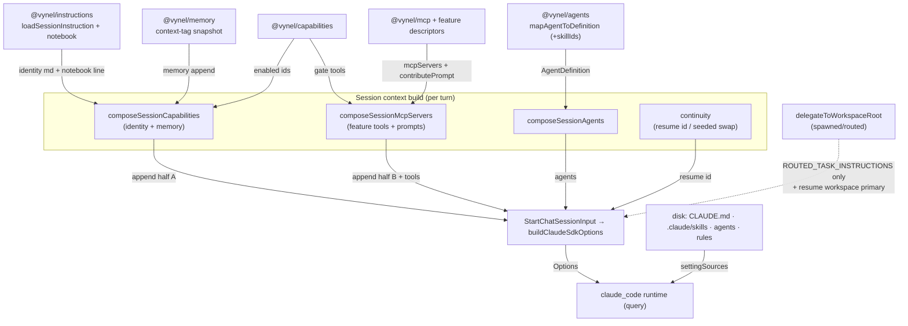

# HOW — session context acquisition

How a session turn gets its **context**: the identity instructions, memory, skills/CLAUDE.md,
attached tools, conversation history, and — for our four flavors — what each one pulls and from
where. Boundary-level: the seams and contracts, not the internals of any one unit.

## Connection summary

Session-context acquisition is a **coordinator**, not a leaf. It has no home package of its own — it
is a composition step that runs at every turn entry point (`apps/local-api` streams + delegation
ticks) and pulls from many leaves down a single funnel: the `StartChatSessionInput` contract
(`@vynel/providers`), which `buildClaudeSdkOptions` turns into the runtime `Options`. Everything a
turn knows arrives on **two independent axes**:

- **(A) Transcript context** — prior conversation, carried by the SDK's `resume` (replays messages).
  Vynel controls only *which* SDK session to resume (continuity); the runtime owns the transcript.
- **(B) Per-turn recomposed context** — the `systemPrompt.append` (identity + memory snapshot +
  feature prompts) + attached `mcpServers` + `agents`. Rebuilt **every turn**, and **NOT replayed by
  resume**. Anything that must survive a session swap rides axis A (the transcript), never axis B.

A third, orthogonal channel sits under both: **`settingSources: ['user','project','local']`** — the
`claude_code` preset loads `CLAUDE.md`, `.claude/skills`, `.claude/agents`, `.claude/rules`, and
`.claude/settings` **from disk** on every flavor. Skills reach a session **only** here — never through
Vynel's composed append.

## The four flavors (what each pulls on each axis)

| Flavor | Entry seam | (A) transcript | (B) recomposed append + MCP + agents | Skills |
|---|---|---|---|---|
| **fresh** | `startChatTurn` / `runGlobalRootTurnCore` (no resume) | empty | **full** — identity + memory snapshot + feature prompts + MCP tools + agents | disk via `settingSources` |
| **continue** | same, `resolvePrimaryConversationTarget` → `resume` set | **full** (resumed workspace primary) | **full** — recomposed fresh each turn | disk via `settingSources` |
| **agent** (Mode A subagent) | `composeSessionAgents` → `query({ agents })` | task from parent | the agent's `AgentDefinition` (`prompt`, tools, model) | ambient disk skills **+** explicit `skills: skillIds` in the definition |
| **spawned** (routed root) | `delegateToWorkspaceRoot` (via `send_task_to_workspace`) | **full** (resumes target workspace primary) | **minimal — `ROUTED_TASK_INSTRUCTIONS` only**; no memory snapshot, no memory/notebook/tasks tools, no `agents` | disk via `settingSources` |
| *leaf (Mode B — PARKED)* | `createLeafSession` → `mapAgentToLeafInput` | empty (fresh) | agent's `prompt` as append, **no** `mcpServers` | disk via `settingSources` |

**Label mapping** (state, don't assume): `agent` = the SDK subagent spawned by the Agent/Task tool
(Mode A). `spawned` = the `send_task_to_workspace` delegation into a workspace's continuing brain. The
Mode-B **leaf** session (`createLeafSession`) is the by-reference sibling but is **parked** — the only
live spawn path today is the SDK Agent tool (the `agent` flavor).

## Dependency table (boundary crossings during context build)

| Unit | Direction | Mechanism | What crosses |
|---|---|---|---|
| `@vynel/providers` (`StartChatSessionInput`, `buildClaudeSdkOptions`) | out | contract + direct call | the funnel: `resume` · `systemPromptAppend` · `mcpServers` · `agents` · `settingSources` · `permissionMode` |
| `@vynel/instructions/session-instructions` | out | direct call `loadSessionInstruction(id)` | the identity prompts `global-root` / `workspace-agent` / `voice-turn` (editable md) |
| `@vynel/instructions` (notebook descriptor) | out | `McpFeatureDescriptor.contributePrompt` + tools | the standing "check the notebook" line + `list_playbooks`/`read_playbook` |
| `@vynel/capabilities` | out | `listEnabledCapabilities(db, workspaceId)` | which capabilities are ON → gates prompt sections + MCP tools |
| `@vynel/memory` | out | `buildMemorySessionContribution` → `loadWorkspaceContextForSession` | `MEMORY_AGENT_INSTRUCTIONS` + the `context`-tagged (or top-N) snapshot |
| `@vynel/mcp` + feature descriptors (tasks/asks/instructions/desktop/ssh) | out | `composeSessionMcpServers([descriptors])` | `mcpServers` record + allow/deny patterns + per-feature `contributePrompt` + `mutatingToolNames` |
| `@vynel/orchestration` (`composeSessionAgents`) | out | direct call → `@vynel/agents` | `Record<slug, AgentDefinition>` for `query({ agents })` |
| `@vynel/agents` (`resolveEnabledAgentsForSession` → `mapAgentToDefinition`) | out | direct call + `agents` repo read | agent `prompt` + tool grants + model + `skills: skillIds` |
| continuity (`resolvePrimaryConversationTarget`, `applyPrimaryTurnContinuity`, `runSeededSwapSession`) | out | direct call + `chat_sessions`/primary read+write | which SDK session to `resume`; post-turn link + pressure-swap; the seeded carry |
| `@vynel/chat` (`consumeSessionEventStream`) | out | async generator | drives the turn + persists rows; emits `session-started`/`session-created` used to link continuity |
| SDK `claude_code` preset (disk) | out | `settingSources` | `CLAUDE.md` · `.claude/skills` · `.claude/agents` · `.claude/rules` · `.claude/settings` |

## Inbound connections (who drives context acquisition)

- **`apps/local-api` turn streams** (`streams/chat-turn.ts`, `sessions/run-global-root-turn.ts`,
  `streams/global-root-turn.ts`) — the callers that assemble both append halves and pass them into
  `startChatTurn`/`runGlobalRootTurnCore`. **They own the join**: `systemPromptAppend =
  [composeSessionCapabilities.append, composeSessionMcpServers.append].filter(≠'').join('\n\n')`
  (chat-turn.ts). Dropping the MCP half here is exactly the historical bug where the notebook line
  never reached workspace turns — a per-caller assembly hazard.
- **Channel + schedule producers** (`runGlobalRootTurn` background, `buildScheduleFireDeps`) — the
  same global-root context path, different origin. They must be handed the composed
  `systemPromptAppend` too (a schedule-fire regression once dropped it).
- **Delegation tick** (`run-delegation-claim-and-run-tick` → `delegateToWorkspaceRoot`) — drives the
  spawned flavor; deliberately does NOT recompose (B).

## Outbound connections (what context acquisition breaks if they change)

- **`StartChatSessionInput` / `buildClaudeSdkOptions`** — the single funnel. Changing a field name or
  the `settingSources` array breaks every flavor at once. `settingSources` is load-bearing: it is the
  sole channel for skills/CLAUDE.md; narrowing it silently strips those from every session.
- **`loadSessionInstruction`** — the identity prompts. A missing/renamed md id throws at turn build
  (fail-loud, cached). See [session-instructions README](../../packages/instructions/session-instructions/README.md).
- **`composeSessionMcpServers`** — a feature that fails to declare `contributePrompt` or
  `capabilityGatedTools` correctly either loses its standing line or leaks a disabled tool. A fully
  capability-denied feature contributes NO prompt (guards the "call a denied tool" steer).
- **`mapAgentToDefinition`** — the Mode-A subagent's whole context. `null` columns mean "inherit from
  the main session"; a non-null `skills` array is the agent's explicit skill preload.

## Events / messages

Context is **pulled, not event-driven** — no event delivers context INTO a turn. Related events are
for *recording* and *continuity*, not acquisition:

- **`session.compacted`** — `captureCompactionSummary` (the SDK `PostCompact` hook) records an
  auto-compaction summary. Feeds continuity, not the next turn's append.
- **Continuity events** (`session-continuity-events.ts`) — primary-session created / linked / swapped.
- **`agent.run-started` / `agent.run-completed`** — the subagent lifecycle (recording/monitor arc).

## Shared data (read at context-build time)

| Store | Read by | Coupling risk |
|---|---|---|
| `memory_entries` | `loadWorkspaceContextForSession` (`context` tag first, else top-N/kind) | tag-selection change alters what every fresh/continue turn sees |
| `capabilities` | `listEnabledCapabilities` | gates both prompt sections and MCP tools; one read feeds two composers |
| `agents` (+ agent↔skill links) | `resolveEnabledAgentsForSession` | disk-mirrored to `.claude/agents`; **remove-on-disable is load-bearing** because `settingSources` also loads that dir |
| `chat_sessions` / primary session | continuity | picks the `resume` id; a stale link resumes the wrong transcript |
| `instruction_documents` + `notebooks/*.md` | notebook shelf | on-demand only — **never** injected into the append |
| disk (`CLAUDE.md`, `.claude/skills|agents|rules|settings`) | SDK `settingSources` | outside Vynel's DB; edited on disk, loaded per turn |

## Coupling notes (what a refactor must handle)

1. **The routed/"spawned" asymmetry is real and structural.** `delegateToWorkspaceRoot` passes
   `systemPromptAppend: ROUTED_TASK_INSTRUCTIONS` and no `mcpServers`/`agents`; its input type has **no
   field** to inject them. A routed turn therefore has **no memory snapshot and no memory/notebook/
   tasks tools** — its only carried context is the **resumed workspace transcript** (axis A) + disk
   `settingSources`. A *first* delegation to a never-used workspace (fresh, no transcript) gets the
   least of any flavor. Whether that's intended (lightweight background worker) or a gap is a product
   call — flagged, not assumed.
2. **Append is recomposed per turn, never replayed.** Because `resume` replays only the transcript
   while the append is rebuilt each turn, a context swap must seed its carry into the **first user
   message** of the fresh session (`runSeededSwapSession`), not the append.
3. **The two append halves are joined at the caller**, not in a composer. Every turn entry point must
   join `composeSessionCapabilities` + `composeSessionMcpServers` outputs — a divergence class that
   has already bitten (workspace turns, schedule fires).
4. **`settingSources` is the sole skills channel** and is decoupled from Vynel's composition — skills
   are never in the append. This is why routed turns still get skills despite minimal axis B, and why
   the agent disk-mirror's remove-on-disable can't be narrowed casually.

## Diagram

---
*Anchors:* `packages/providers/src/claude/base/build-claude-sdk-options.ts` ·
`packages/session/src/runtime/{compose-session-capabilities,run-global-root-turn-core,resolve-primary-conversation,run-seeded-swap-session}.ts` ·
`apps/local-api/src/sessions/compose-session-mcp-servers.ts` ·
`packages/session/src/delegation/delegate-to-workspace-root.ts` ·
`packages/orchestration/src/agents/compose-session-agents.ts` ·
`packages/agents/src/internal/map-agent-to-definition.ts` ·
`packages/memory/src/session/load-workspace-context-for-session.ts`
