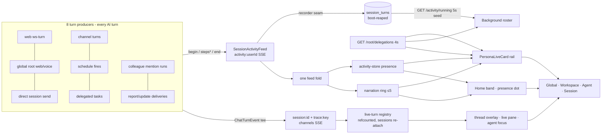

# Live tracking — what · how · where (review copy for Chad)

**What this is:** the combined wh report on Vynel's realtime visibility layer — how a user SEES
sessions/agents working right now — grounded in code at HEAD (2026-08-08, persona-sessions arc
fully shipped). Written for a read-through: every open item carries a stable ID (**B#** = verified
bug, **SF#** = should-fix, **G#** = design gap, **AR#** = accepted residual) so instructions can
cite IDs directly ("fix B6+B7, combine SF1 into it, drop G1"). Full bug detail + backbone findings:
`.claude/reports/2026-08-08-session-package-review.md`.

---

## 1. What live tracking is

Background work must never be invisible: at any moment the user can see WHO is working, ON WHAT,
what step they're on, for how long — and can drill from a glance ("something is running") down to
the actual conversation and type into it. Work presents as **people** (personas with faces, spoken
acks/updates/reports), not queue rows, and the picture is **durable**: refresh, a second window, or
an api restart rebuilds it from the DB.

Rules that hold everywhere:

- **One stream, few polls, never per-card fan-out.** One app-lifetime activity subscription + slow
  polls; persona cards never open their own SSE.
- **Watch one level down.** A thread watches only its direct children's work; received work never
  grows a self-watch; a session view is a leaf (agent chips only).
- **Live elements carry no message text.** Cards/rosters narrate; settled attributed rows own all
  content (ack → Updates → one Report; Update ≠ Report — separate badges, dialogs, guarantees).
- **Only `turn-ended` removes presence.** Steps and approval bells never kill a live dot.
- **Gold = presence.** Reserved for "alive right now" (dots, pulses, breathing card edge).
- **Steps are transient; the envelope is durable.** Refresh rebuilds from stream snapshot replay;
  restart from `session_turns` (orphans honestly closed at boot).

## 2. How it flows — the three signals

1. **The activity feed** (`GET /activity/stream`) — turn lifecycle (started/updated/ended) +
   per-tool narration steps + approval bells, per user. Enrichment on delegated turns: `jobId`,
   `threadId` (task chain — the acked-badge key), `partialSessionId` (per-hop trace key — the
   Watch/Stop handle), `primarySessionId`, `taskLabel`, `personaName` (display-only, never
   stored). Subscribe replays every in-flight turn + its LAST step. `*` = the steps signal has
   only 4 producers today — **B6** below.
2. **The watch channels** — the full token stream of one source: `session:<sdkSessionId>` (every
   turn tees; client re-attaches across turns) and `trace:<partialSessionId>` (delegated runs;
   one-attach-per-run). No server-side replay — a mid-turn attach seeds from the settled snapshot
   + buffered tail.
3. **The polls + durable seed** — `GET /root/delegations` (4s; pending+claimed jobs → the card
   roster, chip pulse, isProcessing) and `GET /activity/running` (5s, roster-gated; the
   `session_turns` rebuild seed — envelope only, so the stream wins on overlap).

Client fold: ONE feed mount (`AppShell` + the desktop overlay window) → `activity-store`
(presence map), `turn-narration-store` (current step + ring ≤5), turn-boundary query
invalidations. Delegation↔turn pairing lives in ONE home (`delegation-turn-pairing.ts`): match by
`partialSessionId`; card row key falls back positionally (`in-flight-<index>` — the planned jobId
fallback never shipped; the DTO carries no jobId); acked = a thread row with
`threadId === turn.threadId` whose `sourceKind !== 'global-root'`.

## 3. The four views

### 3.1 Global view (global thread + Home + title bar)

**Shows:** persona-card rail at the thread's live edge — one card per in-flight task, the user's
FULL roster, cap 4 + "+N more running" → Background. Card = avatar/accent-monogram, queued/working
state, "acknowledged" tag once the child SPEAKS, narration line + recent steps, elapsed, Watch +
Stop (keyless jobs hide both). Plus: `LiveTurn` overlay for the displayed session's turn; watch
chips on settled rows pulsing gold while their delegation runs; `ProcessingBanner` reduced to the
non-delegation origin note ("Replying on Telegram…"); Home's "Right now" band (running turns only,
gold breathing edge, origin notes, "See all"); the title-bar presence pair as a BUTTON opening the
Background overview (gold live / amber approvals); status-bar echo.

**Lives in:** `views/GlobalChatView.vue` → `components/chat/ThreadStream.vue` (+`PersonaLiveCard`,
`LiveTurn`), `components/home/LiveNowBand.vue`, `components/shell/AppTitleBar.vue` /
`AppStatusBar.vue`. Data: own turn SSE + `useWatchedTurn` (registry) + feed stores + the 4s poll
(`useLiveDelegationCards`, no workspace filter).

**Broken/open here:** **B6** (delegated cards narrate blank), **B7** (ghost delivery cards +
Stop kills the delivery), **B8** (refresh blanks narration), **G1** (queued-only work invisible on
Home + the presence dot — both key on RUNNING turns).

### 3.2 Workspace view (a room's thread)

**Shows:** the same rail **scoped to tasks targeting THIS room** (`onlyWorkspaceId` — the old
banner's rule; the full roster stays global). Watch chips stay UNFILTERED (they hang off rows this
thread SENT — one level down). The acked detector's `'global-root'` exclusion matters most here
(the inbound routed-task row shares the chain key; counting it would flip the badge at turn
start). Banner: "<manager> is working…" when the feed reports a turn in this workspace the thread
isn't rendering. Transcript polls 4s while a delegation targets the room or a background turn runs
here — routed rows land near-live.

**Lives in:** `views/WorkspaceView.vue` (same skeleton as Global; scoping at
`use-live-delegation-cards.ts` via `onlyWorkspaceId`, banner via
`activity.hasServerTurnInWorkspace`).

**Broken/open here:** B6/B7/B8 apply identically.

### 3.3 Agent view (two readings — both live-tracked)

**(a) In-turn subagents** (ephemeral, spun up mid-turn): every Agent tool card carries a Watch
chip → the monitor panel's **AgentFocusView**. An agent node has NO channel of its own — it rides
its parent's source (the delegation's trace, or the session the turn ran on), keyed by
`toolUseId`: live = the fold's `agentActivity` map; settled = the Agent call's persisted subagent
fields (works after completion + reload, honest empty states). Back walks Trace → Session → Agent.

**(b) Agent colleagues** (one continuing session per agent per user+scope, resumed by every
@mention, persona + memory accumulating): a mention run rides the SAME machinery as any task —
persona card in the requesting thread, acked tag, Update/Report rows wearing the colleague's
monogram/accent; a working dot on its Sessions-panel row (workspace scope); its own
Background-roster group (keyed `targetPrimarySessionId`). Opening a colleague is **view-only**:
"This colleague works from chat — @mention them" (**G5**, recorded deferral — route + lock parity
needed before direct send).

**Lives in:** `components/activity/AgentFocusView.vue` + `agent-focus.ts` +
`activity-monitor-store.ts` (a); the ordinary card/roster/sessions machinery (b).

**Broken/open here:** **G2** GLOBAL colleagues (workspaceId null) invisible in the Sessions
panel's global list (filter keeps `scope === 'spawned'` only) · **G3** an IDLE colleague has zero
presence anywhere (liveness exists only while a run is in flight; the Agents settings roster shows
no liveness either) · **G4** scope-announce inconsistency: a mention run on a grounded colleague
announces workspace-scoped, a task-branch run on the SAME colleague announces global — which
surfaces light "working" differs by engagement path.

### 3.4 Session view (Sessions panel · open thread · live pane · Background overview)

**Sessions panel** (`views/SessionsView.vue`): recency-sorted rows with title, relative time,
context %, and a **working dot** while a turn runs anywhere in that session's continuation chain
(feed turn matched across chain segments); overview polls 5s while anything runs; continued
conversations show "continued N×" + expandable chain.

**An open session** (`components/sessions/SessionThreadView.vue`) is a REAL chat: chain-head
follow (a mid-turn compaction swap re-points the view live with a quiet "conversation continued"
note; a deliberately-opened earlier part stays put); direct-send rule by scope (spawned chain head
= composer with "→ <persona>" + mid-turn sends QUEUE visibly; superseded part = view-only pointer;
agent = @mention note; primary = its own chat surface); turns it didn't start stream in via the
registry watch (re-attaches across turns) with a 4s fallback poll behind it.

**The live session pane** (`components/activity/LiveSessionPane.vue`): the same component hosted
by the monitor panel's session node — reached from a card's Watch → trace → drill, a roster
header, or the Sessions list; chips clicked INSIDE the panel stack, Back walks the whole pipeline.

**The Background overview** (`components/activity/BackgroundActivityView.vue`, the panel's base
node): everything running/queued grouped by working identity — colleague/spawned session
(`targetPrimarySessionId`) → workspace persona (`ws:<id>`) → standalone turns (persona =
`personaName ?? manager ?? "Assistant"`), working groups first; per row: state, narration,
elapsed, origin note, Watch + Stop; seeds from the durable `GET /activity/running` so F5
mid-delegation rebuilds truthfully (stream wins on overlap; turn-end invalidates the seed — no
ghosts); honest "Nothing running" empty state. Openers: title-bar presence button, Home "See all",
the thread's "+N more" line.

**Broken/open here:** **B9** the pane header dot is gold whenever the SSE is merely CONNECTED (an
idle session glows "live" forever) · **SF1** a mid-turn attach renders nothing until the next chat
event (no channel replay; long silent tools = still page; compounded when the feed is
mid-reconnect because the fallback poll gates on the feed's presence map) · **AR6** a mid-turn
swap's live tail keeps publishing on the OLD session channel key (the followed head catches up by
poll) · **SF7** an unclaimed direct-send turn groups under "Assistant" in the roster.

## 4. File map (compact)

Backend (produce + stream):

| Piece | Path |
|---|---|
| Feed registry + snapshot replay | `packages/session/src/runtime/session-activity-feed.ts` |
| ChatTurnEvent→step mapping | `packages/session/src/runtime/activity-turn-steps.ts` |
| Durable recorder → `session_turns` | `packages/session/src/runtime/session-turn-recorder.ts` (+ `repositories/session-turns.ts`, `schema/session-turns.ts`) |
| Session channel tee | `packages/session/src/runtime/session-turn-channel.ts` |
| Trace channel + broadcaster | `packages/session/src/delegation/turn-event-broadcaster.ts` |
| In-flight jobs query | `packages/orchestration/src/queries/list-in-flight-delegations.ts` |
| Routes: feed/seed · session watch · trace watch · jobs poll | `apps/local-api/src/routes/activity/index.ts` · `routes/sessions/index.ts` · `routes/root/index.ts` |
| Producers (8 `begin()` sites) | `apps/local-api/src/streams/{chat-turn,global-root-turn,session-turn}.ts`, `apps/local-api/src/sessions/{run-global-root-turn,build-schedule-fire-deps}.ts`, `packages/session/src/delegation/{run-delegation-claim-and-run-tick,run-agent-run-job,run-report-delivery-tick}.ts` |

Frontend (`apps/local-web/src`):

| Piece | Path |
|---|---|
| Feed fold (ONE mount) | `composables/activity/use-session-activity-feed.ts` (mounted `AppShell.vue:88` + desktop overlay) |
| Stores | `stores/activity-store.ts` · `turn-narration-store.ts` · `live-turn-registry.ts` · `activity-monitor-store.ts` |
| Watch adapters | `composables/chat/use-watched-turn.ts` + `watched-turn-seed.ts`; `composables/activity/use-activity-monitor.ts` |
| Cards + pairing | `composables/delegations/use-live-delegation-cards.ts` + `delegation-turn-pairing.ts`; `composables/personas/resolve-persona.ts` |
| Roster spine | `composables/activity/use-background-activity.ts` |
| Components | `components/chat/{PersonaLiveCard,LiveTurn,ThreadStream}.vue` · `components/activity/{ActivityMonitorPanel,LiveSessionPane,BackgroundActivityView,AgentFocusView}.vue` · `components/home/{LiveNowBand,LiveSessionCard}.vue` · `components/sessions/SessionThreadView.vue` |
| Chain follow + send rule | `composables/sessions/resolve-chain-head.ts` · `session-open-affordance.ts` |

Cadence constants: in-flight poll 4s · seed/overview polls 5s · feed heartbeat 25s · feed backoff
1→15s · trace status poll 2.5s · narration ring 5 · card cap 4.

## 5. The decision list (cite IDs back)

**Verified bugs — realtime (detail in the report):**

- **B6** — delegated turns publish NO narration steps (only 4 of 8 producers tap
  `publishTurnActivityStep`); persona cards + roster rows narrate blank on their primary path.
- **B7** — delivery jobs (`report/update-delivery`) leak into the in-flight roster: ghost persona
  card labeled with the message SENTENCE; its Stop kills the delivery.
- **B8** — feed snapshot replays the LAST step even when it's an unrenderable settle frame: any
  F5/reconnect landing between tools narrates generic "Working…" with an empty ring.
- **B9** — session pane header dot = SSE-connected, not turn-running: idle sessions glow live.

**Verified bugs — backbone (same report; listed for one decision surface):**

- **B1** report-delivery destroyed by boot reap (report lost forever) · **B2** failure path
  ignores `reportedAt` (duplicate report / success-then-"failed") · **B3** workspace chat turn
  takes no target lock (two writers, chain fork) · **B4** mid-turn SDK swap orphans the segment
  (global root history unreachable on reload) · **B5** monitor watermark cap skips events (lost
  wakes).

**Should-fixes (realtime chain):**

- **SF1** seed the session watch at attach when the feed says a turn runs (kills the blank
  mid-turn attach window); also arm the fallback poll while the watch is attached-but-viewless.
- **SF2** surface feed health — a quiet "live updates reconnecting" line (today an outage is
  invisible; recurs every sleep/wake).
- **SF3** trace stream: add the `:ping` heartbeat + stop hiding its errorText in the panel.
- **SF4** tolerant activity-frame decode (one corrupt frame currently resets the whole feed).
- **SF5** chat fold: add a `default` arm (unknown event kind currently wipes the fold).
- **SF6** monogram of persona-first labels renders "N·" — strip the separator token.
- **SF7** stamp `personaName` on direct-send session turns (roster stops saying "Assistant").
- **SF8** invalidate the in-flight query on send_message completion (cards appear instantly, not
  ≤4s).

**Design gaps (product calls, not bugs):**

- **G1** queued-only work invisible on Home + the presence dot (both key on running turns).
- **G2** GLOBAL colleagues invisible in the Sessions panel's global list.
- **G3** idle colleagues have zero presence anywhere; Agents settings shows no liveness.
- **G4** mention runs announce workspace-scoped, task-branch runs global — unify the liveness scope.
- **G5** colleague direct-send deferred (route widening + MCP-set + lock parity) — pane says
  "@mention".

**Accepted residuals (already decided; listed so they can be re-opened deliberately):**

- **AR1** panel dot keys on the OPENED segment id after a mid-watch chain swap (self-heals on
  reopen; briefly two streams, bounded 2) · **AR2** SessionsView active-row highlight sticks after
  a swap · **AR3** a superseded view-only part holds an idle refcount-bounded registry watch ·
  **AR4** Escape while typing in the panel composer may close the panel · **AR5** brief
  double-render flash at an own-turn's settle · **AR6** post-swap live tail stays on the old
  channel key.

**Recommended packaging (from the review):** slice 1 = B6+B7+B8 (+SF1, SF8 if wanted) — "realtime
narrates honestly"; slice 2 = B1+B2 (delivery guarantees); then B3, B4, B5, B9 + the SF sweep.
Every fix ships a producer-level regression test (both fixture-blindness lessons — accentVar,
seeded narration — recurred in this area).

## 6. Vocabulary

**Persona card** per-task "person working" card at a thread's live edge · **watch chip** settled-row
link pulsing while its delegation runs · **narration line / ring** current step in plain words +
last ≤5 steps · **acknowledged tag** the child SPOKE its ack (threadId match) · **Update vs
Report** interim spoken progress vs the one final result · **trace key** per-hop
`partialSessionId` (Watch/Stop handle) · **thread / chain key** `threadId` linking task ↔
ack/update/report rows · **turn envelope** durable `session_turns` row · **working identity** who
a roster group belongs to · **chain head** newest segment of a continued conversation ·
**colleague** an agent's one continuing session per scope · **presence dot** idle/live/attention,
gold = alive now.
