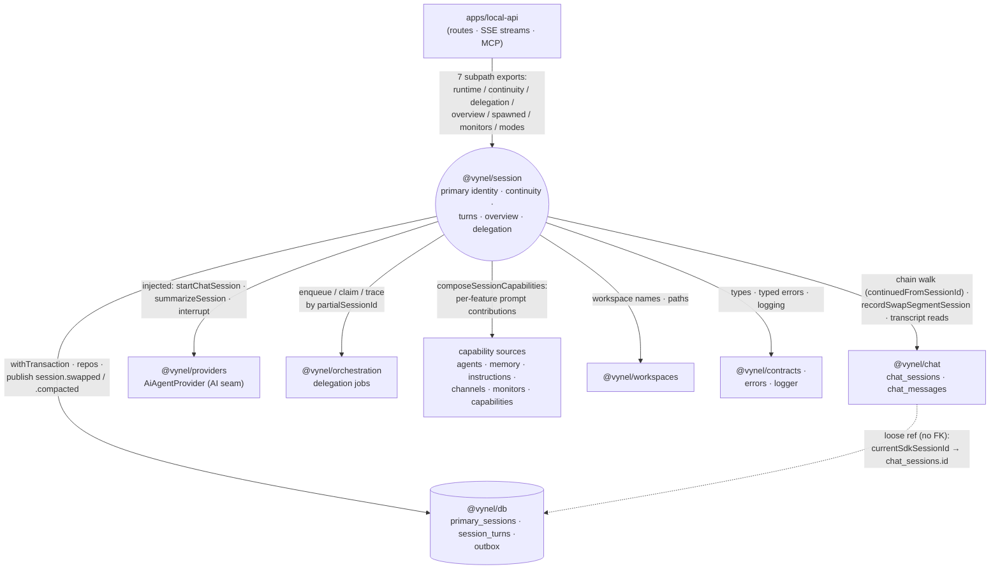

# `@vynel/session` — HOW it connects

*The HOW view: the edges between `@vynel/session` and every unit it touches — directions,
mechanisms, contracts. Boundary-level only; internals live in the package itself (and the
as-built book under `.claude/docs/session/`).*

## Connection summary

`@vynel/session` is the **top-tier coordinator leaf** of the modular monolith: it composes more
sibling packages than any other unit (fourteen `@vynel/*` dependencies), yet **nothing in
`packages/` imports it back** — its only inbound consumer is `apps/local-api`, which reduces
every session-shaped HTTP surface (chat turns, the global root, the sessions panel, delegation
traces) to calls into this package. It owns the durable **session identity** (`primary_sessions`)
and **turn liveness** (`session_turns`) tables, orchestrates the continuity machinery
(link → pressure-detect → seed-fresh swap) across the chat and providers seams, and publishes
`session.swapped` / `session.compacted` to the outbox. It is a hub by fan-out and a leaf by
fan-in — the classic "session tier" the architecture doc describes.

## Dependency table

| Unit | Direction | Mechanism | What crosses the boundary |
| --- | --- | --- | --- |
| `apps/local-api` | **in** | direct import of 7 subpath exports | `startChatTurn`, `applyPrimaryTurnContinuity`, `findPrimaryConversation`, `resolvePrimaryTranscript` / `resolveSessionChainTranscript`, `getSessionsOverview`, `createSpawnedSession`, delegation trace + enrichers, `SessionActivityFeed`, session modes |
| `@vynel/db` | out | kernel import; owns 2 tables | `Database` handle, `withTransaction`, `insertOutboxEvent`; schema + functional repositories for `primary_sessions`, `session_turns` |
| `@vynel/chat` | out | direct calls into chat's repos + ops | chat-session/message/tool-call reads (transcripts, overview fold), `recordSwapSegmentSession`, `buildNewChatSessionRow`, `updateChatSession`; the `continuedFromSessionId` chain contract |
| `@vynel/providers` | out | abstract class + registry (the AI seam) | `AiAgentProvider.startChatSession` / `summarizeSession` / `interruptChatSession`, `resolveAiAgentProvider`, normalized session events |
| `@vynel/orchestration` | out | direct calls | delegation jobs: enqueue / claim / find / settle; `partialSessionId` trace keys |
| `@vynel/contracts` | out | shared types/constants | `SessionsOverviewEntry`, `resolveContextWindow`, thinking-effort levels |
| `@vynel/workspaces` | out | direct calls | workspace lookups (names for overview entries, paths for turn cwd) |
| `@vynel/agents`, `@vynel/memory`, `@vynel/instructions`, `@vynel/channels`, `@vynel/monitors`, `@vynel/capabilities` | out | per-feature composition calls | each feature's prompt contribution / snapshot / tool surface, folded by `composeSessionCapabilities` into one `systemPromptAppend` per turn |
| `@vynel/errors`, `@vynel/logger` | out | shared kernel | typed `VynelError` subclasses; structured pino logging |
| `@vynel/testing`, `@vynel/approvals` | out (dev-only) | test harness | `withTestDatabase`; approvals used only in test fixtures |

## Inbound connections

**`apps/local-api` is the sole consumer** (24 source files) — no package imports
`@vynel/session`, so imports-point-down holds and the package sits at the top of the leaf
tier. The API reads it through its seven subpath exports, which are the real inbound contract:

- `/runtime` (26 imports) — the turn engine: `startChatTurn`, `applyPrimaryTurnContinuity`,
  `bridgePrimarySessionAfterTurn`, `resolvePrimaryTranscript`, `resolveSessionChainTranscript`,
  `composeSessionCapabilities`, the `SessionActivityFeed` + turn recorder + live turn channel.
- `/delegation` (19) — trace reads (`resolveDelegationTrace`, `traceChannelKey`) and the
  serve-time enrichers (`attachDelegationTaskLabels`, `attachDeliveredRunStats`,
  `attachDelegationToolOutcomes`) every session-detail route runs.
- `/continuity` (12) — primary resolution (`findPrimaryConversation`,
  `getOrCreatePrimarySession`, `linkPrimarySessionToSdkSession`) and the bridge.
- `/spawned` (7) — `createSpawnedSession` for the session-library tools.
- `.` barrel (5) — deliberately **web-safe**: only the session-mode model (no db/provider
  imports), so route schemas can derive enums without dragging the runtime into a bundle.
- `/overview` (1) — `getSessionsOverview`, the one list both the Sessions panel and the
  `list_sessions` MCP tool read.
- `/monitors` (1) — monitor-session composition.

**What breaks downstream if `session` changes:** any signature change in those subpaths lands
directly in API route handlers and stream drivers; a change to overview entry shape breaks the
generated SDK (`packages/sdk`) and the web panel that renders it; a change to the transcript
envelope breaks the three continuing-thread views in `apps/local-web` (which consume it via the
generated SDK, not by importing this package).

## Outbound connections

- **`@vynel/db`** — the kernel. Session's schema files register `primary_sessions` and
  `session_turns`; every repository is functional with `db` first-arg. Every state change that
  emits an event co-commits via `withTransaction` + `insertOutboxEvent` (invariant §5). If the
  kernel's transaction or outbox shape changes, the bridge and turn recorder change with it.
- **`@vynel/chat`** — the tightest sibling edge (49 imports). Session orchestrates continuity
  but chat **owns** `chat_sessions` / `chat_messages`: the swap records its fresh segment via
  chat's `recordSwapSegmentSession`, the transcripts and the overview fold read chat's
  repositories, and the chain itself is chat's `continuedFromSessionId` column. A change to the
  chain-link contract or the hidden/visibility convention breaks continuity fold + transcript
  walks here.
- **`@vynel/providers`** — the AI seam, always injected. The bridge takes `summarizeSession` +
  `startSeededSession` as deps; the runtime resolves a provider from the registry and consumes
  its normalized event stream. The SDK runtime itself never appears here — if a provider's
  event vocabulary changes, the turn consumers and the seeded-swap drain change.
- **`@vynel/orchestration`** — delegation jobs are the cross-session work queue; session
  enqueues, claims, settles, and traces them by `partialSessionId`.
- **Capability sources** (`agents`, `memory`, `instructions`, `channels`, `monitors`,
  `capabilities`, `workspaces`) — read-only composition per turn: each contributes its prompt
  block/snapshot, folded into `systemPromptAppend`. These edges are individually thin; renaming
  a feature's compose function only touches `composeSessionCapabilities`.

## Events / messages

| Event | Direction | Trigger | Payload highlights |
| --- | --- | --- | --- |
| `session.swapped` | published | `bridgePrimarySession` repoints a primary at its fresh seeded segment (co-committed with the repoint) | `primarySessionId`, `userId`, `scope`, `workspaceId`, `fromSdkSessionId`, `toSdkSessionId` |
| `session.compacted` | published | PostCompact capture — the runtime auto-compacted a session mid-turn (Layer 1) | compaction summary capture |

Both are **published but not yet consumed** — no handler subscribes today (they exist "for the
future monitor"). The continuity reads deliberately do *not* depend on them: the segment chain
is derived from the rows (`continuedFromSessionId`), precisely because event-window reads once
truncated history (session-review B4).

Session also *emits into* chat's event space indirectly: the swap-segment recording co-commits
chat's `chat.session-created` outbox event (inside chat's own op).

## Shared data

| Data | Owner | Shared with | Coupling risk |
| --- | --- | --- | --- |
| `primary_sessions` | session | read only through this package | `current_sdk_session_id` / `superseded_from_sdk_session_id` are **loose refs** to `chat_sessions.id` (no FK, per the cross-feature rule) — a dangling ref must degrade gracefully (transcript resolvers treat a missing head row as "no session") |
| `session_turns` | session | activity feed consumers via this package | loose refs to chat session ids, primary ids, and delegation `job_id`s |
| `chat_sessions.continued_from_session_id` | **chat** | walked by session's transcript + overview reads | the chain contract both packages must honor: every swap writer stamps it; the walkers are cycle-safe and ownership-checked per hop |

## Coupling notes

- **session ↔ chat is the edge to watch.** Continuity is split by ownership: session decides
  *when* to swap and repoints the primary; chat records the segment row and owns the chain
  column. The two writes are separate transactions (accepted trade-off, documented in
  `bridge-primary-session-after-turn.ts`) — a refactor that changes either side's write order
  must revisit the orphan-segment reasoning there.
- **The provider seam is injection-only** — session never imports the `claude-agent-sdk`
  runtime; it depends on the abstract `AiAgentProvider`. This is what keeps the swap machinery
  unit-testable and phase-2/provider-agnostic.
- **The barrel split is deliberate**: `.` is web-safe, `/runtime` is heavy. Moving a runtime
  export into the barrel would leak db/providers into any bundle that touches session modes.
- **No cycles**: session imports fourteen packages and none import it back; the API is the only
  place its pieces are composed with routes, streams, and MCP surfaces.

## Diagram

*Solid arrows are direct import/call edges; the dotted arrow marks the loose-ref data contract
that links session's identity rows to chat's segment rows without a foreign key.*
